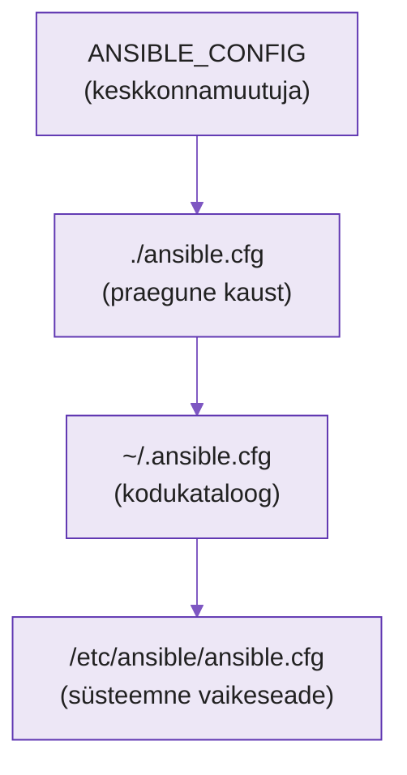

---
tags:
  - Ansible
  - Konfiguratsioon
---

# Ansible seaded — `ansible.cfg`

See on **reference-leht**, mitte loeng — vaata siia, kui vaja, mitte tuubi peast. N3 laboris piisab paarist reast `ansible.cfg`-s; siin on kogu pilt, kuidas Ansible oma seaded leiab ja kuidas neid ümber määrata.

---

## Mis on `ansible.cfg`

Kui paigaldad Ansible'i, salvestab see — nagu iga tarkvara — vaikimisi konfiguratsioonifaili juhtmasinasse: `/etc/ansible/ansible.cfg`. See fail määrab parameetrite abil, kuidas Ansible vaikimisi töötab. Kui muudad siin väärtust, mõjutad **kõiki** playbooke, mida sellel masinal käivitad.

Fail on jagatud sektsioonideks:

```ini
[defaults]
inventory = ./inventory.ini
host_key_checking = False

[privilege_escalation]
become = True

[ssh_connection]
timeout = 20
```

Ülal on `[defaults]` (vaikeseaded), all `[privilege_escalation]`, `[ssh_connection]`, ja on veel `[inventory]` ning `[colors]`. Igas sektsioonis määrad parameetreid ja nende väärtusi: kus asub inventory, kuhu logid ja rollid lähevad, kas Ansible kogub fakte automaatselt, kui kaua SSH-ühendust oodata, mitut hosti korraga töödelda. Kõiki valikuid ei pea teadma — piisab mõttest, et fail koosneb sektsioonidest, mis on täis kohandatavaid seadeid.

---

## Kolm viisi seadete ümbermääramiseks

Oletame, et hoiad eri kohtades eri playbook-kogumeid: üks veebi, teine andmebaaside, kolmas võrguseadmete jaoks, ja igaüks vajab veidi eri käitumist. Veebi puhul ei taha fakte koguda; andmebaaside puhul tahad fakte, aga mitte värvilist väljundit; võrgu puhul on vaja SSH ooteaeg 20 sekundini pikendada. Seadeid saab ümber määrata kolmel viisil.

### 1. Kohalik `ansible.cfg` playbooki kaustas

Lihtsaim: kopeeri `ansible.cfg` playbooki kausta ja muuda ainult seda, mida vaja. Kui käivitad playbooki sellest kaustast, loeb Ansible seaded kohe sealt. **See on meie kursusel eelistatud viis** — fail läheb koos playbookidega Giti, nii et seaded on versioonihallatud ja jagatud kõigi masinate ja kasutajate vahel.

### 2. `ANSIBLE_CONFIG` keskkonnamuutuja

Kui konfiguratsioonifail peab asuma mujal (nt `/opt/ansible-web.cfg`, et seda mitmes playbookis korduvalt kasutada), määra enne käivitamist keskkonnamuutuja, mis osutab faili asukohale:

```bash
export ANSIBLE_CONFIG=/opt/ansible-web.cfg
```

Nüüd kasutab Ansible seda faili vaikimisi asukoha asemel.

### 3. Üksik parameeter keskkonnamuutujana

Mõnikord tahad muuta ainult üht seadet ega taha kogu faili kopeerida. Siis asenda just see parameeter keskkonnamuutujaga. Nime saad enamasti nii: võta parameeter, tee suurtähtedeks ja lisa ette `ANSIBLE_`. Nii saab `gathering`-ist `ANSIBLE_GATHERING`:

```bash
export ANSIBLE_GATHERING=explicit
```

Muutuja edastamiseks on mitu võimalust: pane see otse käsu ette (kehtib ainult selle ühe käivituse puhul), kasuta `export`-i (kehtib kogu shelli-seansi vältel), või — kõige kindlam — pane parameeter kohalikku `ansible.cfg`-sse (läheb koodihoidlasse).

---

## Prioriteedijärjekord

Mis juhtub, kui mitu neist eksisteerib korraga eri väärtustega — milline võidab? Ansible järgib ranget järjekorda, kõrgeimast madalaimani:

1. **`ANSIBLE_CONFIG`** keskkonnamuutujaga määratud fail
2. **`ansible.cfg`** praeguses kataloogis
3. **`.ansible.cfg`** kodukataloogis (`~/.ansible.cfg`)
4. **`/etc/ansible/ansible.cfg`** — süsteemi vaikeseadistus

<figure markdown="span">

  <figcaption>Joonis. Ansible otsib seadeid ülalt alla; esimene leitud võidab. Üksik keskkonnamuutuja (nt ANSIBLE_GATHERING) kaalub kõik need üle (Talvik, 2025).</figcaption>
</figure>

Failis ei pea olema kõiki väärtusi — määra ainult need, mida tahad ümber kirjutada, ülejäänud pärinevad järgmisest failist ahelas. Üksik keskkonnamuutuja (viis 3) on kõigist kõrgeima prioriteediga.

---

## Kuidas kontrollida, mis kehtib

Kolm käsku näitavad, mida Ansible tegelikult loeb:

```bash
ansible-config list    # kõik valikud, vaikeväärtused ja võimalikud seadistused
ansible-config view    # milline konfiguratsioonifail on hetkel aktiivne
ansible-config dump    # kõik praegused väärtused ja nende päritolu
```

Kõige kasulikum on **`ansible-config dump`**: see näitab iga väärtust ja seda, kust see tuli. Näiteks kui määrad `ANSIBLE_GATHERING=explicit`, käivitad `ansible-config dump` ja otsid rida `GATHERING`, näed selgelt, et väärtus pärineb keskkonnamuutujast. Kui konfiguratsioon ei tööta nii nagu peaks, on see käsk, mis näitab täpselt, mida Ansible tuvastas ja miks.

---

## Allikad

| Allikas | URL |
|---|---|
| Ansible konfiguratsiooniseaded | <https://docs.ansible.com/ansible/latest/reference_appendices/config.html> |
| `ansible-config` käsk | <https://docs.ansible.com/ansible/latest/cli/ansible-config.html> |
