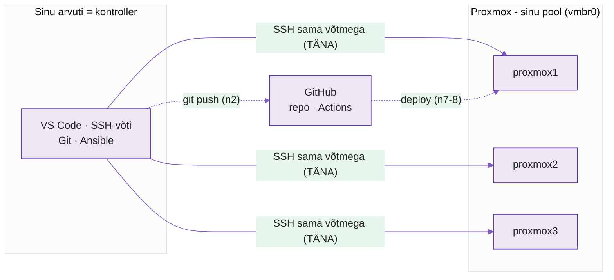

---
tags:
  - Keskkond
  - SSH
  - Ligipääs
---

# SSH-ligipääs kolme Proxmoxi masinasse - Labor

**Õpilane:** ______________________________  **Kuupäev:** ____________

**Kestus:** 4 A-t · **Tase:** 3. aasta · **Esitamine:** vt lõpp

**Eeldame teadaolevana:** Linux käsurida, sudo, VS Code. Uus: võtmepõhine SSH kolme masinasse, `~/.ssh/config` nimega hostid, VS Code Remote-SSH.

---

## 🎯 Tänase tunni eesmärk

**Keskkond valmis, et edaspidi töötada.** Tunni lõpuks on sul:

- **Proxmox** - kolm oma sõlme, kuhu pääsed
- **SSH** - üks võti, kopeeritud kõigisse; ligipääs ilma paroolita
- **VS Code** - töötad vajadusel sõlme sees (Remote-SSH)
- **Git** - töökorras su arvutil, valmis nädal 2-ks
- **Kontroller** - Ansible su arvutil, `ansible -m ping` vastab kõigilt kolmelt

Tänasest edasi ei sea me enam keskkonda üles - kogu ülejäänud kursus **käib** selle peal.

> **Kus asjad elavad (oluline):** Git-repo, Ansible'i failid ja GitHubi ligipääs asuvad kursuse vaikimisi töökorralduses **sinu arvutis** (kontroller). Proxmoxi sõlmed on **ainult SSH-sihtmärgid** - nad ei push'i kuhugi, neisse ainult ühendutakse. **Üks ja sama SSH-võti kopeeritakse kõigisse**, ja Ansible kasutab sedasama võtit. VS Code Remote-SSH on tööriist sõlme sisse vaatamiseks, mitte kursuse töökoht.

> **🎯 Täna on edu = kolm asja.** Kõik muu on boonus. Kui need kolm töötavad, oli tund õnnestunud:
> 1. `ssh proxmox1`, `ssh proxmox2`, `ssh proxmox3` töötavad ilma serveri-paroolita;
> 2. `ansible -i inventory.ini all -m ansible.builtin.ping` annab **kolm `pong`**;
> 3. oskad selgitada, **miks privaatvõti ei lähe kunagi serverisse**.

---

## Topoloogia - mida kogu kursuse jooksul ehitame

<figure markdown="span">

  <figcaption>Joonis 1. Sinu arvutist (kontroller) sama SSH-võtmega kolme Proxmoxi sõlme. Git ja Ansible su arvutil; sõlmed on SSH-sihtmärgid. Täna ehitad ühenduse; ülejäänud lülid lisanduvad nädalate kaupa.</figcaption>
</figure>

Kihid, mis sõlmedele kursuse jooksul tulevad: **Terraform** loob sõlmed (n10-11) → **Ansible** seab korda + paigaldab Dockeri (n3-4) → **Docker** jooksutab rakendust (n5-6) → **GitHub Actions** juurutab (n7-8). Nädal 13 (capstone) paned kõik kokku. **Täna: ühendus sõlmedeni.**

*Tänased kolm sõlme on õpetaja poolt juba ette loodud - need on su töö- ja testkeskkond. Nädalatel 10-11 õpid Terraformiga samasugust infrastruktuuri ise kirjeldama ja looma.*

---

## Õpiväljundid

Labi lõpuks sa:

1. selgitad, **kuidas SSH-võtmepaar töötab** ja **miks saab ilma paroolita sisse logida**;
2. kopeerid **ühe võtme kõigisse kolme sõlme** ja sead `~/.ssh/config`-i nimega hostid;
3. ühendud ühe käsuga (`ssh proxmox1`) igasse sõlme, ilma paroolita;
4. ühendud vajadusel **VS Code Remote-SSH**-ga sõlme;
5. sead **Ansible-kontrolleri** su arvutil ja saad `ansible.builtin.ping`-ist `pong` kõigilt kolmelt.

---

## Kuidas SSH töötab - ja miks ilma paroolita

SSH-võti on **paar**: **privaatvõti** jääb sinu masinasse ega lahku kunagi; **avaliku võtme** paned serverisse. Sisselogimisel server saadab väljakutse, mille ainult vastav privaatvõti oskab lahendada - sina **tõestad end privaatvõtmega, ilma et parool üle võrgu liiguks**.

Seepärast on võtmepõhine login **turvalisem** kui parool: parooli saab brute-force'ida, privaatvõtit ei saadeta kunagi välja. Täpsemalt: [Ubuntu OpenSSH key-based auth](https://documentation.ubuntu.com/server/how-to/security/openssh-server/), [OpenSSH `ssh` manuaal](https://man.openbsd.org/ssh).

---

> Käskudes on `<kasutaja>` su sõlme kasutajanimi ja `<proxmox1-IP>` / `<proxmox2-IP>` / `<proxmox3-IP>` vastavate sõlmede IP-d (õpetajalt). Asenda oma väärtustega.

## Osa 1 - Kolm masinat: nimeta ja leia IP

Õpetaja annab **kolm Proxmoxi sõlme** (bridged, igal oma IP). *Sõlm = Proxmoxi kaudu antud VM/konteiner, mitte hüpervisor ise.* Logi igasse **Proxmoxi konsoolis** ja tee kaks asja:

```bash
sudo hostnamectl set-hostname proxmox1   # anna selge nimi (teises proxmox2, kolmandas proxmox3)
ip a                                      # leia IP (nt inet 192.168.35.x), märgi üles
```

[`hostnamectl`](https://man7.org/linux/man-pages/man1/hostnamectl.1.html)

> **Individualiseerimine:** kui õpetaja ütleb, kasuta hostinimes oma nime (nt `mari-node1`, `mari-node2`, `mari-node3`) `proxmox1/2/3` asemel - siis on kohe näha, kelle sõlmega on tegu, ja töö on isikupärane. Asenda siis kõikjal allpool `proxmoxN` oma nimega.

---

## Osa 2 - Loo võti (üks, kõigi jaoks)

```bash
ssh-keygen -t ed25519 -C "eesnimi@kool" -f ~/.ssh/kursus_ed25519   # loo üks võtmepaar
ls -l ~/.ssh/kursus_ed25519 ~/.ssh/kursus_ed25519.pub             # privaat jääb, .pub kopeeritakse sõlmedesse
```

[`ssh-keygen`](https://man.openbsd.org/ssh-keygen). Sama võtit kasutad kõigi kolme sõlme jaoks - eraldi võtmeid pole vaja.

💡 **Passphrase on soovitatav.** Kui määrad, lisa võti pärast loomist agenti: `ssh-add ~/.ssh/kursus_ed25519` - siis ei küsita seda iga kord.

---

## Osa 3 - Sama login kõigisse kolme masinasse

```bash
ssh-copy-id -i ~/.ssh/kursus_ed25519.pub <kasutaja>@<proxmox1-IP>   # vii SAMA võti (esmakord parooliga)
ssh-copy-id -i ~/.ssh/kursus_ed25519.pub <kasutaja>@<proxmox2-IP>
ssh-copy-id -i ~/.ssh/kursus_ed25519.pub <kasutaja>@<proxmox3-IP>
```

Anna kõigile **nimed** - `~/.ssh/config` ([`ssh_config`](https://man.openbsd.org/ssh_config)):

```
Host proxmox1
    HostName <proxmox1-IP>
    User <kasutaja>
    IdentityFile ~/.ssh/kursus_ed25519

Host proxmox2
    HostName <proxmox2-IP>
    User <kasutaja>
    IdentityFile ~/.ssh/kursus_ed25519

Host proxmox3
    HostName <proxmox3-IP>
    User <kasutaja>
    IdentityFile ~/.ssh/kursus_ed25519
```

```bash
ssh proxmox1    # logi sisse nime kaudu, ilma paroolita (hostname näitab masinat)
ssh proxmox2
ssh proxmox3
```

Ükski ei tohi küsida **serveri kasutajakonto** parooli. (Kui panid võtmele passphrase'i, võib SSH seda küsida - see on normaalne; `ssh-agent` peab selle sessiooni jooksul meeles.) Tõrge → `ssh -vvv proxmox1` ([`ssh`](https://man.openbsd.org/ssh)).

📸 **Ekraanipilt (esitusse):** kolm `ssh proxmoxN` sisselogimist - näha `hostname` ja et parooli ei küsitud. **Ainus kohustuslik pilt.**

💡 `ssh-add ~/.ssh/kursus_ed25519` (ssh-agent) - siis ei küsi passphrase't iga kord.

---

## Osa 4 - VS Code Remote-SSH (sõlme uurimiseks) · *kui aega jääb*

Remote-SSH avab **sõlme sisse** - eraldi oskus, kursuse põhitöö (git, Ansible) jääb su arvutile. [Ametlik dokk](https://code.visualstudio.com/docs/remote/ssh):

1. Extensions (`Ctrl+Shift+X`) → **Remote - SSH** (Microsoft) → Install.
2. `F1` → **Remote-SSH: Connect to Host** → `proxmox1`.
3. All vasakul **roheline** `SSH: proxmox1`; `File → Open Folder`.
4. Terminal (`` Ctrl+` ``) → `hostname`.

---

## Osa 5 - Git valmis ja esimene commit (sinu arvutil)

Git elab **sinu arvutil**, kus on internet - **mitte sõlmedes** (offline). [Git esmane seadistus](https://git-scm.com/book/en/v2/Getting-Started-First-Time-Git-Setup):

```bash
git --version                                        # kas Git on olemas (Git for Windows)
git config --global user.name  "Ees Perekonnanimi"   # commit'i autori nimi
git config --global user.email "eesnimi@kool"        # commit'i autori e-post
git config --global init.defaultBranch main          # uue repo peaharu = main
git config --global --list                           # kontroll: näita seaded
```

---

## Osa 6 - Kas sõlmed on automatiseerimiseks valmis?

Nädal 3 hakkab **Ansible** su arvutilt neisse sõlmedesse ühenduma - **sama SSH-võtmega**. Iga sõlm vajab: **SSH**, **Python**, **sudo** (vt [Ansible getting started](https://docs.ansible.com/ansible/latest/getting_started/index.html)).

```bash
ping -c1 <proxmox1-IP>        # ulatuvus: kas võrk vastab
nc -zv  <proxmox1-IP> 22      # kas SSH-port 22 avatud
```

Kontrolli kõiki kolme + salvesta logi (su arvutil):

```bash
mkdir -p logid                              # kaust logidele (kui pole)
for h in proxmox1 proxmox2 proxmox3; do
  echo "=== $h ==="
  ssh $h hostname                           # SSH + võti (ligipääs)
  ssh $h python3 --version                  # Python (Ansible vajab)
  ssh $h 'sudo -n true 2>/dev/null && echo "sudo: paroolita OK" || echo "sudo: paroolita ei tööta (õigused või NOPASSWD?)"'
done | tee logid/ansible-valmis.txt
```

💡 Kui sudo küsib parooli, **ei tähenda see, et sõlm pole hallatav** - Ansible saab `--ask-become-pass`.

💡 **Ulatuvus vs ligipääs:** `ping`/`nc` = kas paketid jõuavad; `ssh $h hostname` = kas server tunneb võtit. Ansible vajab mõlemat.

---

## Osa 7 - Sea üles Ansible-kontroller (su arvutil)

**Kontroller** = masin, kust Ansible jookseb = **su arvuti**. Ansible paigaldatakse **ainult siia** (sõlmedes piisab Pythonist). Ansible ei jookse natiivselt Windowsis - kasuta Linux/WSL2. [Ansible install](https://docs.ansible.com/ansible/latest/installation_guide/intro_installation.html):

```bash
sudo apt update && sudo apt install -y ansible   # ainult kontrolleris
ansible --version
```

Inventar - fail `inventory.ini` ([inventar](https://docs.ansible.com/ansible/latest/inventory_guide/intro_inventory.html)), nimed su `~/.ssh/config`-ist:

```ini
[proxmox]
proxmox1
proxmox2
proxmox3
```

Testi - [`ansible.builtin.ping`](https://docs.ansible.com/ansible/latest/collections/ansible/builtin/ping_module.html) (EI ole ICMP `ping` - kontrollib SSH-ühendust ja Pythonit):

```bash
mkdir -p logid
ansible -i inventory.ini all -m ansible.builtin.ping | tee logid/ansible-ping.txt
```

Iga sõlm peab vastama **`"ping": "pong"`**. Ansible kasutab **sama SSH-teed** (`User` ja võti tulevad su `~/.ssh/config`-ist) - see ongi mõte: üks võti, kontroller ulatub kõigini. Tõrge → `-vvv` näitab, kas viga on SSH-s või Pythonis.

---

## Osa 8 - Kas sõlm pääseb GitHubi? (valikuline, huvilisele)

*Tee see osa siis, kui kohustuslikud eesmärgid on valmis.* Enne kui eeldad, et sõlmest saab GitHubi - **kontrolli**. Sõlmes:

```bash
ping -c1 github.com                                       # DNS + ICMP
nc -zv github.com 443                                     # TCP HTTPS-porti
git ls-remote https://github.com/<kasutaja>/<repo>.git    # kas git jõuab repo-ni
```

([`git ls-remote`](https://git-scm.com/docs/git-ls-remote) küsib repolt ilma kloonimata.)

**Tõlgenda ise** (iga test kontrollib eri asja):

| Test | Mida kontrollib | Kui kukub |
|---|---|---|
| `ping` | DNS + ICMP-vastus | ICMP võib olla filtreeritud - üksi ei tõesta, et internetti pole |
| `nc ... 443` | TCP HTTPS-porti | port võib olla tulemüüri/proxy taga |
| `git ls-remote` | kas Git päriselt jõuab repo-ni | kõige lähem tõend |

Erista viga: **võrguviga** (`Could not resolve host`, timeout) vs **autentimisviga** (401/403) - viimane tähendab, et võrk töötab, aga repo õigused puuduvad.

**Järeldus:** kui sõlm ei ulatu GitHubi, toimub kogu git-töö **su arvutil** (kontroller), mitte sõlmes. Sellepärast on git lokaalne.

---

## Osa 9 - Iseseisev väljakutse (kui setup valmis)

Kui su keskkond töötab, rakenda oskust iseseisvalt. Vali vähemalt **kaks**:

**A. Üks käsk, kõik kolm sõlme.** Kirjuta üherealine tsükkel, mis jooksutab sama käsu kõigis kolmes sõlmes ja salvestab väljundi:

```bash
for h in proxmox1 proxmox2 proxmox3; do echo "=== $h ==="; ssh $h "uptime; df -h /"; done | tee logid/tervis.txt
```

See on täpselt see, mida Ansible nädalal 3 teeb - aga sina teed käsitsi, et mõista, mis kapoti all toimub.

**B. Kõvenda kõik kolm.** Rakenda "Lisa - serveri kõvendamine" **kõigile kolmele** sõlmele (parool keelatud, root-login keelatud). Tõesta igaühe kohta, et parool enam ei tööta. ⚠️ Testi uut ühendust enne vana sulgemist.

**C. Lisa neljas nimi.** Lisa `~/.ssh/config`-i uus host (nt teise pordi või kasutaja jaoks) ja selgita, mida iga rida teeb.

**D. ssh-agent + ControlMaster.** Sea agent üles, et passphrase't ei küsitaks; uuri, mida `ControlMaster auto` configis teeb (Linux/mac; Windowsi klient ei toeta).

💭 **Mõtle ja kirjuta üks lause iga valitud punkti kohta:**

- Mille poolest on tsükkel (A) parem kui käsitsi kolm korda? Mille poolest halvem kui Ansible?
- Miks on parooli keelamine (B) päris serveril standard?
- Kui pead homme **50 sõlme** sama moodi seadma, mida teeksid teisiti?

---

## ✅ Kontroll

- [ ] oskad selgitada, kuidas võtmepaar töötab ja miks parooli vaja pole
- [ ] üks võti kopeeritud kõigisse; `ssh proxmox1/2/3` ühendavad ilma paroolita
- [ ] VS Code Remote-SSH töötab (`hostname` = masin)
- [ ] `git config --global --list` näitab su identiteeti (arvutil)
- [ ] `ansible -i inventory.ini all -m ansible.builtin.ping` annab `pong` kõigilt kolmelt
- [ ] kontrollisid (ping / nc / git ls-remote), kust git päriselt töötab
- [ ] tegid vähemalt kaks Osa 9 väljakutset ja kirjutasid refleksiooni
- [ ] tegid vähemalt ühe Osa 10 (Sügavam SSH) katse
- [ ] tõendid on oma repos **commit'itud ja push'itud** (privaatvõtit repos EI ole)

---

## Osa 10 - Sügavam SSH (kolmanda aasta tase)

Süsteemi ülesseadmine oli suuresti kordus. Siin läheme SSH-st **sügavamale** - need töötavad su kolme sõlme peal, lisainfra pole vaja. Vali vähemalt üks.

### 10.1 Kuidas käepigistus päriselt käib

"Privaatvõti ei lähe serverisse" - aga *kuidas* server sind siis usub? Loe sõnalist väljundit:

```bash
ssh -vvv proxmox1 exit 2> logid/handshake.txt
grep -iE "kex|host key|server accepts|authenticat|offering|Server host key" logid/handshake.txt
```

Otsi järjekorda: **võtmevahetus** (KEX, nt curve25519) loob sessioonile ühekordse krüptovõtme → server saadab oma **host-key** (sina kontrollid seda `known_hosts`-ist) → server esitab **väljakutse**, mille sinu **privaatvõti** allkirjastab, ilma et võti ise üle võrgu liiguks. Vt [OpenSSH protokoll](https://man.openbsd.org/ssh).

💭 **Mõtle:** mis kaitseb sinu privaatvõtit isegi siis, kui keegi kuulab pealt kogu liiklust?

### 10.2 known_hosts ja MITM (võltsserver)

Esimesel ühendusel salvestas SSH serveri **host-key** sinu `~/.ssh/known_hosts`-i. See kaitseb võltsserveri (man-in-the-middle) eest: kui host-key muutub, SSH **hoiatab ja keeldub**.

Proovi: vaata kirjet, siis simuleeri muutust.

```bash
ssh-keygen -F <proxmox1-IP>              # näita proxmox1 host-key kirjet
ssh-keygen -R <proxmox1-IP>              # eemalda kirje (nagu server oleks taasehitatud)
ssh proxmox1                             # SSH küsib host-key uuesti kinnitada
```

💭 **Mõtle:** kui sa ühel päeval **"REMOTE HOST IDENTIFICATION HAS CHANGED"** hoiatuse saad ja sina serverit ei taasehitanud - mida see tähendada võib?

### 10.3 SSH-tunnel (port forwarding)

SSH ei ole ainult login - ta oskab **teenuseid tunneldada**. Käivita proxmox1-s lihtne veebiteenus ja pääse sellele oma masinast tunneli kaudu:

```bash
ssh proxmox1 'python3 -m http.server 8000 &'        # proxmox1-s veebiteenus pordil 8000
ssh -L 9000:localhost:8000 proxmox1                 # local forward: sinu 9000 -> proxmox1 8000
# uues terminalis / brauseris: http://localhost:9000
```

Sinu masina port 9000 jõuab üle krüptitud SSH-töö proxmox1 pordini 8000. Vt [ssh `-L`](https://man.openbsd.org/ssh). Variandid: `-R` (remote forward), `-D` (dynamic / SOCKS-proxy).

💭 **Mõtle:** miks on tunnel turvalisem kui teenuse pordi otse internetti avamine?

### 10.4 (ainult kui klassis on jump-host)

Kui õpetaja ütleb, et on olemas eraldi bastion-masin, proovi **ProxyJump** - hüppa selle kaudu sõlme: `ssh -J <jump> proxmox1`. Muidu jäta vahele.

---

## Esitamine - commit + push oma repo

Su repo tekib, kui võtad vastu õpetaja jagatud **Classroom 50 accept-lingi** - see loob sulle `lab01-starter` põhjal privaatse repo organisatsioonis `hkhk-automation`. Repos on juba ees `README.md`, `.gitignore` ja tühi `logid/` kaust.

1. **Klooni oma repo** (mitte starter'it - sinu oma):

```bash
git clone <sinu-repo-URL>       # URL on su assignment-repo lehelt GitHubis
cd <repo>
```

2. **Täida ja lisa failid:**
   - `README.md` - kirjuta oma **nimi** + lühivastus: kuidas SSH-võtmepaar töötab ja miks saab ilma paroolita.
   - `logid/ansible-valmis.txt` ja `logid/ansible-ping.txt` (Osa 6-7 väljundid).
   - `inventory.ini` - su Ansible-inventar.
   - `toend.png` - 1 ekraanipilt (kolm `ssh proxmoxN` login'i ilma paroolita).
   - `.gitignore` on juba olemas (välistab võtmed) - ära kustuta.

3. **Commit + push:**

```bash
git add .
git commit -m "Lab 01: keskkond valmis, SSH kolme sõlme"
git push
```

Iga push loeb esituseks (Classroom 50 järgib default-haru push'e). ⚠️ **Ära kunagi commit'i privaatvõtit** (`~/.ssh/kursus_ed25519`) - `.gitignore` välistab selle; kui kogemata lisasid, eemalda enne push'i.

Git toimib **su arvutil** (kus internet on), mitte offline-sõlmes.

---

## Lisa - serveri kõvendamine (valikuline)

> ⚠️ **Ainult pärast õpetaja kinnitust.** Ära muuda SSH autentimise reegleid enne, kui õpetaja on kontrollinud, et võtmega login töötab ja sul on taastamise võimalus. Esimese päeva kohustus on **õige võti serveris**, mitte parooli keelamine.

Serveri `/etc/ssh/sshd_config.d/60-kursus.conf` - [`sshd_config`](https://man.openbsd.org/sshd_config), [Mozilla OpenSSH](https://infosec.mozilla.org/guidelines/openssh):

```
PasswordAuthentication no
KbdInteractiveAuthentication no
PermitRootLogin no
```
```bash
sudo sshd -t && sudo systemctl restart ssh     # kontrolli süntaks enne restart'i
```
⚠️ Ära sulge töötavat sessiooni enne, kui uus võti-ühendus töötab. Õigused: `chmod 700 ~/.ssh`, `chmod 600 ~/.ssh/authorized_keys`.

---

## Veaotsing

| Sümptom | Lahendus |
|---|---|
| `Connection refused` | `sudo systemctl enable --now ssh` |
| `Permission denied (publickey)` | `ssh-copy-id` uuesti; `chmod 700 ~/.ssh`, `600 authorized_keys`; `ssh -vvv proxmoxN` |
| Server keeldus, ei tea miks | `sudo journalctl -u ssh -e` |
| VS Code jääb kinni | `F1 → Remote-SSH: Kill VS Code Server on Host` |
