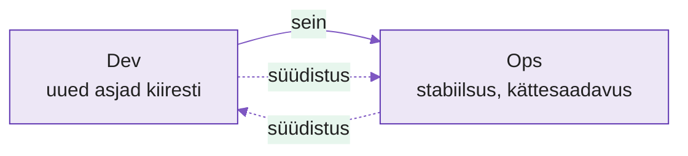
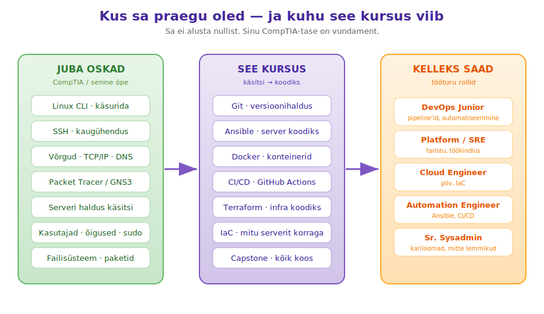
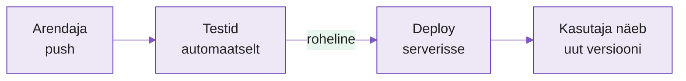

---
tags:
  - Automatiseerimine
  - DevOps
  - Sissejuhatus
---

# Loeng — Miks automatiseerimine?

**Kestus:** ~40 minutit
**Tase:** Sissejuhatav — tööriistu veel ei kasuta

---

!!! example "Näidisstsenaarium"
    Kell 17:00, reede. Meeskond saadab uut versiooni välja. Protsess on 23 sammu, kõik käsitsi. Üks arendaja kopeerib failid ja unustab ühe konfiguratsioonimuudatuse. Kasutajad saavad vea. Kõik tulevad tagasi kontorisse, otsivad — üks unustatud samm. Kolm tundi.

    See ei ole äärmuslik. See juhtub igas ettevõttes, kus deploy on käsitsi. Masin ei unusta sammu.

---

## Kust DevOps tuli

See valdkond, mida sa õppima hakkad, on tegelikult **noorem kui sina**. Enne 2008. aastat oli tarkvarafirmades sein: ühel pool **arendajad** (Dev), kes tahtsid uusi asju välja lasta, teisel pool **operatsioonid** (Ops), kes tahtsid, et server püsiks püsti. Kaks tiimi, vastandlikud eesmärgid, süüdistasid teineteist iga rikke korral. "Töötab minu masinas" ütles üks; "aga mitte tootmises" vastas teine.

<figure markdown="span">

  <figcaption>Joonis 1.1. Enne DevOps'i: kaks tiimi, vastandlikud eesmärgid, sein vahel (Talvik, 2025).</figcaption>
</figure>

Paar kuupäeva, mis selle seina maha võtsid:

| Aasta | Mis juhtus |
|---|---|
| 2008 | Agile-konverentsil Torontos kutsub Andrew Shafer kokku sessiooni "Agile Infrastructure". Kohale tuleb **üks inimene** — Patrick Debois. Nad kaks moodustavad rühma. |
| 2009 | Velocity-konverentsil räägivad Allspaw ja Hammond Flickrist: **"10+ deploys a day"** — kuidas Dev ja Ops koos töötades saab päevas kümneid kordi turvaliselt välja lasta. |
| 2009 okt | Debois korraldab Belgias Ghentis esimese **DevOpsDays** konverentsi. Twitteris tekib hashtag **#DevOps** — ja liikumine saab nime. |
| 2010– | DevOpsDays levib üle maailma; Jez Humble kirjutab raamatu "Continuous Delivery". Aastaks 2014 võtavad suurettevõtted DevOps'i kasutusele. |

*Tabel 1.1. DevOps'i sünd — paar aastat, mis muutsid tööstust (Devopedia, 2022).*

DevOps ei ole tööriist ega sertifikaat — see on **hoiak**: arendajad, kes mõtlevad nagu operatsioonid, ja operatsioonid, kes mõtlevad nagu arendajad. Tööriistad (Git, Docker, Ansible, mida sa õpid) on selle hoiaku **võimaldajad**, mitte hoiak ise. John Willis võttis selle kokku valemiga **CAMS**: Culture, Automation, Measurement, Sharing — kultuur enne tööriistu.

!!! tip "Vaata (10 min) — kust see kõik algas"
    Lühike video DevOps'i ajaloost ja sünnist: [The (Short) History of DevOps](https://www.youtube.com/watch?v=o7-IuYS0iSE). Vaata enne järgmist osa — saad aru, **miks** see valdkond üldse tekkis.

    Rohkem ajajoont ja mõisteid: [Devopedia — DevOps milestones](https://devopedia.org/devops#milestones).

---

## Sina ei alusta nullist

Sa oled juba pool teed — lihtsalt keegi pole seda sulle niimoodi öelnud. Kõik, mida CompTIA / senine õpe sulle andis (Linux käsurida, SSH, võrgud, Packet Tracer, serverihaldus), on **täpselt** see vundament, millele DevOps ehitab. Vahe on üks: seni tegid neid asju **käsitsi**, nüüd õpid tegema **koodiga**.

<figure markdown="span">
  
  <figcaption>Joonis 1.3. Sinu senine sysadmin-tase on vasakpoolne tulp — kursus tõlgib selle keskmiseks, tööturg maksab parempoolse eest (Talvik, 2025).</figcaption>
</figure>

Näide, mis sulle kohe tuttav on: nädal 1 seadistad SSH võtme ja logid serverisse — seda oskad juba. Nädal 3 paned **Ansible** tegema sama SSH-ühendust, aga korraga viiekümnele serverile, ühe käsuga. Sama oskus, teine skaala. Kogu kursus on selline: võtab midagi, mida käsitsi juba tead, ja näitab kuidas masin selle sinu eest ära teeb.

---

## Mis on automatiseerimine?

Kirjutad protsessi ühe korra koodina, ja masin käivitab seda alati täpselt samamoodi.

Näide: iga kord kui arendaja pushib koodi GitHubi, käivituvad testid. Kui roheline, saadetakse rakendus serverisse. Inimene ei tee midagi.

<figure markdown="span">

  <figcaption>Joonis 1.2. Push käivitab ahela — testidest deploy'ni ilma inimese sekkumiseta (Talvik, 2025).</figcaption>
</figure>

---

## Manuaalne vs automatiseeritud

| Küsimus | Manuaalne | Automatiseeritud |
|---|---|---|
| Kui kiire on alustada? | Kiire — teed sammu kohe | Aeglasem — pead skripti kirjutama |
| Tulemus iga kord sama? | Ei — sõltub inimesest, väsimusest | Jah — täpselt sama |
| Kes saab teha? | Ainult see, kes protsessi tunneb | Igaüks, kes pipeline'i käivitab |
| Auditeeritav? | Raske — mis samm, millal? | Täielik logi |
| Mis juhtub öösel / puhkusel? | Keegi peab kohal olema | Masin töötab ise |

*Tabel 1.2. Manuaalse ja automatiseeritud töövoo võrdlus.*

Manuaalne töö ei ole halb, kõike ei pea automatiseerima. Aga korduv ja tähtis protsess — seal hoiab automatiseerimine aja ja vead ära.

---

## Millal mitte automatiseerida?

Automatiseerimine nõuab aega. Enne kui alustad, küsi:

1. **Kas teen seda rohkem kui korra?** Ühekordne asi — tee lihtsalt käsitsi.
2. **Kas protsess on stabiilne?** Kui muutub iga nädal — oota, muidu automatiseerid midagi mis kohe muutub.
3. **Kas tasub ära?** Kui skript võtab 10× kauem kui käsitsi — arvesta investeeringut.

Rusikareegel: kui sama protsess kordub üle 5 korra, tasub kaaluda.

---

## Deklaratiivne vs imperatiivne

Kontseptsioon, mille juurde kursuse jooksul korduvalt tuled.

**Imperatiivne** — kirjeldad samme (*kuidas* teha):

```bash
mkdir /opt/myapp
cd /opt/myapp
git clone https://github.com/example/app .
pip install -r requirements.txt
systemctl start myapp
```

**Deklaratiivne** — kirjeldad lõppseisundit (*mis* peab olema):

```yaml
- name: Rakendus on paigaldatud ja töötab
  hosts: servers
  tasks:
    - name: repo on kloonitud
      git:
        repo: https://github.com/example/app
        dest: /opt/myapp
    - name: teenus töötab
      service:
        name: myapp
        state: started
```

Teisel juhul ei ütle sa mida teha — ütled mis peab olema, ja tööriist otsustab sammud ise. Bash-skriptid on imperatiivsed; Ansible, Terraform ja Docker Compose deklaratiivsed.

---

## Idempotentsus

**Idempotentsus** tähendab: toimingut saab teha mitu korda, tulemus on alati sama.

- `echo "hello" >> fail.txt` — **ei** ole idempotentne (iga kord lisab rea)
- `echo "hello" > fail.txt` — **on** idempotentne (iga kord kirjutab sama üle)

Hea automatiseerimisskript on idempotentne — käivitad 10 korda, tulemus sama, turvaline. Ansible (nädal 3) on üles ehitatud sellele: kirjeldad soovitud olekut, mitte samme.

---

## Deploy — mis see on?

Deploy tähendab rakenduse uue versiooni käivitamist serveris nii, et kasutajad seda kasutada saavad. Käsitsi võib see näha välja nii:

1. Ühenda serveriga (SSH)
2. Lae kood alla (`git pull`)
3. Installi sõltuvused (`pip install -r requirements.txt`)
4. Kopeeri konfiguratsioon (`cp .env.prod .env`)
5. Taaskäivita rakendus (`systemctl restart myapp`)
6. Kontrolli et töötab (`curl .../health`)
7. Teavita meeskonda

Iga samm on potentsiaalne viga. Samm 4 on lihtne unustada, samm 5 võib ebaõnnestuda, samm 6 ei pruugi näidata tõde. Automatiseeritud deploy teeb sama, aga ilma unustamiseta.

---

## Miks IT seda vajab?

DevOps-uuringud (nt DORA "State of DevOps") näitavad järjekindlalt sama mustrit: meeskonnad, kes on deploy automatiseerinud, saadavad muudatusi **sagedamini**, **kiiremini** ja **väiksema tõrkemääraga** kui need, kes teevad käsitsi. Käsitsi-meeskonnad saadavad harvemini — sest iga kord on pingeline ja riskantne.

Automatiseerimine ei ole ainult mugavus, see on konkurentsieelis: kes saab muudatused kiiremini ja turvalisemalt turule, on tugevamas seisus.

---

## Selle kursuse suur pilt

Iga tööriist lahendab ühe konkreetse probleemi. Need ei ole eraldi asjad — need on ühe ahela lülid.

```mermaid
%%{init: {'theme':'base','themeVariables':{'primaryColor':'#ede7f6','primaryBorderColor':'#5e35b1','primaryTextColor':'#212121','lineColor':'#7e57c2'}}}%%
graph LR
    A[Kood] -->|Git| B[Meeskonnatöö]
    B -->|Ansible| C[Server õiges seisus]
    C -->|Docker| D[Töötab kõikjal]
    D -->|GitHub Actions| E[Automaatsed testid]
    E -->|Terraform + Ansible| F[Infra koodis]
    F -->|mitu serverit| G[Korratav park]
```

<figure markdown="span">

  <figcaption>Joonis 1.4. Kursuse tööriistad ühe tarnekonveieri lülidena (Talvik, 2025).</figcaption>
</figure>

| Tööriist | Lahendab | Kursuses |
|---|---|---|
| Git | Versioonikontroll, meeskonnatöö | Nädal 2 |
| Ansible | Serveri konfiguratsioon | Nädal 3–4 |
| Docker | Rakenduse pakendamine | Nädal 5 |
| Docker Compose | Mitu teenust korraga | Nädal 6 |
| GitHub Actions | CI/CD pipeline | Nädal 7–8 |
| Terraform | Infrastruktuur koodina | Nädal 10–11 |
| Ansible IaC | Mitu serverit, keskkonnad | Nädal 12 |

*Tabel 1.3. Kursuse tööriistad ja millal neid võetakse.*

Nädal 13 ehitad meeskonnaga terve ahela ise — koodist töötava rakenduseni serveris.

---

## Versioonikontroll — kõige alus

Kui kood ei ole versioonikontrollis, ei saa automatiseerida. Git annab: ajaloo (kes muutis mida, millal), tagasipööramise (vanema versiooni juurde), koostöö (mitu inimest korraga) ja käivitaja (iga `push` võib pipeline'i käima panna). Nädal 2 alustamegi sellest.

---

## Kokkuvõte

- Manuaalne töö on inimliku vea allikas — automatiseerimine kõrvaldab selle
- Tasub ära, kui protsess on korduv ja stabiilne
- Deklaratiivne kirjeldab lõppseisundit, imperatiivne samme
- Idempotentsus: sama tulemus, ükskõik mitu korda
- Kõik algab versioonikontrollist
- Kursuse lõpus on sul terve CI/CD pipeline, päris tööriistadega

---

*Järgmine: Praktikumis kaardistame ühe manuaalse protsessi koos ja otsime, kus automatiseerimine kõige rohkem aitaks.*
