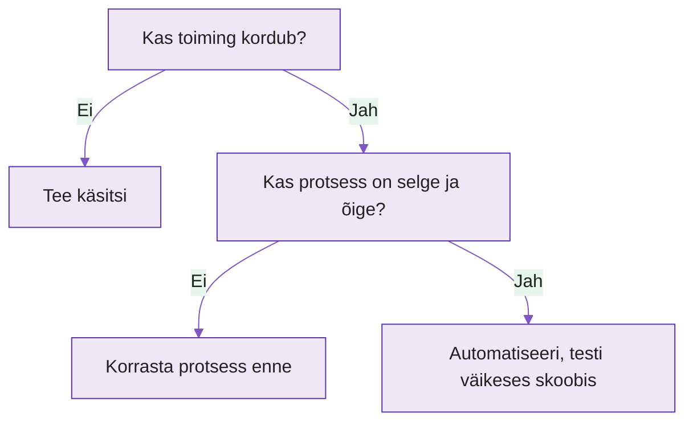
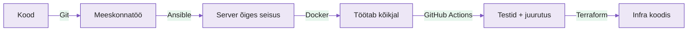

---
tags:
  - Automatiseerimine
  - DevOps
  - Sissejuhatus
---

# Loeng - Miks automatiseerimine?

*Kuidas käsitsi tehtud IT-töö lakkas skaleerumast - ja mis selle asemele tuli*

**Kestus:** ~50 min. See on loengu **tuum**. Süvamaterjal (SRE, AIOps, DORA, Ops-perekond, ajalugu) on samas failis allpool jaotises **Taust ja edasijõudnutele** (loe pärast tundi).
**Tase:** sissejuhatav. Tööriistu veel ei kasuta, aga hakkad mõtlema nagu insener.

---

## Õpiväljundid

Tunni lõpuks oskad selgitada kuut asja:

1. mis on automatiseerimine (arvuti teeb korduvat, selgete reeglitega tööd ühtemoodi);
2. miks käsitsi tehtud töö ei skaleeru;
3. millal automatiseerida ja millal mitte;
4. mis vahe on käsitsi tööl ja koodiga tööl;
5. mida tähendab **idempotentsus** ja **deklaratiivne vs imperatiivne**;
6. kuidas Git, Ansible, Docker, CI/CD ja Terraform ühendavad ühe teenuse teekonna arendusest tootmiseni.

!!! info "Kolm asja ilma slaidita"
    Tunni lõpuks peavad **ilma slaidita** selged olema: miks käsitöö ei skaleeru; miks automatiseerimine ei ole lihtsalt "kiirem käsitöö"; kuidas kursuse tööriistad ühte ahelasse käivad.

---

## 1. Näidisstsenaarium

!!! abstract "Miks see oluline on?"
    Iga rakendus jõudis serverisse mingi protsessi kaudu. Kui see protsess on käsitsi ja kellegi mälu najal, siis mingil ööl see katkeb, ja keegi ärkab kell kolm üles.

!!! example "Reede, 23:00"
    Kati on arendaja. Ta kirjutas veebipoele uue makselehe ja see töötab tema sülearvutis suurepäraselt. Testid rohelised, kolleeg vaatas koodi üle.

    Kell 23:00 logib Mati - süsteemiadministraator - serverisse sisse ja kopeerib Kati failid käsitsi tootmisse. Ta teeb seda iga kord natuke isemoodi, sest juhend on tema peas. Sel korral, väsinuna, unustab ta ühe seadistuse.

    Sait läheb maha. Kliendid ei saa maksta. Ainus, kes teab, mis valesti läks, on Mati - ja tema läks just magama.

Küsi kolm asja:

- **Mis läks valesti?** Mitte kood. Valesti läks **protsess** - see, kuidas kood serverisse jõuab.
- **Mis sõltus mälust?** Failide kopeerimine, seadistus, taaskäivitus - kõik Mati peas.
- **Mille arvuti võiks korrata?** Peaaegu kõik. Arvuti ei väsi kell 23:00 ega unusta sammu.

Ja tähtis: probleem ei ole "Mati oli hooletu". Probleem on **süsteem**, mis lubas kriitilise sammu olla ainult ühe väsinud inimese peas.

!!! quote
    Eesmärk ei ole leida Matit, keda süüdistada. Eesmärk on ehitada süsteem, kus üks unustatud samm ei saa vaikselt tootmist maha võtta.

Lähtepunkt: **käsitsi tehtud töö on ebaühtlane ja aeglane; automatiseeritud, üle vaadatud protsess on korratav ja turvalisem.** Automatiseerimine ei võta vastutust ära - teeb selle nähtavaks ja korratavaks.

!!! question "Kontrolli ennast"
    1. Kati kood töötas tema masinas. Miks siis sait maha läks?
    2. Nimeta üks samm, mis sõltus ainult Mati mälust.
    3. Miks pole "Mati olgu hoolsam" hea lahendus?

---

## 2. Mis käsitöös katki läheb

!!! abstract "Miks see oluline on?"
    Üks server ja üks muudatus on käsitsi hallatav. Probleem tekib skaalaga - ja see on kogu automatiseerimise põhjus.

Üks server ja üks ühekordne muudatus võib olla käsitsi hallatav. Aga kui servereid, kasutajaid, muudatusi ja keskkondi tuleb rohkem, kasvab koos nendega:

- **kopeerimine** - sama töö ikka ja jälle;
- **unustamine** - üks samm jääb tegemata;
- **erinevused** - serverid triivivad eri seisunditesse;
- **teadmise sõltuvus** - protsess on ühe inimese peas, mitte kirjas;
- **väsimus** - inimene teeb kell 23:00 vigu.

Käsitöö ei skaleeru mitte sellepärast, et inimesed on halvad, vaid sellepärast, et **inimene ei ole loodud sama asja sada korda täpselt kordama**. Arvuti on.

!!! question "Kontrolli ennast"
    1. Miks on üks server käsitsi hallatav, aga sada ei ole?
    2. Mida tähendab "serverid triivivad eri seisunditesse"?
    3. Miks on teadmise sõltuvus ühest inimesest riskantne?

---

## 3. Millal automatiseerida - ja millal mitte

!!! abstract "Miks see oluline on?"
    Algaja arvab, et kõik tuleb kohe automatiseerida. Insener teab, millal see tasub ja millal mitte.

Hea automaatika kandidaat on töö, mis on:

- **korduv**;
- **piisavalt sagedane või suure mõjuga**;
- **selgelt kirjeldatav**;
- **stabiilse protsessiga**;
- **kontrollitava tulemusega**.

Ühekordset, ebamäärast või pidevalt muutuvat ülesannet ei pruugi olla mõistlik automatiseerida.

!!! warning "Kõige tähtsam reegel"
    **Esmalt tee protsess õigeks; alles siis kirjuta see koodiks.** Muidu saad kiiresti tehtud vea, ainult suuremas skaalas.

**Kolme korra reegel** on lihtne rusikareegel: esimest korda teed käsitsi, teist korda nurised, kolmandal korral automatiseerid. "Kolm" ei ole püha number - mõte on, et pärast paari kordust on selge, et toiming kordub ja tasub automatiseerida.

<figure markdown="span">

```mermaid
%%{init: {'theme':'base','themeVariables':{'primaryColor':'#ede7f6','primaryBorderColor':'#5e35b1','primaryTextColor':'#212121','lineColor':'#7e57c2'}}}%%
flowchart TD
    A[Kas toiming kordub?] -->|Ei| B[Tee käsitsi]
    A -->|Jah| C[Kas protsess on selge ja õige?]
    C -->|Ei| D[Korrasta protsess enne]
    C -->|Jah| E[Automatiseeri, testi väikeses skoobis]
```
  <figcaption>Joonis 3.1. Millal tasub automatiseerida (Talvik, 2025).</figcaption>
</figure>

Ettevaatust: **kiiresti tehtud vale on ikka vale, lihtsalt kiiremini ja sajas serveris korraga.** Automatiseerimine võimendab seda, mis sul juba on - nii head kui halba.

!!! question "Kontrolli ennast"
    1. Nimeta kolm hea automaatika-kandidaadi tunnust.
    2. Miks tuleb protsess enne õigeks teha?
    3. Millal EI tasu automatiseerida?

---

## 4. Automatiseerimise lühike ajajoon

!!! abstract "Miks see oluline on?"
    Automatiseerimine ei alanud DevOpsist ega AI-st. Iga uus laine tekkis, sest eelmine ei skaleerunud enam.

| Samm | Milline probleem tekkis? | Mis vastus tekkis? |
|---|---|---|
| Käsitsi administreerimine | Inimene teeb serveris samu käske | SSH, runbook'id, käsitsi seadistus |
| Skriptimine | Sama käsk tuleb käivitada kümnetes kohtades | Bash, PowerShell, cron |
| Konfiguratsioonihaldus | Serverid triivivad eri seisunditesse | Puppet, Chef, Ansible |
| DevOps ja CI/CD | Arenduse ja ops'i vahel aeglane, riskantne üleandmine | Git, automaattestid, pipeline'id, automaatne deploy |
| IaC ja pilv | Taristut luuakse pilvekonsoolis käsitsi, keegi ei tea, mis muudeti | Terraform, CloudFormation, versioonihaldus |
| GitOps ja platvormid | Paljud tiimid kordavad sama taristu- ja juurutustööd | Git kui soovitud seisu allikas, "golden path" |
| AIOps | Logisid ja häireid on inimesele liiga palju | Anomaaliatuvastus, korrelatsioon, automaatne esmane analüüs |

*Tabel 4.1. Automatiseerimise arengujoon.*

!!! quote
    Uus tehnoloogia ei kustuta vana. Ansible ei kaota SSH-d; Terraform ei kaota võrke; CI/CD ei kaota testimise vastutust. Automatiseerimine ehitab põhitõdede peale ja viib need suuremasse skaalasse.

!!! question "Kontrolli ennast"
    1. Miks tekkis iga uus automatiseerimise laine?
    2. Kas Ansible tühistab SSH? Selgita.
    3. Mille probleemi lahendas konfiguratsioonihaldus?

---

## 5. Sama töö: käsitsi vs Ansible

!!! abstract "Miks see oluline on?"
    See on loengu tehniline keskpunkt. Kõige selgemini näed vahet, kui vaatad sama ülesannet kahel viisil.

Ülesanne: paigalda kolmele serverile nginx ja käivita.

**Käsitsi (imperatiivne, ei skaleeru):**

```bash
ssh server1
sudo apt update && sudo apt install -y nginx
sudo systemctl enable --now nginx
exit
# server2 - sama uuesti
# server3 - sama uuesti
```

Probleemid: kordad sama, teed kuskil vea, unustad serveri, ei tea hiljem iga masina seisu.

**Koodiga (deklaratiivne, skaleerub):**

```yaml
- name: Veebiserver kõigis masinates
  hosts: koik_serverid
  become: true
  tasks:
    - name: nginx on paigaldatud
      ansible.builtin.apt:
        name: nginx
        state: present
        update_cache: true
    - name: nginx tootab ja kaivitub buutimisel
      ansible.builtin.service:
        name: nginx
        state: started
        enabled: true
```

| Käsitsi | Koodiga |
|---|---|
| Inimene teeb samme iga serveri jaoks eraldi | Üks kirjeldus rakendub kõigile |
| Tulemus võib serveriti erineda | Soovitud seis on kõigil sama |
| Teadmine inimese peas | Teadmine failis ja Giti ajaloos |
| Vea leidmine sõltub mälust | Muudatusi saab üle vaadata ja võrrelda |
| Kordamisel rohkem käsitööd | Sama konfiguratsiooni saab uuesti käivitada |

*Tabel 5.1. Käsitsi vs koodiga.*

Sama fail töötab kolme või kolmesaja serveri jaoks - muudad ainult inventari. See paneb paika, miks kursusel tulevad Git, Ansible, Docker, CI/CD ja Terraform.

!!! question "Kontrolli ennast"
    1. Mis on käsitsi-versiooni kolm probleemi?
    2. Mis muutub, kui serverite arv kasvab 3-lt 300-le?
    3. Kus elab teadmine koodiga-versioonis?

---

## 6. Idempotentsus

!!! abstract "Miks see oluline on?"
    Idempotentsus on automaatika keskne mõiste: kui käivitan automaatika uuesti, ei tohiks ta süsteemi iga kord rohkem muuta ega katki teha.

```bash
echo "x" >> fail    # EI ole idempotentne: iga käivitus lisab rea
echo "x" > fail     # ON idempotentne: iga käivitus annab sama tulemuse
```

Esimene lisab iga korraga rea; teine kirjutab üle. Hea automatiseerimine on idempotentne: käivitad 10 korda, seis sama, midagi ei lähe katki.

Ansible on sellele ehitatud - näiteks "teenus **peab olema** käivitatud": kui teenus juba töötab, ei tee Ansible midagi; kui ei, käivitab. See seob idempotentsuse otse **soovitud seisundi** ideega.

!!! question "Kontrolli ennast"
    1. Mida tähendab idempotentne?
    2. Miks `echo >>` ei ole, aga `echo >` on idempotentne?
    3. Miks saad Ansible-playbook'i julgelt uuesti käivitada?

---

## 7. Deklaratiivne vs imperatiivne

!!! abstract "Miks see oluline on?"
    See selgitab, miks konfiguratsioonihaldus ja IaC ei ole lihtsalt "palju käske ühes failis". Otsene sild Bashilt Ansible'ini.

- **Imperatiivne:** "tee need sammud selles järjekorras." (Bash-skript.)
- **Deklaratiivne:** "süsteem peab olema sellises lõppseisus." (Ansible, Terraform, Compose.)

Deklaratiivne ütleb *mis peab olema*, mitte *kuidas seda teha* - tööriist otsustab sammud ise ja jätab tegemata selle, mis juba õige.

!!! note "Nüanss hilisemaks"
    Ansible-playbook on üldiselt deklaratiivne ja enamik mooduleid idempotentsed, aga `command`/`shell` võivad olla imperatiivsed - seega "Ansible = alati deklaratiivne" on lihtsustus.

!!! question "Kontrolli ennast"
    1. Mis vahe on imperatiivsel ja deklaratiivsel?
    2. Miks on deklaratiivne turvalisem korduval käivitamisel?
    3. Nimeta üks deklaratiivne tööriist kursuselt.

---

## 8. DevOps ühe põhimõttena

!!! abstract "Miks see oluline on?"
    Automatiseerimine ei lahenda ainult tehnilist probleemi. Kui arendaja kirjutab koodi ja ops käitab teenust, peab tarneahel olema ühine, nähtav ja tagasisidega.

Lühidalt:

- enne DevOpsi olid **Dev** ja **Ops** sageli eraldi silodes;
- Dev tahtis kiiresti muudatusi, Ops stabiilsust;
- "üle müüri viskamine" tekitas aeglaseid, riskantseid ja süüdistavaid väljalaskeid;
- DevOps ühendab koostöö, jagatud vastutuse, automatiseerimise, mõõtmise ja teadmise jagamise;
- DevOps **ei ole** üks tööriist, üks tiim ega ametinimetus.

!!! quote
    Hea automatiseerimine vajab inimesi, toimivat koostööd, mõõtmist ja jagatud teadmist - mitte ainult uut tööriista.

*Kust DevOps täpsemalt tuli, mis on CAMS, SRE, platvormi-inseneeria ja Ops-perekond - vt allpool **Taust ja edasijõudnutele**.*

!!! question "Kontrolli ennast"
    1. Mis oli "üle müüri viskamise" probleem?
    2. Mida DevOps selle asemel pakub?
    3. Miks pole DevOps üks tööriist?

---

## 9. Infrastruktuur koodina ja kursuse tööriistaahel

!!! abstract "Miks see oluline on?"
    IaC on kursuse kesksemaid ideid, ja tööriistaahel näitab, kuidas kõik kokku käib.

**Infrastruktuur koodina (IaC):** kirjelda serverid, võrgud ja õigused failides, mida saab versioonihaldusesse panna, üle vaadata ja automaatselt rakendada.

!!! quote
    Selle asemel et "klõpsa kümmet pilve-nuppu, et teha server", ütled "hoia server, võrk ja õigused koodina; lase üle vaadata; las automaatika loob ühtemoodi".

IaC ja automatiseeritud, üle vaadatud juurutus oleksid Kati ja Mati vea tõenäosust oluliselt vähendanud. Ka automaatika võib olla vigane - aga siis on viga nähtav ja korratav, mitte peidus ühe inimese peas.

Kursuse tööriistad on ühe tarneahela lülid:

<figure markdown="span">

```mermaid
%%{init: {'theme':'base','themeVariables':{'primaryColor':'#ede7f6','primaryBorderColor':'#5e35b1','primaryTextColor':'#212121','lineColor':'#7e57c2'}}}%%
graph LR
    A[Kood] -->|Git| B[Meeskonnatöö]
    B -->|Ansible| C[Server õiges seisus]
    C -->|Docker| D[Töötab kõikjal]
    D -->|GitHub Actions| E[Testid + juurutus]
    E -->|Terraform| F[Infra koodis]
```
  <figcaption>Joonis 9.1. Kursuse tööriistad ühe konveieri lülidena (Talvik, 2025).</figcaption>
</figure>

| Tööriist | Millist käsitöö-probleemi lahendab | Kursuses |
|---|---|---|
| Git | Kes muutis, mida, millal | Nädal 2 |
| Ansible | Sama seadistus paljudes masinates | Nädal 3-4 |
| Docker | Rakendus ühtemoodi käivitatav ("aga minu masinas töötas") | Nädal 5-6 |
| GitHub Actions | Test ja juurutus ei sõltu kellegi õhtusest käsitööst | Nädal 7-8 |
| Terraform | Ka infrastruktuur kirjeldatud, üle vaadatud, korratav | Nädal 10-11 |

*Tabel 9.1. Kursuse tööriistad.* Nädal 13: ehitad terve ahela ise.

!!! question "Kontrolli ennast"
    1. Mida tähendab IaC ühe lausega?
    2. Millist probleemi lahendab Git ja millal seda õpid?
    3. Miks on tööriistad ühe ahela lülid, mitte eraldi asjad?

---

## 10. Kokkuvõte

| Mõiste | Selgitus |
|---|---|
| **Automatiseerimine** | Arvuti teeb korduvat tööd reeglite järgi, ühtemoodi |
| **Miks käsitöö ei skaleeru** | Kopeerimine, unustamine, erinevused, teadmine ühe peas, väsimus |
| **Kolme korra reegel** | Pärast paari kordust tasub automatiseerida |
| **"Automatiseeritud vale"** | Kiire viga suuremas skaalas - korrasta protsess enne |
| **Idempotentsus** | Sama toiming mitu korda → sama tulemus |
| **Deklaratiivne** | Kirjelda lõppseisund, mitte samme |
| **DevOps** | Ühine, nähtav, tagasisidega tarneahel - kultuur, mitte tööriist |
| **IaC** | Infrastruktuur koodina |

!!! success "Lõplik kontroll - kolm tuumaküsimust"
    1. Miks käsitsi tehtud IT-töö ei skaleeru?
    2. Miks automatiseerimine ei ole lihtsalt "kiirem käsitöö"?
    3. Kuidas ühendavad Git, Ansible, Docker ja CI/CD ühe teenuse teekonna arendusest tootmiseni?

---

## 11. Enne laborit

Loeng andis "miks". Praktikum annab "kuidas". Täna paned töökeskkonna korda - ahela **esimese lüli**: SSH-võti, `~/.ssh/config` nimega hostid, VS Code Remote-SSH, Git, Ansible-kontroller.

See võib näida väikese tehnilise detailina, aga see on eeltingimus, et sama tegevust saaks hiljem korrata kümnetel serveritel. Kui täna keskkond ei tööta, ei tööta ka ülejäänud kursus.

---

*Nüüd oled valmis laboriks! See on ahela esimene lüli - kõik ülejäänud nädalad ehitavad selle peale.*

---

# Taust ja edasijõudnutele

!!! note "Loe pärast tundi"
    Alljärgnev süvendab loengut. See ei ole esimese tunni tuum - need teemad tulevad paremini mõjule, kui juba tead, mida tähendab deploy, pipeline, konfiguratsioon, infrastruktuur ja monitooring.

## Kust DevOps tuli (detailne ajalugu)

See valdkond on noorem kui sina. Enne 2008: sein. Ühel pool **Dev**, kes tahtis uusi asju kiiresti; teisel **Ops**, kes tahtis stabiilsust. Arendaja viskas koodi "üle müüri"; rike, süüdistus.

| Aasta | Mis juhtus |
|---|---|
| 2008 | Agile-konverentsil Torontos kutsub Andrew Shafer kokku "Agile Infrastructure" sessiooni; kohale tuleb üks inimene - Patrick Debois |
| 2009 | Velocity-konverentsil Allspaw & Hammond: "10+ deploys a day" Flickris |
| 2009 okt | Debois korraldab Ghentis esimese DevOpsDays; Twitteris tekib #DevOps |
| 2010- | DevOpsDays levib; Jez Humble "Continuous Delivery"; suurettevõtted võtavad kasutusele |

*Tabel. DevOpsi sünd (Devopedia, 2022).*

Google'i sõna korduvale käsitööle on **toil** (rüsitöö): käsitsi, korduv, automatiseeritav, väärtust mitte-lisav, teenuse kasvades kasvav töö.

!!! tip "Vaata - kust see kõik algas"
    - [History of DevOps (Damon Edwards)](https://www.youtube.com/watch?v=o7-IuYS0iSE)
    - [The Origins of DevOps (Cisco)](https://www.youtube.com/watch?v=4ROs_A6Vj9o)
    - [History and Evolution of DevOps](https://www.youtube.com/watch?v=fNgXG7oTS7k)
    - [Devopedia - DevOps milestones](https://devopedia.org/devops#milestones)

---

## Kaks vaadet veale (blameless)

**Vana vaade (blame):** inimene tegi vea, leia süüdlane. **Uus vaade (blameless):** viga on sümptom; süsteem lubas sel juhtuda. Küsi "miks tundus see tegu mõistlik ja mis süsteemis lubas veal kasvada?", mitte "kes?". Hoolsus ei skaleeru. See ongi DevOpsi vaimne nihe (Davis & Daniels, 2016).

---

## Mis DevOps EI ole (müüdid)

| Müüt | Miks vale |
|---|---|
| **ametinimetus** ("DevOps engineer") | Nimetus tähistab liikumist; "arendaja + sysadmin ühe palga eest" ei skaleeru |
| **eraldi tiim** | Uus "DevOps-tiim" lisab kolmanda silo |
| **tööriistad** | Tööriistad on võimaldajad, mitte definitsioon |
| **automatiseerimine** | Automatiseerimine on tulemus; kultuuritult teed vigu kiiremini |
| **üks õige viis** | Teise firma pime kopeerimine loob silosid |
| **pool inimesi, sama töö** | Ei säästa palka; tõstab kvaliteeti ja kiirust |

*Tabel. DevOpsi müüdid (Davis & Daniels, 2016).*

---

## Mis DevOps siis ON (CAMS ja kompakt)

**CAMS:** Culture, Automation, Measurement, Sharing. Kultuur enne tööriistu.

Tuum on **kompakt**: ühine eesmärk, pidev suhtlus, jooksev parandamine. Analoogia kaljuronimine: ronija ronib, julgestaja hoiab köit; enne algust kontrollivad mõlemad sõlmed; märguanded "on belay?", "belay on".

!!! note "Folk model"
    DevOps on mõiste, mida eri inimesed kasutavad eri tähenduses; inimesed vaidlevad definitsiooni üle rohkem kui ideede üle. Küsi "mis probleemi me lahendame?".

---

## DevOpsi silmus

plan → code → build → test → release → deploy → operate → monitor → (tagasi). Kõige tähtsam osa on **tagasiside**: rikke info läheb tagasi planeerimisse. See teeb sellest silmuse, mitte joone.

---

## Ops-perekond

DevOpsi ideed levisid teistesse valdkondadesse. LiveActioni jaotus:

| Rühm | Nimi | Fookus |
|---|---|---|
| Algne | ITOps | Infra, monitooring, deploy |
| Algne | DevOps | Arendus + ops CI/CD-silmuses |
| Algne | NetOps | Võrgu tervis, automatiseerimine |
| Algne | SecOps | Riski vähendamine üleselt |
| Uus | CloudOps | Pilve provisioning, optimeerimine |
| Uus | EdgeOps | Servavõrgud, kaugharud |
| Uus | AIOps | Big data + ML ops'ile |
| Uus | NoOps | Arendaja "üle müüri" (pole juurdunud) |
| Hübriid | DevSecOps | Turve arendusse algusest |
| Hübriid | NetSecOps | Võrguturbe automaatne testimine |
| Hübriid | NetDevOps | Automaatika, observability võrgule |

*Tabel (LiveAction, 2022).*

!!! warning "Iga uus Ops ei tohi saada uueks siloks"
    Sufiks `-Ops` ei tähenda automaatselt uut ametit, tiimi ega tööriista. Tavaliselt tähendab see, et sama loogikat - koostöö, automatiseerimine, mõõtmine, tagasiside - rakendatakse teises valdkonnas.

**DevSecOps ei ole DevOpsi järgmine versioon** - see on DevOpsi põhimõtete rakendamine turbele: turve osa tarneahelast algusest peale, mitte värav lõpus (nt sõltuvuste ja secret'ite skannimine pipeline'is).

---

## DevOps, SRE ja platvormi-inseneeria

| Distsipliin | Mis see on | Võtmemõisted |
|---|---|---|
| DevOps | Kultuur ja filosoofia | CAMS, CI/CD |
| SRE | Google'ist lähtuv mõõdetav teostus | SLI/SLO, veaeelarve, toil |
| Platvormi-inseneeria | Skaleerimismuster | Iseteenindusplatvorm, kuldsed teed |

**SRE** on üks mõjukas, Google'ist lähtuv viis DevOpsi usaldusväärsust praktiliselt rakendada (mitte ainus).

**Platvormi-inseneeria** ehitab iseteenindusplatvormi kuldsete teedega, et vähendada tootetiimi kognitiivset koormat (Team Topologies, 2019). Analoogia raudtee: platvorm hoiab rööpaid, tiimid valivad sihtkoha.

---

## SRE detail: SLI, SLO ja veaeelarve

- **SLI** - mõõdik (nt "kui suur osa päringutest õnnestus").
- **SLO** - eesmärk (nt "99,9% õnnestub").
- **Veaeelarve** - vahe 100% ja SLO vahel; lubatud ebausaldusväärsus.

!!! example "Worked-example"
    SLO 99,9% kuus. Kui kaua tohib teenus maas olla?
    Kuus ~30 päeva = 43 200 minutit. Veaeelarve = 0,1% × 43 200 = **~43 minutit/kuus**.
    Kui eelarve otsas, **peatuvad uued funktsioonid**, tiim tegeleb stabiilsusega. Võrdle: 99% → ~7,2 h/kuus; 99,99% → ~4,3 min. Iga lisa-üheksa on kümme korda rangem ja kallim.

---

## AIOps, MLOps ja agentne AIOps

**AIOps** (AI for IT Operations): ML operatsiooniandmetele. Probleem - **häireväsimus** (liiga palju häireid → tähtsaim jääb müra sisse → suurem MTTR). Kolm etappi: kogumine+puhastamine → ML/analüütika (anomaaliad, RCA) → automaatne reageerimine (Red Hat, 2026).

**MLOps ei ole sama:** MLOps hooldab ML-mudelite elutsüklit (andmeteadlased). Eristus: MLOps hooldab mudelit; AIOps kasutab mudelit ops'i jaoks.

**Agentne AIOps:** agent tegutseb ise valvepiirete sees; inimene jääb kalli/pöördumatu otsuse juurde (LogicMonitor, 2026).

!!! note "Korrektuur"
    Need ei ole küpsusastmed, vaid paralleelsed lähenemised.

---

## Automatiseerimine ei ole võluvits

**Automatiseerimine ilma arusaamiseta loob suuremat riski.** Käsitsi vale mõjutab ühte serverit; automaatne vale mõjutab kõiki korraga.

!!! warning "Õppetund lennundusest"
    2013: Asiana 214 lendas San Franciscos vastu merevalli, osalt sest piloodid usaldasid automaatikat, mida ei mõistnud. James Reason: automaatika loojad lõid tahtmatult uued, tõsisemad veatüübid. Automatiseeri alles siis, kui mõistad protsessi. Vt [XKCD 1205](https://xkcd.com/1205).

---

## Rike kui õppetund: postmortem

Blameless-kultuuris pole RCA jaht süüdlasele. "Inimlik viga" on uurimise **algus**, mitte lõpp.

- **5 Whys:** *Sait läks maha. Miks? Vale konf. Miks? Mati unustas sammu. Miks? Samm oli peas, mitte kirjas. Miks? Juurutus oli käsitsi. Miks? Polnud automaatset juurutust.* Vastus ei ole "Mati", vaid "polnud automaatset juurutust".
- **Ishikawa (kalaluu):** põhjuste rühmitamine (inimesed, protsess, tööriistad, keskkond).

---

## DORA

Neli mõõdikut: juurutamise sagedus, muudatuse tarneaeg, muudatuse tõrkemäär, taastumisaeg. Automatiseerinud meeskonnad on kõigis paremad.

!!! warning "Tähtis"
    DORA mõõdikud on vestluse ja süsteemi parandamise tööriist, **mitte töötajate hindamisvahend**. Nad näitavad, kus protsess takerdub, mitte kes on "halb".

---

## Sõnastik

- **Agentne AIOps** - AIOps, kus agent tegutseb ise valvepiirete sees.
- **AIOps** - ML operatsiooniandmetele; anomaaliad, automaatne reageerimine.
- **Ansible** - deklaratiivne konfiguratsiooni-tööriist üle SSH.
- **Blameless** - kultuur, kus rikke järel uuritakse süsteemi, mitte süüdlast.
- **CAMS** - Culture, Automation, Measurement, Sharing.
- **CI/CD** - koodi automaatne testimine (CI) ja juurutamine (CD).
- **Deklaratiivne** - kirjeldad soovitud lõppseisundit.
- **Deploy** - koodi viimine serverisse.
- **DevOps** - kultuuriline hoiak, mis ühendab arenduse ja operatsioonid.
- **DevSecOps** - turbe integreerimine tarneahelasse algusest peale.
- **DORA** - neli mõõdikut tarne tervise hindamiseks.
- **Docker** - rakenduse pakendamine konteinerisse.
- **Git** - versioonihaldus; hoiab muudatuste ajalugu.
- **Idempotentsus** - toiming mitu korda, tulemus sama.
- **Imperatiivne** - kirjeldad samme (kuidas).
- **IaC** - infrastruktuur koodina.
- **Kompakt** - tiimide kokkulepe eesmärgi, suhtluse ja parandamise kohta.
- **MLOps** - ML-mudelite elutsükli haldamine.
- **MTTR** - keskmine rikke lahendusaeg.
- **NetOps** - DevOps-põhimõtted võrgule.
- **Platvormi-inseneeria** - iseteenindusplatvorm koormuse vähendamiseks.
- **Postmortem** - rikke järelanalüüs õppimiseks.
- **SecOps** - turbe integreerimine ops'i ja arendusse.
- **SLI / SLO** - mõõdik ja eesmärk.
- **SRE** - Google'ist lähtuv usaldusväärsuse inseneeria.
- **Terraform** - deklaratiivne IaC-tööriist.
- **Toil** - korduv käsitsi väärtust mitte-lisav töö.
- **Veaeelarve** - lubatud ebausaldusväärsus, vahe 100% ja SLO vahel.

---

## Allikad

| Allikas | Miks |
|---|---|
| Davis & Daniels, *Effective DevOps* (2016) | Kultuur, müüdid, kompakt, blameless |
| LiveAction (2022) | Ops-perekond: <https://www.liveaction.com/resources/solution-briefs/netops-devops-secops-aiopswho-does-what-and-why/> |
| Skelton & Pais, *Team Topologies* (2019) | Kognitiivne koorem, platvormitiim |
| Google, *Site Reliability Engineering* (2016) | SLO, veaeelarve, toil: <https://sre.google/books/> |
| Red Hat, *What is AIOps* (2026) | <https://www.redhat.com/en/topics/ai/what-is-aiops> |
| LogicMonitor (2026) | MLOps, agentne: <https://www.logicmonitor.com/blog/aiops-devops-mlops-and-agentic-aiops> |
| DORA, *State of DevOps* | Miks automatiseerimine tasub |
| Devopedia · XKCD 1205 | <https://devopedia.org/devops> · <https://xkcd.com/1205> |
