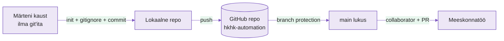

---
tags:
  - Git
  - Versioonihaldus
  - Meeskonnatöö
  - GitHub
---

# Tühjast repost meeskonnani — Labor

**Kestus:** 4 tundi (klassis)
**Tase:** Algaste — esimene kord Git meeskonnaga
**Eeldused:** GitHub konto olemas, SSH võti seadistatud (nädal 1). Tead mis on `git clone`, `git add`, `git commit`, `git push`.
**Töökeskkond:** Oma masin + GitHub, organisatsioon `hkhk-automation`

---

!!! abstract "Õpiväljundid"

    **Teadmised:**

    1. Selgitab mis on `.git/` kaust ja miks lokaalne ≠ remote
    2. Selgitab miks `.gitignore` peab olemas olema **enne** esimest pushi
    3. Kirjeldab mida branch protection teeb ja miks `main` lukustatakse
    4. Eristab collaborator-õigusi: Read, Write, Admin

    **Oskused:**

    5. Loob repo nullist ja seob selle lokaalse kaustaga
    6. Seadistab `main`-ile branch protection reegli
    7. Lisab collaboratori ja annab õpetajale ligipääsu
    8. Töötab feature-branch → PR → review → merge ja lahendab merge-konflikti

---

!!! example "Näidisstsenaarium — Märten"
    Märten oli suvepraktikant. Märten oli entusiastlik. Märten pushis otse `main`-i, sest branchid tundusid tüütud, ja tegi commite sõnumiga `asjad` ja `veelkord` ja `nüüd päriselt`.

    Märten lahkus augustis. Maha jäi kaust `marten-kraam`: paar skripti, üks `.env` fail andmebaasi parooliga, ja null Git-ajalugu. Tema lahkumiskingitus oli `monitor.sh`, mis "peaks töötama". (Ei tööta.)

    Nüüd pärid selle sina ja su paariline. Töö: teha Märteni jamast päris projekt — ajalukku, kaitse alla, reeglite sisse — **enne** kui järgmine Märten reedel kell 16:55 sama loo uuesti alustab.

---

## Osa 1 · Päästa Märteni pärand

Märteni failid on su masinas. Versioonihalduses ei ole neid kunagi olnud. Esimene töö: tee neist repo.

<figure markdown="span">

  <figcaption>Joonis 2.1. Tänase labi kaar: Märteni kaustast kaitstud meeskonnaprojektini (Talvik, 2025).</figcaption>
</figure>

### 1.1 Loo tühi repo GitHubis

Mine `github.com/hkhk-automation` → **New repository**.

- Nimi: `marten-monitor-<sinu-eesnimi>`
- **Private**
- **Ära** lisa README, `.gitignore` ega litsentsi. GitHub pakub neid ühe klõpsuga — aga siis teeb GitHub esimese commiti sinu eest, ja sa jääd ilma sellest, kuidas repo päriselt sünnib. Tühi tähendab tühi.

GitHub näitab nüüd juhiseid. Ära kopeeri neid pimesi — teeme sammud teadlikult, sest just neid sa hiljem sada korda kordad.

### 1.2 Seo Märteni kaust repoga

```bash
cd marten-kraam
git init
git branch -M main
```

`git init` tekitab `.git/` kausta. **See** on repo — mitte GitHub, mitte pilv, vaid see peidetud kaust su ketta peal. GitHub on lihtsalt koopia, mis elab mujal. Seo need kaks:

```bash
git remote add origin git@github.com:hkhk-automation/marten-monitor-<sinu-eesnimi>.git
git remote -v
```

??? question "Mõtle"
    `git init` tekitas `.git/`. Kui sa selle kustutaksid (`rm -rf .git/`), mis kaob ja mis jääb? (Vihje: failid jäävad. Kõik muu — ajalugu, harud, see et Git üldse teab sellest kaustast — kaob. Inimesed on seda teinud. Kogemata. Backupita.)

---

## Osa 2 · `.gitignore` enne kui `.env` lekib

Märten jättis maha `.env` faili. Sees andmebaasi parool. Sinu esimene kiusatus on lihtsalt kõik commitida ja edasi minna. Ära.

!!! example "Näidisstsenaarium"
    Avalikku GitHubi repo pushitud parool ei ela minuteid, vaid sekundeid. Botid skannivad uusi committe ööpäevaringselt — mitte sellepärast et keegi sind jälitab, vaid sellepärast et see on tasuta raha. Parooli Git-ajaloost eemaldamine pärast on omaette õudusfilm. Lihtsam on teda sinna mitte lasta.

Vaata mida Git praegu näeks:

```bash
git status
```

`.env` on nimekirjas. Peata ta enne kui ta liigub:

```bash
nano .gitignore
```

```
# Saladused — Märteni pärand
.env
*.key

# Logifailid
*.log

# macOS rämps, mida keegi ei taha näha
.DS_Store
```

```bash
git status
```

`.env` on kadunud. Fail on kaustas alles, aga Git teeb näo et teda pole.

!!! warning
    `.gitignore` ei kustuta juba pushitud faili — ta hoiab ainult ära uued. Kui parool on korra üleval käinud, on ta lekkinud, punkt. Vaheta ta ära. Ignore pärast on nagu turvavöö pärast avariid.

---

## Osa 3 · Esimene commit — repo elab

Lisa README, et keegi (sh sina kolme kuu pärast) teaks mis see on:

```bash
nano README.md
```

Paar rida: mis projekt, kes autor, mida `monitor.sh` teeks kui töötaks.

Nüüd päästa Märteni pärand ajalukku:

```bash
git add .
git status
git commit -m "init: päästa Märteni kraam versioonihaldusesse"
git push -u origin main
```

Commit-sõnum on terve lause, mitte `asjad`. Märten kirjutas `asjad`. Ära ole Märten.

Mine GitHubi — failid on seal, `.env` ei ole (kontrolli üle). Repol on ajalugu ja üks korralik commit.

??? question "Mõtle"
    Miks pidi olema vähemalt üks commit **enne** kui saame `main`-i kaitsta? Mida GitHub kaitseks, kui `main`-i veel polegi?

---

## Osa 4 · Kaitse `main`

Praegu saab igaüks — sina väsinuna kell 16:55 kaasa arvatud — otse `main`-i pushida. Nii sünnivad Märtenid. Lukusta `main` ära.

GitHubis: **Settings → Branches → Add branch ruleset** (või *Add rule*).

- Branch name pattern: `main`
- **Require a pull request before merging** — sisse
- **Require approvals: 1** — sisse
- **Do not allow bypassing the above settings** — praegu jäta **välja** (nii pääseb õpetaja hädakorral ligi)

Salvesta. Nüüd tee Märtenit: proovi meelega otse `main`-i pushida.

```bash
echo "test" >> README.md
git add README.md
git commit -m "test: kas main on lukus"
git push origin main
```

GitHub lööb käpa ette: `protected branch hook declined`. Hea. Sa jooksid oma enda reeglile vastu — ja see pidas. Võta katse tagasi:

```bash
git reset --hard origin/main
```

!!! tip
    Branch protection ei ole bürokraatia. See on põhjus, miks feature-branch üldse olemas on: kui `main` on lukus, on ainus tee sisse PR. Reegel, mille sa ise peale panid, on ainus reegel, mida sa päriselt usaldad.

---

## Osa 5 · Rollid ja õigused

### 5.1 Lisa paariline collaboratoriks

**Settings → Collaborators → Add people** → paarilise GitHubi kasutajanimi.

| Tase | Mida saab |
|---|---|
| Read | Näeb ja kloonib |
| Write | Pushib branchidesse, avab PR-e |
| Admin | Kõik + seaded, protection, repo kustutamine |

Anna paarilisele **Write**. Ta saab teha branche ja PR-e, aga ei saa su reegleid ära keerata ega repot ära kustutada. Õigus on usalduse mõõt, mitte sõbralikkuse.

### 5.2 Lisa õpetaja

Samas kohas lisa õpetaja kasutajanimi (küsi õpetajalt) **Admin**-õigusega — hindamiseks ja hädakorral päästmiseks.

??? question "Mõtle"
    Märtenil oli admin. Vaata mis juhtus. Miks ei anna sa igale collaboratorile admin-taset "igaks juhuks"?

### 5.3 Rollid risti

Sina oled **oma** repos admin, paariline collaborator. Tema repos vastupidi. Nii oled sa korraga peremees oma majas ja külaline naabri juures — ja saad tunda mõlemat poolt, enne kui päris töökohal keegi sulle `Read`-õiguse annab ja imestad miks sa merge'ida ei saa.

Klooni paarilise repo, seda läheb kohe vaja:

```bash
git clone git@github.com:hkhk-automation/marten-monitor-<paarilise-nimi>.git
```

---

## Osa 6 · Paranda Märtenit — läbi reeglite

`main` on lukus. Märteni katkine `monitor.sh` läheb korda **õiget teed**: branch → PR → review → merge. Sama töö, aga nüüd on tal põhjus, mitte lihtsalt "õpetaja käskis".

### 6.1 Oma haru

```bash
git switch -c fix/monitor-parandused
```

### 6.2 Uuri skripti

```bash
cat monitor.sh
```

```bash
#!/bin/bash
# Märteni servermonitor v1.0
# kirjutatud reedel kell 16:55, varsti koju
# peaks töötama

SERVIIS=nginx
LOG=/var/log/monitor.log
KUUPÄEV=$(date)

# kontrollin kas teenus töötab, google ütles nii
servis $SERVIIS status

if [ $? = 0 ]
then
    echo "$KUUPÄEV - $SERVIIS töötab" >> $LOG
else
    echo "$KUUPÄEV - $SERVIIS EI tööta" >> $LOQ
fi
```

Neli viga. Kommentaarid on vihjed — iga rida, kus Märten ennast õigustab, on koht kus midagi katki. "Google ütles nii" ei ole testimine.

### 6.3 Paranda neli viga

1. `servis` ei ole käsk. Märten kirjutas mälu järgi. → `systemctl status $SERVIIS`
2. `$LOQ` — Q, mitte G. Bash ei kaeba, kirjutab vaikselt tühja stringi ega ütle sõnagi. Log ei uuene kunagi kui teenus on maas — ehk täpselt siis kui seda vaja oleks. → `$LOG`
3. `[ $? = 0 ]` — `=` on stringidele, arvudele on `-eq`. Töötab vahel. "Töötab vahel" on halvim tulemus, sest sa ei tea millal ei tööta. → `[ $? -eq 0 ]`
4. Skript ei peatu vea korral — jookseb rõõmsalt edasi ka pärast ebaõnnestumist. → lisa `set -e` kohe pärast `#!/bin/bash`

Vaata muudatust enne commiti. `git diff` on su viimane võimalus näha mida sa tegelikult saatmas oled:

```bash
git diff
git add monitor.sh
git commit -m "fix: systemctl, LOG kirjaviga, -eq, set -e"
git push -u origin fix/monitor-parandused
```

### 6.4 PR ja review

GitHubis: **Compare & pull request**.

- Title: `Fix: Märteni monitor.sh parandused`
- Description (osa hindest — `fixed stuff` ei lähe arvesse, Märten kirjutas ka `fixed stuff`):
    - Mitu viga, mis tüüpi?
    - Milline oli kõige kavalam ja miks?
    - Kas `set -e` oleks mõne varem paljastanud?

Määra reviewer'iks paariline. Tema avab **sinu** PR-i, vaatab **Files changed**, jätab ühe sisulise kommentaari ja **Approve**. Alles siis saad merge'ida — sest sa ise nõudsid 1 approval. Review ei ole solvang. See on teine paar silmi enne kui asi läheb `main`-i ja sealt tootmisse.

### 6.5 Merge-konflikt — kontrollitud katse

Teie mõlema PR muudab sama rida. Üks merge'ib esimesena. Teine näeb: *"This branch has conflicts."* Konflikt ei ole viga ega süüdistus — Git lihtsalt ei julge sinu eest valida.

```bash
git switch main
git pull origin main
git switch fix/monitor-parandused
git merge main
```

Failis:

```
<<<<<<< HEAD
systemctl status $SERVIIS
=======
service $SERVIIS status
>>>>>>> main
```

`<<<`, `===`, `>>>` on Git'i markerid, mitte kood. Vali õige rida, kustuta markerid, kontrolli `git diff` (jah, jälle), siis:

```bash
git add monitor.sh
git commit -m "resolve: merge konflikt monitor.sh"
git push
```

PR uueneb, merge läheb läbi. Märten on parandatud — seekord korralikult, ja ajaloos on näha kes, mida ja miks.

---

## Lõppkontroll

- [ ] Repo `hkhk-automation` all, vähemalt üks commit
- [ ] `.env` **ei ole** GitHubis, `.gitignore` blokeerib ta
- [ ] `main` on protected — otse-push lükatakse tagasi
- [ ] Paariline on Write-collaborator, õpetaja Admin
- [ ] `monitor.sh` — neli viga parandatud, PR reviewed + merged läbi reeglite
- [ ] Merge-konflikt lahendatud lokaalselt
- [ ] Ükski su commit-sõnum ei ole `asjad`

---

## Lisaülesanded (ette jõudnutele)

**L1 — Päästmine:** Tegid katki commiti (Märteni klassika). `git restore`, `git reset --soft`, `git revert` — millal kumbki? Proovi kõiki kolme, üks lause vahe kohta.

**L2 — CODEOWNERS:** Lisa `.github/CODEOWNERS`, mis nõuab et `monitor.sh` muudatused vaatab üle kindel inimene. Testi.

**L3 — Bash (valikuline):** Kirjuta nullist `check_disk.sh`, mis hoiatab kui `/` kasutus üle 80%. Vihje: `df / | tail -1 | awk '{print $5}' | tr -d '%'`. Too PR-ina, mitte otse `main`-i (sa tead nüüd miks).

**L4 — `git stash`:** Pooleliolev muudatus, siis `git stash`. Kuhu ta kadus? `git stash pop` toob tagasi. Millal kasulik?

---

## Veaotsing

| Probleem | Lahendus |
|---|---|
| `git push` annab `Permission denied` | `ssh -T git@github.com` — kas SSH töötab? |
| `protected branch hook declined` | Töötab õigesti — `main` on lukus, tee branch + PR |
| Merge-nupp on hall | Puudub approval — paariline peab Approve'ima |
| `.env` on juba GitHubis | Vaheta parool, siis `git rm --cached .env` + commit |
| PR näitab konflikti | Osa 6.5 — lahenda lokaalselt, push uuesti |
| Markerid `<<<<<<<` jäid faili | Kustuta kõik `<<<`, `===`, `>>>` read |

*Tabel 2.1. Levinumad tõrked ja lahendused.*

---

## Allikad

| Allikas | URL | Miks oluline |
|---|---|---|
| GitHub Flow | <https://docs.github.com/en/get-started/using-github/github-flow> | See flow mida kasutame |
| Branch protection | <https://docs.github.com/en/repositories/configuring-branches-and-merges-in-your-repository/managing-protected-branches> | Reeglid `main`-ile |
| Repo õigustasemed | <https://docs.github.com/en/account-and-profile/setting-up-and-managing-your-personal-account-on-github/managing-access-to-your-personal-repositories> | Read / Write / Admin |
| gitignore mustrid | <https://git-scm.com/docs/gitignore> | Formaadi ametlik dok |
| Bash `set -e` | <https://www.gnu.org/software/bash/manual/bash.html#The-Set-Builtin> | Miks `set -e` on hea tava |

---

*Järgmine: Nädal 3 — Ansible, ehk kuidas Märteni tööd automaatselt teha, et järgmine praktikant ei peaks midagi mälu järgi kirjutama.*
