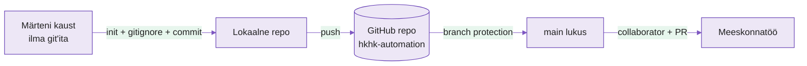

---
tags:
  - Git
  - Versioonihaldus
  - Meeskonnatöö
  - GitHub
---

# Tühjast repost meeskonnani — Labor

**Kestus:** 4 tundi
**Eeldused:** Loeng antud (commit, branch, remote, PR mudel). Nädal 1 tehtud — SSH võti GitHubis, sihtmärk töötab. Tead mis on `git clone`, `git add`, `git commit`, `git push`.
**Kontroll-node:** sinu arvuti, kogu töö **VS Code'is**. Repo elab sinu masinas.
**Sihtmärk:** sinu valik (vt [Töökeskkond](../kodulabor.md)) — Märteni skripti jooksutame **seal**, sest monitooriskript, mida testitakse ainult peas, ongi Märteni meetod.

---

!!! abstract "Õpiväljundid"

    Selle labi lõpuks sa:

    1. Lood repo nullist ja selgitad miks `.git/` kaust **on** repo, mitte GitHub
    2. Peatad saladuse `.gitignore`-iga **enne** esimest pushi
    3. Lukustad `main`-i ja jooksed ise oma reeglile vastu
    4. **Diagnoosid** neli skriptiviga jooksutades — igaüks annab eri tüüpi signaali (veateade, vaikne tõrge, õiguste viga, valetav kontroll)
    5. Lahendad merge-konflikti ja tead miks Git sinu eest ei vali

---

Labi loogika: **baas → kaitse → viga → paranda → viga → diagnoos → paranda → konflikt → lahenda.** Vead ei ole nimekirjas — need tulevad välja jooksutades, ükshaaval, ja igaüks räägib erinevat keelt. Sinu töö on keelt lugema õppida.

---

!!! example "Näidisstsenaarium — Märten"
    Märten oli suvepraktikant. Märten oli entusiastlik. Märten pushis otse `main`-i, sest branchid tundusid tüütud, ja tegi commite sõnumiga `asjad` ja `veelkord` ja `nüüd päriselt`.

    Märten lahkus augustis. Maha jäi kaust `marten-kraam`: paar skripti, üks `.env` fail andmebaasi parooliga, ja null Git-ajalugu. Tema lahkumiskingitus oli `monitor.sh`, mis "peaks töötama". (Kommentaarides on kirjas, et peaks.)

    Nüüd pärid selle sina ja su paariline. Töö: teha Märteni jamast päris projekt — ajalukku, kaitse alla, reeglite sisse — **enne** kui järgmine Märten reedel kell 16:55 sama loo uuesti alustab.

---

## Osa 1 · Päästa Märteni pärand

Märteni failid on su masinas (õpetaja jagatud `marten-kraam` kaust). Versioonihalduses ei ole neid kunagi olnud. Esimene töö: tee neist repo.

<figure markdown="span">

  <figcaption>Joonis 2.1. Tänase labi kaar: Märteni kaustast kaitstud meeskonnaprojektini (Talvik, 2025).</figcaption>
</figure>

### 1.1 Loo tühi repo GitHubis

Mine `github.com/hkhk-automation` → **New repository**.

- Nimi: `marten-monitor-<sinu-eesnimi>`
- **Private**
- **Ära** lisa README, `.gitignore` ega litsentsi. GitHub pakub neid ühe klõpsuga — aga siis teeb GitHub esimese commiti sinu eest, ja sa jääd ilma sellest, kuidas repo päriselt sünnib. Tühi tähendab tühi.

GitHub näitab nüüd juhiseid. Ära kopeeri neid pimesi — teeme sammud teadlikult, sest just neid sa hiljem sada korda kordad.

### 1.2 Seo Märteni kaust repoga

Ava kaust VS Code'is (`code marten-kraam`), terminal lahti:

```bash
git init
git branch -M main
```

`git init` tekitas `.git/` kausta. **See** on repo — mitte GitHub, mitte pilv, vaid see peidetud kaust su ketta peal. GitHub on koopia, mis elab mujal. Seo need kaks:

```bash
git remote add origin git@github.com:hkhk-automation/marten-monitor-<sinu-eesnimi>.git
git remote -v
```

??? question "Mõtle"
    Kui kustutaksid `.git/` (`rm -rf .git/`), mis kaob ja mis jääb? Failid jäävad. Kõik muu — ajalugu, harud, see et Git üldse teab sellest kaustast — kaob. Inimesed on seda teinud. Kogemata. Backupita.

---

## Osa 2 · `.gitignore` enne kui `.env` lekib

Märten jättis maha `.env` faili. Sees andmebaasi parool. Sinu esimene kiusatus on lihtsalt kõik commitida ja edasi minna. Ära.

Avalikku reposse pushitud parool ei ela minuteid, vaid sekundeid — botid skannivad uusi committe ööpäevaringselt, mitte sellepärast et keegi sind jälitab, vaid sellepärast et see on tasuta raha. Parooli Git-ajaloost tagantjärele eemaldamine on omaette õudusfilm. Lihtsam on teda sinna mitte lasta.

Vaata mida Git praegu näeks:

```bash
git status
```

`.env` on nimekirjas. Peata ta enne kui ta liigub — loo `.gitignore`:

```
# Saladused — Märteni pärand
.env
*.key

# Logifailid
*.log

# macOS rämps, mida keegi ei taha näha
.DS_Store
```

```bash
git status
```

`.env` on nimekirjast kadunud. Fail on kaustas alles, aga Git teeb näo et teda pole.

!!! warning
    `.gitignore` ei kustuta juba pushitud faili — ta hoiab ainult ära uued. Kui parool on korra üleval käinud, on ta lekkinud, punkt. Vaheta ta ära. Ignore pärast on nagu turvavöö pärast avariid.

??? question "Mõtle"
    Miks peab `.gitignore` ise olema Git'is (commititud), aga `.env` mitte? Mõlemad on ju failid samas kaustas — mis neid põhimõtteliselt eristab?

---

## Osa 3 · Esimene commit — repo elab

Lisa `README.md`, et keegi (sh sina kolme kuu pärast) teaks mis see on: paar rida — mis projekt, kes autor, mida `monitor.sh` teeks kui töötaks.

Päästa Märteni pärand ajalukku:

```bash
git add .
git status
git commit -m "init: päästa Märteni kraam versioonihaldusesse"
git push -u origin main
```

Commit-sõnum on terve lause, mitte `asjad`. Märten kirjutas `asjad`. Ära ole Märten.

Mine GitHubi — failid on seal, `.env` ei ole (kontrolli üle). Vaata ka ajalugu terminalist:

```bash
git log --oneline
```

Üks rida, üks korralik commit. Selle rea kõrvale tuleb täna veel mitu — ja labi lõpus loed sellest reast välja terve tänase loo.

??? question "Mõtle"
    Miks pidi olema vähemalt üks commit **enne** kui saame `main`-i kaitsta? Mida GitHub kaitseks, kui `main`-i veel polegi?

---

## Osa 4 · Kaitse `main` — ja jookse ise vastu

Praegu saab igaüks — sina väsinuna kell 16:55 kaasa arvatud — otse `main`-i pushida. Nii sünnivad Märtenid. Lukusta `main` ära.

GitHubis: **Settings → Branches → Add branch ruleset** (või *Add rule*).

- Branch name pattern: `main`
- **Require a pull request before merging** — sisse
- **Require approvals: 1** — sisse
- **Do not allow bypassing the above settings** — praegu jäta **välja** (nii pääseb õpetaja hädakorral ligi)

Salvesta. Nüüd tee Märtenit — proovi **meelega** otse `main`-i pushida:

```bash
echo "test" >> README.md
git add README.md
git commit -m "test: kas main on lukus"
git push origin main
```

**Viga:** `remote: error: GH006: Protected branch update failed` / `protected branch hook declined`.

??? question "Diagnoosi enne kui parandad"
    Loe veateade: `remote:` prefiks ütleb, **kes** keeldus. Sinu masin lasi commiti teha, lokaalne ajalugu on olemas — miks lokaalne Git ei takistanud? Kus reegel päriselt elab?

Sa jooksid oma enda reeglile vastu — ja see pidas. Commit on aga lokaalselt olemas ja vajab koristamist:

```bash
git reset --hard origin/main
git log --oneline
```

Test-commit on kadunud, ajalugu klapib jälle GitHubiga.

!!! tip
    Branch protection ei ole bürokraatia. Kui `main` on lukus, on ainus tee sisse PR — see on põhjus, miks feature-branch üldse olemas on. Reegel, mille sa ise peale panid, on ainus reegel, mida sa päriselt usaldad.

---

## Osa 5 · Rollid ja õigused

### 5.1 Lisa paariline collaboratoriks

**Settings → Collaborators → Add people** → paarilise GitHubi kasutajanimi.

| Tase | Mida saab |
|---|---|
| Read | Näeb ja kloonib |
| Write | Pushib branchidesse, avab PR-e |
| Admin | Kõik + seaded, protection, repo kustutamine |

*Tabel 2.1. GitHubi õigustasemed.*

Anna paarilisele **Write**. Ta saab teha branche ja PR-e, aga ei saa su reegleid ära keerata ega repot kustutada. Õigus on usalduse mõõt, mitte sõbralikkuse.

### 5.2 Lisa õpetaja

Samas kohas õpetaja kasutajanimi **Admin**-õigusega — hindamiseks ja hädakorral päästmiseks.

??? question "Mõtle"
    Märtenil oli admin. Vaata mis juhtus. Miks ei anna sa igale collaboratorile admin-taset "igaks juhuks"?

### 5.3 Rollid risti

Sina oled **oma** repos admin, paariline collaborator. Tema repos vastupidi. Nii tunned mõlemat poolt, enne kui päris töökohal keegi sulle `Read` annab ja sa imestad, miks merge-nupp on hall.

Klooni paarilise repo — seda läheb Osa 7-s vaja:

```bash
git clone git@github.com:hkhk-automation/marten-monitor-<paarilise-nimi>.git
```

---

## Osa 6 · Märteni skript — neli viga, neli keelt

`main` on lukus, seega parandused käivad õiget teed: branch → PR → review → merge. Aga kõigepealt tuleb vead **leida** — ja mitte lugedes, vaid jooksutades. Märten testis lugemisega. Tulemus on teada.

### 6.1 Oma haru

```bash
git switch -c fix/monitor-parandused
```

### 6.2 Vii skript sihtmärgile ja käivita

Skript on monitooriskript — tema koht on serveris, mitte su süles. Kopeeri sihtmärgile ja jooksuta seal:

```bash
scp monitor.sh <kasutaja>@<sihtmärk>:~/
ssh <kasutaja>@<sihtmärk>
bash monitor.sh
```

Sisu, millega sõidad (loe läbi, aga ära veel paranda):

```bash
#!/bin/bash
# Märteni servermonitor v1.0
# kirjutatud reedel kell 16:55, varsti koju
# peaks töötama

SERVIIS=nginx
LOG=/var/log/monitor.log
KUUPÄEV=$(date)

# kontrollin kas teenus töötab, google ütles nii
servis $SERVIIS status

if [ $? = 0 ]
then
    echo "$KUUPÄEV - $SERVIIS töötab" >> $LOG
else
    echo "$KUUPÄEV - $SERVIIS EI tööta" >> $LOQ
fi
```

Iga rida, kus Märten ennast kommentaaris õigustab, on koht kus midagi on katki. "Google ütles nii" ei ole testimine.

### 6.3 Viga 1 — command not found

Esimene käivitus annab:

```
monitor.sh: line 12: servis: command not found
```

??? question "Diagnoosi enne kui parandad"
    Veateade annab kolm asja: faili, rea numbri ja süüdlase. `servis` ei ole ühegi Linuxi käsk — Märten kirjutas mälu järgi. Mis on **õige** käsk teenuse oleku kontrolliks? (Nädal 1 kasutasid `systemctl` juba — meenuta.)

**Paranda** oma masinas (VS Code'is, mitte sihtmärgil — repo on sinu masinas ja parandus peab jõudma ajalukku):

```bash
systemctl status $SERVIIS
```

Kopeeri parandatud fail uuesti üles ja jooksuta:

```bash
scp monitor.sh <kasutaja>@<sihtmärk>:~/ && ssh <kasutaja>@<sihtmärk> bash monitor.sh
```

Nüüd jookseb `systemctl` — ja ütleb, et `nginx.service could not be found`. See on **õige** vastus: nginx pole veel installitud (tuleb nädal 3). Teenus on maas, skript peaks selle logisse kirjutama. Kontrolli:

```bash
ssh <kasutaja>@<sihtmärk> cat /var/log/monitor.log
```

```
cat: /var/log/monitor.log: No such file or directory
```

Skript jooksis läbi, viga ei andnud, logi ei tekkinud. Tere tulemast järgmisesse vea-keelde.

### 6.4 Viga 2 — vaikne tõrge

??? question "Diagnoosi enne kui parandad"
    Vaata `else` haru tähelepanelikult. `$LOQ` — Q, mitte G. Bash ei kaeba defineerimata muutuja peale sõnagi: `$LOQ` on lihtsalt tühi string, ja `>> ` tühja nime taha kirjutamine läheb... kuhu? Miks on see viga hullem kui Viga 1 — kumba märkad kiiremini?

See on **vaikne tõrge**: skript raporteerib edu, tulemust pole. Ja ta lööb täpselt siis, kui teenus on maas — ehk täpselt siis, kui logi kõige rohkem vaja oleks. Märten ehitas monitori, mis vaikib hädas.

**Paranda** `$LOQ` → `$LOG`, `scp` üles, jooksuta uuesti. Ja nüüd kolmas keel:

```
monitor.sh: line 18: /var/log/monitor.log: Permission denied
```

### 6.5 Viga 3 — Permission denied

??? question "Diagnoosi enne kui parandad"
    Tuttav sõnapaar nädalast 1 — aga teine olukord. `/var/log/` kuulub root'ile; sina jooksed tavakasutajana. Kaks võimalikku parandust: (a) jooksuta skripti sudo'ga, (b) kirjuta logi kohta, kuhu sul õigus on. Kumb on parem monitooriskriptile, mis peaks jooksma iga minut, ja miks on "anna lihtsalt sudo" Märteni-stiilis vastus?

**Paranda** — skript ei vaja root'i, kui ta ei pea:

```bash
LOG=$HOME/monitor.log
```

`scp`, jooksuta, kontrolli:

```bash
ssh <kasutaja>@<sihtmärk> "bash monitor.sh && cat ~/monitor.log"
```

```
... - nginx EI tööta
```

Esimest korda teeb skript seda, mida lubas. Aga üks viga on veel sees — see, mis "töötab vahel".

### 6.6 Viga 4 — kontroll, mis valetab

`[ $? = 0 ]` — `=` võrdleb **stringe**, arvudele on `-eq`. Enamasti annab sama tulemuse, aga mitte alati — ja "töötab vahel" on halvim vea tüüp, sest sa ei tea, millal ei tööta. Kolm eelmist viga ütlesid end ise välja (kaks häälekalt, üks vaikides); see ei ütle end **kunagi** ise välja. Sellised püütakse kinni ainult teadmise või linteriga.

**Paranda** kaks asja korraga:

1. `[ $? = 0 ]` → `[ $? -eq 0 ]`
2. Lisa `set -e` kohe `#!/bin/bash` järele — skript peatub esimese vea peal, mitte ei jookse rõõmsalt edasi

??? question "Mõtle"
    Kui `set -e` oleks olnud sees algusest peale — millised neljast veast oleks skripti peatanud kohe esimesel real, kus asi valesti läks? Ja kumb vigadest oleks ellu jäänud ka `set -e`-ga?

### 6.7 Commit — neli viga, üks lugu

Vaata muudatust enne commiti. `git diff` on su viimane võimalus näha, mida sa tegelikult saatmas oled:

```bash
git diff
git add monitor.sh
git commit -m "fix: systemctl, vaikne LOQ, logi koju, -eq + set -e"
git push -u origin fix/monitor-parandused
```

---

## Osa 7 · PR, review ja konflikt

### 7.1 PR ja review

GitHubis: **Compare & pull request**.

- Title: `Fix: Märteni monitor.sh parandused`
- Description (osa hindest — `fixed stuff` ei lähe arvesse, Märten kirjutas ka `fixed stuff`):
    - Neli viga — mis **tüüpi** igaüks oli (häälekas / vaikne / õigused / valetav)?
    - Milline oli kõige ohtlikum tootmises ja miks?
    - Mis järjekorras nad välja tulid ja miks just selles?

Määra reviewer'iks paariline. Tema avab **sinu** PR-i, vaatab **Files changed**, jätab ühe sisulise kommentaari ja **Approve**. Alles siis saad merge'ida — sest sa ise nõudsid 1 approval. Review ei ole solvang. See on teine paar silmi enne kui asi läheb `main`-i ja sealt tootmisse.

### 7.2 Merge-konflikt — kontrollitud katse

Teie mõlema PR muudab sama rida. Üks merge'ib esimesena. Teine näeb: *"This branch has conflicts."* Konflikt ei ole viga ega süüdistus — Git lihtsalt ei julge sinu eest valida.

```bash
git switch main
git pull origin main
git switch fix/monitor-parandused
git merge main
```

Failis:

```
<<<<<<< HEAD
systemctl status $SERVIIS
=======
service $SERVIIS status
>>>>>>> main
```

??? question "Diagnoosi enne kui parandad"
    `<<<`, `===`, `>>>` on Git'i markerid, mitte kood. `HEAD` on sinu versioon, teisel pool see, mis vahepeal `main`-i jõudis. Kumb rida on õige — ja kust sa seda **tead**, mitte ei arva? (Sa just jooksutasid ühte neist sihtmärgil.)

Vali õige rida, kustuta markerid, kontrolli `git diff` (jah, jälle), siis:

```bash
git add monitor.sh
git commit -m "resolve: merge konflikt monitor.sh"
git push
```

PR uueneb, merge läheb läbi. Vaata lõpuks tervet lugu:

```bash
git switch main && git pull
git log --oneline --graph
```

Init, kaitsetest, neli parandust, konflikt, merge — kogu tänane päev on ajaloos loetav. Märteni versioonis oli sama loo asemel kaust nimega `marten-kraam` ja mitte midagi.

---

## Lõppkontroll — oskad ilma juhendita

- [ ] Repo `hkhk-automation` all, `git log --oneline` loeb tänase loo välja
- [ ] `.env` **ei ole** GitHubis, `.gitignore` blokeerib ta
- [ ] `main` on protected — otse-push lükatakse tagasi ja tead, **kes** keeldub
- [ ] Paariline Write, õpetaja Admin — ja oskad põhjendada kumbki taset
- [ ] Nimetad neli vea-tüüpi (häälekas / vaikne / õigused / valetav) ja näite igast
- [ ] `monitor.sh` jookseb sihtmärgil ja kirjutab logi
- [ ] Merge-konflikt lahendatud lokaalselt, valik põhjendatud
- [ ] Ükski su commit-sõnum ei ole `asjad`

---

## Lisaülesanded (kui jõuad ette)

1. **Päästmine:** tee katki commit (Märteni klassika). `git restore`, `git reset --soft`, `git revert` — millal kumbki? Proovi kõiki kolme, üks lause vahe kohta. Vihje: üks neist on ainus, mis on ohutu **pärast** pushi.
2. **shellcheck:** installi [shellcheck](https://www.shellcheck.net/) (või kasuta veebiversiooni) ja anna talle Märteni **algne** skript. Mitu neljast veast leiab ta ilma jooksutamata? Milline jääb kahe silma vahele?
3. **CODEOWNERS:** lisa `.github/CODEOWNERS`, mis nõuab et `monitor.sh` muudatused vaatab üle kindel inimene. Testi.
4. **`git stash`:** pooleliolev muudatus, siis `git stash`. Kuhu ta kadus? `git stash pop` toob tagasi. Millal kasulik?

---

## Veaotsing

| Probleem | Lahendus |
|---|---|
| `git push` annab `Permission denied` | `ssh -T git@github.com` — kas nädal 1 võti töötab? |
| `protected branch hook declined` | Töötab õigesti — `main` on lukus, tee branch + PR |
| Merge-nupp on hall | Puudub approval — paariline peab Approve'ima |
| `.env` on juba GitHubis | Vaheta parool, siis `git rm --cached .env` + commit |
| `scp: command not found` / ei jõua sihtmärgile | Nädal 1 SSH ühendus — kontrolli `ssh <kasutaja>@<sihtmärk>` enne |
| Skript "töötab", logi ei teki | Vaikne tõrge — kontrolli muutujanimed tähthaaval (Osa 6.4 muster) |
| `Permission denied` failile kirjutamisel | Kirjutad root'i omandisse — vii logi koju (Osa 6.5) |
| PR näitab konflikti | Osa 7.2 — lahenda lokaalselt, push uuesti |
| Markerid `<<<<<<<` jäid faili | Kustuta kõik `<<<`, `===`, `>>>` read, `git diff` üle |

*Tabel 2.2. Iga rida on viga, mille sa selles labis ise tekitasid või kohtad.*

---

## Allikad

| Allikas | URL | Miks oluline |
|---|---|---|
| GitHub Flow | <https://docs.github.com/en/get-started/using-github/github-flow> | See flow mida kasutame |
| Branch protection | <https://docs.github.com/en/repositories/configuring-branches-and-merges-in-your-repository/managing-protected-branches> | Reeglid `main`-ile |
| Repo õigustasemed | <https://docs.github.com/en/account-and-profile/setting-up-and-managing-your-personal-account-on-github/managing-access-to-your-personal-repositories> | Read / Write / Admin |
| gitignore mustrid | <https://git-scm.com/docs/gitignore> | Formaadi ametlik dok |
| Bash `set -e` | <https://www.gnu.org/software/bash/manual/bash.html#The-Set-Builtin> | Miks `set -e` on hea tava |
| ShellCheck | <https://www.shellcheck.net/> | Linter, mis leiab Märteni vead lugedes |

---

*Järgmine: Nädal 3 — Ansible, ehk kuidas Märteni tööd automaatselt teha, et järgmine praktikant ei peaks midagi mälu järgi kirjutama.*
