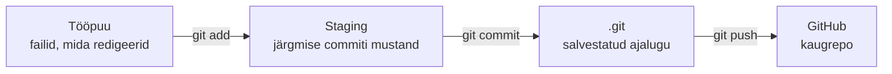
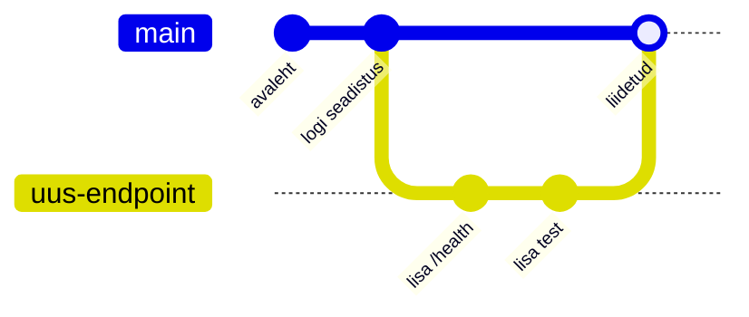
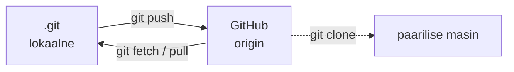
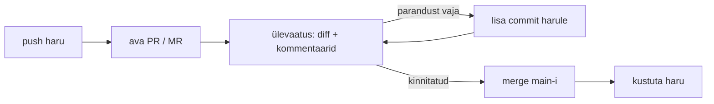

---
tags:
  - Automatiseerimine
  - DevOps
  - Git
---

# Loeng - Versioonihaldus: Git ja GitHub

*Kuidas terve meeskond muudab sama koodi, ilma et keegi kellegi tööd üle kirjutaks*

**Kestus:** ~50 min. See on loengu **tuum**. Süvamaterjal (rebase, tagasivõtmine, mõistete võrdlus) on samas failis allpool jaotises **Taust ja edasijõudnutele** (loe pärast tundi).
**Tase:** kolmas kursus. Linuxi käsurida ja tekstiredaktor on eeldatud; Git ise on uus tööriist, mille üles ehitame.

---

## Õpiväljundid

Tunni lõpuks oskad selgitada:

1. miks versioonihaldus on meeskonnatöö ja automatiseerimise alus;
2. mis on Giti kolm ala ja põhitsükkel `add → commit → log`;
3. mida panna `.gitignore`-sse ja mida mitte;
4. mis on haru ja kuidas liita ning lahendada liitmiskonflikt;
5. mis vahe on lokaalsel Gitil ja kaugrepol, mis on `clone` ja `fork`;
6. mis on pull request / merge request ja koodiülevaatus.

!!! info "Kaks asja ilma slaidita"
    Tunni lõpuks peavad selged olema: miks kaks inimest ei saa ilma versioonihalduseta sama faili turvaliselt muuta; ja kuidas haru + pull request lasevad neil seda teha.

---

## 1. Näidisstsenaarium

!!! abstract "Miks see oluline on?"
    Kogu ülejäänud kursus - Ansible, Docker, CI/CD - on tekstifailid, mida tiim koos muudab. Kui kaks inimest muudavad sama faili ilma versioonihalduseta, kaob ühe töö vaikselt ära. Git on tööriist, mis selle ära hoiab.

!!! example "Esmaspäev, rühmatöö"
    Kati ja Mati parandavad koos sama deploy-skripti. Kati saadab Matile faili, Mati muudab, saadab tagasi. Vahepeal on Kati juba oma koopiat muutnud.

    Kaustas on `deploy.sh`, `deploy_v2.sh`, `deploy_MATI.sh`, `deploy_LOPP.sh`. Keegi ei tea, milline on uusim. Kati salvestab oma paranduse vana faili peale - Mati eilne töö on läinud. Failinimi ei ütle, mis muutus ega miks.

Küsi kaks asja:

- **Mis läks kaotsi?** Mati töö - keegi kirjutas selle kogemata üle.
- **Mis puudus?** Ühine, usaldusväärne versioon ja jälg sellest, kes mida muutis.

Git lahendab selle: salvestab iga versiooni muudatusena (diff - mis read lisandusid, mis kadusid), näitab kahe seisu vahet ja laseb mitmel inimesel paralleelselt töötada. Boltis või Wise'is muudavad sadu inseneride sama koodibaasi iga päev - see toimib ainult versioonihalduse peal.

!!! question "Kontrolli ennast"
    1. Miks ei aita failide ümbernimetamine (`deploy_LOPP.sh`) probleemi lahendada?
    2. Nimeta kaks asja, mida Git meeskonnale annab, mida käsitsi failivahetus ei anna.

---

## 2. Giti kolm ala ja commit

!!! abstract "Miks see oluline on?"
    Git ei salvesta muudatust kohe faili muutmisel. Fail liigub läbi kolme ala, ja see mudel on põhjus, miks algul tekib segadus - aga ka põhjus, miks saad ühe töösessiooni jagada puhasteks commitideks.

<figure markdown="span">

  <figcaption>Joonis 2.1. Faili teekond: tööpuu → staging → .git → GitHub (Talvik, 2026).</figcaption>
</figure>

**Staging** (index) on mustand: sinna paned täpselt need muudatused, mis lähevad järgmisse commiti. See laseb tükeldada ühe töösessiooni loogilisteks commitideks - bugiparandus ühte, uus funktsioon teise.

```bash
git status                                  # mis muutus, mis on staging'us
git add deploy.sh                           # üks fail staging'usse
git commit -m "Lisa restardi kontroll deploy skripti"
git log --oneline --graph                   # ajalugu
```

Commit-sõnum on **kohustuslik** - Git keeldub tühja sõnumiga commitist. `git log` on esimene koht, kuhu vaatad vea otsimisel, ja sõnum on selle ainus inimloetav sisu. `paranda asjad` ei aita kuu aja pärast; `Lisa restardi kontroll` ütleb, mis muutus.

!!! question "Kontrolli ennast"
    1. Mis vahe on `git add` ja `git commit` vahel?
    2. Miks keeldub Git tühja commit-sõnumiga commitist?

---

## 3. Git-failid ja `.gitignore`

!!! abstract "Miks see oluline on?"
    Kõike ei taha versioonihaldusse - saladused ja logid sinna ei kuulu. Ja saladus, mis kord commiti sattus, jääb ajalukku ka pärast kustutamist.

Repo juures on peidetud kaust `.git` - seal on kogu ajalugu, commitid ja harud. Kustutad `.git`, jäävad failid alles, aga ajalugu kaob. Seda kausta käsitsi ei redigeeri. Ainus git-fail, mille ise kirjutad, on `.gitignore` - loend mustritest, mida Git ignoreerib.

| Pane `.gitignore`-sse | Ära pane sinna |
|-----------------------|----------------|
| Saladused: `.env`, võtmed, paroolid | Lähtekood ja skriptid |
| Logid: `*.log` | Jagatud konfid (`config.example`) |
| Genereeritud: `build/`, `__pycache__/` | `.gitignore` ise (seda jälgitakse) |
| Sõltuvused: `node_modules/`, `venv/` | README, Ansible/Docker/CI-failid |
| Masina prügi: `.DS_Store`, `.idea/` | |

!!! warning "Saladus ajaloos"
    Lisa `.env` `.gitignore`-sse **enne** esimest commiti. Kord commiti sattununa on saladus vanast commitist kättesaadav ka pärast kustutamist. Saladuste juurde tuleme Ansible Vault'i moodulis.

---

## 4. Harud

!!! abstract "Miks see oluline on?"
    Kui kõik redigeeriksid otse `main`-i, segaks igaühe pooleliolev töö teisi. Haru laseb sul ja paarilisel töötada kahe eri asja kallal korraga, teineteist segamata.

Haru (branch) on eraldi tööliin - tehniliselt liikuv osuti ühele commitile. `main` on ametlik, töötav versioon. Töötad oma harus, kuni valmis, siis liidad tagasi; `main` jääb vahepeal terveks.

<figure markdown="span">

  <figcaption>Joonis 4.1. Haru kasvab main'ist eraldi ja liidetakse valmides tagasi (Talvik, 2026).</figcaption>
</figure>

```bash
git switch -c uus-endpoint      # loo haru ja mine sinna
git switch main                 # vaheta haru
git branch                      # loend, tärn = kus oled
```

Harusid on kaht liiki: lokaalne (`uus-endpoint`, sinu masinas) ja kaugharu-peegeldus (`origin/main`, GitHubi seis). `git status` võrdleb neid: "ahead of origin/main by 2 commits" tähendab, et sul on 2 push'imata commiti.

---

## 5. Liitmine ja konfliktid

!!! abstract "Miks see oluline on?"
    Enamasti liidab Git harud kokku ise. Aga kui kaks inimest muutsid sama rida, ei saa Git otsustada, kumb õige on - ja jätab valiku sulle. Konflikti lahendamine on igapäevane meeskonnaoskus.

```bash
git switch main
git merge uus-endpoint
```

Kui `main` pole vahepeal muutunud, teeb Git *fast-forward*. Kui on, tekib *merge-commit*, mis ühendab kaks liini. Konflikt tekib ainult siis, kui kaks inimest muutsid **sama rida**. Git märgistab failis mõlemad versioonid:

```
<<<<<<< HEAD
port = 8080
=======
port = 3000
>>>>>>> uus-endpoint
```

`HEAD` on su praeguse haru versioon, alumine on liidetava oma. Valid õige, kustutad markerid (`<<<`, `===`, `>>>`), lõpetad:

```bash
git add config.py
git commit
```

!!! question "Kontrolli ennast"
    1. Sina muutsid rida 5, paariline rida 40 samas failis. Kas liitmisel tekib konflikt?
    2. Kes otsustab, kumb versioon konflikti korral jääb?

---

## 6. Lokaalne ja kaug: clone, push, pull, fetch

!!! abstract "Miks see oluline on?"
    Kaugrepo on tiimi ühine tõehetk. Sinu lokaalne koopia võib olla ajast maas - seepärast alustad tööpäeva `git pull`-iga, mitte kohe kirjutamisega.

- **Lokaalne Git** - sinu masinas. Terve repo koos ajalooga on su kettal; commit, haru, log töötavad ilma internetita. Git on hajus: igal inimesel on täielik koopia.
- **Kaugrepo (remote)** - GitHubis, tiimi ühine koopia. Põhilise kaugrepo tavanimi on **`origin`**.

<figure markdown="span">

  <figcaption>Joonis 6.1. clone tõmbab koopia, push viib commitid GitHubi, fetch/pull toob teiste omad (Talvik, 2026).</figcaption>
</figure>

`clone` teeb kaugrepost täieliku koopia su masinasse (failid, ajalugu, seos `origin`-iga) - üks kord repo alguses.

```bash
git clone https://github.com/hkhk-automation/tiimi-repo.git
git push -u origin uus-endpoint   # oma haru GitHubi
git fetch                         # too muudatused, ära liida
git pull                          # fetch + merge
```

`fetch` toob muudatused, aga ei puuduta su tööd - saad enne vaadata. `pull` toob ja liidab kohe. Töörütm jagatud repos: **pull → töö → commit → push**.

---

## 7. GitHub: pull request, fork, koodiülevaatus

!!! abstract "Miks see oluline on?"
    Valmis haru ei liideta vaikselt main'i - keegi vaatab selle enne üle. Nii püütakse vead kinni, enne kui need kõiki mõjutavad. CI/CD moodulis käivitab iga pull request lisaks automaattestid.

Valmis haru puhul avad **pull request'i** (PR): "vaadake üle ja liitke". Nimi sõltub platvormist - **GitHub**: pull request; **GitLab** ja **Bitbucket**: merge request (MR). Sama mõiste.

<figure markdown="span">

  <figcaption>Joonis 7.1. Pull request on värav main'i ette: ülevaatus enne liitmist (Talvik, 2026).</figcaption>
</figure>

PR-is näeb tiim, mis read muutusid (roheline lisatud, punane eemaldatud), kommenteerib ja palub parandust. See on **koodiülevaatus** (code review) - teine silmapaar enne main'i. Lisad harule commiti, PR uueneb ise. **Issue'd** jälgivad ülesandeid ja vigu; PR viitab tavaliselt issue'le, mille lahendab.

**Fork** on koopia repost **sinu GitHubi kontole** - kasutad, kui sul pole originaali kirjutusõigust (avatud lähtekood). Voog: forkid → kloonid oma forki → haru + muudatused → push oma forki → PR originaali poole.

!!! note "Clone, fork, branch - mis vahe on?"
    **clone** = koopia su masinasse; **fork** = eraldi koopia su GitHubi kontole; **branch** = tööliin ühe repo sees.

!!! question "Kontrolli ennast"
    1. GitHub nimetab seda pull request'iks, GitLab merge request'iks. Kas need on eri asjad?
    2. Tahad panustada projekti, kus sul pole kirjutusõigust. Mis on esimene samm - `clone` või `fork`?

---

## 8. Kokkuvõte

- Git hoiab muudatusi (diff), mitte täiskoopiaid; kogu ajalugu elab `.git` kaustas.
- Kolm ala: tööpuu → staging (`git add`) → repo (`git commit`). Sõnum on kohustuslik.
- `.gitignore`: jälgi lähtekoodi ja jagatud konfe; ignoreeri saladusi, logisid, genereeritud faile.
- Harud on odavad; iga funktsioon oma harus, `main` alati töökorras.
- Konflikt tekib ainult samal real; sina valid, Git ei arva.
- Lokaalne vs kaug: `origin` on tiimi ühine repo; rütm `pull → töö → commit → push`.
- Pull request (= merge request) on värav main'i ette: koodiülevaatus enne liitmist.

## 9. Enne laborit

Praktikumis teed paarilisega läbi terve voo: haru → push → pull request → koodiülevaatus → liitmine, ning lahendad ühe päris liitmiskonflikti. Veendu, et Git teab su nime (`git config --global user.name`) ja et sul on GitHubi konto.

---

# Taust ja edasijõudnutele

*Loe pärast tundi. Reegel kõigele siin: muuda ainult oma haru, mida keegi teine pole veel tõmmanud.*

## Merge vs rebase

Mõlemad toovad haru kokku, aga jätavad eri ajaloo. `merge` säilitab ühenduspunkti; `rebase` tõstab su commitid värske main'i otsa, ajalugu jääb sirge.

```
merge:                          rebase:
main:  A---B---C---M            main:  A---B---C---D'---E'
                  /
haru:      D---E
```

```bash
git switch uus-endpoint
git rebase main
```

Rebase annab commitidele uued SHA-d, seega ainult isiklikku harusse enne PR-i - mitte jagatud main'i.

## Tagasivõtmine - kolm tasandit

```bash
git restore fail.py          # enne commiti: viska muudatus ära
git reset --soft HEAD~1      # oma harus: võta commit tagasi, jäta muudatus staging'usse
git revert <sha>             # jagatud harus: uus commit, mis tühistab vana
```

`reset` kustutab ajaloo (ainult jagamata töö). `revert` säilitab ajaloo, lisades tühistava commiti (ohutu ka main'is). `HEAD` = su praegune positsioon, `HEAD~1` üks samm tagasi.

## Sarnased mõisted - mis vahe on?

| | | Vahe |
|--------|--------|------|
| **lokaalne** | **remote** | sinu masin vs GitHub (`origin`) |
| **clone** | **fork** | koopia su masinasse vs su GitHubi kontole |
| **branch** | **fork** | tööliin repo sees vs eraldi repo su kontol |
| **pull request** | **merge request** | sama asi; GitHub vs GitLab/Bitbucket |
| **fetch** | **pull** | too vs too **ja** liida |
| **merge** | **rebase** | säilita ajalugu vs kirjuta sirgeks |
| **reset** | **revert** | kustuta ajalugu (jagamata) vs tühista commitiga (jagatud) |

## Allikad

- Pro Git (tasuta raamat): <https://git-scm.com/book/en/v2>
- Git käsureferents: <https://git-scm.com/docs>
- GitHub - Getting started with Git: <https://docs.github.com/en/get-started/learning-to-code/getting-started-with-git>
- GitHub - GitHub flow: <https://docs.github.com/en/get-started/using-github/github-flow>
- GitHub - Fork a repo: <https://docs.github.com/en/get-started/quickstart/fork-a-repo>
- Coursera - Introduction to Git and GitHub: <https://www.coursera.org/learn/introduction-git-github>
