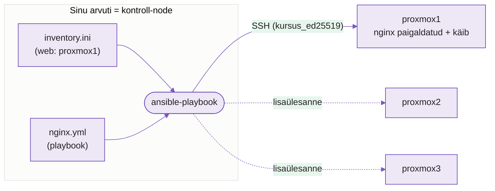

---
tags:
  - Ansible
  - Playbook
  - Praktikum
---

# Esimene Ansible playbook — Praktikum

**Kestus:** 4 tundi
**Eeldused:** Loeng loetud (ptk 1–8: inventory, push-mudel, playbook, idempotentsus). Nädal 1 tehtud — `kursus_ed25519` võti kolmes sõlmes, `ansible -m ping` annab `pong`. Kui udu — [tagasi loengusse](lecture.md).
**Kontroll-node:** sinu arvuti, kogu töö **VS Code'is** (failid redaktoris, käsud terminalis).
**Sihtmärk:** su Proxmoxi sõlmed `proxmox1` / `proxmox2` / `proxmox3` (nagu nädal 1). Kui teed kodus, sobib ka WSL2/VM/pilv — playbook on kõigil identne.

---

!!! abstract "Õpiväljundid"

    Selle praktikumi lõpuks sa:

    1. Ehitad playbooki task-haaval, testides igal sammul
    2. **Diagnoosid** kolm tüüpviga veateate järgi (permission denied, katkine idempotentsus, sisu vs olemasolu)
    3. Selgitad idempotentsust näite peal — miks `changed` vs `ok`, ja miks `shell:` selle lõhub
    4. Ajad Märteni monitori roheliseks — Ansible teeb selle, mida Märten käsitsi ei dokumenteerinud

---

!!! example "Näidisstsenaarium — Märten, teine vaatus"
    Nädal 2 päästsid Märteni `monitor.sh`. Ta kontrollib, kas nginx töötab — ja ütles kohe "nginx EI tööta", sest nginx polnud kunagi paigaldatud. Märten oleks selle käsitsi installinud, unustanud `enable`, ega kirjutanud kuhugi üles, mis ta tegi.

    Sina teed teisiti: kirjutad **playbooki**, mis paigaldab ja käivitab nginx'i — korratavalt, dokumenteeritult, koodina. Praktikumi lõpus jooksutad Märteni monitori ja see läheb **roheliseks**.

---

Praktikumi loogika: **setup → baas → viga → paranda → laienda → viga → taasta.** Sa ei kopeeri valmis playbookit. Ehitad selle task-haaval, lõhud võtmekohtades meelega, ja saad aru **miks**.

<figure markdown="span">

  <figcaption>Joonis 1. Kuidas see töötab: sinu arvuti loeb inventory ja playbooki, ja lükkab SSH kaudu (nädala 1 võtmega) muudatuse sõlme. Sõlme ei paigaldata Ansible't — ainult SSH + Python (Talvik, 2025).</figcaption>
</figure>

---

## Osa 1 · Setup — kontrolli ühendust

!!! warning "Ansible ei jookse Windowsi käsurealt"
    Ansible vajab *NIX-käsurida — **Mac, Linux või WSL2**. Windowsi cmd/PowerShell ei sobi kontroll-node'iks. Kolm varianti:

    - **On WSL2 / Mac / Linux** → jooksuta Ansible oma masinast sõlme vastu (nii nagu päriselt tehakse).
    - **Pole *NIX-i käepärast** → jooksuta Ansible **sõlme seest sõlme enda vastu** (`localhost`). See pole tavapärane kasutus, aga toimib õppimiseks.
    - Kahtluse korral küsi õpetajalt, kumb tee sinu masinal sobib.

Ansible on su arvutil juba (nädal 1). Ava projektikaust VS Code'is (`code .`), terminal `` Ctrl+` ``. Sinu `inventory.ini` on nädalast 1:

```ini
[web]
proxmox1
```

Testi ühendust — [`ping`](https://docs.ansible.com/ansible/latest/collections/ansible/builtin/ping_module.html) moodul (mitte ICMP, vaid SSH + Python kontroll):

```bash
ansible -i inventory.ini web -m ping
```

`SUCCESS` + `"pong"` — valmis. **Ära edasi mine enne kui pong tuleb.**

!!! info "Kes sa Ansible'i silmis oled?"
    Ansible logib sisse **sama kasutajana**, kellega `ssh proxmox1` töötab — sest `User` ja võti tulevad su nädala 1 `~/.ssh/config`-ist. Teie sõlmedel on see `kasutaja`. Kontrolli üle:

    ```bash
    ansible -i inventory.ini web -m command -a "whoami"
    ```

    Väljund peab olema **`kasutaja`** — sama, kellega ise SSH-d. Nii näedki, et Ansible kasutab täpselt sama SSH-teed mis sina.

    > Päris tootmises on Ansible'il sageli **oma teenuskonto** (nt `ansible`), mitte inimese isiklik konto — nii on ligipääs auditeeritav ja piiratud. Meie kursusel piisab ühest `kasutaja`-st; root-õigused tuleb siis `become`-ga (Osa 3).

!!! tip
    `UNREACHABLE`? Kas `ssh proxmox1` töötab käsitsi? Ansible ei tee midagi maagilist: kui SSH käsitsi ei ühendu, ei ühendu ka Ansible.

---

## Osa 2 · Baas — esimene task

Loo `nginx.yml`. **Ainus kord terve fail** — edasi lisad task'e:

```yaml
---
- name: Paigalda ja seadista nginx
  hosts: web
  become: yes                         # root-õigused (sudo)

  tasks:
    - name: Paigalda nginx pakett
      ansible.builtin.package:         # valib ise dnf (Alma) või apt (Ubuntu)
        name: nginx
        state: present                 # "peab olemas olema"
```

Kolm asja, mida tähele panna:

- `hosts: web` — grupp `inventory.ini`-st.
- `become: yes` — paketi paigaldus vajab root-õigusi.
- **`ansible.builtin.package`** — universaalne paketimoodul. Su koolisõlm on Alma (`dnf`), aga sama task töötab ka Ubuntul (`apt`). Ei pea harusid tegema.

Käivita:

```bash
ansible-playbook -i inventory.ini nginx.yml
```

`changed=1`, task **changed**. Kontrolli sõlmes:

```bash
ssh proxmox1 "nginx -v"
```

---

## Osa 3 · Become puudu — permission denied

Eemalda **meelega** rida `become: yes` (kommenteeri: `# become: yes`). Käivita:

```bash
ansible-playbook -i inventory.ini nginx.yml
```

**Viga:** midagi stiilis `Permission denied` või `This command has to be run under the root user`.

??? question "Diagnoosi enne kui parandad"
    Sinu SSH-kasutaja ei ole root. Paketi paigaldus vajab root-õigusi. Mis rida ütles Ansible'ile "tee sudo-ga", ja mis juhtus kui selle ära võtsid? Miks Ansible ei kasuta sudo't vaikimisi?

**Paranda** — pane `become: yes` tagasi, käivita, veendu et läbib. See on esimene asi, mida `Permission denied` puhul kontrollida: kas task vajab root'i ja kas `become` on peal.

---

## Osa 4 · Laienda — teenus ja idempotentsus

Nginx on paigaldatud, aga kas teenus töötab ja käivitub pärast reboot'i? **Lisa teine task** (`tasks:` alla):

```yaml
    - name: Käivita ja luba nginx
      ansible.builtin.service:
        name: nginx
        state: started         # käivita nüüd
        enabled: yes           # käivitu ka pärast reboot'i
```

```bash
ansible-playbook -i inventory.ini nginx.yml
```

**Vaata `PLAY RECAP` hoolikalt.** Esimene task **ok** (nginx juba paigaldatud — Ansible ei tee midagi), teine **changed** (teenus käivitati esmakordselt).

??? question "Mõtle"
    Käivita **veel kord**. Nüüd on mõlemad **ok**. Kust Ansible teadis, et pole midagi teha? See ongi idempotentsus. Osas 5 lõhume selle meelega.

`enabled: yes` on täpselt see, mille Märten unustas. Nüüd on see failis kirjas — enam ei unusta.

---

## Osa 5 · Katkine idempotentsus — shell alati changed

Tahad kirjutada nginx versiooni faili. **Vale viis** — lisa task `shell:` mooduliga:

```yaml
    - name: Kirjuta nginx versioon faili
      ansible.builtin.shell: nginx -v 2> /tmp/nginx_version.txt
```

```bash
ansible-playbook -i inventory.ini nginx.yml
ansible-playbook -i inventory.ini nginx.yml
ansible-playbook -i inventory.ini nginx.yml
```

**Vaata:** see task on **changed** iga kord. Kolm käivitust, kolm `changed`.

??? question "Diagnoosi"
    `package` ja `service` **kontrollivad seisu** enne tegutsemist. `shell:` ei kontrolli midagi — käivitab käsu ja raporteerib alati `changed`, sest Ansible ei tea, mida see käsk tegi. Miks on "alati changed" halb, kui sul on 50 sõlme ja Märteni monitor jooksib cron'is?

**Paranda** — kui käsk peab jooksma ainult kord, lisa `creates` (Ansible jätab vahele kui fail olemas):

```yaml
    - name: Kirjuta nginx versioon faili
      ansible.builtin.shell: nginx -v 2> /tmp/nginx_version.txt
      args:
        creates: /tmp/nginx_version.txt
```

Käivita kaks korda — teine kord **ok**. Idempotentsus taastatud.

!!! tip
    Reegel: enne kui kirjutad `shell:`, küsi kas mõni moodul teeb sama. `shell:` on koht, kus idempotentsus tavaliselt sureb.

---

## Osa 6 · Oma leht

**Loo fail** `index.html`:

```html
<h1>Ansible töötab — [sinu nimi]</h1>
```

**Lisa task** (Alma nginx serveerib kaustast `/usr/share/nginx/html/`):

```yaml
    - name: Kopeeri index.html
      ansible.builtin.copy:
        src: index.html
        dest: /usr/share/nginx/html/index.html
        mode: '0644'
```

`src` = sinu masinas, `dest` = sõlmes.

```bash
ansible-playbook -i inventory.ini nginx.yml
ssh proxmox1 "curl -s localhost"
```

Peaksid nägema oma lehte. (`curl localhost` sõlme seest väldib tulemüüri; brauserist väljast töötab, kui port 80 on firewalld-is avatud — vt lisaülesanne.)

---

## Osa 7 · Taasta, lõpp-test ja Märteni monitor

Lõplik idempotentsuse test — käivita ilma midagi muutmata:

```bash
ansible-playbook -i inventory.ini nginx.yml
```

`PLAY RECAP` — **kõik ok, changed=0**. See on tervik: playbookit võib jooksutada lõputult, tulemus sama.

Nüüd jooksuta **Märteni monitor** sõlmes — teenus, mis nädalal 2 ütles "EI tööta":

```bash
ssh proxmox1 "bash ~/monitor.sh && cat ~/monitor.log"
```

```
... - nginx töötab
```

Märten oleks selle käsitsi teinud ja unustanud. Sina tegid playbookiga — korratav, dokumenteeritud, Gitis.

??? question "Mõtle"
    Kui sul oleks 50 sõlme ja see playbook cron'is iga tund — mida ütleks `changed=0` vs `changed=5` su monitooringule? Kumb tähendaks "keegi näppis sõlme käsitsi"?

---

## Lõppkontroll — oskad ilma juhendita

- [ ] `ansible -m ping` annab `pong` su sõlmele
- [ ] `Permission denied` nägemisel kontrollid kohe `become`
- [ ] Selgitad miks `shell:` on alati `changed` ja `package`/`copy` ei ole
- [ ] Tead millal `creates` idempotentsust päästab
- [ ] Lõpp-test: kõik `ok`, `changed=0`
- [ ] `curl localhost` näitab sinu lehte
- [ ] Märteni monitor ütleb "nginx töötab"

---

## Lisaülesanded (kui jõuad ette)

1. **Kolm sõlme korraga.** Lisa `inventory.ini` `[web]` gruppi `proxmox2` ja `proxmox3`, jooksuta sama playbook kõigil. Sama fail, kolm sõlme — see ongi Ansible'i mõte.
2. **`--check`:** `ansible-playbook -i inventory.ini nginx.yml --check` — mida teeb ilma reaalsete muudatusteta? Millal kasulik enne tootmist?
3. **`--syntax-check`:** kustuta meelega üks koolon, jooksuta `--syntax-check`. Kuidas Ansible viga näitab?
4. **Tulemüür:** ava Almal port 80 (`ansible.posix.firewalld` või `firewall-cmd`), et leht avaneks ka brauserist väljast. Miks on port vaikimisi kinni?

---

## Veaotsing

| Veateade | Põhjus | Lahendus |
|---|---|---|
| `UNREACHABLE` | SSH katki / sõlm maas | `ssh proxmox1` käsitsi, kontrolli inventory rida |
| `Permission denied` / root vajalik | `become` puudub | `become: yes` |
| Task alati `changed` | `shell:` ei kontrolli seisu | Moodul, või `args: creates:` |
| `No package nginx available` | Alma repo puudu | `ssh proxmox1 "sudo dnf repolist"` — kontrolli appstream |
| `curl: Connection refused` | teenus maas | kontrolli Osa 4 task, `ssh proxmox1 systemctl status nginx` |
| YAML süntaksiviga | Taane katki, tab-id | VS Code näitab taanet; `--syntax-check` |

*Tabel 3.2. Iga rida on viga, mille sa selles praktikumis ise tekitasid ja parandasid.*

---

## Esitamine — commit + push oma repo

Töö läheb su kursuse repo `hkhk-automation` all, haru ja PR-i kaudu (nagu nädal 2):

1. Salvesta **viimane, muutmata käivitus** logifaili (kontroll otsib seda):

```bash
ansible-playbook -i inventory.ini nginx.yml | tee logid/play_recap.txt
```

   `changed=0` tuleb ainult siis, kui kõik on juba paigas — nii tõestab logi, et jooksutasid **ja** playbook on idempotentne.

2. Haru: `git switch -c n03-nginx`
3. Lisa `nginx.yml`, `index.html`, `inventory.ini` ja `logid/play_recap.txt`, commit
4. `git push -u origin n03-nginx` ja ava **Pull Request** `main` vastu
5. Veendu, et automaatne **kontroll (Actions) on roheline** — see tähendab, et failid, süntaks, moodulid, nimi lehel ja `changed=0` on kõik korras
6. Pärast review'd merge. Esita PR-i link GitHub Projectis.

---

## Allikad

| Allikas | URL | Miks |
|---|---|---|
| Getting Started | <https://docs.ansible.com/ansible/latest/getting_started/index.html> | Alustamine |
| `package` moodul | <https://docs.ansible.com/ansible/latest/collections/ansible/builtin/package_module.html> | Universaalne paigaldus |
| `service` moodul | <https://docs.ansible.com/ansible/latest/collections/ansible/builtin/service_module.html> | Teenuse haldus |
| `shell` vs `command` | <https://docs.ansible.com/ansible/latest/collections/ansible/builtin/shell_module.html> | Millal (mitte) kasutada |

---

*Järgmine: N4 — muutujad välisfailidesse, Jinja2 mallid ja saladuste kaitse (Vault).*
