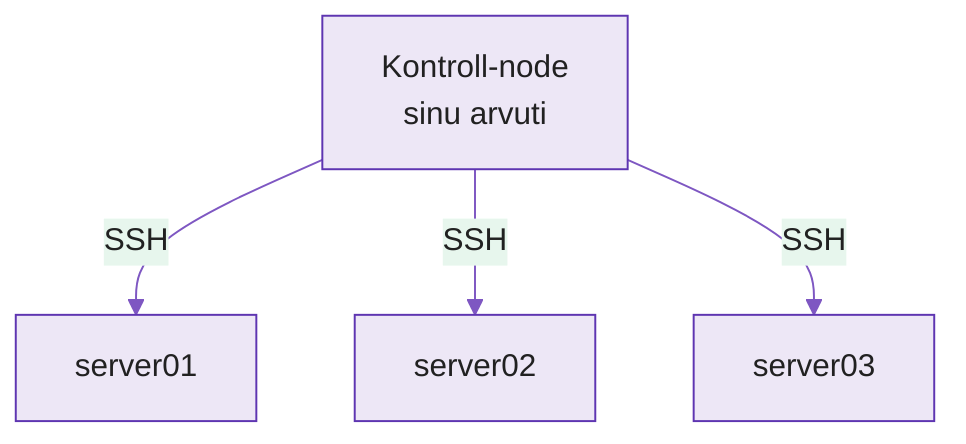

---
tags:
  - Ansible
  - Automatiseerimine
  - Konfiguratsioonihaldus
---

# Loeng — Serveri konfiguratsiooni automatiseerimine

**Kestus:** ~40 minutit
**Tase:** Algaste — eeldame et tead SSH-d ja oled teinud `git push`

---

!!! abstract "Õpiväljundid"
    Pärast loengut oskad:

    - selgitada miks deklaratiivne lähenemine on parem kui käskude järjekord
    - kirjeldada mida tähendab idempotentsus ja miks see oluline on
    - eristada Ansible inventory't, moodulit ja playbooki
    - kirjutada lihtsa playbooki, mis installib tarkvara ja käivitab teenuse
    - põhjendada miks Ansible ei vaja hallatavatel serveritel agenti

---

## 1. Probleem, mida Ansible lahendab

Nädal 2 panime koodi GitHubi, et meeskond saaks koos töötada. Aga kood jõuab lõpuks serverisse — ja server peab olema õiges seisundis, et rakendus toimiks.

Kujuta, et su ettevõttel on 10 serverit. Igaühele peab olema paigaldatud nginx, konfiguratsioon täpselt sama, teenus peab käivituma pärast taaskäivitust. Käsitsi:

```bash
ssh server01
sudo apt install -y nginx
sudo cp nginx.conf /etc/nginx/nginx.conf
sudo systemctl enable nginx
sudo systemctl start nginx
exit

ssh server02
# korda kõike...
```

Server 7-l unustasid `systemctl enable` — nginx ei käivitu pärast reboot'i. Sa ei tea seda enne, kui server nädala pärast kell 3 öösel taaskäivitub.

Ansible kirjeldab **mis peab olema**, mitte **mida teha**. Kirjutad soovitud seisundi üks kord, Ansible tagab selle kõigil serveritel, iga kord.

---

## 2. Deklaratiivne lähenemine

Imperatiivne ehk samm-sammuline ütleb masinale mida teha:

```bash
apt install nginx
cp nginx.conf /etc/nginx/nginx.conf
systemctl start nginx
```

Deklaratiivne kirjeldab lõppseisundit:

```yaml
- name: nginx on paigaldatud ja töötab
  hosts: webservers
  tasks:
    - name: nginx pakett on olemas
      apt:
        name: nginx
        state: present

    - name: konfiguratsioon on paigas
      copy:
        src: nginx.conf
        dest: /etc/nginx/nginx.conf

    - name: teenus on käivitatud
      service:
        name: nginx
        state: started
        enabled: true
```

Tulemus on sama, aga deklaratiivne versioon töötab igas seisukorras: kui nginx on juba paigaldatud, jätab Ansible selle sammu vahele; kui konfiguratsioon ei muutunud, ei kopeeri üle. Ansible teeb ainult seda, mida vaja.

---

## 3. Idempotentsus

**Idempotentsus** tähendab, et sama toimingut saab teha mitu korda ja tulemus on alati sama.

Ansible ülesanded on idempotentsed. Käivitad sama playbooki kümme korda järjest — pärast esimest korda ei muutu serveris midagi, kui soovitud seisund on juba saavutatud.

See on tähtis mitmel põhjusel: saad playbooki käivitada pärast igat muudatust ilma hirmuta et midagi katki läheb; saad käivitada ka "kontrolli" käigus, et näha kas serverid on ikka õiges seisundis; ja kui server kukub, käivitad sama playbooki — tulemus on täpselt sama nagu algselt.

Ansible näitab iga ülesande kohta:

- `ok` — seisund oli juba õige, midagi ei tehtud
- `changed` — midagi muudeti
- `failed` — ülesanne ebaõnnestus

---

## 4. Ansible arhitektuur

Ansible töötab ilma serveritele midagi paigaldamata. See ühendub SSH kaudu, käivitab vajaliku koodi ja eemaldab enda jäljed.

<figure markdown="span">

  <figcaption>Joonis 3.1. Ansible ühendub SSH kaudu; serveritel on vaja ainult SSH-d ja Pythonit — agenti ei paigaldata (Talvik, 2025).</figcaption>
</figure>

**Kolm põhikomponenti:**

**Inventory** — nimekiri serveritest, kellega Ansible räägib:

```ini
[webservers]
192.168.1.10
192.168.1.11

[databases]
192.168.1.20
```

**Moodul** — üks konkreetne toiming. `apt` installib pakette, `copy` kopeerib faile, `service` haldab teenuseid. Ansible'il on üle 3000 mooduli.

**Playbook** — YAML-fail, mis kirjeldab mida millistel serveritel teha. Koosneb ülesannetest (tasks), iga ülesanne kasutab ühte moodulit.

---

## 5. Esimene playbook

Terviklik playbook, mis seadistab nginx veebiserveri:

```yaml
---
- name: Seadista veebiserver
  hosts: webservers
  become: true          # käivita root õigustega (sudo)

  tasks:
    - name: Uuenda pakettide nimekirja
      apt:
        update_cache: true

    - name: Paigalda nginx
      apt:
        name: nginx
        state: present    # "present" = peab olemas olema

    - name: Käivita ja luba nginx
      service:
        name: nginx
        state: started
        enabled: true     # käivitub ka pärast reboot'i
```

Käivitamine:

```bash
ansible-playbook -i inventory.ini webserver.yml
```

Väljund näitab iga ülesande kohta, kas midagi muutus (`changed`) või oli juba korrektne (`ok`).

---

## 6. Handlers — tee ainult siis kui midagi muutus

Tüüpiline olukord: muutsid nginx konfiguratsiooni — teenus peab taaskäivituma. Aga kui konfiguratsioon ei muutunud, pole taaskäivitust vaja.

Handler on ülesanne, mis käivitub ainult siis kui teine ülesanne annab talle signaali (`notify`):

```yaml
  tasks:
    - name: Kopeeri nginx konfiguratsioon
      copy:
        src: nginx.conf
        dest: /etc/nginx/nginx.conf
      notify: Taaskäivita nginx    # signaali nimi

  handlers:
    - name: Taaskäivita nginx
      service:
        name: nginx
        state: restarted
```

Kui konfiguratsioon ei muutunud — nginx ei taaskäivitu. Kui muutus — taaskäivitub automaatselt, üks kord, playbooki lõpus.

---

## 7. Miks see tööl oluline on

Suured veebiteenused jooksutavad tuhandeid nginx eksemplare. Iga kord kui konfiguratsioon muutub, peab see jõudma kõigile serveritele — täpselt, kiiresti, vigadeta. Käsitsi SSH-ga seda ei tee. Ansible playbook käivitub CI/CD pipeline'ist automaatselt, iga kord sama tulemus.

Süsteemiintegraatorid kasutavad Ansible't klientide infrastruktuuri seadistamisel: sama playbook töötab nii test- kui tootmiskeskkonnas, sama tulemusega.

---

## Kokkuvõte

- **Deklaratiivne** kirjeldab lõppseisundit, mitte samme — Ansible otsustab ise mida teha
- **Idempotentsus:** sama playbook, sama tulemus, ükskõik mitu korda. `ok` = juba korrektne, `changed` = tehti
- **Agenti pole vaja:** SSH + Python serveril, rohkem midagi
- **Kolm komponenti:** inventory (serverid), moodul (toiming), playbook (soovitud seisund)
- **Handler** käivitub ainult siis kui talle viitav ülesanne tegi muudatuse

---

## Allikad

| Allikas | URL |
|---|---|
| Ansible dokumentatsioon | <https://docs.ansible.com> |
| Ansible moodulite nimekiri | <https://docs.ansible.com/ansible/latest/collections/index_module.html> |
| Ansible Getting Started | <https://docs.ansible.com/ansible/latest/getting_started/> |

---

*Järgmine: Praktikumis kirjutad oma esimese playbooki — nginx Proxmox VM-ile.*
