---
tags:
  - Ansible
  - Automatiseerimine
  - Konfiguratsioonihaldus
---

# Loeng — Serveri konfiguratsiooni automatiseerimine

**Maht:** ~40 min iseseisvat lugemist — loe **enne** praktikumit
**Tase:** Algaste — eeldame et tead SSH-d ja oled teinud `git push`

See leht on mõeldud iseseisvaks lugemiseks. Loe see rahulikult läbi enne praktikumit — klassis käime põhiliini kiiremini üle, aga siit leiad kõik lahti seletatuna, koos näidetega, ja saad selle praktikumi ajal spikrina lahti hoida.

**Praktikum 1 vajab ainult tuuma** — peatükid 1–8 (kuni esimese playbookini ja idempotentsuseni). Peatükist 9 edasi (muutujate süvend, tingimused, tsüklid) on lugemismaterjal: loed rahulikult läbi, aga esimeseks praktikumiks pole seda vaja peast teada.

---

!!! abstract "Õpiväljundid"
    Pärast seda materjali oskad:

    - selgitada miks deklaratiivne lähenemine on parem kui käskude järjekord
    - kirjeldada mida tähendab idempotentsus ja miks see oluline on
    - eristada push- ja pull-mudelit ning põhjendada miks Ansible ei vaja agenti
    - eristada Ansible inventory't, playbooki, play'd, task'i ja moodulit
    - lugeda lihtsat YAML-i ja `PLAY RECAP` väljundit (`ok` / `changed` / `failed`)
    - kirjutada lihtsa playbooki, mis installib tarkvara ja käivitab teenuse
    - kasutada muutujat playbookis (`vars:`, `{{ }}`)
    - selgitada millal on vaja `become`-i ja mida teeb kuiv-jooks (`--check`)

---

!!! info "Lisalugemine — teistsugune sissejuhatus"
    Kui tahad sama teemat teise nurga alt või lihtsamat sissejuhatust, vaata ka:

    - [Ansible tutorial for beginners (Spacelift)](https://spacelift.io/blog/ansible-tutorial) — selge inglisekeelne algajaõpetus; lõpeb esimese playbooki ja lihtsa muutujaga
    - [Süsteemihalduse Ansible-labor (TÜ)](https://courses.cs.ut.ee/2022/sa/spring/Main/Ansible) — Tartu Ülikooli kursus; ehitab esimese playbooki localhostis (user/file/get_url moodulid)
    - [Ansible kasutamine (auul.pri.ee)](https://www.auul.pri.ee/wiki/Ansible_kasutamine) — eestikeelne kogukonna-wiki

---

## 1. Probleem, mida Ansible lahendab

Inimesed teevad vigu, eriti keeruliste tekstipõhiste süsteemidega. Tänapäeva infrastruktuur võib hõlmata sadu servereid, keerukate seostega. Küsimus on: kuidas automatiseerida tarkvara ja süsteemide haldust ning tagada kõigil serveritel ühtne seisund, minimaalse käsitsi sekkumisega?

<figure markdown="span">
  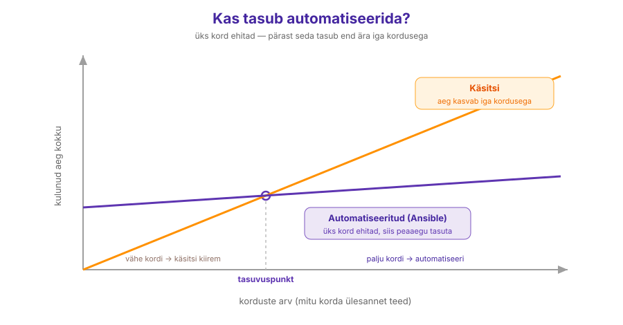
  <figcaption>Joonis 3.1. Käsitsi kulub aeg iga kordusega; automatiseeritud lahendus nõuab ühekordse ehitamise, aga pärast tasuvuspunkti on iga kordus peaaegu tasuta (Talvik, 2025).</figcaption>
</figure>

Käsitsi seadistamisel on kolm püsivat häda. **See ei skaleeru** — kümme serverit on tüütu, kakssada võimatu. **See triivib** — iga server saab ajapikku pisut erineva seade. Ja **see pole dokumenteeritud** — ainus koht, kus "õige seade" kirjas on, on serveri enda hetkeseisund.

Ansible lahendab kõik kolm: sa kirjeldad soovitud seisundi **koodina, üks kord** (mis paketid, mis konfiguratsioon, mis teenused), see kood läheb Giti (nagu eelmisel nädalal), ja Ansible rakendab selle kõigil serveritel ühtemoodi. Ansible ei asenda Giti — Git hoiab faile, Ansible loeb neid ja viib serverid nendes kirjeldatud seisundisse.

---

## 2. Mis Ansible on — ja mis ta EI ole

Ansible on avatud lähtekoodiga IT-automaatika platvorm. Seda kasutatakse konfiguratsioonihalduseks (serverite seadistamine), rakenduste paigaldamiseks, pilveressursside haldamiseks, võrguseadmete seadistamiseks ja mitme masina korraga orkestreerimiseks. See on lai kasutusala, aga põhiidee on kogu aeg sama: sa kirjeldad, missugune peab lõpptulemus olema, ja Ansible viib süsteemi sinna. Kõige lihtsamalt öeldes on Ansible programm, mis loeb sinu kirjutatud YAML-faile ja teeb nende järgi serverites muudatusi.[^docs]

Sama oluline on teada, mis Ansible **ei ole**, sest algaja aetakse siin kergesti segadusse. Ansible ei ole operatsioonisüsteem, ei ole pilveteenus ega veebirakendus. Ta on tööriist, mis käivitub kuskil — sinu arvutis, CI/CD-runneris või eraldi automaatikaserveris — ja sealt ühendub serveritega, mida ta haldab. Sa ei "lähe Ansible'isse" nagu mõnda veebilehele; sa käivitad Ansible'i käsu ja see teeb töö ära.

Ansible'i lõi Michael DeHaan 2012. aastal. Tema eesmärk oli teha automatiseerimistööriist, mille kasutuselevõtt oleks lihtne, millel oleks võimalikult vähe eeldusi ja mille seadistused oleksid inimesele loetavad — mitte krüptiline programmeerimiskeel, vaid midagi, mida ka administraator ilma sügava programmeerimistaustata lugeda oskab. Red Hat omandas Ansible'i 2015. aastal, aga projekt on siiani avatud lähtekoodiga ja kogukonna panusega arendatav.

!!! info "Ametlik projekt vs meie projekt"
    Kursusel on kaks eri asja, mida ei tohi segamini ajada.

    **Ametlik projekt** elab aadressil <https://github.com/ansible/ansible>. See on Ansible'i programmi enda lähtekood, dokumentatsioon ja arendus. Seda **me ei muuda** — see on tööriist, mida me kasutame.

    **Meie projekt** on sinu enda kursuse repo (`ansible-nginx-<eesnimi>` vms). Siia lähevad **meie** inventory, playbookid, konfiguratsioonifailid ja README.

    Teisisõnu: me ei kirjuta Ansible'i ümber. Me kirjutame Ansible'i abil oma **infrastruktuuri kirjeldust** — faile, mis ütlevad, missugused meie serverid peavad olema.

---

## 3. Kust Ansible tuleb — konfiguratsioonihalduse maastik

Ansible pole esimene ega ainus tööriist, mis servereid koodiga haldab. Enne teda olid juba Puppet (2005) ja Chef (2009), ja tänaseni on kasutusel ka Salt. Kõik nad lahendavad sama probleemi — kuidas hoida palju servereid koodi järgi õiges seisundis — aga Ansible võttis turul kiiresti maad ühe konkreetse valiku tõttu: **ta ei vaja hallataval serveril agenti**. Et aru saada, miks see oluline on, tuleb teada, mis vahe on kahel lähenemisel.[^howansible]

**Pull-mudelis** (Puppet, Chef) jookseb igal serveril väike agent-programm, mille sa pead sinna eelnevalt paigaldama. See agent küsib perioodiliselt keskserverilt: "mis on minu soovitud seisund?" — ja rakendab selle siis ise kohapeal. Server tõmbab (pull) endale konfiguratsiooni. See töötab hästi, aga tähendab, et enne kui sa üldse midagi teha saad, pead igasse serverisse agendi paigaldama ja seda hoolduses hoidma.

**Push-mudelis** (Ansible) ei jookse serveril midagi. Keskne masin — kontroll-node — ühendub serveritega ise, tavaliselt SSH kaudu, lükkab (push) käsud kohale ja käivitab need. Kui käsk on tehtud, ei jää serverisse midagi maha. Sa ei pea kuhugi midagi eelnevalt paigaldama; kui serveril on SSH ja Python (mis Linuxil peaaegu alati on), siis Ansible saab sellega juba rääkida.

<figure markdown="span">
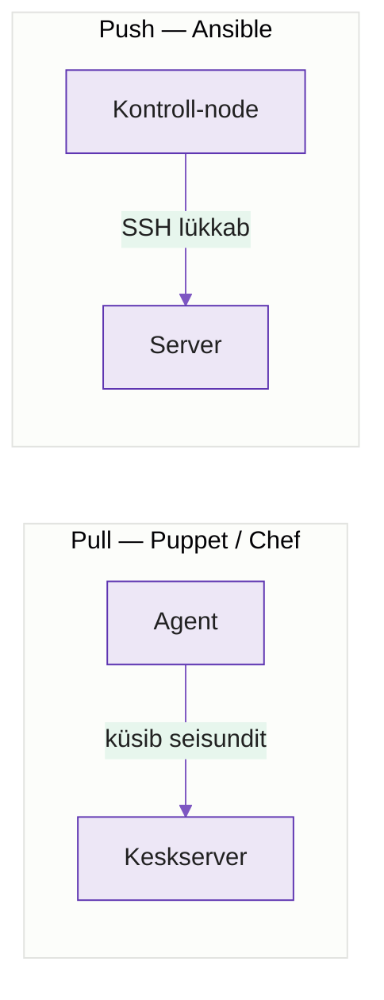
```mermaid
%%{init: {'theme':'base','themeVariables':{'primaryColor':'#ede7f6','primaryBorderColor':'#5e35b1','primaryTextColor':'#212121','lineColor':'#7e57c2'}}}%%
graph LR
    subgraph Pull [Pull — Puppet / Chef]
        A1[Agent] -->|küsib seisundit| M1[Keskserver]
    end
    subgraph Push [Push — Ansible]
        C1[Kontroll-node] -->|SSH lükkab| S1[Server]
    end
```
  <figcaption>Joonis 3.2. Pull-mudelis küsib serveri agent ise seisundit; push-mudelis lükkab kontroll-node muudatuse SSH kaudu kohale (Talvik, 2025).</figcaption>
</figure>

Kumbki lähenemine pole absoluutselt parem — suurtes keskkondades on pull-mudelil omad eelised. Aga Ansible'i madal alustamise lävi on täpselt see, mis teeb ta algajale ja väiksemale keskkonnale sõbralikuks. Järgnev tabel võtab vahe kokku:

| Omadus | Push (Ansible) | Pull (Puppet, Chef) |
|---|---|---|
| Agent serveril | Pole vaja | Paigalda ja hoia töös |
| Ühendus | SSH (juba olemas) | Agent + keskserver |
| Alustamise lävi | Madal — installi ühte masinasse | Kõrgem — sea üles kogu taristu |
| Keel | YAML (loetav) | Oma DSL (Ruby-põhine) |
| Kust muudatus algab | Sina käivitad käsitsi või CI-st | Agent ise, ajastatult |

*Tabel 3.1. Push- ja pull-mudeli võrdlus.*

Meie kursusel valime Ansible'i just sellepärast, et sul on juba olemas kõik, mida vaja: SSH-ühendus serveriga ja Python serveri sees. Rohkem pole tarvis.

---

## 4. Deklaratiivne lähenemine

Nüüd jõuame Ansible'i kõige olulisema mõtteni, ja see on mõtteviisi muutus, mitte lihtsalt uus süntaks. Harjumuspärane viis masinaga rääkida on **imperatiivne** ehk samm-sammuline: sa ütled täpselt, mis käsud millises järjekorras käivitada. Nii sa Bashis kirjutadki — "installi see, kopeeri too, käivita kolmas":

```bash
apt install nginx
cp nginx.conf /etc/nginx/nginx.conf
systemctl start nginx
```

Ansible töötab teistmoodi. Selle asemel, et loetleda samme, kirjeldad sa **lõppseisundit** — missugune server peab pärast olema. See on **deklaratiivne** lähenemine:

```yaml
- name: nginx on paigaldatud ja töötab
  hosts: webservers
  tasks:
    - name: nginx pakett on olemas
      apt:
        name: nginx
        state: present

    - name: konfiguratsioon on paigas
      copy:
        src: nginx.conf
        dest: /etc/nginx/nginx.conf

    - name: teenus on käivitatud
      service:
        name: nginx
        state: started
        enabled: true
```

<figure markdown="span">
  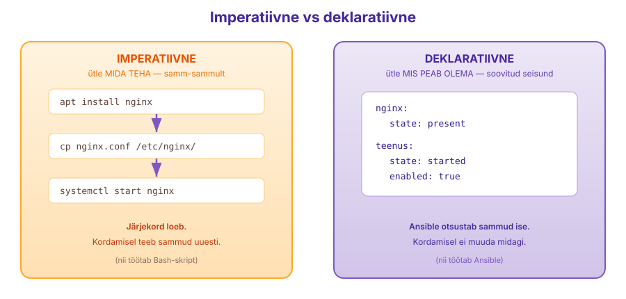
  <figcaption>Joonis 3.3. Imperatiivne ütleb, mida teha ja mis järjekorras; deklaratiivne ütleb, mis peab olema, ja Ansible otsustab sammud ise (Talvik, 2025).</figcaption>
</figure>

Pane tähele sõnastust. Sa ei ütle "installi nginx", vaid "nginx `state: present` — olgu olemas". Sa ei ütle "käivita teenus", vaid "`state: started` — olgu käimas". Vahe pole ainult sõnades. Kui sa ütled "installi", siis käsk üritab alati installida, ka siis kui nginx on juba olemas. Kui sa ütled "olgu olemas", siis Ansible vaatab kõigepealt, kas nginx on juba paigaldatud, ja teeb midagi ainult siis, kui vaja. See väike erinevus ongi kogu Ansible'i töökindluse alus.

Võtmesõna on `state`, ja see kordub läbi kõigi moodulite. Iga moodul mõistab natuke erinevaid väärtusi, aga loogika on sama — sa kirjeldad, missugune asi peab olema, mitte mida sellega teha:

| Moodul | Levinud `state` väärtused | Tähendus |
|---|---|---|
| `apt` / `package` | `present`, `absent`, `latest` | olemas / eemaldatud / uusim versioon |
| `service` | `started`, `stopped`, `restarted`, `reloaded` | käib / seisab / taaskäivita / lae config uuesti |
| `copy` / `file` | `present`, `absent`, `directory` | fail olemas / kustutatud / kaust |

*Tabel 3.2. `state` on deklaratiivse mõtte tuum — kirjeldad seisundit, mitte tegevust.*

Deklaratiivsuse ilu on selles, et sama fail töötab ükskõik millisest algseisust. Kui server on täiesti tühi, teeb Ansible kõik sammud. Kui pool on juba seatud, teeb ainult puuduva osa. Kui kõik on juba korras, ei tee üldse midagi. Sa ei pea teadma, mis seisus server praegu on — sa lihtsalt ütled, mis seisus ta peab olema, ja Ansible viib ta sinna.

---

## 5. Idempotentsus — meeldetuletus

Idempotentsust nägid juba N1-s: sama toimingut võib teha mitu korda ja tulemus jääb samaks. Ansible töötab just nii, ja see tuleb otse deklaratiivsusest — kuna moodul teab soovitud seisundit, kontrollib ta enne tegutsemist, kas see on juba käes. Esimesel käivitusel paigaldab nginx-i (`changed`), teisel näeb, et kõik on paigas, ega tee midagi (`ok`).[^idempotency]

<figure markdown="span">
  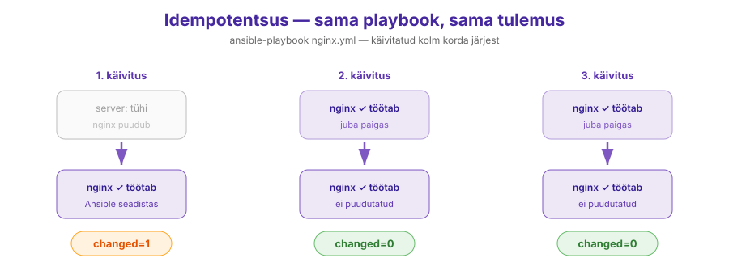
  <figcaption>Joonis 3.4. Esimene käivitus seab serveri soovitud seisundisse (changed=1); järgmised käivitused ei muuda enam midagi (changed=0) (Talvik, 2025).</figcaption>
</figure>

N3 jaoks on üks oluline täpsustus, sest laboris kohtud sellega. Moodulid `shell:` ja `command:` lihtsalt käivitavad käsu ega tea, mida see tegi — seetõttu raporteerivad nad **alati** `changed`, iga kord. See lõhub idempotentsuse: 50 serveri ja cron'iga ei erista sa enam päris muudatust mürast. Reegel: enne kui kirjutad `shell:`, küsi, kas mõni päris moodul teeb sama. Laboris teed selle vea meelega ja parandad ise.

---

## 6. Ansible arhitektuur ja inventory

Vaatame nüüd, kuidas Ansible tegelikult serveritega räägib. Nagu ptk 3 ütles, töötab Ansible push-mudelis: kontroll-node ühendub SSH kaudu, kopeerib vajaliku koodijupi serverisse, käivitab selle Pythoniga ja koristab enda jäljed ära. Serverisse ei jää midagi maha ega paigaldata püsivat agenti.

<figure markdown="span">
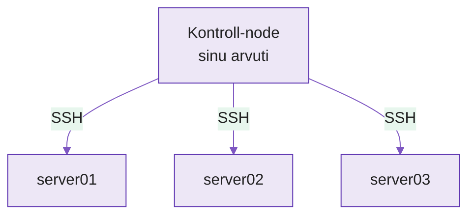
```mermaid
%%{init: {'theme':'base','themeVariables':{'primaryColor':'#ede7f6','primaryBorderColor':'#5e35b1','primaryTextColor':'#212121','lineColor':'#7e57c2'}}}%%
graph TB
    C[Kontroll-node<br/>sinu arvuti] -->|SSH| S1[server01]
    C -->|SSH| S2[server02]
    C -->|SSH| S3[server03]
```
  <figcaption>Joonis 3.5. Ansible ühendub SSH kaudu; serveritel on vaja ainult SSH-d ja Pythonit — agenti ei paigaldata (Talvik, 2025).</figcaption>
</figure>

Siin on kaks poolt, mille nimed tasub selgeks teha. **Kontroll-node** (control node) on masin, kust Ansible käivitatakse — sinu enda arvuti või näiteks GitLab-runner. **Hallatav sõlm** (managed node) on masin, mida Ansible seadistab — Ubuntu VM, veebiserver. Ja **remote user** on kasutaja, kelle nime all Ansible serverisse sisse logib, näiteks `kasutaja` või `ubuntu`.

Tähtis on aru saada, et Ansible'i võim serveri üle ei ole maagiline. Ta saab teha täpselt seda, mida SSH-kasutajal ja `sudo`-reeglitel on lubatud teha — ei rohkem ega vähem. Serveri poolel on vaja ainult kahte asja, ja need on Linuxil tavaliselt niigi olemas: **SSH-teenus**, et üldse ühenduda, ja **Python**, et Ansible'i mooduleid käivitada. Kontroll-node peal on Ansible ise. Windowsi hallatakse veidi teisiti (WinRM asemel SSH), aga meie kursusel on kõik sihtmärgid Linux, nii et sellega ei pea pead vaevama.

### Inventory — kaart hallatavatest serveritest

Et Ansible teaks, milliste serveritega üldse rääkida, hoiab ta nende nimekirja **inventory-failis**. See on lihtsalt loend serveritest, kõige lihtsamal juhul üks server rea kohta. Kohe kasulikumaks muutub inventory siis, kui hakkad servereid **gruppidesse** koondama — nii saad ühe käsuga rääkida korraga kõigi veebiserveritega või kõigi andmebaasidega. Gruppi märgib nurksulgudes olev nimi, mille alla loetled selle grupi serverid:

```ini
[webservers]
web01 ansible_host=192.168.1.10 ansible_user=kasutaja
web02 ansible_host=192.168.1.11 ansible_user=kasutaja

[databases]
db01 ansible_host=192.168.1.20 ansible_user=kasutaja
```

Loeme selle rea-realt lahti. `[webservers]` ja `[databases]` on serverite grupid. `web01` on inimesele mugav hüüdnimi — palju loetavam kui paljas IP-aadress, ja kui serveri aadress kunagi muutub, muudad ainult üht kohta. `ansible_host` ütleb, mis on selle serveri tegelik IP-aadress või DNS-nimi. `ansible_user` määrab, mis kasutajaga Ansible sinna SSH-ga sisse logib. Grupinimi (`webservers`) on täpselt see, millele playbook oma `hosts:`-real hiljem viitab; nii saab sama playbook sihtida üht serverit, tervet gruppi või kõiki hoste korraga (`all`).

Kui sa Ansible'ile inventory asukohta ei ütle, otsib ta vaikimisi faili `/etc/ansible/hosts`. Meie hoiame inventory alati projektikaustas, mitte süsteemi sügavustes, sest siis läheb see koos playbookiga Giti ja on osa versioonihallatud projektist.

### Inventory parameetrid

Hüüdnime taha saab kirjutada parameetreid, mis täpsustavad, kuidas Ansible selle serveriga ühenduma peab. Enamik neist saab mõistliku vaikeväärtuse, nii et tavaliselt piisab `ansible_host`-ist ja `ansible_user`-ist — aga hea on teada, mis valikuid üldse on:

| Parameeter | Mille jaoks | Näide |
|---|---|---|
| `ansible_host` | serveri IP või DNS-nimi | `192.168.1.10` |
| `ansible_connection` | kuidas ühenduda | `ssh` (Linux), `winrm` (Windows), `local` (oma masin) |
| `ansible_port` | SSH port (vaikimisi 22) | `2222` |
| `ansible_user` | kasutaja, kellega sisse logida | `kasutaja`, `ubuntu` |
| `ansible_password` | ühenduse parool — **väldi** | (vt turvamärkus) |

*Tabel 3.4. Levinumad inventory parameetrid.*

Paar neist tasub eraldi seletada. `ansible_connection` ütleb Ansible'ile, kuidas ühenduda: Linuxi puhul SSH, Windowsi puhul WinRM. Kui määrad selle väärtuseks `local`, töötab Ansible otse sinu enda masinas, ilma kuhugi ühendumata — see on hea koht katsetamiseks, kui sul pole eraldi serverit käepärast:

```ini
[local]
localhost ansible_connection=local
```

`ansible_port` määrab pordi, millega ühendutakse; kuna SSH kuulab vaikimisi porti 22, saad selle tasuta ega pea seda tavaliselt kirjutama. Muudad seda ainult siis, kui su server kuulab mõnda muud porti.

!!! warning "Ära hoia paroole tavatekstina"
    Viimane parameeter, `ansible_password`, väärib hoiatust. See paneb SSH-parooli inventory-faili loetava tekstina — ja see fail läheb Giti, kõigile nähtavaks. **Nii ei tehta.** Õige lahendus on paroolita **SSH-võtme autentimine**, mille sa juba eelmistes nädalates seadistasid: Ansible kasutab lihtsalt sama SSH-võtit ja parooli pole failis üldse vaja. Päris tootmise saladused (API-võtmed, andmebaasi paroolid) hoitakse **Ansible Vaultis**, mis krüpteerib need — selle juurde jõuame N4-s. Meie kursusel piisab täiesti SSH-võtmest.

### INI või YAML — kaks vormingut

Kujuta ette kahte väga erinevat ettevõtet. Esimene on väike idufirma, millel on käputäis servereid põhiliste ülesannete jaoks — veebimajutus ja andmebaas. Teine on rahvusvaheline kontsern, millel on üle maailma sadu servereid: e-kaubandus, klienditugi, andmeanalüüs ja palju muud. See, milline inventory-vorming sulle sobib, sõltub sellest, kummale su keskkond sarnaneb.

Väiksele keskkonnale piisab lihtsast **INI-vormingust** — kujuta seda ette kui lihtsat organisatsiooniskeemi, millel on vaid mõni osakond. Iga rühm on nurksulgudes pealkiri, mille alla loetled serverid:

```ini
[webservers]
web1
web2

[databases]
db1
db2
```

Suurema ja keerukama keskkonna jaoks on **YAML-vorming** struktureeritum ja paindlikum — nagu täielik organisatsiooniskeem koos osakondade, allosakondade ja meeskondadega. Sama serverite kogum YAML-is näeb välja nii: kõik paikneb `all` all, siis `children` all, iga rühm selle all ja hostid ühe taseme võrra sügavamal:

```yaml
all:
  children:
    webservers:
      hosts:
        web1:
        web2:
    databases:
      hosts:
        db1:
        db2:
```

Seda on rohkem kirjutada, aga struktuur tasub end ära, kui keskkond kasvab. Mõlemad vormingud lubavad sul servereid rühmitada nii, nagu sulle sobib — rolli järgi (veebi-, andmebaasi-, rakendusserverid), geograafia järgi (USA, Euroopa, Aasia) või mis tahes muu kriteeriumi alusel. Rühmad määrad sa ise. **Meie kursusel kasutame INI-t**, sest see on meie mahu jaoks kõige selgem — aga tasub YAML-inventory ära tunda, kui sa seda kuskil näed.

### Rühm rühmade sees — vanem-laps

Kujuta suurt organisatsiooni, kus veebiserverid asuvad eri asukohtades — osa USA-s, osa Euroopas — ja igas asukohas on mõni asukohaspetsiifiline seade, aga suur osa konfiguratsioonist on kõigil ühine. Võiksid teha iga asukoha jaoks eraldi rühma, aga siis peaksid ühise osa igas rühmas dubleerima — ja dubleerimine on koht, kus vead tekivad.

Lahendus on rühm, mis sisaldab teisi rühmi — **vanem-laps-suhe**. Teed vanemrühma `webservers` ja selle alla lapsrühmad `webservers_us` ja `webservers_eu`. Ühise konfiguratsiooni saad määrata vanemrühma tasemel, kus see kehtib kõigile, ja asukohaspetsiifilise seade lapsrühma tasemel. INI-vormingus märgitakse lapsrühmad `:children` järelliitega:

```ini
[webservers_us]
web1
web2

[webservers_eu]
web3
web4

[webservers:children]
webservers_us
webservers_eu
```

Nii sihib `hosts: webservers` playbookis korraga kõiki nelja serverit, samas kui `hosts: webservers_eu` ainult euroopa omi. YAML-vormingus teeb sama töö võtmesõna `children:`, mille nägid juba formaadi näites ülalpool.

<figure markdown="span">
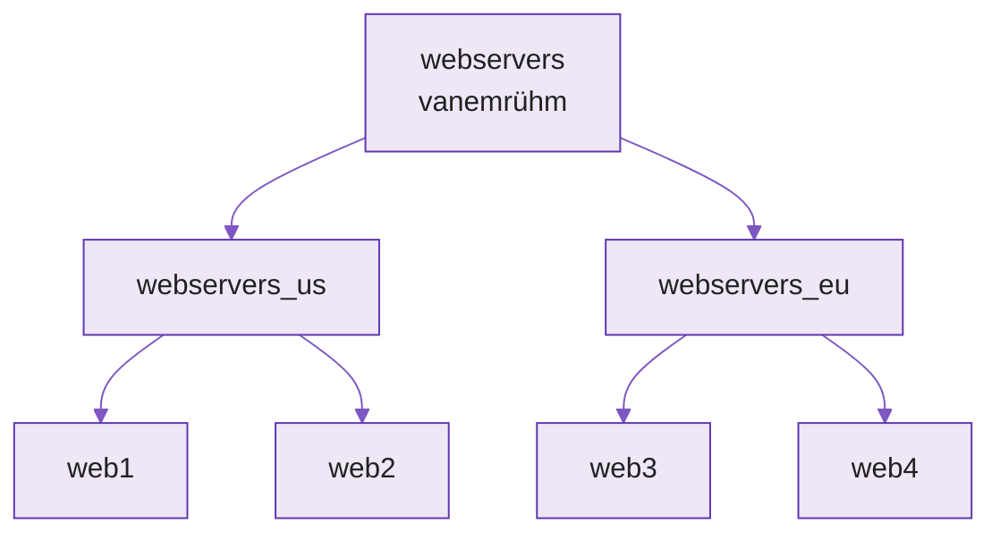
```mermaid
%%{init: {'theme':'base','themeVariables':{'primaryColor':'#ede7f6','primaryBorderColor':'#5e35b1','primaryTextColor':'#212121','lineColor':'#7e57c2'}}}%%
graph TB
    P["webservers<br/>vanemrühm"] --> US[webservers_us]
    P --> EU[webservers_eu]
    US --> H1[web1]
    US --> H2[web2]
    EU --> H3[web3]
    EU --> H4[web4]
```
  <figcaption>Joonis 3.6. Vanemrühm webservers sisaldab lapsrühmi; hosts: webservers sihib kõiki nelja, hosts: webservers_eu ainult euroopa omi (Talvik, 2025).</figcaption>
</figure>

See, kuidas anda vanem- ja lapsrühmale eri seaded, käib **muutujate** (group_vars) kaudu — selle teemani jõuame N4-s. Praegu piisab, kui tead, et rühm võib sisaldada teisi rühmi ja et nii saab dubleerimist vältida.

Inventory on sisuliselt kaart kõigist seadmetest, mida Ansible haldab. Kõik ülejäänu, mida sa ehitad, tugineb sellele — seepärast tasub see selgeks teha kohe alguses.

---

## 7. YAML — keel, millel kõik playbookid põhinevad

Iga Ansible playbook on **YAML-fail**: lihttekst, mis sisaldab andmeid — meie puhul konfiguratsiooni. Kogu ülejäänud kursus tugineb YAML-ile, seega tee see korralikult selgeks. Kui oled XML-i või JSON-i näinud, tuleb see kiiresti. Samad andmed JSON-is ja YAML-is — YAML on loetavam:

```json
{ "nimi": "nginx", "port": 80, "paketid": ["nginx", "curl", "git"] }
```

```yaml
nimi: nginx
port: 80
paketid:
  - nginx
  - curl
  - git
```

### Võti-väärtus

Kõige lihtsam andmestruktuur YAML-is on võti-väärtuse paar. Kirjutad võtme, siis kooloni, siis väärtuse:

```yaml
puuvili: õun
vedelik: vesi
liha: kana
```

Üks reegel, mida tuleb kindlalt meeles pidada: **kooloni järel peab olema tühik** (`puuvili: õun`, mitte `puuvili:õun`). See tundub tühine, aga on üks sagedasemaid vigu.

### Loend (list)

Kui tahad loetleda mitut asja, kasutad loendit. Iga element läheb eraldi reale ja tema ette paned kriipsu:

```yaml
puuviljad:
  - õun
  - banaan
  - viinamari
```

Kriips (`-`) märgib iga kirje loendi elemendina. Oluline detail: **loend on järjestatud**. `õun, banaan` ei ole sama mis `banaan, õun` — järjekord loeb.

### Sõnastik (dictionary)

Sõnastik koondab ühe kirje alla mitu omadust. Näiteks üks puuvili koos oma toitumisandmetega:

```yaml
banaan:
  kalorid: 105
  rasv: 0.4
  süsivesikud: 27
```

Pane tähele tühikut enne iga omadust. Kõik ühe kirje omadused peavad olema joondatud **sama arvu tühikute järgi** — ja just siin komistavad algajad kõige sagedamini. Kolm omadust sama taandega tähendab, et kalorid, rasv ja süsivesikud kuuluvad kõik `banaan`-i alla. Kui joondad ühe neist sügavamale:

```yaml
banaan:
  kalorid: 105
    rasv: 0.4          # liiga sügav taane
```

siis `rasv` satub justkui `kalorid`-i alla. Aga `kalorid`-il on juba väärtus (105), tema alla ei saa enam sõnastikku panna — ja YAML annab vea. Erinevalt loendist on **sõnastik järjestamata**: omaduste järjekord ei loe, `rasv` enne või pärast `süsivesikud`-i on täpselt sama.

### Pesastamine — loend sõnastikke, sõnastik sõnastikus

Neid struktuure saab üksteise sisse panna, ja siit tuleb lihtne rusikareegel: **üks objekt kirjeldatakse sõnastikuga, mitut objekti loendiga.**

Üks auto on üks objekt, seega sõnastik. Ja mõne omaduse väärtuse võib omakorda asendada sõnastikuga — nii tekib sõnastik sõnastiku sees:

```yaml
auto:
  värv: sinine
  mudel:               # sõnastik sõnastiku sees
    nimi: Corolla
    aasta: 2020
  hind: 15000
```

Kui autosid on mitu, on tegu loendiga. Kui vajad ainult nimesid, piisab lihtsast stringide loendist; kui vajad iga auto kõiki andmeid, on iga element omaette sõnastik — nii tekib **loend sõnastikke**:

```yaml
autod:
  - nimi: Corolla
    aasta: 2020
  - nimi: Civic
    aasta: 2019
```

### Kommentaarid

Iga rida, mis algab trellidega (`#`), on kommentaar, ja YAML jätab selle täielikult tähelepanuta. Kasutad seda selgituste kirjutamiseks:

```yaml
# see on kommentaar
nginx_port: 80   # ka rea lõpus
```

### Miks see playbookis tähtis on

Nüüd tuleb aha-moment: playbook **ongi** täpselt need struktuurid pesastatult. Vaata sama pilguga tagasi nginx-näitele:

```yaml
- name: Seadista veebiserver   # play = sõnastik (loendi element)
  hosts: webservers
  tasks:                       # tasks = loend
    - name: Paigalda nginx     #   task = sõnastik
      apt:                     #     mooduli parameetrid = sõnastik
        name: nginx
        state: present
```

Playbook on **loend play'sid**; iga play on sõnastik; `tasks` on omakorda **loend sõnastikke**; ja mooduli parameetrid on jälle sõnastik. Kui YAML-struktuur on sul selge, siis playbook pole enam midagi uut — see on lihtsalt tuttavad tükid tuttavas järjekorras. VS Code näitab taande tühikuid ja märgib YAML-vead kohe ära, seega hoia see praktikumis lahti.

---

## 8. Playbook, play, task, moodul

Enne kui esimese playbooki kirjutad, teeme selgeks neli mõistet, mida algaja sageli segamini ajab. Need on pesastatud, suuremast väiksemani, ja kui vahed on selged, loed sa iga playbooki palju kindlamalt.

<figure markdown="span">
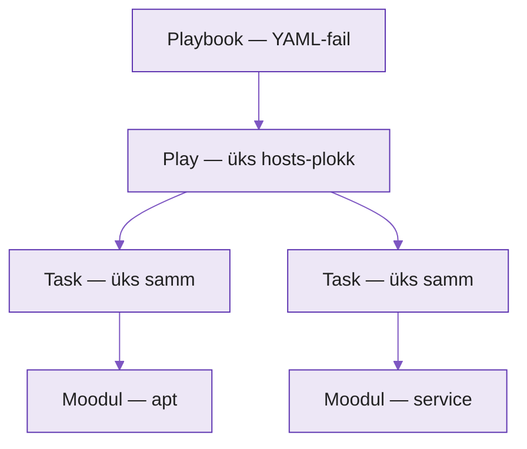
```mermaid
%%{init: {'theme':'base','themeVariables':{'primaryColor':'#ede7f6','primaryBorderColor':'#5e35b1','primaryTextColor':'#212121','lineColor':'#7e57c2'}}}%%
graph TB
    P[Playbook — YAML-fail] --> PL[Play — üks hosts-plokk]
    PL --> T1[Task — üks samm]
    PL --> T2[Task — üks samm]
    T1 --> M1[Moodul — apt]
    T2 --> M2[Moodul — service]
```
  <figcaption>Joonis 3.7. Playbook koosneb play'dest, play ülesannetest (task), iga task kasutab üht moodulit (Talvik, 2025).</figcaption>
</figure>

**Playbook** on kogu YAML-fail — see on su plaan tervikuna. **Play** on selle sees üks plokk, mis seob ühe grupi servereid (`hosts:`-rida) hulga ülesannetega. **Task** on üks samm play sees, näiteks "paigalda nginx". Ja **moodul** on tegelik tööriist, mida task oma töö tegemiseks kasutab — `apt`, `copy`, `service`. Task ütleb, *mida* teha; moodul on see, *millega* seda tehakse.

Vaatame terviklikku playbooki, mis seadistab nginx veebiserveri, ja loeme selle rea-realt lahti:

```yaml
---
- name: Seadista veebiserver     # play nimi, ilmub väljundis
  hosts: webservers              # grupp inventory'st
  become: true                   # käivita root-õigustega (sudo)

  tasks:
    - name: Uuenda pakettide nimekirja
      apt:
        update_cache: true

    - name: Paigalda nginx
      apt:
        name: nginx
        state: present            # "present" = peab olemas olema

    - name: Käivita ja luba nginx
      service:
        name: nginx
        state: started
        enabled: true             # käivitub ka pärast reboot'i
```

Kolm kriipsu (`---`) tähistavad YAML-dokumendi algust. Rida `- name:` annab play'le inimesele loetava nime, mis ilmub hiljem väljundis — see teeb `PLAY RECAP`-i lugemise palju lihtsamaks. `hosts: webservers` ütleb, et see play jookseb kõigil inventory grupi `webservers` serveritel. `become: true` tähendab, et tööd tehakse `sudo`-õigustega (sellest kohe lähemalt). `tasks:` alt algavad tegevused, ja iga task kasutab üht moodulit: `apt` paketihalduseks (`name: nginx`, `state: present` — nginx peab olema paigaldatud) ja `service` teenuse käivitamiseks.[^gettingstarted]

<figure markdown="span">
  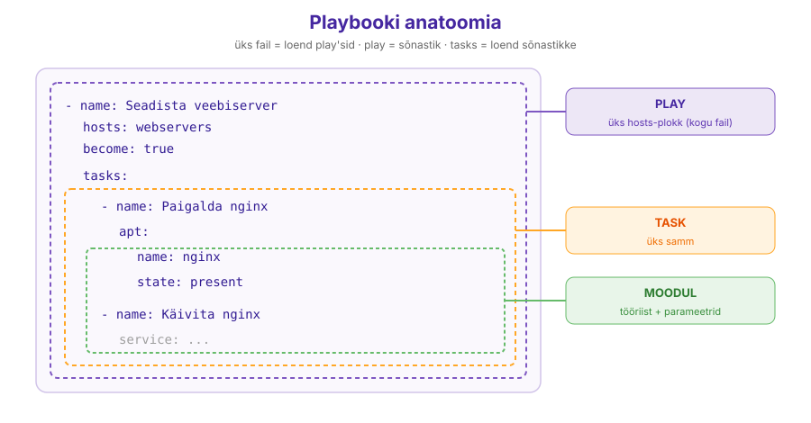
  <figcaption>Joonis 3.8. Sama playbook märgistatult: välimine plokk on play, iga samm task, ja task kasutab üht moodulit koos parameetritega (Talvik, 2025).</figcaption>
</figure>

Siin tuleb kasuks see, mida YAML-ist juba tead. Playbook on **loend play'sid**, ja iga play on **sõnastik** — seega play omaduste (`name`, `hosts`, `tasks`) järjekord ei loe: võid `name` ja `hosts` omavahel vahetada ja kood on ikka kehtiv. Aga `tasks` on **loend**, ja loend on järjestatud — seal järjekord loeb. Kui vahetad "Paigalda nginx" ja "Käivita nginx" omavahel ära, käsid Ansible'il käivitada teenuse enne, kui pakett on üldse paigaldatud. Just seepärast on YAML-i taane ja struktuur nii tähtis — jälgi neid hoolega.

### Moodulid — valmis tööriistad

Moodul on Ansible'i valmis tegevus, ja neid on üle kolme tuhande. Sa ei pea neid pähe õppima — iga mooduli dokumentatsioon sisaldab parameetreid ja näiteid. Alguses tuled toime väheste moodulitega, ja tasub teada, mis milleks on:

| Moodul | Milleks |
|---|---|
| `ping` | kontrollib Ansible'i ühendust hostiga |
| `apt` | paigaldab/eemaldab Debiani/Ubuntu pakette |
| `dnf` | paigaldab/eemaldab RHEL/Fedora/Alma pakette |
| `package` | üldisem paketimoodul (valib ise apt/dnf) |
| `copy` | kopeerib faili kontroll-node'ist serverisse |
| `template` | loob faili Jinja2 malli põhjal |
| `service` | käivitab/peatab/taaskäivitab teenuse |
| `user` | haldab Linuxi kasutajaid |
| `file` | haldab faile, kaustu ja õigusi |

*Tabel 3.5. Levinumad `ansible.builtin` moodulid.*

Need baasmoodulid tulevad kollektsioonist nimega `ansible.builtin`, ja neid võib kirjutada kas täisnimega (`ansible.builtin.apt`) või lühidalt (`apt`). Täisnimi ehk **FQCN** (fully qualified collection name) näitab täpselt, millisest kollektsioonist moodul tuleb, ja just nii soovitab Ansible tänapäeval mooduleid kirjutada. Praktiline näide: vanemates juhendites näed RHEL/Alma pakettide jaoks `yum`-moodulit, aga tänapäeval kasutatakse `ansible.builtin.dnf` (samad parameetrid; `yum`-tagataust eemaldati Ansible Core 2.17-s). Kõik olemasolevad moodulid loetleb käsk `ansible-doc -l`, ja üksiku mooduli dokumentatsiooni näeb `ansible-doc <nimi>`. Lisamooduleid saab juurde tuua `ansible-galaxy` abil, aga kursusel jääme baasi juurde — sellest piisab kõigeks, mida teeme.[^modules]

### Ansible sõnavara — ühe pilguga

Kokkuvõtteks kogu sõnavara, mille sa Ansible'iga kohtad. Osa neist õpid juba täna, osa alles hilisematel nädalatel — see tabel näitab, kus mis:

| Mõiste | Millele vastab | Millal |
|---|---|---|
| Inventory | milliste serveritega räägime? | N3 |
| Group | millised serverid on sama rolliga? | N3 |
| Playbook | mida ja kellele teeme? | N3 |
| Play | üks plokk, mis sihib hoste | N3 |
| Task | üks tegevus play sees | N3 |
| Module | valmis tööriist tegevuse tegemiseks | N3 |
| Variable | muudetav väärtus (paketi nimi, port) | N3 |
| Handler | tegevus, mis käivitub ainult muudatuse korral | N4 |
| Template | Jinja2 mall dünaamilise faili loomiseks | N4 |
| Role | korduvkasutatavalt organiseeritud sisu | N11 |
| Collection | moodulite ja rollide pakett | N11 |

*Tabel 3.6. Ansible mõisted ja kus neid kursusel käsitleme.*

---

## 9. Muutujad — üks playbook, palju väärtusi

Reaalne playbook vajab peaaegu alati muutujaid. Kui domeen, port või IP on otse playbookis kõvakodeeritud, pead iga serveri või keskkonna jaoks tegema eraldi faili ja neid käsitsi sünkroonis hoidma. Muutuja hoiab selle väärtuse ühes kohas, ja sama playbook töötab paljude väärtustega. Tegelikult oled muutujaid juba näinud — inventory's on `ansible_host` ja `ansible_user` samuti muutujad.

Kõige lihtsam koht muutuja määramiseks on playbook ise, `vars:` ploki all:

```yaml
- name: Seadista veebiserver
  hosts: webservers
  vars:
    domain_name: example.ee
    nginx_port: 80
  tasks:
    - name: ...
```

Muutuja kasutamiseks kirjuta selle nimi kahe looksuluku vahele — `{{ }}`. Väärtuse käsitsi sisestamise asemel paned muutuja:

```yaml
    server_name: "{{ domain_name }}"
```

Käivitamisel asendab Ansible `{{ domain_name }}` väärtusega sinu eest. Üks süntaksireegel: kui väärtus **algab** muutujaga, pane see jutumärkidesse (`"{{ domain_name }}"`), muidu loeb YAML looksulu valesti; kui muutuja on stringi keskel, jutumärke vaja pole.

### Muutujatüübid — mida väärtus võib sisaldada

Ansible toetab viit muutujatüüpi, ja need on iga playbooki alusklotsid. **String** on tavaline tekst (`username: admin`) — kõige sagedasem. **Number** on täisarv või kümnendarv, millega saab teha aritmeetikat (`max_connections: 100`). **Boolean** on `true` või `false`, sageli tingimustes (`debug_mode: true`); Ansible käsitleb tõesena ka `yes`/`on`/`1` ja väärana `no`/`off`/`0`, aga selguse huvides jää `true`/`false` juurde.

**Loend (list)** on järjestatud kogum, mille elemendid võivad olla mis tahes tüüpi:

```yaml
paketid:
  - nginx
  - postgresql
  - git
```

Kogu loendile viitad `{{ paketid }}`; ühe elemendi juurde pääsed indeksiga: `{{ paketid[0] }}` annab `nginx` (indeks 0 = esimene).

**Sõnastik (dictionary)** sisaldab võti-väärtuse paare:

```yaml
kasutaja:
  nimi: admin
  roll: administraator
```

Kogu sõnastikule viitad `{{ kasutaja }}`; ühe väärtuse leiad võtme kaudu — `{{ kasutaja.nimi }}` annab `admin`.

### Prioriteet — kes võidab, kui muutuja on määratud mitmes kohas

Sama muutuja võib olla määratud korraga mitmes kohas eri väärtusega — milline kehtib? Ansible rakendab need kindlas järjekorras, ja hilisem kirjutab varasema üle. Kui grupp `web_servers` määrab `dns_server: 10.5.5.3`, aga hostile `web2` paned host-muutujana `dns_server: 10.5.5.4`, siis `web2` saab esmalt grupi väärtuse ja host-väärtus kirjutab selle üle — võidab **10.5.5.4**. Ahel lihtsustatult, madalaimast kõrgeimani:

1. **rollide vaikimisi muutujad** (`roles/*/defaults/`) — madalaim
2. **grupi muutujad** (`group_vars`)
3. **hosti muutujad** (`host_vars`) — võidab grupi üle
4. **play-taseme `vars:`** — võidab mõlema üle
5. **extra-vars** (`-e` käsurealt) — **kõrgeim, tühistab kõik**

<figure markdown="span">
  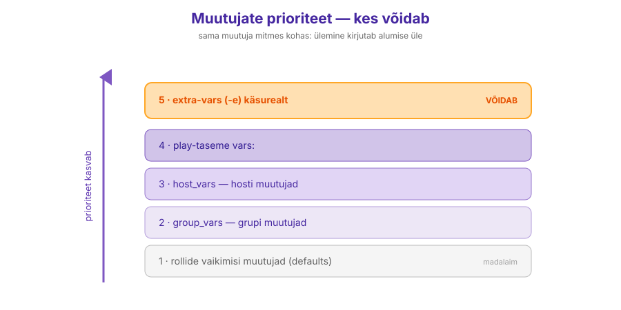
  <figcaption>Joonis 3.9. Kui muutuja on määratud mitmes kohas, võidab ülemine: extra-vars kaalub üles kõik, rollide defaults on madalaim (Talvik, 2025).</figcaption>
</figure>

Reegel meeldejätmiseks: mida spetsiifilisem ja hilisem määrang, seda kõrgem prioriteet.

### `register` — salvesta ühe ülesande tulemus

Mõnikord on vaja ühe ülesande väljundit hiljem kasutada. Selleks lisad ülesandele `register`-direktiivi ja annad muutujale nime:

```yaml
tasks:
  - name: Loe /etc/hosts
    shell: cat /etc/hosts
    register: result

  - name: Kuva tulemus
    debug:
      var: result.stdout
```

Esimese ülesande väljund salvestatakse muutujasse `result`, ja teine kasutab seda; muutuja on kättesaadav kogu ülejäänud play jooksul. Mida `result` sisaldab, sõltub moodulist: `shell`/`command` puhul on seal `rc` (tagastuskood, `0` = õnnestus), ajad, ja `stdout`/`stderr`. Ühe välja saad täpselt: `{{ result.stdout }}`, `{{ result.rc }}`. Registreeritud muutuja kuulub sellele hostile, kus ta loodi. Kiire viis tulemust näha ilma `debug`-ita: `ansible-playbook -v`.

### Muutuja ulatus (scope) — kus muutuja on nähtav

Nagu programmeerimises, määrab **ulatus**, kus muutuja on nähtav. **Host-ulatus:** hostile määratud muutuja on nähtav ainult selle hosti play's — `web2` `dns_server` ei ole nähtav `web1`-le ega `web3`-le. **Play-ulatus:** play sees `vars:`-ga määratud muutuja jääb selle play piiresse; teine play seda ei näe. **Globaalne ulatus:** extra-vars (`-e`) on nähtav kõigis play'des.

<figure markdown="span">
  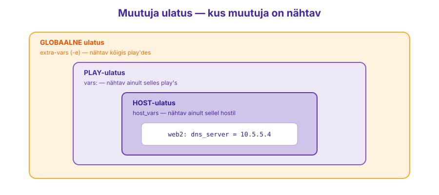
  <figcaption>Joonis 3.10. Host-muutuja on nähtav ainult oma hostil, play-muutuja oma play's, globaalne (extra-vars) kõikjal (Talvik, 2025).</figcaption>
</figure>

### Maagilised muutujad (magic variables)

Kuna host-muutuja on seotud oma hostiga, tekib küsimus: kuidas pääseb `web1` ülesanne ligi väärtusele, mis asub `web2`-l? Selleks on **maagilised muutujad** — sisseehitatud muutujad üle hostide ja gruppide ulatumiseks. **`hostvars`** loeb teise hosti muutujaid: `hostvars['web2'].dns_server`. **`groups`** annab grupi hostid (`groups['webservers']`). **`group_names`** annab grupid, kuhu praegune host kuulub. **`inventory_hostname`** on nimi, mille host sai inventory-failis (mitte FQDN). Ja üks paar, mida ei aeta segamini: `ansible_playbook_python` on Python kontroll-node'is (sinu masin), `ansible_python_interpreter` aga hallataval serveril, kus ülesanded jooksevad.

### Faktid — muutujad, mille Ansible ise kogub

Seni oled kõik muutujad ise määranud. Aga osa muutujaid annab Ansible sulle ise — neid nimetatakse **faktideks**. Kui playbook käivitub ja Ansible ühendub sihtmasinaga, kogub ta esmalt hulga infot: süsteemi kohta (arhitektuur, OS ja selle versioon, protsessor, mälu), võrgu kohta (liidesed, IP-aadressid, FQDN, MAC-aadressid), seadmete kohta (kettad, vabaruum) ja isegi kuupäeva ja kellaaja.

Selle kogumise teeb **`setup`-moodul**, ja see juhtub automaatselt. Isegi kui su playbookis on ainult üks task, näed väljundis kahte: esimene on "Gathering Facts" (mille sa ise ei kirjutanud), teine on sinu task.

Fakte näed, kui suunad `debug`-mooduli muutujale `ansible_facts`:

```yaml
- name: Kuva faktid
  debug:
    var: ansible_facts
```

Üksiku fakti loed sõnastikust: `ansible_facts.distribution` annab OS-i nime. Vanemates juhendites nägid otse `ansible_distribution` — see töötas, sest Ansible lisas iga fakti eraldi tipptaseme muutujana, aga uuemas Ansible'is (`inject_facts_as_vars: false`) harju lugema `ansible_facts` sõnastikust; see vorm töötab alati.

Faktid teevad playbooki kohandatavaks: kui seadistad kettaid või teenuseid, saad otsused teha selle põhjal, mida Ansible masinast leidis (nt palju mälu, mis OS). Kui su playbook fakte ei kasuta, saab kogumise **välja lülitada** — see kiirendab käivitust:

```yaml
- hosts: webservers
  gather_facts: no
```

Nüüd käivitub ainult sinu task, fakte ei koguta. Sama juhib ka `ansible.cfg` seade `gathering` (`implicit` = kogub alati, `explicit` = ei kogu enne kui `gather_facts: true`, `smart` = kogub iga hosti kohta jooksu jooksul üks kord); playbooki seade võidab alati config-faili üle. Fakte kogutakse ainult nende hostide kohta, mida playbook sihib.

See kraam on juba piisav, et kirjutada tugev, kohandatav playbook. Muutujaid saab hoida ka **väljaspool** playbooki — eraldi failides (`group_vars/`, `host_vars/`), et sama väärtust jagada mitme playbooki vahel ja eri keskkondade (test/tootmine) vahel — ja tundlikud väärtused (paroolid, API-võtmed) krüpteeritakse **Ansible Vaultiga**. Failipõhine korraldus ja Vault on **N4** (dünaamiline konfiguratsioon) teema.

---

## 10. Become — õiguste tõstmine

Enamik serveri seadistamisest vajab root-õigusi: paketi paigaldamine, teenuse käivitamine, faili kirjutamine `/etc`-i. Samas sa ei logi Ansible'iga tavaliselt otse root'ina sisse, sest otse root-sisselogimine on turvakaalutlustel serveris keelatud. Selle asemel logid sisse tavakasutajana ja tõstad õigusi ainult siis, kui vaja.

Selle tõstmise teeb rida `become: true`, mis tähendab lihtsalt "kasuta sudo't". Võid panna selle terve play kohta — nagu meie nginx-näites, kus kõik ülesanded vajavad root-õigusi — või ühe konkreetse task'i kohta, kui ainult see üks samm neid vajab. Kui on vaja teha midagi mõne muu kasutaja nimel (mitte root, vaid näiteks `postgres`), on selleks eraldi `become_user`.[^become] See järgib **minimaalsete õiguste põhimõtet** (principle of least privilege): iga tegevus saab täpselt need õigused, mida vajab, mitte rohkem — root-õigust tõstad ainult sinna, kus vaja, ja tavatöö teed tavakasutajana.

Kui sa `become`-i unustad, saad vea `Permission denied` või `Failed to lock apt` — sest tavakasutajal pole õigust pakette paigaldada. See on esimene asi, mida sellise vea korral kontrollida: kas see task vajab root-õigusi ja kas `become` on peal. Laboris eemaldad sa `become`-i meelega, näed täpselt seda viga ja paned rea tagasi — nii jääb see seos sulle kindlalt meelde.

---

## 11. Tingimused ja tsüklid — when ja loop

Seni jooksevad kõik task'id alati. Aga sageli tahad, et task jookseks **ainult teatud tingimusel** — näiteks ainult teatud operatsioonisüsteemil. Selleks on `when`.

### `when` — käivita ainult tingimusel

Kujuta, et tahad paigaldada nginx-i, aga Debiani-põhised süsteemid kasutavad `apt`-i ja Red Hat / Alma kasutab `dnf`-i. Kahe eraldi playbooki asemel teed ühe, kus igal task'il on tingimus:

```yaml
tasks:
  - name: Paigalda nginx (Debian)
    ansible.builtin.apt:
      name: nginx
      state: present
    when: ansible_os_family == "Debian"

  - name: Paigalda nginx (Red Hat / Alma)
    ansible.builtin.dnf:
      name: nginx
      state: present
    when: ansible_os_family == "RedHat"
```

Tingimus loeb fakti `ansible_os_family`, mille Ansible täidab OS-i tüübiga (`Debian`, `RedHat`, `SUSE`). `apt`-task jookseb ainult Debianil, `dnf`-task ainult Red Hatil; teine jäetakse vahele (`skipped`).[^conditionals]

<figure markdown="span">
  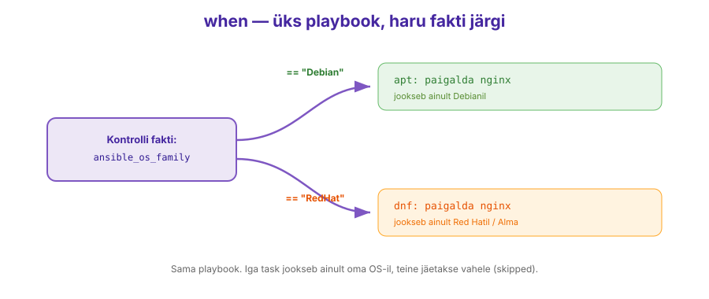
  <figcaption>Joonis 3.11. when laseb ühel playbookil hargneda fakti järgi: apt-task jookseb Debianil, dnf-task Red Hatil (Talvik, 2025).</figcaption>
</figure>

Paar detaili. Võrdlemisel kasuta **kahte** võrdusmärki (`==`), mitte üht. Tingimusi saab kombineerida: `or`-ga jookseb task, kui kumbki tingimus kehtib (`ansible_os_family == "RedHat" or ansible_os_family == "Suse"`); `and`-ga peavad mõlemad kehtima (`ansible_os_family == "Debian" and ansible_distribution_version == "22.04"`).

Ja üks märkus, mis meid otseselt puudutab: selle lihtsa paigalduse võiks tegelikult kirjutada **ilma tingimuseta**, kasutades `ansible.builtin.package` moodulit, mis valib sihtmasinale õige paketihalduri (apt/dnf) ise — nii säästad harude loomise. Aga `when`-i on oluline osata, sest sa vajad seda kohe, kui tingimus pole enam lihtsalt "mis OS".

Millist fakti tingimuses kasutada? Kõige laiem on `ansible_os_family`, mis rühmitab distributsioonid peredeks (`Debian`, `RedHat`, `Windows`) — kasuta seda, kui task peaks hõlmama kõiki Debiani- või Red Hati-tüüpi masinaid, sest see on kõige ülekantavam. Kui vajad täpsust, annab `ansible_distribution` konkreetse nime (`Ubuntu`, `Rocky`), `ansible_distribution_major_version` peaversiooni (`24`, `9`), ja protsessori jaoks on `ansible_architecture` (`x86_64`). Enne kui tingimusi kirjutad, vaata üle, mis väärtused su server **tegelikult** annab — kas ad-hoc käsuga `ansible <host> -m setup`, mis loeb kõik faktid ette, või lisa playbooki debug-task, mis kuvab `ansible_facts`. Nii ei sõltu sa võtmest, mille täpset kuju sa ei tea. (Ja pea meeles: kui `gather_facts: no`, on faktid tühjad — ära tugine faktidele, mida sa kunagi kogunud pole.)

Mitu tingimust eraldi ridadel `when:` all tähendab sama mis nende ühendamine `and`-ga, ja on loetavam:

```yaml
    when:
      - ansible_distribution == "Ubuntu"
      - ansible_distribution_major_version == "24"
```

### loop — korda sama task'i

Kujuta, et pead looma serveris mitu kasutajat. Sama task'i kopeerimine iga kasutaja jaoks töötab, aga on kohmakas, ja dubleerimine teeb hoolduse tülikaks. Parem on üks task, mis käib kõigist kasutajatest läbi — selleks on `loop`.

`loop` käivitab sama task'i mitu korda ja salvestab iga kord käesoleva väärtuse muutujasse `item`. Kasutajanime asemel paned `{{ item }}`:

```yaml
- name: Loo kasutajad
  ansible.builtin.user:
    name: "{{ item }}"
    state: present
  loop:
    - joe
    - george
    - ravi
```

Mõtle sellest nii, nagu tsükkel jaguneks eraldi task'ideks: esimene loob `joe`, teine `george`, kolmas `ravi` — sama moodul, iga kord eri `item`. Playbook on korras ja kordust palju vähem.

<figure markdown="span">
  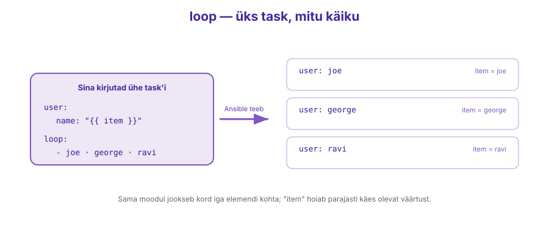
  <figcaption>Joonis 3.12. loop teeb ühest task'ist mitu käiku; item hoiab iga kord loendi järgmist väärtust (Talvik, 2025).</figcaption>
</figure>

Kui iga kirje vajab **mitut väärtust** — näiteks nime ja kasutaja-ID — siis stringide loendi asemel annad **sõnastike loendi**, ja iga välja loed `item.<võti>`-ga:

```yaml
- name: Loo kasutajad ID-ga
  ansible.builtin.user:
    name: "{{ item.name }}"
    uid: "{{ item.uid }}"
    state: present
  loop:
    - { name: joe, uid: 1001 }
    - { name: george, uid: 1002 }
```

Nüüd on `item` sõnastik: `item.name` annab nime, `item.uid` ID. Kui andmed keerukamaks lähevad, aitab just see "kujuta tsükkel eraldi task'ideks" mõtteviis neist aru saada.

Vanemates juhendites näed `loop` asemel `with_items` — see teeb sama asja ja annab sama tulemuse, aga `loop` on tänapäeval soovitatav vorm; tasub `with_items`-i ära tunda, kui seda kohtad. `with_`-perekonnas on veel palju: `with_file` (failid), `with_url` (URL-id), `with_mongodb` (andmebaasid) jt — kõik `with_`-eesliitega on tegelikult **otsingupluginad** (lookup plugins), väikesed skriptid, mis toovad andmeid failidest, URL-idest, andmebaasidest või süsteemidest nagu Kubernetes. Alguses piisab `loop`-ist loendi üle.

### `when` tsükli sees

`when`-i saab kasutada ka koos loendiga. Oletame, et hoiad pakette muutujas, kus igal on nimi ja lipp `required`:

```yaml
vars:
  packages:
    - { name: nginx, required: true }
    - { name: mysql, required: true }
    - { name: apache, required: false }

tasks:
  - name: Paigalda kohustuslikud paketid
    ansible.builtin.package:
      name: "{{ item.name }}"
      state: present
    loop: "{{ packages }}"
    when: item.required
```

`loop` käib loendi läbi ja `when: item.required` paigaldab elemendi ainult siis, kui selle `required` on `true`. nginx ja mysql paigaldatakse, apache jäetakse vahele. Sama task, mida järjest korratakse iga elemendi kohta — muutuja `item` viitab parajasti käes olevale elemendile.

### Tingimus eelmise task'i tulemuse põhjal

`when`-i saab siduda ka `register`-iga (mille nägid muutujate juures). Oletame, et tahad kontrollida teenust ja anda teada, kui see ei tööta:

```yaml
tasks:
  - name: Kontrolli httpd seisundit
    shell: systemctl status httpd
    register: result

  - name: Teata kui teenus maas
    debug:
      msg: "httpd on maas!"
    when: result.stdout.find('down') != -1
```

`find` tagastab sõna asukoha tekstis või `-1`, kui seda pole. Kui tulemus pole `-1`, ilmus sõna "down" ja teade antakse. Nii kohandub üks playbook iga masinaga, millele ta satub.

### Faktid vs muutujad — host vs kavatsus

Tasub eristada kahte asja, mida `when` kasutab. **Faktid** kirjeldavad, *mis host on* (mis OS, mis arhitektuur). **Muutujad** kirjeldavad, *mida sina tahad* (mis keskkond, mis seaded). `when` seob need kaks.

Muutujapõhine näide: arendus, test ja tootmine vajavad igaüks veidi erinevat käitumist. Määrad muutuja `app_env` ja lased sellel tingimusi juhtida. Kõige parem koht `app_env`-i jaoks pole task'i rida, vaid inventory, `group_vars` või `host_vars` — nii saab sama playbooki eri keskkondades korduvalt kasutada, ilma faili muutmata.

Tüüpiline korduvkasutuse muster: enamik samme (pakettide paigaldus, kataloogid, õigused, konfifailid) käivitub **igal** serveril, ilma tingimuseta. Ainult väike osa on keskkonnaspetsiifiline — näiteks teenuse käivitamine ainult tootmises. Selle väljendad ühe `when`-iga just selle task'i juures:

```yaml
  - name: Käivita rakendus (ainult tootmises)
    ansible.builtin.service:
      name: app
      state: started
    when: app_env == "production"
```

Tulemus: üks playbook, mida saab paigaldada kõikjal, aga mis käivitab teenuse ainult seal, kus sa tahad. Faktid näitavad, mis on host; muutujad näitavad, mida sa tahad; `when` seob need.

---

## 12. Töövoog — õige järjekord juba esimesest päevast

Kujuta, et sind palutakse paigaldada oluline uuendus sadadele serveritele. Kirjutad playbooki, oled sellega rahul, ja paned selle kohe tootmisse tööle — aga sees on väike viga, mis uuendamise asemel hoopis peatab teenuse igal serveril. Nüüd on ees pikk seisak ja meeleheitlik võitlus, et kõik jälle tööle saada. Selle vea oleks kinni püüdnud üks samm, mis vahele jäi: **kontroll**. Playbooki kontrollimine enne käivitamist on nagu proov enne etendust — vead tulevad välja ohutult ja kontrollitult, mitte tootmises. Seepärast ei tasu playbooki kunagi käivitada suhtumisega "vaatame mis juhtub", eriti mitte tootmisserveris. Terve harjumus on kasutada kindlat sammude järjekorda, mis annab sulle kindluse enne, kui midagi päriselt muudad:

```bash
# 1. Kas Ansible näeb hoste?
ansible all -i inventory.ini -m ping

# 2. Kas playbooki süntaks on korras? (ei ühendu serveriga)
ansible-playbook -i inventory.ini nginx.yml --syntax-check

# 3. Mis muutuks, kui käivitaks? (ei muuda midagi)
ansible-playbook -i inventory.ini nginx.yml --check

# 4. Rakenda päriselt
ansible-playbook -i inventory.ini nginx.yml

# 5. Kontrolli tulemust
curl http://<sihtmärgi-IP>
```

<figure markdown="span">
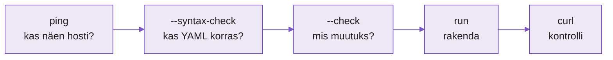
```mermaid
%%{init: {'theme':'base','themeVariables':{'primaryColor':'#ede7f6','primaryBorderColor':'#5e35b1','primaryTextColor':'#212121','lineColor':'#7e57c2'}}}%%
graph LR
    A["ping<br/>kas näen hosti?"] --> B["--syntax-check<br/>kas YAML korras?"]
    B --> C["--check<br/>mis muutuks?"]
    C --> D["run<br/>rakenda"]
    D --> E["curl<br/>kontrolli"]
```
  <figcaption>Joonis 3.13. Terve harjumus: kontrolli ühendust ja süntaksit, vaata kuiv-jooksuga muudatused üle, alles siis rakenda ja kontrolli tulemust (Talvik, 2025).</figcaption>
</figure>

Esimene samm, `ping`-moodul, kontrollib lihtsalt, kas Ansible üldse hostini jõuab — see pole ICMP-ping, vaid päris SSH- ja Python-kontroll. Teine, `--syntax-check`, vaatab su playbooki üle YAML-vigade suhtes, ilma serveriga ühendumata. Kolmas on kuiv-jooks: `--check` käivitab playbooki nii, nagu käivitaks päriselt, aga ei tee tegelikult ühtki muudatust — ta lihtsalt näitab, millised task'id oleksid olnud `changed`. Kui lisad veel `--diff`, näed täpset vahet failides, rida-realt. Alles neljas samm teeb muudatused päriselt, ja viies kontrollib tulemust.

Iga ülesande kohta näitab Ansible olekut, ja lõpus võtab kõik kokku real `PLAY RECAP`. Neid olekuid tasub osata lugeda:

| Olek | Tähendus |
|---|---|
| `ok` | seisund oli juba õige, midagi ei tehtud |
| `changed` | midagi muudeti serveris |
| `failed` | ülesanne ebaõnnestus |
| `skipped` | tingimus ei täitunud, ülesanne jäeti vahele |
| `unreachable` | serverini ei jõutud (SSH katki, server maas) |

*Tabel 3.3. `PLAY RECAP` loeb olekud kokku iga serveri kohta.*

`--syntax-check` ja `--check` peaksid olema sinu harjumus, mitte "edasijõudnute teema". Enamik levinud mooduleid (`apt`, `copy`, `service`) toetavad kuiv-jooksu täielikult, nii et sa näed plaani alati ette, ilma riskita.[^checkmode] (Märkus: mitte iga moodul ei toeta kuiv-jooksu — need ülesanded lihtsalt jäetakse `--check`-i ajal vahele.)

`--diff` juures näed täpselt, mis muutuks — näiteks konfiguratsioonifaili lisatav rida on märgitud plussmärgiga:

```diff
+ server_name example.ee;
```

Ja `--syntax-check` osutab vea korral täpsele kohale: kui unustad YAML-is kooloni, peatub Ansible ja näitab faili, rea ja veeru numbrit, joonistades noolega otse veakoha juurde. Nii parandad vea sekunditega — ja leidsid selle enne, kui playbook üldse serverisse jõudis.

### ansible-lint — stiili ja kvaliteedi kontroll

`--check` ja `--diff` kontrollivad, **mida** playbook teeb. `ansible-lint` kontrollib, **kuidas** see on kirjutatud. Mida rohkem playbooke sul koguneb, seda tähtsam on, et need oleksid ühtlased ja loetavad — ja siin aitab lint. See on käsurea tööriist, mis loeb su playbookid, rollid ja kollektsioonid läbi ning märgib ära vead, stiiliprobleemid ja kahtlased konstruktsioonid. Kujuta, et su kõrval istub kogenud Ansible'i mentor, kes osutab vaikselt kohtadele, mis muidu märkamata jääksid.

Käivitad lihtsalt:

```bash
ansible-lint nginx.yml
```

Lint raporteerib ühe rea iga probleemi kohta, koos faili ja reanumbriga, nii et tead alati, kust otsida. Iga rida lõpeb reegli ID-ga: kategooria ja detail nurksulgudes. Näiteks `yaml[indentation]` (ebaühtlane taane), `name[casing]` (task'i nimi peaks algama suurtähega), `name[missing]` (task'il pole nime), `command-instead-of-shell` (kasutasid `shell`-i seal, kus `command` piisaks — `shell` on aeglasem, kasuta ainult kui vajad torusid või muutujate laiendust). Kasulik detail: kui `ansible-lint` lõpetab ja ei väljasta midagi, siis probleeme ei leitud — **vaikus on edu**.

Hea tava on panna `ansible-lint` oma töövoogu, eriti CI-protsessi (N7): siis läbib iga muudatus automaatselt sama mentorilaadse läbivaatuse ja su playbookid jäävad kasvades järjepidevaks.

---

## 13. Väike mugavus — `ansible.cfg`

Iga käsu taha `-i inventory.ini` kirjutamine läheb kiiresti tüütuks. Ansible'il on lihtne lahendus: kui paned projektikausta faili nimega `ansible.cfg`, loeb Ansible oma seaded sealt automaatselt. Näiteks:

```ini
[defaults]
inventory = inventory.ini
host_key_checking = False
```

Kui see fail on olemas, ei pea sa enam iga kord inventory asukohta käsurea taha kirjutama — Ansible leiab selle ise:

```bash
ansible all -m ping           # leiab inventory ise
ansible-playbook nginx.yml    # ilma -i liputa
```

Rida `host_key_checking = False` väldib esimesel ühendumisel seda "kas oled kindel? (yes/no)" küsimust, mis laboris muidu iga uue serveri juures ette tuleb. `ansible.cfg`-l on tegelikult palju rohkem valikuid ja isegi mitu võimalikku asukohta oma prioriteedijärjekorraga — vaata [Ansible seaded (ansible.cfg)](../ansible-config.md) reference-lehte. Praeguseks piisab täiesti sellest ühest mugavusest.

---

## 14. Failistruktuur — mis repo-st ajapikku saab

Väike, aga kasulik nõuanne kohe alguseks: ära tee igas tunnis uut juhuslikku kausta, vaid hoia oma projekt korras algusest peale. Kursuse jooksul kasvab su repo umbes selliseks:

```text
ansible-lab/
├── inventory.ini
├── nginx.yml            # playbook
├── index.html           # kopeeritav fail
├── templates/           # Jinja2 mallid (N4)
├── group_vars/          # grupi muutujad (N4)
├── roles/               # rollid (N11)
└── README.md
```

Esimesel korral on olemas ainult mõni fail — inventory, esimene playbook, üks HTML-leht ja README:

```text
ansible-lab/
├── inventory.ini
├── nginx.yml
├── index.html
└── README.md
```

Ülejäänud kaustad (mallid, muutujad, rollid) lisanduvad nädalate kaupa, kui nende teemadeni jõuame. Nii tekib loomulik kord, mitte segadus, ja sa tead alati, kuhu mis kuulub.

---

## 15. Miks see tööl oluline on

Kõik see pole ainult õppeülesanne — see on täpselt see, kuidas päris tööd tehakse. Suured veebiteenused jooksutavad tuhandeid nginx-i eksemplare, ja iga kord kui konfiguratsioon muutub, peab see jõudma kõigile serveritele täpselt, kiiresti ja vigadeta. Käsitsi SSH-ga seda teha ei saa. Ansible-playbook käivitub CI/CD-pipeline'ist automaatselt, annab iga kord sama tulemuse, ja `git log` näitab, kes mida millal muutis.

Süsteemiintegraatorid kasutavad Ansible't klientide taristu seadistamisel just sellepärast, et sama playbook töötab nii test- kui tootmiskeskkonnas sama tulemusega — nii kaob see igavene "meil töötas, teil ei tööta" probleem. Ja kui server tuleb kunagi nullist üles seada, olgu riistvararikke, uue keskkonna või katastroofist taastumise tõttu, ei pea keegi peast meenutama, "mis me sinna omal ajal seadistasime". Vastus on playbookis, Gitis, üle vaadatud ja valmis uuesti jooksma.

See on sama mõte, mis eelmisel nädalal Gitiga: käsitsi tehtud ja dokumenteerimata töö on alati hapram kui koodina kirja pandu. Vahe on ainult selles, et nüüd pole koodiks mitte rakendus ise, vaid **serveri enda seisund**.

---

## 16. Kuhu edasi

Sa ei pea kõike kohe oskama — kursus on tervik. See, mida täna ei õpi, tuleb hiljem:

- muutujate välisfailid (`group_vars`/`host_vars`) ja Jinja2 mallid — **N4**
- handlers ja saladuste kaitse (`ansible-vault`) — **N4**
- korduvkasutatavad rollid ja kollektsioonid — **N11**
- playbooki automaatne käivitamine CI/CD-st — **N7–N8**

---

## Kokkuvõte

- **Ansible loeb YAML-faile ja viib serverid soovitud seisundisse** — ta pole OS ega pilv, vaid tööriist su arvutis/CI-s
- **Deklaratiivne** kirjeldab lõppseisundit (`state:`), mitte samme
- **Idempotentsus:** sama playbook, sama tulemus, ükskõik mitu korda. `ok` = juba korrektne, `changed` = tehti
- **`shell:`/`command:` on alati `changed`** — eelista moodulit, või piira `creates`/`changed_when`-iga
- **Push-mudel, agenti pole vaja:** kontroll-node lükkab SSH-ga, serveril ainult SSH + Python
- **Neli mõistet:** playbook (fail) → play (`hosts`-plokk) → task (samm) → moodul (tööriist)
- **YAML:** `võti: väärtus`, `-` loend, taane tühikutega (mitte tab)
- **Inventory** rühmitab serverid; `hosts:` viitab grupile
- **Muutujad:** `vars:` + `{{ }}`; prioriteet defaults < group_vars < host_vars < play < extra-vars; faktid tulevad automaatselt
- **`become: true`** tõstab õigusi (sudo); ilma selleta `Permission denied`
- **`when` / `loop`:** tingimuslik ja korduv task
- **Töövoog:** `ping` → `--syntax-check` → `--check` → run → `curl`

---

[^docs]: Ansible dokumentatsioon. <https://docs.ansible.com>
[^gettingstarted]: Ansible Getting Started. <https://docs.ansible.com/ansible/latest/getting_started/>
[^modules]: `ansible.builtin` moodulite nimekiri. <https://docs.ansible.com/ansible/latest/collections/ansible/builtin/>
[^idempotency]: Idempotentsus (Ansible glossary). <https://docs.ansible.com/ansible/latest/reference_appendices/glossary.html>
[^howansible]: How Ansible works. <https://www.ansible.com/overview/how-ansible-works>
[^become]: Privilege escalation — become. <https://docs.ansible.com/ansible/latest/playbook_guide/playbooks_privilege_escalation.html>
[^checkmode]: Check mode (kuiv-jooks). <https://docs.ansible.com/ansible/latest/playbook_guide/playbooks_checkmode.html>
[^conditionals]: Conditionals ja loops. <https://docs.ansible.com/ansible/latest/playbook_guide/playbooks_conditionals.html>

---

*Järgmine: Praktikumis kirjutad oma esimese playbooki task-haaval, lõhud idempotentsuse meelega ja parandad selle — nginx sinu sihtmärgil.*
