---
tags:
  - Ansible
  - Jinja2
  - Turvalisus
---

# Muutujad, Jinja2 ja Vault: Praktikum

**Kestus:** 4 tundi
**Eeldused:** Loeng loetud (välisfailid, Jinja2, handlers, Vault). N3 praktikum tehtud, töötav `nginx.yml` (`package` + `service` + `copy`). Kui udu, [tagasi loengusse](lecture.md).
**Kontroll-node:** sinu arvuti, kogu töö **VS Code'is**.
**Sihtmärk:** `proxmox1` (nagu N3). Kodus sobib ka WSL2/VM.

---

!!! abstract "Õpiväljundid"

    Selle praktikumi lõpuks sa:

    1. Tõstad kõvakodeeritud väärtused `group_vars`-i
    2. Kirjutad Jinja2 malli ja tead, miks `template:` ≠ `copy:`
    3. Paned handleri teenust uuesti laadima ainult siis, kui config muutus
    4. Krüpteerid saladuse Vault'iga ja käivitad playbooki sellega
    5. **Diagnoosid** vigu veateate järgi (jutumärgid, undefined variable, mall ei asendu, no vault secrets)
    6. **Ennustad** enne käivitamist, mis muutub (`--check --diff`), ja selgitad, miks handler mõnikord ei käivitu
    7. **Lisad ise** uue teenuse (pakett + mall + teenus + handler) ilma samm-sammulise juhiseta
    8. **Diagnoosid kaaslase tekitatud vea** ainult veateate ja tööriistade abil
    9. **Leiad** Ansible'i ametlikust dokumentatsioonist mooduli, parameetri, lubatud väärtused ja näite
    10. **Praktiseerid Gitti**: töötad harul, teed mõttekaid commit'e, võtad muudatuse `git revert`-iga tagasi ja teed paarilise PR-ile review'd

---

!!! example "Näidisstsenaarium: Märten, kolmas vaatus"
    Märteni nginx jookseb nüüd Ansible'iga, aga playbookis on kõik kõvasti kirjas: paketi nimi, lehe tekst, päise väärtus. Sõlmi tuleb juurde ja igaühel peab olema oma leht. Lisaks tahab Märten, et rakenduse andmebaasi parool oleks samas repos kui ülejäänud konfiguratsioon, aga **mitte selge tekstina**.

    Sina teed nii, et playbook jääb samaks ja muutub ainult see, mis on **väljaspool** (muutujad, mallid, krüpteeritud saladus). Lõpus lisad ise uue teenuse ja tuled toime vigadega, mida keegi sulle ette ei ütle.

---

Praktikumi loogika: **baas → laienda → viga → paranda → ennusta → lõhu ise → ehita ise → vaheta vead.** Ehitad N3 playbooki peale samm-sammult; alguses juhendan sind, lõpus enam mitte.

| Osa | Sisu | Orientiir |
|---|---|---|
| 0 | Töövoog: haru, commit'id, Giti spikker | ~10 min |
| 1–5 | Muutujad, mall, handler (juhendatud) | ~90 min |
| 6–8 | Vault | ~40 min |
| 9–10 | Kuiv-jooks ja katkine play | ~25 min |
| 11 | **Iseseisev:** lisa teine teenus | ~40 min |
| 12 | **Paaris:** vigade vahetus | ~25 min |
| 13 | Tõendid ja kontroll | ~15 min |

Lõpuks näeb su repo välja nii:

```
lab04/
├── inventory.ini
├── nginx.yml
├── group_vars/
│   └── all/
│       ├── main.yml        # tavalised muutujad
│       └── vault.yml       # krüpteeritud saladus
├── templates/
│   ├── index.html.j2
│   ├── hallatud.conf.j2
│   └── chrony-hallatud.conf.j2   # Osa 11
├── logid/
└── kontroll.sh
```

---

## Enne alustamist: pilt peas

Kogu praktikum on selle **ühe pildi** kohta. Kui käsud lähevad segaseks, tule siia tagasi.

<figure markdown="span">
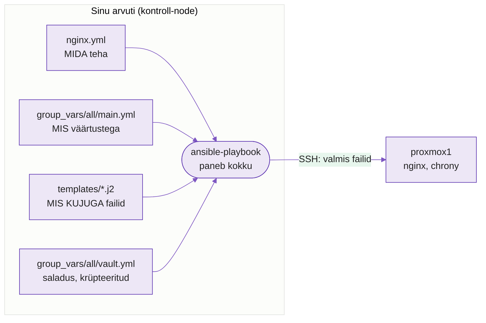
  <figcaption>Joonis 1. Kolm asja on lahus: MIDA teha (playbook), MIS väärtustega (group_vars, vault) ja MIS KUJUGA (mall). Ansible paneb need kokku sinu arvutis ja saadab sõlme juba valmis tulemuse (Talvik, 2026).</figcaption>
</figure>

**Miks lahus?** Kui väärtus on otse playbookis, pead iga muudatuse jaoks playbooki muutma. Kui väärtus on eraldi failis, jääb playbook samaks ja muutub ainult see üks fail. Sellepärast on selle nädala teema "mis on **väljaspool** playbooki".

**Analoogia: kirjaliitmine Wordis.** Mall on kiri "Lp. `{{ nimi }}`", `group_vars` on nimekiri, kust nimed tulevad, ja `ansible-playbook` on nupp "Liida", see teeb igale valmis kirja. Sõlme jõuab ainult valmis kiri, mitte mall.

### Sõnastik

| Mõiste | Tähendus |
|---|---|
| Playbook | nimekiri "**mida** teha" (`nginx.yml`) |
| Inventory | nimekiri "**kus** teha" (`inventory.ini`) |
| Muutuja | silt + väärtus, nt `paketi_nimi` = `nginx` |
| `group_vars/` | kaust, kust Ansible muutujaid **ise** loeb |
| Mall (`.j2`) | fail, kus on augud `{{ }}`; Ansible täidab augud väärtustega |
| Handler | task, mis käib ainult siis, kui keegi teda kutsub **ja** midagi muutus |
| Vault | lukk faili peal; võti on parool |
| `changed` / `ok` | Ansible tegi muudatuse / asi oli juba õige |
| Idempotentsus | sama käivitus teist korda ei muuda enam midagi |

### Kus käsk jookseb?

| Käsk | Kus jookseb |
|---|---|
| `ansible-playbook`, `ansible-vault`, `ansible-inventory`, `git`, `bash kontroll.sh` | **sinu arvutis** |
| `ssh proxmox1 "curl -s localhost"` | jutumärkides olev käsk jookseb **sõlmes**, tulemus tuleb sinu terminali |

### Ühe käsu anatoomia

Praktikumi lõpus jooksutad selliseid käske. Iga osa käsus tähendab midagi:

```bash
ansible-playbook -i inventory.ini nginx.yml --vault-password-file .vault_pass --check --diff
```

| Osa | Mida ütleb |
|---|---|
| `ansible-playbook` | käivita playbook |
| `-i inventory.ini` | **kuhu**: sõlmede nimekiri |
| `nginx.yml` | **mida** teha |
| `--vault-password-file .vault_pass` | Vault parool on selles failis (muidu küsiks) |
| `--check` | **kuiv** jooks: ära tee midagi päriselt |
| `--diff` | näita, mis failides muutuks |

### Kuidas Ansible'i väljundit lugeda

```text
TASK [Paigalda nginx pakett] ***********
ok: [proxmox1]                          <- oli juba õige, midagi ei muutnud
TASK [Kopeeri index.html] **************
changed: [proxmox1]                     <- muutis sõlme
TASK [Meelega katki] *******************
fatal: [proxmox1]: FAILED! => ...       <- viga, play katkeb siin

PLAY RECAP *****************************
proxmox1 : ok=3  changed=1  unreachable=0  failed=0  skipped=0
```

| Sõna | Mida see tähendab |
|---|---|
| `ok` | asi oli juba õige, midagi ei muudetud |
| `changed` | Ansible muutis sõlme |
| `failed` | task ebaõnnestus, sõlme töö lõpeb siin |
| `unreachable` | sõlmeni ei jõutud (SSH) |
| `skipped` | task jäeti vahele |

**Idempotentne käivitus on see, kus `changed=0`.** Praktikumis taotled seda peaaegu igal sammul.

!!! tip "Ei saa aru? Mine trepist üles"
    1. Loe osa alguses olev **"Mis siin toimub?"** ja vaata joonist.
    2. **Ennusta**, mis juhtub, ja alles siis käivita. Kui ennustus ja tulemus erinevad, uuri, miks.
    3. Ava **Ansible'i ametlik dokumentatsioon** ja otsi mooduli täisnime järgi (nt `ansible.builtin.service`). Vaata parameetreid, lubatud väärtusi ja näiteid.
    4. Küsi kaaslaselt.
    5. Küsi AI-lt **selgitust**, mitte valmis lahendust: kopeeri talle **veateade, oma fail ja link dokumentatsioonile**, mille juba läbi vaatasid, ning küsi "miks see viga tekib ja milline rida selle põhjustab?".
    6. Küsi õpetajalt.

!!! warning "Käskude pimesi kopeerimine ei õpeta"
    Osa 11 (iseseisev teenus) ja Osa 12 (kaaslane murrab **sinu** faili) on tehtud nii, et neid ei saa "kopeerida". Seal on vaja mõista, mis toimub. Kui oled seni käske lihtsalt kopeerinud, siis just nendes osades tuleb see välja, parem harjuta aru saamist juba nüüd.

---

## Osa 0 · Töövoog: kuhu muudatused lähevad

Kõik muudatused lähevad **oma harule** `n04-vault`, **mitte otse `main`-i**. `main` jääb puutumata, kuni PR on vaadatud. Tee see enne esimest muudatust.

<figure markdown="span">
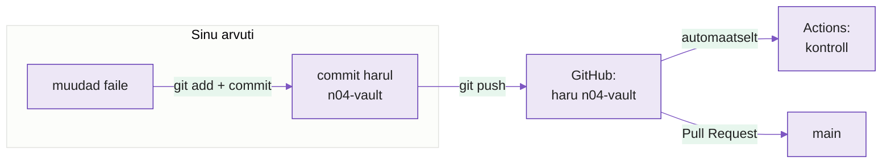
  <figcaption>Joonis 2. Töö liigub harule, mitte `main`-ile: muuda, commit, push, alles lõpus PR (Talvik, 2026).</figcaption>
</figure>

1. Klooni oma Classroomi repo ja ava kaust VS Code'is. Kõik käsud jooksevad **selles kaustas**, sinu arvutis.
2. Loo haru ja kontrolli, et oled selle peal:

```bash
git switch -c n04-vault
git branch --show-current
```

Teine käsk peab vastama `n04-vault`. Kui vastab `main`, ära muuda midagi enne, kui haru on olemas.

3. Tee commit **pärast iga osa** (Osa 3, 5, 8, 10, 11), et sul oleks alati koht, kuhu tagasi minna:

```bash
git add -A
git status
git commit -m "Osa 3: muutujad group_vars-i"
```

`git status` näitab, mis commitisse läheb. Enne kui commit'id, vaata, et seal poleks `.vault_pass` (see tuleb alles Osa 8-s, ja kõigepealt `.gitignore`).

**Commit-sõnum kirjeldab, mis muutus**, kujul `Osa 3: muutujad group_vars-i`. Sõnumid nagu `asjad`, `veelkord` või `test` ei räägi ajaloost midagi. Praktikumi lõpus peab `git log --oneline` lugema sinu töö loona.

| Käsk | Mida see teeb |
|---|---|
| `git status` | näitab, mis on muutunud ja mis on commitisse minemas |
| `git diff` | näitab, mida täpselt muutsid (enne `git add`-i) |
| `git add -A` | paneb kõik muudatused commit'i ootele |
| `git commit -m "..."` | salvestab ajalukku |
| `git log --oneline` | näitab ajalugu, üks rida commit'i kohta |
| `git restore .` | tühistab **commit'imata** muudatused |
| `git revert HEAD` | teeb uue commit'i, mis tühistab viimase commit'i |
| `git push` | saadab commit'id GitHubi |

4. Push'i haru pärast esimest commit'i ja siis iga kord, kui oled osa lõpetanud:

```bash
git push -u origin n04-vault
```

Iga push käivitab GitHubis automaatse kontrolli (Actions). Kui see on alguses punane, on see normaalne: tööd on veel vähe.

5. Praktikumi lõpus avad **Pull Request** `n04-vault` → `main` (vt "Esitamine").

!!! warning "Tegid juba commit'i `main`-il?"
    Ära paanitse. Loo haru sealt, kus oled, ja tõsta `main` tagasi:

    ```bash
    git switch -c n04-vault
    git branch -f main origin/main
    ```

    Su commit jääb harule `n04-vault`, `main` on jälle sama mis GitHubis.

---

## Osa 1 · Setup

Aktsepteeri Classroom'i ülesanne, klooni repo, ava VS Code'is. Starteris on juba **`nginx.yml` N3 lõppseisus** (`package` + `service` + `copy`) ja `index.html`. Kui sul on oma töötav N3 versioon, võid selle asemele kopeerida. Käivita:

```bash
ansible-playbook -i inventory.ini nginx.yml
```

`changed=0`? Edasi. Ei jookse? Paranda enne: see praktikum ehitab otse selle peale.

---

## Osa 2 · Hardcode → muutuja

Paketi nimi on otse task'i sees. Lisa play-tasandile `vars:` plokk (`hosts:` ja `become:` kõrvale):

```yaml
  vars:
    paketi_nimi: nginx
```

Ja task'is, **meelega ilma jutumärkideta**:

```yaml
    - name: Paigalda nginx pakett
      ansible.builtin.package:
        name: {{ paketi_nimi }}
        state: present
```

```bash
ansible-playbook -i inventory.ini nginx.yml
```

**Viga:** `We could be wrong, but this one looks like it might be an issue with missing quotes`.

??? question "Diagnoosi enne kui parandad"
    YAML-is tähendab `{` sõnastiku algust. Kui väärtus **algab** `{{`-ga, arvab YAML, et see on sõnastik. Mis teeb talle selgeks, et see on tekst?

**Paranda:** `name: "{{ paketi_nimi }}"`. Käivita: `changed=0`, sama tulemus. Väärtus on nüüd loogikast eraldi.

---

## Osa 3 · Muutuja välisfaili: undefined variable

**Dokumentatsioon:** [Using variables](https://docs.ansible.com/ansible/latest/playbook_guide/playbooks_variables.html)

!!! info "Mis siin toimub?"
    Muutuja on **silt + väärtus**, nagu kontaktiraamatus nimi ja number. Playbook ütleb "paigalda pakett `{{ paketi_nimi }}`", see on silt. Väärtus (`nginx`) elab eraldi failis. Ansible loeb `group_vars/all/main.yml` **ise**, playbookis pole sellele faili viidet, ja asendab sildi väärtusega.

<figure markdown="span">
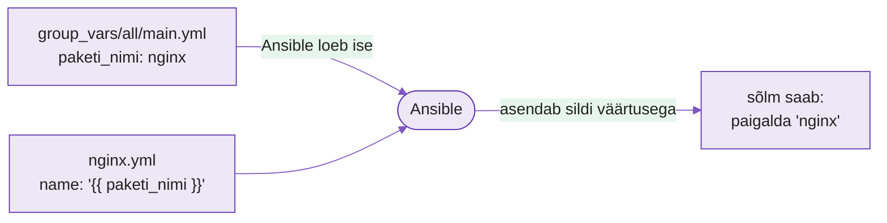
  <figcaption>Joonis 3. Playbookis on ainult silt; väärtus tuleb failist, mida Ansible leiab kausta nime järgi (Talvik, 2026).</figcaption>
</figure>

Just sellepärast on **kausta ja faili nimi** nii tähtis: Ansible ei otsi "kõiki YAML-e", vaid kausta `group_vars/` **inventory kõrvalt**. Vale nimi = fail jääb lugemata, ja viga tuleb alles siis, kui silti vaja on.

Tõsta väärtused playbookist välja. Loo kaust ja fail (`inventory.ini` kõrvale):

```bash
mkdir -p group_vars/all
```

`group_vars/all/main.yml`:

```yaml
paketi_nimi: nginx
omaniku_nimi: Mari Maasikas     # sinu päris nimi
```

Kustuta `vars:` plokk playbookist. Nüüd **tee meelega viga:** nimeta muutuja failis valesti (`pakett_nimi`) **või** pane kaust vale nimega (`vars/all/`). Käivita.

**Viga:** `'paketi_nimi' is undefined`.

??? question "Diagnoosi"
    Ansible otsib `group_vars/`-i **inventory** (või playbooki) kõrvalt, ja kausta `all/` sisu kehtib kõigile hostidele. Nimi peab tähthaaval klappima. Kaks võimalikku põhjust: kumb on sinul?

**Ära arva, küsi Ansible'ilt.** Vaata, mida ta sinu hostile tegelikult näeb:

```bash
ansible-inventory -i inventory.ini --host proxmox1
```

Kas `paketi_nimi` on väljundis? Kui pole, siis Ansible faili **ei lugenud**. See on esimene käsk, mida "undefined variable" puhul jooksutada, kiirem kui failide vahtimine.

**Paranda** ja käivita: `changed=0`. Jooksuta `ansible-inventory` uuesti ja veendu, et muutuja on nüüd olemas.

!!! tip "Miks kaust `all/`, mitte fail `all.yml`?"
    Mõlemad töötavad. Kaust lubab grupil hoida **mitut faili**. Osa 6-s lisad sinna krüpteeritud `vault.yml`. Kui paneksid selle `group_vars/vault.yml`-ks, loeks Ansible seda grupi nimega `vault` muutujateks. Sellist gruppi pole ja saladus ei jõuaks kuhugi.

---

## Osa 4 · Template vs copy: miks `{{ }}` ei asendu

**Dokumentatsioon:** [`ansible.builtin.template`](https://docs.ansible.com/ansible/latest/collections/ansible/builtin/template_module.html)

!!! info "Mis siin toimub?"
    `copy` on nagu faili **manusena saatmine**: sisu jääb muutmata, ka `{{ }}` jääb kirja. `template` on **kirjaliitmine**: Ansible täidab augud väärtustega **kontroll-node'is** (kursusel sinu arvutis) ja saadab sõlme juba valmis teksti. Sõlmes ei ole Jinja2-t vaja.

<figure markdown="span">
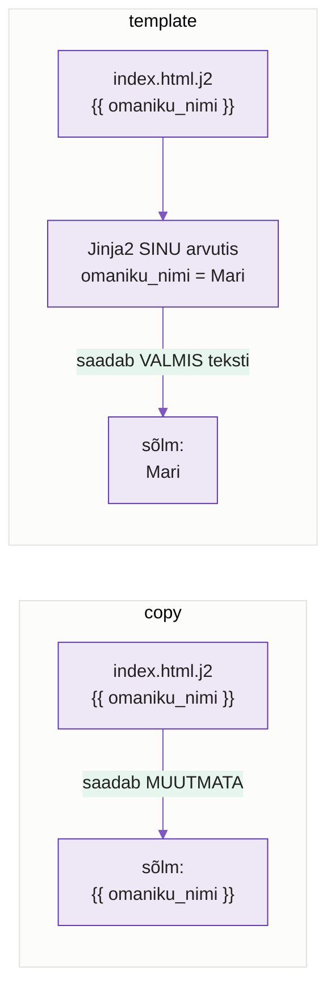
  <figcaption>Joonis 4. Sama mall, kaks moodulit. Ainult `template` täidab augud (Talvik, 2026).</figcaption>
</figure>

N3-s oli `index.html` staatiline. Tee sellest mall `templates/index.html.j2`:

```html
<h1>Ansible töötab: {{ omaniku_nimi }}</h1>
<p>Server: {{ inventory_hostname }}</p>
```

Muuda **ainult** `src` rida, moodul jääb **meelega** `copy`:

```yaml
    - name: Kopeeri index.html
      ansible.builtin.copy:
        src: templates/index.html.j2
        dest: /usr/share/nginx/html/index.html
        mode: '0644'
```

!!! example "Ennusta enne käivitamist"
    Kirjuta paberile või kommentaari: **mis tekst on lehel** pärast käivitust? Mitu task'i on `changed`? Kontrolli oma ennustust alles pärast käivitamist.

```bash
ansible-playbook -i inventory.ini nginx.yml
ssh proxmox1 "curl -s localhost"
```

Lehel on sõna-sõnalt `{{ omaniku_nimi }}`. Kas ennustasid nii?

??? question "Diagnoosi"
    `copy` viib faili **muutmata**. Kes `{{ }}` asendab ja mis moodulis?

**Paranda:** `ansible.builtin.copy` → `ansible.builtin.template`. Käivita ja tee `curl` uuesti: nüüd on lehel su nimi ja `proxmox1`. `inventory_hostname` väärtust sa kuskile ei kirjutanud, see on erimuutuja (N3).

---

## Osa 5 · Handler: laadi nginx uuesti ainult muudatuse korral

Lisa serverile konfiguratsioonifail, mis paneb igale vastusele päise. Mall `templates/hallatud.conf.j2`:

```nginx
add_header X-Hallatud "ansible-{{ inventory_hostname }}";
```

Uus task, **meelega ilma** `notify`-ta:

```yaml
    - name: Nginx lisakonfiguratsioon
      ansible.builtin.template:
        src: templates/hallatud.conf.j2
        dest: /etc/nginx/conf.d/hallatud.conf
        mode: '0644'
```

```bash
ansible-playbook -i inventory.ini nginx.yml
ssh proxmox1 "curl -sI localhost"
```

Task oli `changed`, fail on sõlmes, aga `X-Hallatud` päist vastuses **pole**.

??? question "Diagnoosi"
    Nginx loeb konfiguratsiooni käivitamisel. Fail muutus, teenus sellest ei tea. `service` task ütleb `state: started`, aga ta on juba started, seega ei tee midagi. Mis peab juhtuma pärast config muutust?

**Paranda**: lisa task'ile `notify` ja playbooki lõppu `handlers:` (`tasks:`-iga samal tasemel):

```yaml
      notify: Laadi nginx uuesti

  handlers:
    - name: Laadi nginx uuesti
      ansible.builtin.service:
        name: nginx
        state: reloaded
```

!!! example "Ennusta enne käivitamist"
    Sa lisasid just `notify` ja handleri. Kas päis ilmub sellel käivitusel? Kirjuta ennustus üles.

`notify` ei käivita handlerit tagantjärele: handler läheb järjekorda ainult siis, kui task on **selle käivituse ajal** `changed`.

Käivita. Päist **ikka pole**.

??? question "Diagnoosi: miks ikka mitte?"
    Vaata task'i olekut: `ok`, mitte `changed`. Fail oli juba eelmisest käivitusest paigas. Millal handler käivitub?

**Paranda:** muuda mallis väärtust (nt `"ansible-{{ inventory_hostname }}-v2"`), käivita. Task `changed` → handler käivitub play lõpus → `curl -sI localhost` näitab `X-Hallatud`. Käivita veel kord: task `ok`, handlerit ei kutsuta, nginx jääb rahule.

!!! info "Mis siin toimub?"
    Nginx loeb oma seadistuse **ainult käivitamisel**. Kui muudad faili, jookseb nginx edasi vana seadistusega, kuni keegi ütleb "loe uuesti". `notify` on märge "see fail muutus, nginx tuleb uuesti laadida". **Handler** on see tegevus ise, ja ta käib **ühe korra play lõpus**, ainult siis, kui märge tehti.

<figure markdown="span">
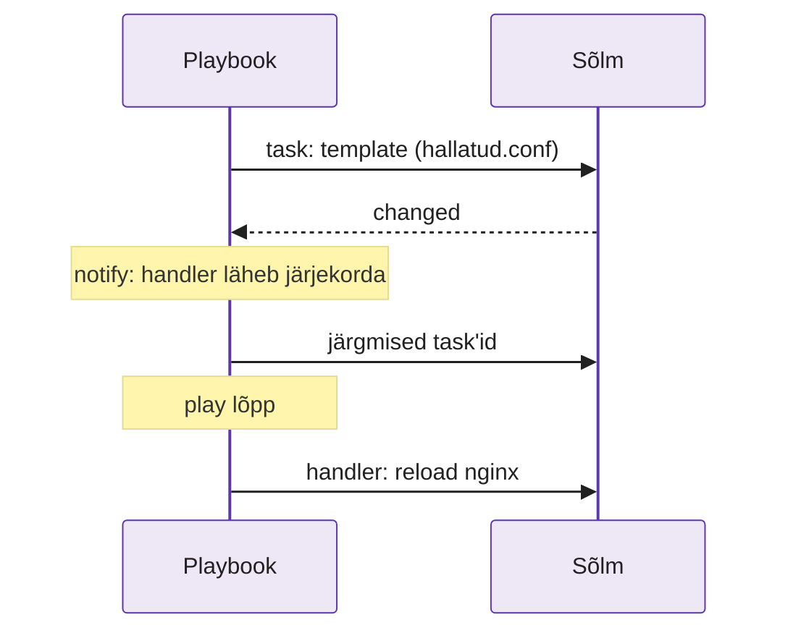
  <figcaption>Joonis 5. Handler ei käi kohe, vaid play lõpus, ja ainult siis, kui teda kutsunud task oli changed (Talvik, 2026).</figcaption>
</figure>

| Olukord | Task | Handler | Päis uueneb? |
|---|---|---|---|
| Fail muutus, play läbis | `changed` | **käib** (play lõpus) | jah |
| Fail oli juba õige | `ok` | ei käi | pole vaja, on juba õige |
| Fail muutus, aga play **katkes** hiljem | `changed` | **ei käi** | **ei** (vt Osa 10) |

*Tabel 4.1. Kolm olukorda handleri käivitumise kohta.*

### Ametlik dokumentatsioon: ära arva

Kui Ansible ütleb `value of state must be one of: ...`, ära otsi vastust ainult sellest praktikumist.

1. Ava [`ansible.builtin.service`](https://docs.ansible.com/ansible/latest/collections/ansible/builtin/service_module.html) dokumentatsioon ja leia parameeter `state`.
2. Kirjuta üles kõik lubatud `state` väärtused.
3. Leia, milline neist sobib nginx-i konfiguratsiooni muutuse rakendamiseks ilma teenust peatamata.
4. Loo fail `logid/dokumendid.txt` ja lisa sinna rida:

```text
Moodul: ansible.builtin.service
URL: https://docs.ansible.com/ansible/latest/collections/ansible/builtin/service_module.html
Parameeter: state
Valik: reloaded
Põhjus: nginx peab pärast konfiguratsiooni muutumist seadistuse uuesti sisse lugema.
```

Selle faili täidad praktikumi jooksul juurde (Osa 11 ja Osa 12). Vaata ka: [Handlers](https://docs.ansible.com/ansible/latest/playbook_guide/playbooks_handlers.html).

---

## Osa 6 · Vault: saladuse krüpteerimine

**Dokumentatsioon:** [Protecting sensitive data with Ansible vault](https://docs.ansible.com/ansible/latest/vault_guide/index.html)

!!! info "Mis siin toimub? Kolm asja, mida ei tohi segamini ajada"
    Vault on nagu **lukustatud kast**. Kastis on saladus. Kast võib olla avalikus kohas (Gitis), sest ilma võtmeta ei saa seda avada. **Võti** on parool, mille sa kohe välja mõtled, see ei tohi Gitti minna. Ja `.vault_pass` on **võtmest tehtud koopia failina**, et sa ei peaks igal korral seda trükkima.

<figure markdown="span">
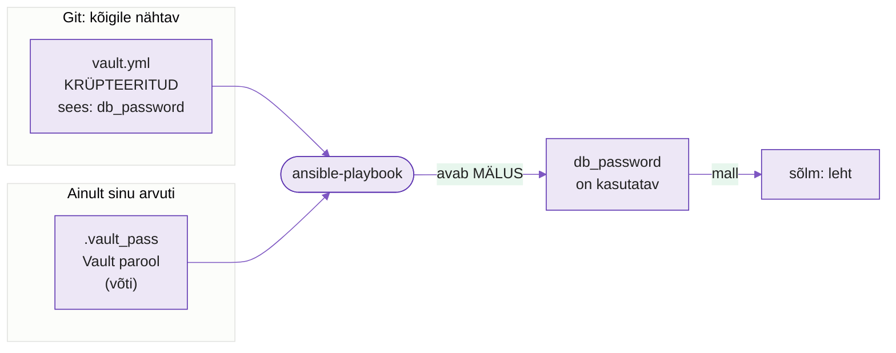
  <figcaption>Joonis 6. Kast Gitis, võti sinu arvutis. Ansible dekrüpteerib Vaulti sisu käivituse ajal mälus. Kui saladus satub mallist tehtud faili, on see sõlmes selge tekstina (Talvik, 2026).</figcaption>
</figure>

| | Mis see on | Kus elab | Gitis? |
|---|---|---|---|
| `db_password` = `SuperSalajane123` | rakenduse saladus | `vault.yml` **sees** | jah, aga krüpteeritult |
| **Vault parool** | võti, mille sa Osa 6-s välja mõtled | sinu peas ja `.vault_pass` | **ei** |
| `.vault_pass` | fail, mille sees on Vault parool | sinu arvuti | **ei** (`.gitignore`) |

*Tabel 4.2. `db_password` ja Vault parool on **kaks eri asja**, neid aetakse tihti segi.*

`ansible-vault` avab redaktori. Vaikimisi on see `vi`. Vali parem:

```bash
export EDITOR=nano        # või: export EDITOR="code --wait"
```

Loo krüpteeritud fail. Ansible küsib **Vault parooli**. Mõtle see välja ja **jäta meelde**:

```bash
ansible-vault create group_vars/all/vault.yml
```

Redaktoris:

```yaml
db_password: SuperSalajane123
```

Salvesta, sulge. Vaata:

```bash
cat group_vars/all/vault.yml
```

`$ANSIBLE_VAULT;1.1;AES256` ja numbrid, mitte su parool. Lisa `index.html.j2` lõppu (parooli ennast lehele ei pane, ainult kontroll, kas muutuja jõudis kohale):

```html
<p>Saladus laetud: {{ db_password is defined }}</p>
```

---

## Osa 7 · No vault secrets: Vault ilma paroolita

Käivita nagu seni:

```bash
ansible-playbook -i inventory.ini nginx.yml
```

**Viga:** `Attempting to decrypt but no vault secrets found`.

??? question "Diagnoosi"
    Ansible leidis `group_vars/all/vault.yml`, aga see on krüpteeritud ja sa ei andnud parooli. Mis lipp käsule puudu?

**Paranda:**

```bash
ansible-playbook -i inventory.ini nginx.yml --ask-vault-pass
ssh proxmox1 "curl -s localhost"
```

Leht näitab `Saladus laetud: True`.

!!! warning
    Vault'il pole "unustasin parooli" nuppu. Vale parooliga tuleb `Decryption failed`; kui õige parool on kadunud, ei saa faili enam avada ja tuleb luua uus.

---

## Osa 8 · Vault parool faili, mitte Gitti

`--ask-vault-pass` iga kord on tüütu ja CI/CD ei saa parooli trükkida. Pane see faili, aga **kõigepealt** `.gitignore`:

```bash
echo ".vault_pass" >> .gitignore
echo "<sinu Vault parool>" > .vault_pass
chmod 600 .vault_pass
git status
```

Kirjuta `.vault_pass`-i **parool, mille Osa 6-s välja mõtlesid** (see, mida Ansible `create` ajal küsis), mitte `SuperSalajane123`, mis on `vault.yml`-i sees olev saladus.

`git status` ei tohi `.vault_pass`-i näidata. Näitab? `.gitignore` rida on vale. Paranda enne edasi minekut.

Küsi Gitilt, **miks** ta faili ignoreerib:

```bash
git check-ignore -v .vault_pass
```

Väljund näitab `.gitignore` faili, rea numbri ja mustri. Kui väljundit pole, ei ignoreeri Git seda faili.

```bash
ansible-playbook -i inventory.ini nginx.yml --vault-password-file .vault_pass
```

Läbib küsimata.

??? question "Mõtle"
    `vault.yml` võib Gitis olla, `.vault_pass` mitte. Miks? Ja kui `.vault_pass` kord commititakse ja siis kustutatakse, kas see on siis turvaline?

Sellest hetkest kasuta kõigis käskudes `--vault-password-file .vault_pass`.

---

## Osa 9 · Kuiv-jooks: ennusta ja kontrolli

**Dokumentatsioon:** [Validating tasks: check mode and diff mode](https://docs.ansible.com/ansible/latest/playbook_guide/playbooks_checkmode.html)

Seni käivitasid ja vaatasid pärast, mis juhtus. Tootmises tahad teada **enne**. Loengust tead `--check --diff`; nüüd kasuta seda.

<figure markdown="span">
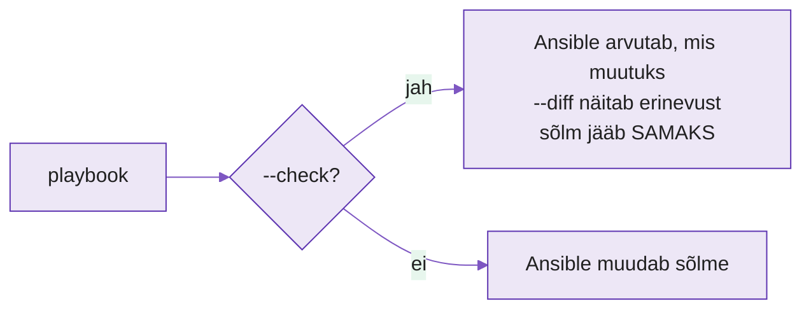
  <figcaption>Joonis 7. `--check` ütleb, mis juhtuks, aga ei muuda midagi; ilma selleta muudab Ansible sõlme päriselt (Talvik, 2026).</figcaption>
</figure>

1. Muuda `group_vars/all/main.yml`-is `omaniku_nimi` väärtust (lisa lõppu ` (test)`).
2. **Ennusta:** mitu task'i on `changed`? Mis rida lehes muutub?
3. Jooksuta **kuiv**:

```bash
ansible-playbook -i inventory.ini nginx.yml --vault-password-file .vault_pass --check --diff
```

4. Võrdle diff'i oma ennustusega. Seejärel veendu, et sõlmes **ei muutunud** midagi:

```bash
ssh proxmox1 "curl -s localhost"
```

5. Muuda nimi tagasi õigeks ja käivita `changed=0` seisuni.

??? question "Mõtle"
    Sa pole veel midagi tootmisse saatnud, aga diff näitas sulle täpselt, mis muutuks. Millal oleks see päästnud sind päris serveril?

!!! warning "Mida Vault **ei** kaitse"
    Proovi: `ansible-inventory -i inventory.ini --host proxmox1 --vault-password-file .vault_pass`. Mida sa näed `db_password` kohal? Mida see tähendab, kui keegi jagab su terminali ekraani või `--diff` väljund läheb CI logisse?

    Kui Vaulti väärtus satub renderdatavasse faili, võib see tulla nähtavale `--diff` väljundis. `no_log: true` piirab task'i väljundit, aga ei kata kõiki kohti; ära jaga sellist väljundit ega saada seda kaitsmata logidesse.

---

## Osa 10 · Katkine play: handler ei käivitu

Loengus (ptk 5, reegel 4) oli väide: *kui play katkeb, jäävad kutsutud handlerid käivitamata.* Uskumise asemel **tee nii**.

!!! info "Mis siin toimub?"
    Kui task ebaõnnestub, **lõpetab Ansible selle sõlme töö ära**, ka ootel olevad handlerid jäävad tegemata. Fail on sõlmes juba uus, aga nginx töötab vana seadistusega. Järgmisel korral on fail "juba õige" (`ok`), seega Ansible ei arva, et midagi tuleks teha. **Viga ei ole enam nähtav, aga probleem on alles.**

<figure markdown="span">
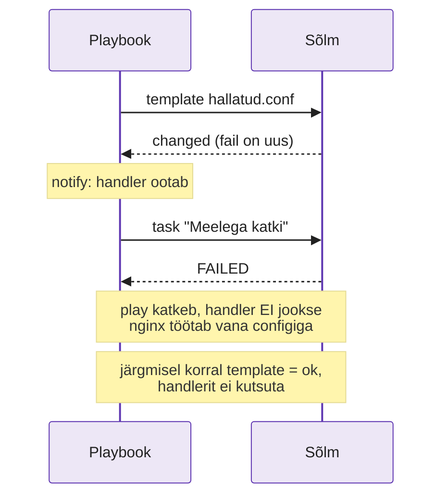
  <figcaption>Joonis 8. Katkine play jätab sõlme poolikusse seisu ja järgmine käivitus seda ei märka (Talvik, 2026).</figcaption>
</figure>

**1. Tee play katki.** Lisa `tasks:` **lõppu** task, mis alati ebaõnnestub:

```yaml
    - name: Meelega katki
      ansible.builtin.command: /bin/false
```

**2. Muuda mallis** `hallatud.conf.j2` väärtust (nt `-v3`) ja **ennusta:** kas päis uueneb? Käivita, siis `curl -sI localhost`.

Play katkes (`failed=1`), template task oli `changed`, aga `RUNNING HANDLER` ridu **pole** ja päis on vana.

**3. Eemalda "Meelega katki" task ja käivita uuesti.** Template on nüüd `ok` (fail on juba sõlmes), seega handlerit **ei kutsuta**. Vaata päist.

??? question "Diagnoosi"
    Päis on **ikka vana**, vigu pole, kõik `ok`. Kus on vana väärtus ja miks Ansible ei tea, et midagi on valesti? Kuidas seda tootmises märgata?

**4. Paranda kahel viisil:**

- **Käsitsi:** `ssh proxmox1 "sudo systemctl reload nginx"`, nüüd on päis õige.
- **Ennetavalt:** pane "Meelega katki" task tagasi, muuda väärtust (`-v4`) ja käivita lipuga `--force-handlers`. Handler jookseb **ka siis**, kui play katkeb. Lipp ei tee katkist task'i edukaks ega kõrvalda vea põhjust: ta käivitab ainult juba järjekorda pandud handlerid.

```bash
ansible-playbook -i inventory.ini nginx.yml --vault-password-file .vault_pass --force-handlers
```

**5. Git-harjutus: võta katkine seis tagasi.** Praegu on playbookis "Meelega katki" task. Ära kustuta seda käsitsi, vaid võta tagasi Gitiga:

```bash
git add -A
git commit -m "Osa 10: meelega katki (katse)"
git revert HEAD --no-edit
git log --oneline
```

`git revert` **ei kustuta** ajalugu. Ta teeb uue commit'i, mis tühistab eelmise, nii et näed ajaloos nii katse kui ka tagasivõtmise. `git restore` seevastu tühistab ainult muudatused, mida sa pole veel commit'inud.

Käivita playbook, kuni `changed=0`.

??? question "Mõtle"
    Millal kasutad `git restore .` ja millal `git revert`? Mis juhtub sinu ajalooga, kui kasutaksid `git reset --hard` ja oleksid juba `push`-inud?

---

## Osa 11 · Iseseisev: lisa teine teenus

**Dokumentatsioon:** [`ansible.builtin.service`](https://docs.ansible.com/ansible/latest/collections/ansible/builtin/service_module.html), [chrony](https://chrony-project.org/documentation.html)

Siiani sa juhendit järgisid. Nüüd **kirjutad ise**. Kasuta sama mustrit, mis nginx-iga: **pakett → mall → teenus → handler**. Ülesanne on lisada sõlmele **chrony** (kellasünkroniseerimine). Kellad peavad klappima: logid, TLS ja ka Vault'i töövood lähevad segi, kui sõlmede aeg jookseb lahku.

!!! info "Mis siin toimub?"
    Sul on mitu serverit ja iga kohta läheb üks rida. Käsitsi kirjutaks need mällu, mall aga **kordab rida ise**. `` on nagu "tee see rida iga nimekirja elemendi kohta". Lisad nimekirja uue serveri, ja config saab uue rea ilma malli muutmata.

<figure markdown="span">
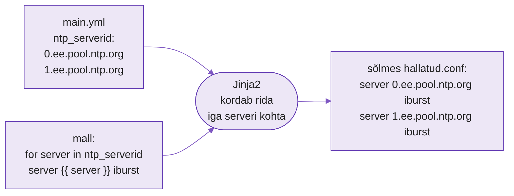
  <figcaption>Joonis 9. Loend + mall = üks rida iga elemendi kohta. Loend muutub, mall mitte (Talvik, 2026).</figcaption>
</figure>

**Nõuded** (oled valmis, kui):

- [ ] `chrony` pakett on paigaldatud ja teenus `chronyd` käib ja on lubatud (`enabled`)
- [ ] NTP serverite loend on **muutuja** `group_vars/all/main.yml`-is (`ntp_serverid`, vähemalt 2 serverit), mitte playbookis
- [ ] Config on **mall** (`templates/chrony-hallatud.conf.j2`), mis kasutab `` tsüklit serverite jaoks ja alustab rida `# {{ ansible_managed }}`
- [ ] Muudatuse korral taaskäivitatakse `chronyd` **handleriga**, mitte igal käivitusel
- [ ] Teine käivitus annab `changed=0`
- [ ] `ssh proxmox1 "chronyc sources"` näitab sinu seadistatud NTP allikaid

**Enne alustamist uuri sõlme** (ära eelda, vaata):

```bash
ssh proxmox1 "systemctl is-active chronyd; grep -n confdir /etc/chrony.conf; ls /etc/chrony.d"
```

Sa kasutad kausta `/etc/chrony.d/`. Kui `confdir` rida puudub, anna õpetajale teada.

!!! warning "Kaks nime"
    Pakett on `chrony`, aga teenus on `chronyd`. Nii on paljude asjadega: pakett ja teenus ei pea sama nime kandma. 

!!! example "Uuri ise: `reloaded` või `restarted`?"
    1. Ava `ansible.builtin.service` dokumentatsioon ja vaata, milliseid `state` väärtusi saad kasutada.
    2. Uuri sõlmes, kas `chronyd` oskab konfiguratsiooni uuesti laadida: `ssh proxmox1 "systemctl show chronyd -p CanReload"`. Kaks eri küsimust: mida oskab **Ansible** küsida ja mida oskab **teenus ise** teha?
    3. Lisa `logid/dokumendid.txt` faili, kumba valid ja miks.

??? tip "Vihje 1: muutuja"
    Loend YAML-is: `ntp_serverid:` ja selle all `- 0.ee.pool.ntp.org`, `- 1.ee.pool.ntp.org`. Mallis: `` … ``.

??? tip "Vihje 2: mall"
    Chrony config rida on `server <nimi> iburst`. Mallis kordub see üks rida iga serveri kohta.

??? tip "Vihje 3: kontroll"
    Kui teed enne teist käivitust midagi muutmata, peab `changed=0` olema. Kui lisad **kolmanda serveri**, peavad muutuma **ainult** mall-task ja handler; nginx task'id jäävad `ok`.

??? success "Näidislahendus: vaata alles pärast oma katset"
    `group_vars/all/main.yml`:

    ```yaml
    ntp_serverid:
      - 0.ee.pool.ntp.org
      - 1.ee.pool.ntp.org
    ```

    `templates/chrony-hallatud.conf.j2`:

    ```jinja
    # {{ ansible_managed }}
    
    server {{ server }} iburst
    
    ```

    `nginx.yml`: lisa `tasks:` alla:

    ```yaml
        - name: Paigalda chrony
          ansible.builtin.package:
            name: chrony
            state: present

        - name: Chrony seadistus
          ansible.builtin.template:
            src: templates/chrony-hallatud.conf.j2
            dest: /etc/chrony.d/hallatud.conf
            mode: '0644'
          notify: Taaskäivita chronyd

        - name: Käivita ja luba chronyd
          ansible.builtin.service:
            name: chronyd
            state: started
            enabled: true
    ```

    ja `handlers:` alla:

    ```yaml
        - name: Taaskäivita chronyd
          ansible.builtin.service:
            name: chronyd
            state: restarted
    ```

**Kontrolli end:** lisa kolmas server `ntp_serverid` loendisse, käivita ja vaata `PLAY RECAP`-i. Muutus ainult see, mis pidi? Seejärel käivita uuesti: `changed=0`.

??? question "Mõtle"
    Sa kirjutasid teise teenuse ja **playbooki struktuur ei muutunud**. Lisandusid ainult task'id, üks mall ja üks muutuja. Mis oleks juhtunud, kui serverite loend oleks olnud otse mallis? Kus siis muudaksid seda kümne sõlme jaoks?

---

## Osa 12 · Paaris: vigade vahetus

Kuni siiani sa tekitasid vigu **ise** ja teadsid, mida oodata. Töös sa ei tea. Nüüd murrab **kaaslane** sinu playbooki ja sina otsid vea üles, ainult veateate ja tööriistade abil.

**Diagnoosi plaan**: kui midagi on valesti, ära hakka juhuslikult muutma. Mine seda puud mööda:

<figure markdown="span">
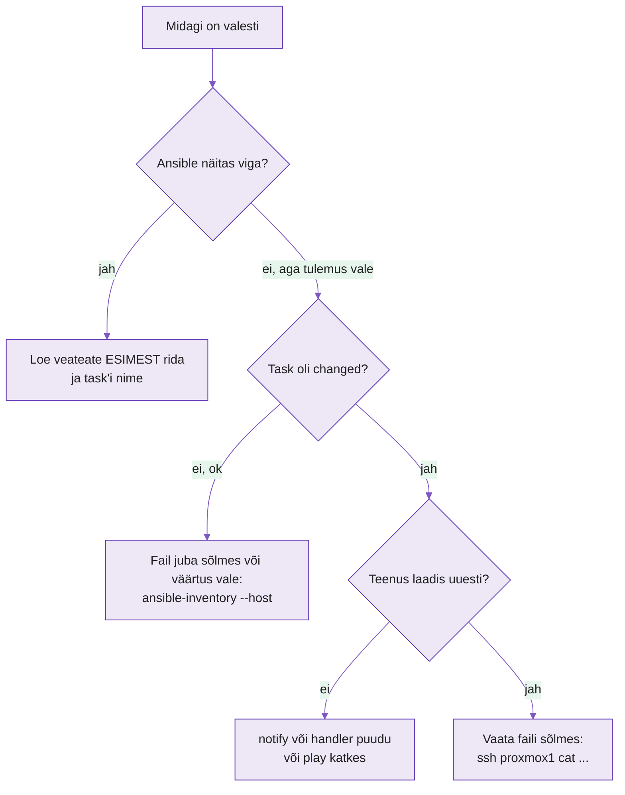
  <figcaption>Joonis 10. Esimene küsimus on alati: kas Ansible ütles midagi? Alles siis vaata, mis task'i olek oli (Talvik, 2026).</figcaption>
</figure>

**Reeglid**

1. **Enne alustamist commit'i** oma töö oma harul `n04-vault` (`git add -A && git commit -m "töötav"`; `.vault_pass` ei lähe commitisse). Nii on sul alati `git restore .`.
2. **Murdja** (kaaslane) valib **ühe** vea allolevast menüüst ja teeb selle sinu arvutis, kui sa ära vaatad. Ta **ei ütle**, mis viga on.
3. **Diagnoosija** (sina) kasutab: veateadet, `--check --diff`, `ansible-inventory --host`, `git diff` (viimasena, alles kui oled ise kindel). **Kolm katset**, siis võib küsida vihjet. Vähemalt ühe vea puhul leia vastus ametlikust dokumentatsioonist ja lisa link faili `logid/dokumendid.txt`.
4. Kui parandatud, vahetage rolle.

??? warning "Vigade menüü: ainult murdjale"
    Igal juhul murdja **muudab enne mallis `hallatud.conf.j2` väärtust** (`-v5`), et task oleks `changed` ja `notify`-vead ilmneksid.

    | # | Mida murda | Mida diagnoosija näeb |
    |---|---|---|
    | 1 | `notify:` nimi kirjaveaga (`Laadi nginx uuseti`) | `The requested handler ... was not found` |
    | 2 | Tõsta `vault.yml` kausta `group_vars/` (`all/` väljast) | `Saladus laetud: False`, viga puudub |
    | 3 | Mallis `{{ omaniku_nimi }}` → `{{ omanik_nimi }}` | `'omanik_nimi' is undefined` |
    | 4 | `dest: /etc/ngnix/conf.d/hallatud.conf` | `Destination directory ... does not exist` |
    | 5 | Handleris `state: reloaded` → `state: reload` | `value of state must be one of: ...`; õige väärtus tuleb leida ametlikust `ansible.builtin.service` dokumentatsioonist |
    | 6 | Eemalda `notify:` täielikult | **Vigu pole**, aga päis ei uuene (vaikne viga) |

!!! tip "Kui päis ikka ei uuene pärast parandust"
    Tea, miks (Osa 10): kui fail jõudis sõlme juba eelmisel katsel, on template nüüd `ok` ja handlerit ei kutsuta. Muuda väärtust uuesti (`-v6`).

**Kui töötad üksi:** vali menüüst kolm viga, kirjuta **enne** ennustus, mis veateade tuleb, tee viga, käivita ja võrdle. Seejärel `git restore .`.

??? question "Arutlege pärast"
    Milline viga oli kõige raskem leida, ja miks? Mis oli **esimene** asi, mida kontrollisite? Mis oleks selle teinud kiiremaks?

Enne edasi minekut käivita `git status`: kõik peab olema puhas (või ainult sinu Osa 11 muudatused). Käivita playbook, kuni `changed=0`.

---

## Osa 13 · Tõendid ja kontroll

<figure markdown="span">
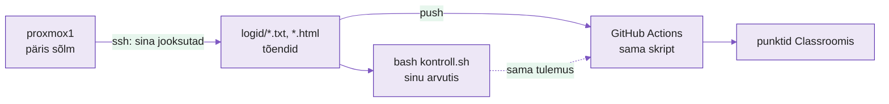
  <figcaption>Joonis 11. GitHub ei pääse sinu sõlmeni, seega tõendid (`logid/`) toodad sinu arvutis sõlme käskudega; kontroll loeb ainult neid faile (Talvik, 2026).</figcaption>
</figure>


Viimane käivitus, midagi muutmata: `changed=0`. Salvesta tõendid:

```bash
mkdir -p logid
ansible-playbook -i inventory.ini nginx.yml --vault-password-file .vault_pass | tee logid/play_recap.txt
ssh proxmox1 "curl -s localhost"  > logid/leht.html
ssh proxmox1 "curl -sI localhost" > logid/pais.txt
ssh proxmox1 "chronyc sources"    > logid/chrony.txt
```

Jooksuta sama kontroll, mis GitHubis:

```bash
bash kontroll.sh
```

Testid 1–6 peavad olema ✅. Test 7 on kodutöö.

---

## Lõppkontroll: oskad ilma juhendita

- [ ] Playbookis pole kõvakodeeritud väärtusi, need on `group_vars/all/main.yml`-is
- [ ] "undefined variable" puhul jooksutad kohe `ansible-inventory --host`
- [ ] Tead, miks mall vajab `template`, mitte `copy`
- [ ] Selgitad, miks handler ei käivitunud, kui task oli `ok`
- [ ] Ennustad enne käivitamist `--check --diff` abil, mis muutub
- [ ] Selgitad, mis juhtub handleriga, kui play katkeb, ja kuidas seda parandada
- [ ] Lisasid ise teise teenuse (pakett + mall + teenus + handler) ilma juhendita
- [ ] Diagnoosisid kaaslase vea ilma tema vihjeta
- [ ] Leiad mooduli parameetri ja lubatud väärtused ametlikust dokumentatsioonist ning oled need kirja pannud (`logid/dokumendid.txt`)
- [ ] `vault.yml` on krüpteeritud, `.vault_pass` on `.gitignore`-is
- [ ] `bash kontroll.sh` testid 1–6 ✅

---

## Lisaülesanded (kui jõuad ette)

1. **Kolm sõlme:** lisa `[web]` alla `proxmox2` ja `proxmox3`. Kas iga leht näitab oma serveri nime?
2. **Saladus diff'is:** tee mall `templates/rakendus.env.j2` (`DB_PASSWORD={{ db_password }}`), pane sõlme `/etc/rakendus.env` (`mode: '0600'`, `owner: root`). Käivita `--check --diff`. **Näed parooli?** Lisa task'ile `no_log: true` ja käivita uuesti. Mis muutus? Miks on see CI logide jaoks oluline?
3. **`backup`:** lisa `backup: true` `hallatud.conf` task'ile, muuda väärtust ja vaata sõlmes `ls /etc/nginx/conf.d/`. Mis faile näed? Miks ei jää varukoopia nginx-i poolt loetavaks?
4. **Filtrid:** kasuta lehel `{{ omaniku_nimi | upper }}` ja `{{ keskkond_nimi | default('LABOR') }}`. Mis juhtub, kui `keskkond_nimi` pole kuskil määratud, kui `default` on ja kui pole?
5. **Parooli vahetus:** `ansible-vault rekey group_vars/all/vault.yml`. Mis juhtub vana `.vault_pass`-iga?
6. **`encrypt_string`:** krüpteeri `db_password` üksik väärtus ja pane `main.yml`-i. Mis on eelis ja puudus võrreldes eraldi `vault.yml`-iga? *(Ära seda esita: `kontroll.sh` test 2 nõuab `db_password:` ainult `vault.yml`-is. Tee eraldi harul.)*

---

## Veaotsing

| Veateade | Põhjus | Lahendus |
|---|---|---|
| `might be an issue with missing quotes` | Väärtus algab `{{`-ga ilma jutumärkideta | `"{{ x }}"` |
| `'x' is undefined` | `group_vars/` vales kohas või nimi ei klapi | `ansible-inventory --host`; kaust `inventory.ini` kõrvale, nimi täpselt |
| Leht näitab `{{ muutuja }}` | `copy`, mitte `template` | `ansible.builtin.template` |
| Config muutus, teenus ei tea | `notify` puudu või task oli `ok` | `notify` + `handlers:`; handler käib ainult `changed` peale |
| Handlerit ei käivitatud, kuigi config muutus | Eelmine käivitus katkes enne handlerit | Käsitsi `reload` või `--force-handlers` |
| `The requested handler ... was not found` | `notify` nimi ≠ handleri `name` | Nimed tähthaaval samaks |
| `value of state must be one of: ...` | Vale `state` väärtus (`reload` ≠ `reloaded`) | Vaata mooduli dokumentatsiooni |
| `Destination directory ... does not exist` | `dest` tee kirjaviga | Kontrolli tee sõlmes (`ssh ... ls`) |
| `no vault secrets found` | Krüpteeritud fail, parooli ei antud | `--ask-vault-pass` / `--vault-password-file` |
| `Decryption failed` | Vale Vault parool | Õige parool; vale parooliga pole taastatav |
| `Saladus laetud: False` | `vault.yml` ei ole `group_vars/all/` all | Tõsta `group_vars/all/vault.yml` |

*Tabel 4.3. Iga rida on viga, mille selles praktikumis ise tekitasid või võid kohata.*

---

## Esitamine

1. Kontrolli, et oled harul `n04-vault` (`git branch --show-current`, Osa 0)
2. Commit: `nginx.yml`, `inventory.ini`, `group_vars/`, `templates/`, `logid/`, `.gitignore`. **Mitte** `.vault_pass`
3. `bash kontroll.sh` → testid 1–6 ✅
4. `git push -u origin n04-vault`, ava **Pull Request** `main` vastu, Actions roheline
5. Kodutöö lisad samasse PR-i ([kodutöö](homework.md)). PR-i link GitHub Projecti.
6. **Git-harjutus: review.** Ava oma paarilise PR, vaata sakki **Files changed** ja kirjuta vähemalt **ühe rea** peale kommentaar (nt "miks siin on `reloaded`, mitte `restarted`?"). Vali lõpus **Approve** või **Request changes**. Sinu PR-il teeb sama teine.

!!! example "Enne PR-i kontrolli"
    ```bash
    git log --oneline
    ```
    Kas iga rida ütleb, mis muutus? Kas on vähemalt 5 mõttekat commit'i? Kui sõnum on `asjad`, ei ole veel hilja: `git rebase -i` on hilisem teema, aga uued commit'id kirjuta korralikult.

---

## Ametlik dokumentatsioon

| Allikas | URL | Miks |
|---|---|---|
| Ansible Variables | <https://docs.ansible.com/ansible/latest/playbook_guide/playbooks_variables.html> | group_vars, precedence |
| Templating (Jinja2) | <https://docs.ansible.com/ansible/latest/playbook_guide/playbooks_templating.html> | `template` |
| `ansible.builtin.template` | <https://docs.ansible.com/ansible/latest/collections/ansible/builtin/template_module.html> | `backup`, `validate` |
| `ansible.builtin.service` | <https://docs.ansible.com/ansible/latest/collections/ansible/builtin/service_module.html> | lubatud `state` väärtused |
| Handlers | <https://docs.ansible.com/ansible/latest/playbook_guide/playbooks_handlers.html> | `notify`, `--force-handlers` |
| Ansible Vault | <https://docs.ansible.com/ansible/latest/vault_guide/index.html> | Vault käsud |
| Check mode ja diff | <https://docs.ansible.com/ansible/latest/playbook_guide/playbooks_checkmode.html> | `--check`, `--diff` |
| chrony | <https://chrony-project.org/documentation.html> | seadistus |

---

*Järgmine: N5, rakenduse pakkimine ja ümberpaigutamine (Docker).*
