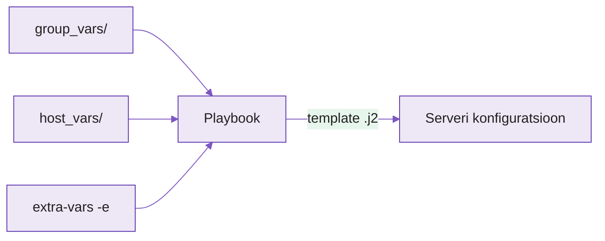

---
tags:
  - Ansible
  - Konfiguratsioonihaldus
  - Turvalisus
---

# Loeng — Dünaamiline konfiguratsioon ja saladuste kaitse

**Kestus:** ~40 minutit
**Tase:** Algaste — eeldame et kirjutasid eelmisel nädalal esimese Ansible playbooki

---

!!! abstract "Õpiväljundid"
    Pärast loengut oskad:

    - selgitada miks kõvakodeeritud väärtused (IP-d, paroolid) playbookis on probleem
    - kirjeldada Ansible muutujate tüüpe (`host_vars`, `group_vars`, extra-vars)
    - kirjutada Jinja2 mallina konfiguratsioonifaili
    - kaitsta tundlikud andmed Ansible Vault'iga
    - põhjendada miks Vault'i parool ei tohi olla Git-is

---

## 1. Probleem: kõvakodeeritud väärtused

Eelmisel nädalal kirjutasid playbooki, mis paigaldas nginx'i ja kopeeris konfiguratsioonifaili otse serverisse:

```yaml
- name: Kopeeri nginx konfiguratsioon
  copy:
    src: nginx.conf
    dest: /etc/nginx/nginx.conf
```

See töötab, kuni midagi muutub. Ja midagi muutub alati. Server saab uue IP. Sama playbook peab tööle hakkama testkeskkonnas (`test.example.ee`) ja tootmises (`example.ee`). Andmebaasi parool testis ei tohi olla sama mis tootmises.

Kui domeen või parool on otse YAML-failis, on kaks halba varianti: kas kirjutad iga keskkonna jaoks eraldi playbooki ja hoiad neid käsitsi sünkroonis, või muudad sama faili enne igat käivitust. Mõlemad tähendavad, et varem või hiljem unustad midagi muuta ja saadad vale konfiguratsiooni valesse kohta.

Ansible lahendab selle muutujatega: playbook jääb üheks failiks, väärtused tulevad väljastpoolt.

<figure markdown="span">

  <figcaption>Joonis 4.1. Väärtused tulevad väljastpoolt; extra-vars kaalub üles kõik muu (Talvik, 2025).</figcaption>
</figure>

---

## 2. Muutujad — kust Ansible neid otsib

Ansible otsib muutujaid mitmest kohast, kindlas prioriteedis. Kolm, mida praegu vaja:

**`group_vars/`** — muutujad tervele grupile. Kui inventory's on grupp `webservers`, loeb Ansible automaatselt failist `group_vars/webservers.yml`.

**`host_vars/`** — muutujad ühele konkreetsele serverile. `host_vars/server01.yml` kehtib ainult `server01`-le, isegi kui see kuulub `webservers` gruppi.

**Extra-vars käsurealt** — antakse käivitamise hetkel, kaalub üles kõik muu:

```bash
ansible-playbook -i inventory.ini site.yml -e "domain_name=test.example.ee"
```

Tüüpiline kausta struktuur:

```
projekt/
├── inventory.ini
├── site.yml
├── group_vars/
│   ├── webservers.yml
│   └── databases.yml
└── host_vars/
    └── server01.yml
```

Ja `group_vars/webservers.yml` on lihtne YAML:

```yaml
domain_name: example.ee
nginx_port: 80
```

Playbook ise ei tea ega hooli kust väärtus tuli — ta kasutab lihtsalt muutuja nime.

---

## 3. Jinja2 mallid

Kui konfiguratsioonifail peab sisaldama muutuvaid väärtusi, ei kopeerita seda enam `copy` mooduliga — kasutatakse `template` moodulit koos Jinja2 malliga.

Fail `nginx.conf.j2` näeb peaaegu samasugune välja nagu tavaline `nginx.conf`, ainult muutuvad kohad on `{{ }}` sulgudes:

```nginx
server {
    listen {{ nginx_port }};
    server_name {{ domain_name }};

    location / {
        proxy_pass http://127.0.0.1:5000;
    }
}
```

Playbookis kasutatakse `copy` asemel `template`:

```yaml
- name: Genereeri nginx konfiguratsioon
  template:
    src: nginx.conf.j2
    dest: /etc/nginx/sites-available/app.conf
  notify: Taaskäivita nginx
```

Ansible asendab käivitamise hetkel `{{ domain_name }}` väärtusega, mis tuli `group_vars`-ist, `host_vars`-ist või extra-vars'ist. Sama mall, erinevad väärtused, erinev tulemus igal serveril.

`{{ }}` süntaks pole Ansible-spetsiifiline — see on Jinja2, Pythoni mallimootor, mida kasutatakse ka mujal. Ansible lubab sees ka lihtsat loogikat (``, ``), aga konfiguratsioonifailide puhul piisab enamasti muutuja asendamisest.

---

## 4. Ansible Vault

Muutujad lahendavad domeeni ja pordi hästi. Aga mis siis, kui väärtus on andmebaasi parool või API võti? Neid ei saa panna tavalisse `group_vars/webservers.yml` faili — see läheb Git-i, ja Git-i ajalugu on nähtav kõigile, kellel on repole ligipääs.

**Ansible Vault** krüpteerib faili sisu. Krüpteeritud faili võib vabalt Git-i panna — ilma paroolita ei loe seda keegi.

```bash
# krüpteeri olemasolev muutujate fail
ansible-vault encrypt group_vars/webservers/vault.yml

# vaata või muuda krüpteeritud faili sisu
ansible-vault edit group_vars/webservers/vault.yml

# dekrüpteeri (nt migreerimiseks)
ansible-vault decrypt group_vars/webservers/vault.yml
```

Krüpteeritud fail näeb Git'is välja umbes nii:

```
$ANSIBLE_VAULT;1.1;AES256
66386439653236336462626566653063336164663966303231363934653561363364616138...
```

Käivitamisel küsib Ansible Vault'i parooli:

```bash
ansible-playbook -i inventory.ini site.yml --ask-vault-pass
```

Ansible dekrüpteerib faili mällu ajutiselt ja kasutab muutujaid täpselt samamoodi nagu tavalisi — playbookis pole vahet, kas muutuja tuli krüpteeritud failist või mitte.

---

## 5. Miks tööl oluline

Deploy-skripte kirjutav arendaja ei saa kunagi panna andmebaasi parooli otse GitHubi — ka mitte privaatsesse repositooriumisse. Iga inimene, kellel on kunagi olnud ligipääs repole, näeb Git-i ajaloost parooli, isegi kui see hiljem failist eemaldati.

Vault muudab reegli konkreetseks tööriistaks: saladus on Git-is olemas, aga krüpteeritud kujul. Konfiguratsioon ja saladused liiguvad koos, versioonihalduses, ülejäänud infrastruktuuri koodiga — ilma et keegi näeks selget teksti.

Vault'i enda parool ei tohi muidugi ka Git-is olla — see hoitakse eraldi: keskkonnamuutujana arendaja masinas või CI/CD süsteemi secrets-hoidlas (nt GitHub Actions secrets). Nii jääb ahel terveks: kood on avalik, konfiguratsioon on Git-is, saladused on krüpteeritud, ja ainult Vault'i parooli omanik saab need lahti võtta.

---

## Kokkuvõte

- **Kõvakodeeritud väärtus** playbookis töötab ühes keskkonnas ja katkeb teises
- **`group_vars/` ja `host_vars/`** annavad väärtused grupile või serverile; extra-vars kaalub kõik üles
- **Jinja2 mall (`.j2`)** asendab `{{ muutuja }}` kohad — `template` mooduliga, mitte `copy`-ga
- **Ansible Vault krüpteerib faili sisu** — krüpteeritud fail võib olla Git-is, selge tekstiga saladus mitte kunagi
- **`ansible-vault encrypt/edit/decrypt`** + `--ask-vault-pass` käivitamisel
- **Vault'i parool ise ei tohi olla Git-is** — keskkonnamuutujast või CI/CD secrets-hoidlast

---

## Allikad

| Allikas | URL |
|---|---|
| Ansible Vault | <https://docs.ansible.com/ansible/latest/vault_guide/index.html> |
| Muutujate precedence | <https://docs.ansible.com/ansible/latest/playbook_guide/playbooks_variables.html> |
| Jinja2 | <https://jinja.palletsprojects.com/> |
| template moodul | <https://docs.ansible.com/ansible/latest/collections/ansible/builtin/template_module.html> |

---

*Järgmine: Praktikumis lisad oma nginx playbookile muutujad ja Vault'iga kaitstud saladuse.*
