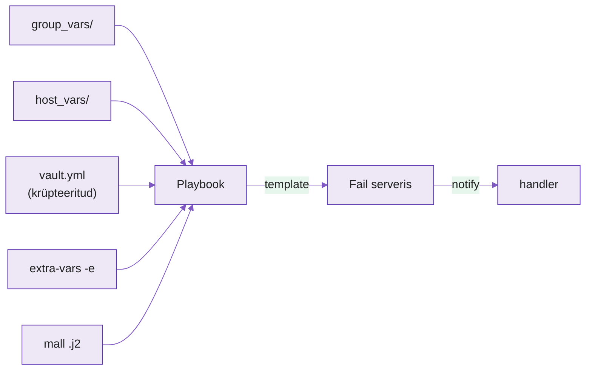
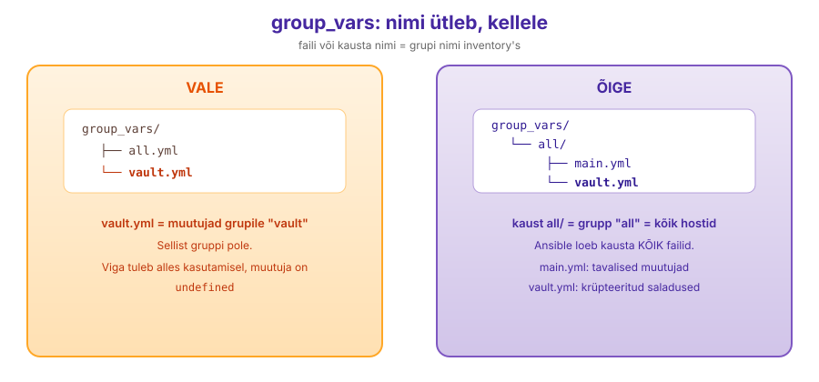
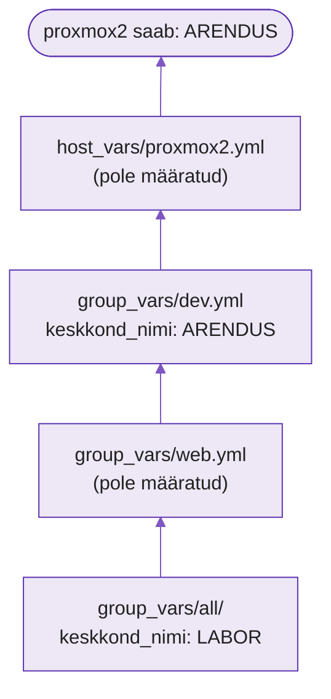
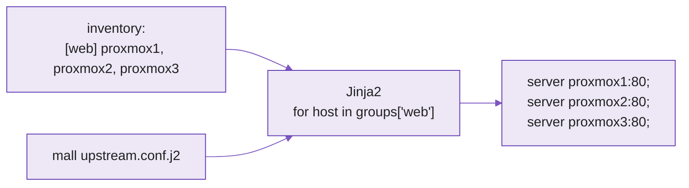
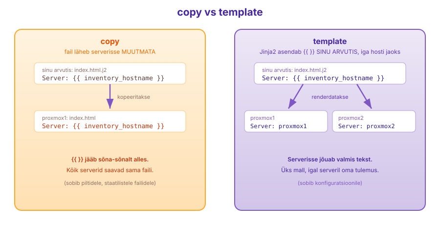
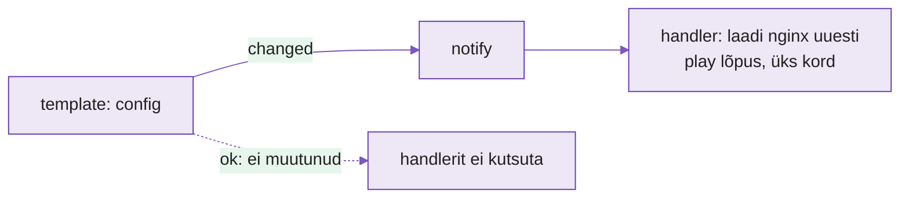
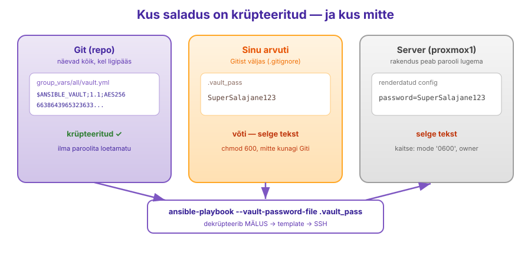

---
tags:
  - Ansible
  - Konfiguratsioonihaldus
  - Jinja2
  - Turvalisus
---

# Loeng: Dünaamiline konfiguratsioon ja saladuste kaitse

**Maht:** ~40 min iseseisvat lugemist, loe **enne** praktikumit
**Tase:** Algaste, eeldame, et N3 praktikum on tehtud (`nginx.yml` töötab) ja N3 muutujate peatükk (ptk 9) on loetud

See leht on mõeldud iseseisvaks lugemiseks ja praktikumi ajal spikriks. Tunnis läbime põhiosa kiiremini.

**Praktikumiks on vaja**: peatükid 1–5 ja 7.1–7.4 (välisfailid, mall, `template`, handler, Vault fail + parool). Ülejäänu (filtrite tabel, `encrypt_string`, vault ID-d, `no_log`) on lugemismaterjal: loe läbi, aga peast pole vaja teada.

---

!!! abstract "Õpiväljundid"
    Pärast seda materjali oskad:

    - selgitada, miks kõvakodeeritud väärtused playbookis on probleem
    - tõsta muutujad välisfailidesse (`group_vars`, `host_vars`) ja leida, kust väärtus tuli
    - lugeda ja kirjutada Jinja2 malli: `{{ }}`, filtrid, ``, ``
    - eristada `template` ja `copy` moodulit ning kasutada `validate`, `backup` ja `--diff`
    - selgitada, millal handler käivitub ja millal mitte
    - krüpteerida faili või üksiku väärtuse Ansible Vault'iga ja anda parool käivitamisel
    - põhjendada, mis tohib olla Gitis ja mis mitte

---

!!! info "Lisalugemine: teistsugune sissejuhatus"
    Kui tahad sama teemat teise nurga alt, vaata ka:

    - [How to Keep Your Playbooks Secure Using Ansible Vault (Spacelift)](https://dev.to/spacelift/how-to-keep-your-playbooks-secure-using-ansible-vault-3103), inglisekeelne Vault'i ülevaade: failid, üksikud muutujad, paroolide haldus
    - [Templating (Jinja2), Ansible docs](https://docs.ansible.com/ansible/latest/playbook_guide/playbooks_templating.html), ametlik juhend, filtrid ja testid
    - [Jinja2 Template Designer](https://jinja.palletsprojects.com/en/stable/templates/), Jinja2 süntaks täismahus

---

## 1. Probleem: kõvakodeeritud väärtused

N3 praktikumis paigaldas su playbook nginx-i ja kopeeris staatilise `index.html`-i:

```yaml
    - name: Kopeeri index.html
      ansible.builtin.copy:
        src: index.html
        dest: /usr/share/nginx/html/index.html
```

See töötab ühe serveri jaoks. Aga sul on kolm sõlme, ja päris elus on sama playbook vaja jooksutada nii testis kui tootmises. Kohe tekivad küsimused: kuidas saab iga server oma nime lehele? Kuidas on testis debug-info nähtav ja tootmises mitte? Kuhu panna andmebaasi parool, mis testis ja tootmises on erinev?

Kui väärtused on otse YAML-failis, on kaks halba varianti: kirjutad iga keskkonna jaoks eraldi playbooki ja hoiad neid käsitsi sünkroonis, või muudad sama faili enne igat käivitust. Mõlemal juhul unustad varem või hiljem midagi ja saadad vale konfiguratsiooni valesse kohta.

N4 lahendus koosneb kolmest osast:

1. **muutujad eraldi failidesse**: `group_vars/` ja `host_vars/` (ptk 2)
2. **failid mallideks**: Jinja2 mall + `template` moodul (ptk 3–4)
3. **saladused krüpteeritult**: Ansible Vault (ptk 6–7)

Ja üks lisa, mis kuulub konfiguratsioonifailide juurde: **handler**, mis taaskäivitab teenuse ainult siis, kui config muutus (ptk 5).

<figure markdown="span">

```mermaid
%%{init: {'theme':'base','themeVariables':{'primaryColor':'#ede7f6','primaryBorderColor':'#5e35b1','primaryTextColor':'#212121','lineColor':'#7e57c2'}}}%%
graph LR
    A[group_vars/] --> P[Playbook]
    B[host_vars/] --> P
    V["vault.yml<br/>(krüpteeritud)"] --> P
    C[extra-vars -e] --> P
    M["mall .j2"] --> P
    P -->|template| S[Fail serveris]
    S -->|notify| H[handler]
```
  <figcaption>Joonis 4.1. Playbook jääb samaks; väärtused, saladused ja mallid tulevad väljastpoolt (Talvik, 2026).</figcaption>
</figure>

---

## 2. Muutujad välisfailidesse: group_vars ja host_vars

Muutujate alused käisid läbi N3-s: tüübid, inline `vars:`, `{{ }}`, prioriteet, ulatus, erimuutujad ja faktid. Kui need on ähmased, loe [N3 ptk 9](../week03/lecture.md) enne edasiminekut üle.

Inline `vars:` töötab, aga kui väärtus erineb keskkonniti, pead redigeerima playbooki ennast, ja just seda tahame vältida. Parem on väärtused tõsta eraldi failidesse, mida Ansible loeb **automaatselt**, ilma et playbookis neile viidataks.[^vars]

### Kaks kausta, kaks tasandit

**`group_vars/<grupp>.yml`**: muutujad tervele grupile. Kui inventory's on grupp `web`, loeb Ansible faili `group_vars/web.yml`. Eriline grupp on **`all`**, sinna kuuluvad kõik hostid, seega `group_vars/all.yml` kehtib kõigile.

**`host_vars/<host>.yml`**: muutujad ühele serverile. `host_vars/proxmox1.yml` kehtib ainult `proxmox1`-le. Faili nimi peab tähthaaval klappima hosti nimega inventory's.

Ansible otsib neid kaustu kahest kohast: **inventory faili kõrvalt** ja **playbooki kõrvalt**. Meie kursusel on mõlemad samas kaustas, nii et piisab, kui `group_vars/` on `inventory.ini` kõrval.

### Fail või kaust

Grupi muutujad võivad olla kas üks fail või kaust mitme failiga:

```text
group_vars/
├── web.yml              # variant 1: üks fail
└── all/                 # variant 2: kaust, Ansible loeb kõik failid selle seest
    ├── main.yml
    └── vault.yml
```

Kaust on vajalik siis, kui tahad hoida tavalised muutujad ja krüpteeritud saladused eraldi failides (ptk 7). Failide nimed kausta sees võivad olla suvalised, oluline on **kausta** nimi, mis peab klappima grupi nimega.

<figure markdown="span">
  
  <figcaption>Joonis 4.2. Faili või kausta nimi `group_vars/` all on grupi nimi. `vault.yml` otse seal oleks muutujad grupile `vault`, mida pole olemas (Talvik, 2026).</figcaption>
</figure>

!!! warning "Levinud viga"
    `group_vars/vault.yml` **ei** tähenda "saladused kõigile". See tähendab "muutujad grupile nimega `vault`". Sellist gruppi pole, ja muutujad ei jõua kuhugi. Faili laadimisel viga ei tule; viga (`'x' is undefined`) tuleb alles siis, kui muutujat kasutatakse. Õige: `group_vars/all/vault.yml`.

### Näide meie kolme sõlmega

```ini
[web]
proxmox1

[dev]
proxmox2

[prod]
proxmox3

[web:children]
dev
prod
```

```text
projekt/
├── inventory.ini
├── nginx.yml
├── group_vars/
│   ├── all/
│   │   └── main.yml         # keskkond_nimi: LABOR
│   ├── dev.yml              # keskkond_nimi: ARENDUS
│   └── prod.yml             # keskkond_nimi: PRODUKTSIOON
└── host_vars/
    └── proxmox3.yml         # nginx_port: 8008
```

`proxmox2` kuulub gruppidesse `all`, `web` ja `dev`. Kõik kolm faili loetakse, ja kui sama muutuja on mitmes, võidab **spetsiifilisem**: laps-grupp (`dev`) võidab vanem-grupi (`web`), mis võidab `all`-i. `host_vars` võidab kõik grupid. See on sama prioriteedireegel, mida nägid N3-s, aga nüüd failidena.

<figure markdown="span">

```mermaid
%%{init: {'theme':'base','themeVariables':{'primaryColor':'#ede7f6','primaryBorderColor':'#5e35b1','primaryTextColor':'#212121','lineColor':'#7e57c2'}}}%%
graph BT
    A["group_vars/all/<br/>keskkond_nimi: LABOR"] --> W["group_vars/web.yml<br/>(pole määratud)"]
    W --> D["group_vars/dev.yml<br/>keskkond_nimi: ARENDUS"]
    D --> H["host_vars/proxmox2.yml<br/>(pole määratud)"]
    H --> R(["proxmox2 saab: ARENDUS"])
```
  <figcaption>Joonis 4.3. Väärtus liigub üldisest spetsiifilisemani; viimane, kes muutuja määras, võidab (Talvik, 2026).</figcaption>
</figure>

### Extra-vars käsurealt

Käivitamise hetkel antud väärtus kaalub üles kõik failid:

```bash
ansible-playbook -i inventory.ini nginx.yml -e "keskkond_nimi=DEMO"
ansible-playbook -i inventory.ini nginx.yml -e @demo.yml     # väärtused failist
```

Extra-vars on hea ühekordseks testiks. Püsiv väärtus kuulub faili, muidu peab keegi järgmine kord mäletama, mis lipu sa käsule lisasid.

### Kust väärtus tuli?

Kui muutujal on vale väärtus, ära arva, küsi Ansible'ilt:

```bash
ansible-inventory -i inventory.ini --host proxmox2      # kõik proxmox2 muutujad kokku
ansible-inventory -i inventory.ini --graph --vars       # grupid, hostid ja nende muutujad puuna
```

Esimene näitab lõplikku väärtust pärast kõigi failide liitmist. Kui seal on `LABOR`, aga ootasid `ARENDUS`, pole `dev.yml` loetud (vale nimi, vale koht või host pole grupis).

---

## 3. Jinja2: mallimootor

`{{ }}` süntaks, mida N3-s kasutasid, ei ole Ansible'i leiutis. See on **Jinja2**, Pythoni mallimootor, mida kasutavad ka veebiraamistikud (nt Flask) HTML-lehtede genereerimiseks. Ansible kasutab Jinja2 igal pool, kus näed `{{ }}`: playbookis, inventory's, muutujate failides ja mallides.[^templating]

Mall on tavaline tekstifail, milles mõned kohad on märgitud. Jinja2 loeb malli, asendab märgitud kohad ja annab välja valmis teksti. Märgistusi on kolm:

| Süntaks | Mis see on | Näide |
|---|---|---|
| `{{ ... }}` | **avaldis**: asendatakse väärtusega | `{{ inventory_hostname }}` |
| `` | **lause**: loogika (tingimus, tsükkel), ise väljundisse ei jõua | `` |
| `{# ... #}` | **kommentaar**: ei jõua väljundisse | `{# see on märkus #}` |

*Tabel 4.1. Jinja2 kolm märgistust.*

### 3.1 Avaldis `{{ }}`

Lihtsaim juhtum on muutuja nimi:

```jinja
<h1>Server: {{ inventory_hostname }}</h1>
```

Sõnastiku või loendi sisse pääsed sama moodi nagu N3-s: `{{ ansible_facts['distribution'] }}`, `{{ pordid[0] }}`. Avaldises võib olla ka lihtne arvutus või tekstide liitmine: `{{ nginx_port + 1 }}`, `{{ 'www.' + domeen }}`.

### 3.2 Filtrid: väärtuse töötlemine

Filter muudab väärtust enne väljastamist. Filter kirjutatakse püstkriipsuga `|` muutuja järele, nagu Linuxi toru: väärtus liigub vasakult paremale:

```jinja
{{ omaniku_nimi | upper }}                 {# MARI MAASIKAS #}
{{ keskkond_nimi | default('LABOR') }}     {# LABOR, kui muutuja puudub #}
{{ domeen | replace('.ee', '.com') }}
```

Filtreid saab ahelasse panna: `{{ nimi | lower | replace(' ', '-') }}` teeb `Mari Maasikas` → `mari-maasikas`.

Kasulikumad filtrid algajale:

| Filter | Mida teeb | Näide → tulemus |
|---|---|---|
| `upper`, `lower`, `title` | suurtähed / väiketähed / iga sõna suure tähega | `'mari' \| title` → `Mari` |
| `replace(a, b)` | asendab teksti | `'test.ee' \| replace('test.', '')` → `ee` |
| `default(x)` | varuväärtus, kui muutuja puudub | `port \| default(80)` → `80` |
| `length` | pikkus / elementide arv | `[1,2,3] \| length` → `3` |
| `join(', ')` | loend tekstiks | `['a','b'] \| join(', ')` → `a, b` |
| `min`, `max` | väikseim / suurim | `[3,1,2] \| max` → `3` |
| `unique` | eemaldab kordused | `[1,1,2] \| unique` → `[1, 2]` |
| `union`, `intersect`, `difference` | loendite hulgatehted | `[1,2] \| union([2,3])` → `[1, 2, 3]` |
| `basename`, `dirname` | failitee osad | `'/etc/nginx/nginx.conf' \| basename` → `nginx.conf` |
| `int`, `bool` | tüübiteisendus | `'8080' \| int` → `8080` |

*Tabel 4.2. Filtrid, mida kohtad kõige sagedamini. Täisnimekiri on Ansible'i ja Jinja2 dokumentatsioonis.*[^filters]

`default` on levinud filter. Ilma selleta katkeb playbook, kui muutuja puudub (`'x' is undefined`). `default` teeb muutuja valikuliseks: kui keegi on väärtuse määranud, kasutatakse seda; kui mitte, varuväärtust. Tühja teksti või `false` väärtuse puhul `default(x)` varuväärtust **ei** kasuta; selleks on `default(x, true)`. See on hea vaikeväärtuste jaoks, aga **mitte** saladuste jaoks: kui parool puudub, peab playbook katkema, mitte vaikselt `default('admin')` kasutama.

### 3.3 Tingimus ``

Mallis saab osa teksti välja jätta või lisada tingimuse järgi:

```jinja
<p>Keskkond: {{ keskkond_nimi }}</p>

<p>Debug: {{ inventory_hostname }}, {{ ansible_facts['distribution'] }}</p>

```

Võrdlused ja mitu haru:

```jinja

error_log /var/log/nginx/error.log warn;

error_log /var/log/nginx/error.log debug;

error_log /var/log/nginx/error.log error;

```

Iga `` vajab oma ``. Kui see puudub, tuleb viga `Unexpected end of template`.

Kasulik test: `is defined` kontrollib, kas muutuja üldse olemas on. Seda kasutad praktikumis, et kontrollida, kas Vault'i muutuja jõudis kohale, ilma parooli ennast lehele panemata:

```jinja
<p>Saladus laetud: {{ db_password is defined }}</p>
```

### 3.4 Tsükkel ``

N3-s nägid `loop`-i, mis kordab **task'i**. Mallis on oma tsükkel ``, mis kordab **ridu ühe faili sees**:

```jinja
<ul>

  <li>{{ loop.index }}. {{ teenus }}</li>

</ul>
```

Kui `teenused: [nginx, sshd, firewalld]`, tuleb välja kolm `<li>` rida. `loop.index` on jooksev number alates 1-st; `loop.first` ja `loop.last` ütlevad, kas oled esimese või viimase elemendi juures.

Tsükkel koos erimuutujatega (N3 ptk 9) on koht, kus mallid muutuvad päriselt kasulikuks. Näiteks nginx-i koormusjaotur, mis peab teadma kõiki veebiservereid:

```jinja
upstream veebiserverid {

    server {{ host }}:80;

}
```

Lisad inventory `[web]` gruppi neljanda serveri ja järgmisel käivitusel on see konfiguratsioonis ise. Keegi ei pea faili käsitsi muutma.

<figure markdown="span">

```mermaid
%%{init: {'theme':'base','themeVariables':{'primaryColor':'#ede7f6','primaryBorderColor':'#5e35b1','primaryTextColor':'#212121','lineColor':'#7e57c2'}}}%%
graph LR
    I["inventory:<br/>[web] proxmox1, proxmox2, proxmox3"] --> J["Jinja2<br/>for host in groups['web']"]
    T["mall upstream.conf.j2"] --> J
    J --> O["server proxmox1:80;<br/>server proxmox2:80;<br/>server proxmox3:80;"]
```
  <figcaption>Joonis 4.4. Mall + muutujad → valmis fail. Inventory muutub, mall mitte (Talvik, 2026).</figcaption>
</figure>

### 3.5 `loop` vs ``: kumba kasutada

| | `loop` (playbookis) | `` (mallis) |
|---|---|---|
| Mida kordab | task'i | ridu failis |
| Tulemus | mitu toimingut serveris | üks fail mitme reaga |
| Näide | paigalda 3 paketti | 3 `server` rida ühes configis |

*Tabel 4.3. Kui tahad üht faili, kasuta malli tsüklit; kui tahad mitut toimingut, kasuta `loop`-i.*

### 3.6 Tühjad read mallides

`` read ise väljundisse ei jõua, aga reavahetus nende järel võib jõuda. Ansible'i `template` moodulil on `trim_blocks` vaikimisi sees: reavahetus pärast `` lauset eemaldatakse, nii et ülaltoodud näidetes lisatühje ridu ei teki. Kui näed väljundis siiski ootamatuid tühikuid, saab lause äärtest tühimärgid ära võtta miinusmärgiga: ``. Konfiguratsioonifailide puhul pole see tavaliselt oluline; YAML-i või Pythoni failide genereerimisel võib olla.

### 3.7 Jinja2 playbookis vs mallis

Sama mootor, kaks kohta. **Playbookis** kasutad peaaegu alati ainult `{{ }}`, ja kui väärtus algab sellega, peab see olema jutumärkides (`name: "{{ paketi_nimi }}"`), sest YAML loeb `{` sõnastiku algusena. **Mallis** (`.j2` fail) jutumärke vaja pole, sest see pole YAML, ja seal kasutad ka `` loogikat. Reegel: loogika kuulub malli, mitte playbooki. Kui playbook täitub `` plokkidega, on see märk, et midagi peaks olema mallis või muutujate failis.

---

## 4. `template` moodul

Mall jõuab serverisse `template` mooduliga. Välimuselt on see nagu `copy`:[^template]

```yaml
    - name: Pane leht üles
      ansible.builtin.template:
        src: index.html.j2
        dest: /usr/share/nginx/html/index.html
        owner: root
        group: root
        mode: '0644'
```

Vahe on selles, **kus** töö tehakse ja **mida** saadetakse:

| | `copy` | `template` |
|---|---|---|
| Fail | saadetakse muutmata | Jinja2 töötleb **kontroll-node'is** |
| `{{ }}` failis | jääb sõna-sõnalt | asendatakse väärtusega |
| Sobib | pildid, staatilised failid, skriptid | konfiguratsioon, mis sõltub hostist või keskkonnast |
| Faili lõpp | suvaline | tavaks `.j2` |

*Tabel 4.4. Kui failis on `{{ }}`, on vaja `template`-it.*

<figure markdown="span">
  
  <figcaption>Joonis 4.5. `copy` saadab malli muutmata, `{{ }}` jääb lehele. `template` renderdab malli sinu arvutis iga hosti muutujatega (Talvik, 2026).</figcaption>
</figure>

Mall renderdatakse **kontroll-node'is** (kursusel sinu arvutis), iga hosti jaoks eraldi, tolle hosti muutujatega. Serverisse jõuab juba valmis tekst ja serveris pole Jinja2-t vaja. `template` on idempotentne samamoodi nagu `copy`: kui renderdatud tulemus on sama mis serveris olev fail, on olek `ok` ja midagi ei kirjutata.

### Kus Ansible malli otsib

`template` otsib `src` faili kõigepealt playbooki kõrval olevast kaustast **`templates/`**. Seega kui fail on `templates/index.html.j2`, töötavad mõlemad: `src: index.html.j2` ja `src: templates/index.html.j2`. N11-s näed, et rollidel on samuti oma `templates/` kaust.

### Kolm kasulikku parameetrit

**`backup: true`**: enne ülekirjutamist teeb serverisse vanast failist ajatempliga koopia. Kui uus config ei tööta, on vana käepärast.

**`validate`**: kontrollib renderdatud faili **enne**, kui see oma kohale pannakse. `%s` asendatakse ajutise faili teega. Kui kontroll ebaõnnestub, jääb vana fail puutumata ja task katkeb:

```yaml
    - name: SSH serveri seadistus
      ansible.builtin.template:
        src: sshd_config.j2
        dest: /etc/ssh/sshd_config
        validate: /usr/sbin/sshd -t -f %s
        backup: true
```

See on eriti oluline SSH puhul: katkine `sshd_config` + taaskäivitus = sa ei pääse enam serverisse, ja ka Ansible mitte.

**`{{ ansible_managed }}`**: sisseehitatud muutuja, mille paned malli esimesse ritta kommentaarina:

```jinja
# {{ ansible_managed }}
server {
    listen {{ nginx_port }};
}
```

Serveris on faili alguses `# Ansible managed`. Järgmine inimene, kes faili SSH-ga avab, teab: seda faili käsitsi muuta pole mõtet: järgmine playbooki käivitus kirjutab selle üle. Nii väheneb **config drift**, olukord, kus serveri tegelik seis erineb sellest, mis on Gitis.

### Enne käivitamist: `--check --diff`

N3-s nägid `--check` kuiv-jooksu. Mallidega on sellele parim paariline `--diff`, mis näitab failide muudatusi rea kaupa:

```bash
ansible-playbook -i inventory.ini nginx.yml --check --diff
```

```diff
--- before: /usr/share/nginx/html/index.html
+++ after: /home/mari/lab04/templates/index.html.j2
@@ -1,2 +1,3 @@
 <h1>Ansible töötab: Mari Maasikas</h1>
-<p>Keskkond: LABOR</p>
+<p>Keskkond: ARENDUS</p>
+<p>Debug: proxmox2, AlmaLinux</p>
```

Näed täpselt, mis muutuks, ilma et midagi muutuks. Enne tootmist on see kohustuslik harjumus.

---

## 5. Handlers: taaskäivita ainult muudatuse korral

Konfiguratsioonifaili muutmisest ei piisa. Nginx loeb oma configi käivitamisel. Kui fail muutub, peab teenus selle uuesti laadima. N3 `service` task (`state: started`) seda ei tee: teenus on juba käimas, seega `ok`, midagi ei juhtu.

Lihtne lahendus oleks lisada task `state: restarted`. Aga see taaskäivitaks nginx-i **igal** käivitusel, ka siis, kui midagi ei muutunud. Iga taaskäivitus katkestab hetkeks teeninduse, ja `changed` oleks alati vähemalt 1. Idempotentsus kaoks.

**Handler** on task, mis käivitub **ainult siis**, kui mõni teine task teda `notify`-ga kutsub **ja** see task oli `changed`:[^handlers]

```yaml
  tasks:
    - name: Nginx lisakonfiguratsioon
      ansible.builtin.template:
        src: hallatud.conf.j2
        dest: /etc/nginx/conf.d/hallatud.conf
      notify: Laadi nginx uuesti        # handleri nimi

  handlers:
    - name: Laadi nginx uuesti          # peab tähthaaval klappima
      ansible.builtin.service:
        name: nginx
        state: reloaded
```

`handlers:` on `tasks:`-iga samal tasemel. AlmaLinuxi nginx loeb kõik `/etc/nginx/conf.d/*.conf` failid automaatselt, nii et uue faili lisamine sinna ongi viis põhikonfiguratsiooni puutumata seadistust lisada.

<figure markdown="span">

```mermaid
%%{init: {'theme':'base','themeVariables':{'primaryColor':'#ede7f6','primaryBorderColor':'#5e35b1','primaryTextColor':'#212121','lineColor':'#7e57c2'}}}%%
graph LR
    T["template: config"] -->|changed| N[notify]
    T -.->|ok: ei muutunud| X["handlerit ei kutsuta"]
    N --> H["handler: laadi nginx uuesti<br/>play lõpus, üks kord"]
```
  <figcaption>Joonis 4.6. Handler käivitub ainult siis, kui teda kutsuv task on changed (Talvik, 2026).</figcaption>
</figure>

Neli reeglit, mis handlerite puhul üllatavad:

1. **Handler jookseb play lõpus**, mitte kohe pärast `notify`-d, vaid pärast kõiki task'e.
2. **Üks kord**, isegi kui kolm task'i teda kutsusid. Kolm config-faili muutus → üks reload.
3. **Ainult `changed` peale.** Kui lisad `notify` task'ile, mille fail on serveris juba õige, ei juhtu midagi: handlerit ei kutsuta. Praktikumis näed seda oma silmaga.
4. **Kui play katkeb** mõnes hilisemas task'is, jäävad kutsutud handlerid sellel hostil käivitamata. Järgmisel korral on config-task `ok` ja handlerit ei tule. Teenus võib jääda vana configiga. Parandus: taaskäivita käsitsi või jooksuta `--force-handlers`.

**`reloaded` või `restarted`?** `reloaded` laseb nginx-il configi uuesti lugeda ilma ühendusi katkestamata ja on konfiguratsioonimuutuse puhul eelistatud. `restarted` peatab ja käivitab teenuse uuesti ning on vajalik, kui muutus midagi, mida reload ei võta (nt uus moodul). Kõik teenused reload'i ei toeta; siis jääb ainult `restarted`.

---

## 6. Saladused: miks tavaline muutuja ei sobi

Domeen, port ja keskkonna nimi on avalik info. Andmebaasi parool, API võti või TLS privaatvõti ei ole. Neid ei saa panna `group_vars/all/main.yml`-i: see fail läheb Giti.

Gitiga on saladuste puhul kaks eriti halba omadust:

- **Ajalugu ei unusta.** Kui parool on kunagi commititud ja hiljem failist kustutatud, on see endiselt `git log -p` väljundis. Iga inimene, kes on repo kunagi kloninud, omab seda.
- **Ligipääs laieneb.** Täna on repo privaatne ja seal on kolm inimest. Aasta pärast on seal kaksteist, üks praktikant ja CI-süsteem, mille logid on nähtavad kõigile.

Seega kehtib reegel: **selge tekstiga saladus ei jõua Giti kunagi**, ka mitte privaatsesse repositooriumisse. Kui jõudis, loe see lekkinuks ja vaheta parool välja. Kustutamine ei aita.

---

## 7. Ansible Vault

**Ansible Vault** krüpteerib faili või üksiku väärtuse parooliga (AES256). Krüpteeritud faili võib Giti panna: ilma paroolita on see loetamatu. Käivitamisel annad parooli, Ansible dekrüpteerib sisu **mällu** ja kasutab muutujaid täpselt nagu tavalisi.[^vault]

### 7.1 Terve fail: käsud

| Käsk | Mida teeb |
|---|---|
| `ansible-vault create fail.yml` | loob uue krüpteeritud faili, avab redaktori |
| `ansible-vault encrypt fail.yml` | krüpteerib olemasoleva selge faili |
| `ansible-vault view fail.yml` | näitab sisu, faili ei muuda |
| `ansible-vault edit fail.yml` | dekrüpteerib ajutiselt, avab redaktori, krüpteerib tagasi |
| `ansible-vault decrypt fail.yml` | teeb failist jäädavalt selge teksti: harva vaja |
| `ansible-vault rekey fail.yml` | vahetab parooli |

*Tabel 4.5. Vault'i põhikäsud.*

`create` ja `edit` avavad redaktori, mille määrab keskkonnamuutuja `EDITOR`. Kui see pole seatud, on vaikimisi `vi`. Algajale mugavam:

```bash
export EDITOR=nano
```

`edit` on eelistatud viis faili muutmiseks: selge tekst on kettal ainult ajutiselt. `decrypt` → muuda → `encrypt` töötab ka, aga kui vahepeal unustad ja teed `git add`, on saladus Gitis.

### 7.2 Mida Gitis näed

```text
$ANSIBLE_VAULT;1.1;AES256
66386439653236336462626566653063336164663966303231363934653561363364616138
3866303635373631623261616362343163396432306164330a336463636262353239363135
...
```

Päis ütleb: see on Vault'i fail, vormingu versioon 1.1, šiffer AES256. Ülejäänu on krüpteeritud sisu. Isegi muutujate **nimed** pole näha (sellega arvestame järgmises alapunktis).

### 7.3 Kus krüpteeritud fail elab

Pane saladused grupi **kausta**, tavaliste muutujate kõrvale (ptk 2):

```text
group_vars/
└── all/
    ├── main.yml     # selge tekst: Gitis loetav
    └── vault.yml    # krüpteeritud: Gitis loetamatu
```

Suuremates projektides on levinud veel üks harjumus. Kuna `vault.yml` sisu on nähtamatu, ei leia keegi `grep`-iga üles, kus muutuja `db_password` defineeritud on. Seetõttu pannakse krüpteeritud muutujatele eesliide `vault_` ja selges failis viidatakse neile:[^tips]

```yaml
# group_vars/all/vault.yml (krüpteeritud)
vault_db_password: SuperSalajane123
```

```yaml
# group_vars/all/main.yml (selge tekst)
db_password: "{{ vault_db_password }}"
```

Nüüd on `main.yml`-is näha, et `db_password` on olemas ja tuleb Vault'ist, aga väärtus mitte. Praktikumis teeme lihtsamalt (otse `db_password` Vault'is); tea, et see muster on olemas. Praktikumi `kontroll.sh` test 2 nõuab, et `db_password:` oleks ainult `vault.yml`-is, seega selle mustriga (ega `encrypt_string`-iga `main.yml`-is) praktikumi ei esita.

### 7.4 Parooli andmine käivitamisel

Ilma paroolita saad vea:

```text
ERROR! Attempting to decrypt but no vault secrets found
```

Ansible leidis krüpteeritud faili, aga ei saa seda lahti teha. Parooli saab anda neljal viisil:

```bash
# 1. küsi parooli (kõige turvalisem, käsitsi tööks)
ansible-playbook -i inventory.ini nginx.yml --ask-vault-pass

# 2. parool failist
ansible-playbook -i inventory.ini nginx.yml --vault-password-file .vault_pass
```

```ini
# 3. ansible.cfg: ei pea lippu iga kord kirjutama
[defaults]
vault_password_file = .vault_pass
```

```bash
# 4. keskkonnamuutuja: tüüpiline CI/CD-s
export ANSIBLE_VAULT_PASSWORD_FILE=~/.vault_pass
```

Paroolifail on **selge tekstiga võti**. Kaks kohustuslikku sammu, enne kui faili lood:

```bash
echo ".vault_pass" >> .gitignore
chmod 600 .vault_pass
```

Järjekord on oluline: `.gitignore` enne, fail pärast. Vastupidi tehes piisab ühest `git add .`-st.

Kui parool on vale, on viga teine:

```text
ERROR! Decryption failed (no vault secrets were found that could decrypt)
```

Vault'il pole "unustasin parooli" nuppu. Fail ise jääb alles, aga ilma õige paroolita ei saa seda lahti krüpteerida. Kui parool on kadunud ja varukoopiat pole, tuleb luua uus fail ja uued saladused.

<figure markdown="span">
  
  <figcaption>Joonis 4.7. Krüpteeritud on saladus Gitis, mitte serveris. Parool elab Gitist väljas, ja serverisse jõuab väärtus selge tekstina (Talvik, 2026).</figcaption>
</figure>

### 7.5 Üksik krüpteeritud väärtus: `encrypt_string`

Terve faili asemel saab krüpteerida ühe väärtuse ja panna selle tavalise YAML-faili sisse:

```bash
ansible-vault encrypt_string 'SuperSalajane123' --name 'db_password'
```

```yaml
db_password: !vault |
          $ANSIBLE_VAULT;1.1;AES256
          62313365396662343061393464336163383764373764613633653634306231386433626436623361
          ...
```

Selle ploki kleebid näiteks `main.yml`-i. Eelis: muutuja nimi on nähtav, fail on muidu loetav. Puudus: kui saladusi on palju, muutub fail kirjuks ja parooli vahetamine (`rekey`) ei tööta üksikute stringide peal: need tuleb uuesti krüpteerida. Üldreegel: paar saladust → `encrypt_string` sobib; rohkem → eraldi `vault.yml`.

### 7.6 Mitu parooli: vault ID

Päris projektis on arenduse ja tootmise saladustel eri paroolid: arendaja teab dev-parooli, aga mitte prod-parooli. Selleks on **vault ID**: sildiga parool:

```bash
ansible-vault create --vault-id dev@prompt group_vars/dev/vault.yml
ansible-vault create --vault-id prod@prompt group_vars/prod/vault.yml

ansible-playbook -i inventory.ini nginx.yml --vault-id dev@prompt --vault-id prod@~/.vault_prod
```

`dev@prompt` tähendab "silt `dev`, parool küsi"; `prod@~/.vault_prod` "silt `prod`, parool failist". Sildiga faili päises on vorming `1.2` ja silt lõpus: `$ANSIBLE_VAULT;1.2;AES256;dev`. Meie kursusel piisab ühest paroolist; tea, et see võimalus on olemas.

### 7.7 Mida Vault ei kaitse

Vault kaitseb saladust **Gitis**. Kolmes kohas on see ikkagi nähtav:

**Serveris.** Mall renderdatakse ja fail jõuab serverisse selge tekstina, sest rakendus peab parooli lugema. Seega sellised failid saavad piiratud õigused: `mode: '0600'`, `owner` teenuse kasutaja.

**Ansible'i väljundis.** Kui task'i väärtus sisaldab parooli, võib see ilmuda väljundisse (eriti `-v` või `debug`-iga) ja sealt CI logidesse. Selle vastu on `no_log`:

```yaml
    - name: Loo andmebaasi kasutaja
      community.mysql.mysql_user:
        name: rakendus
        password: "{{ db_password }}"
      no_log: true
```

`no_log: true` peidab task'i tulemuse väljundist. Veaotsingu ajal on see tüütu (veateadet ka ei näe), seega lülita see vajadusel ajutiselt välja, mitte ära jäta seda lisamata.

**Parooli omaniku masinas.** `.vault_pass` on selge tekst. Kes pääseb su kasutajakontole, pääseb ka saladustele.

---

## 8. Miks tööl oluline

Deploy-skripte kirjutav meeskond ei pane andmebaasi parooli otse repositooriumisse, ka mitte privaatsesse. Vault muudab selle reegli tööriistaks: konfiguratsioon, mallid ja krüpteeritud saladused elavad koos Gitis, läbivad sama Pull Request'i ülevaatuse ja sama ajaloo. Selget teksti ei näe keegi, kellel parooli pole.

Vault'i parool hoitakse Gitist eraldi: arendaja masinas failina või CI/CD süsteemi saladuste hoidlas (nt GitHub Actions secrets, mida käsitleme N7-s). CI annab parooli käivitamisel keskkonnamuutuja kaudu, ja keegi ei trüki seda käsitsi.

Mallid lahendavad teise igapäevase probleemi. Kümne serveri kümme käsitsi muudetud configi erinevad aja jooksul alati: keegi parandas üht kiiresti SSH-ga ja unustas teised. Üks mall, muutujad failides ja `# Ansible managed` iga faili alguses tähendavad, et kõik serverid on kirjeldatud ühes kohas ja iga erinevus on muutujate failis nähtav.

---

## Kokkuvõte

- **Väärtused välja:** `group_vars/<grupp>.yml` või `group_vars/<grupp>/` kaust; `host_vars/<host>.yml`; spetsiifilisem võidab, extra-vars võidab kõik
- **`group_vars/vault.yml` ≠ "kõigile"**: see on grupp nimega `vault`. Õige: `group_vars/all/vault.yml`
- **Kust väärtus tuli:** `ansible-inventory --host <host>`
- **Jinja2:** `{{ }}` väärtus, `` loogika, `{# #}` kommentaar; filtrid `|`-ga, `default` valikuliste muutujate jaoks
- **`` mallis** kordab ridu ühes failis; **`loop`** kordab task'e
- **`template`**, mitte `copy`, kui failis on `{{ }}`; renderdatakse kontroll-node'is; `validate`, `backup`, `# {{ ansible_managed }}`
- **`--check --diff`** näitab faili muutust enne päriselt tegemist
- **Handler** jookseb play lõpus, üks kord, ainult kui kutsuv task oli `changed`
- **Vault** krüpteerib faili (`create/edit/view/rekey`) või väärtuse (`encrypt_string`)
- **Parool:** `--ask-vault-pass`, `--vault-password-file`, `ansible.cfg`, keskkonnamuutuja; `.vault_pass` → `.gitignore` **enne** faili loomist
- **Vault kaitseb Giti, mitte serverit ega logi**: `mode: '0600'` ja `no_log: true`

---

[^vars]: Using variables, where to set variables. <https://docs.ansible.com/ansible/latest/playbook_guide/playbooks_variables.html>
[^templating]: Templating (Jinja2). <https://docs.ansible.com/ansible/latest/playbook_guide/playbooks_templating.html>
[^filters]: Using filters to manipulate data. <https://docs.ansible.com/ansible/latest/playbook_guide/playbooks_filters.html>
[^template]: `ansible.builtin.template` moodul. <https://docs.ansible.com/ansible/latest/collections/ansible/builtin/template_module.html>
[^handlers]: Handlers: running operations on change. <https://docs.ansible.com/ansible/latest/playbook_guide/playbooks_handlers.html>
[^vault]: Protecting sensitive data with Ansible vault. <https://docs.ansible.com/ansible/latest/vault_guide/index.html>
[^tips]: Ansible tips and tricks, keep vaulted variables safely visible. <https://docs.ansible.com/ansible/latest/tips_tricks/ansible_tips_tricks.html>

---

*Järgmine: praktikumis tõstad oma N3 `nginx.yml` väärtused välja, teed lehest malli, lisad handleri ja peidad saladuse Vault'i.*
