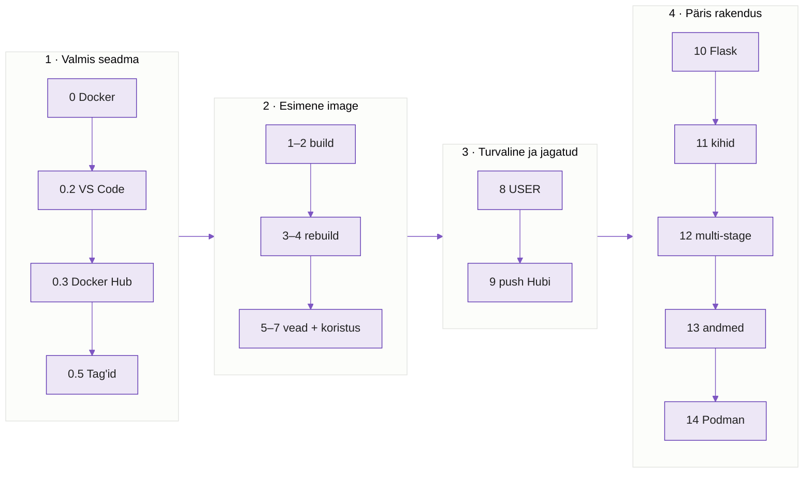
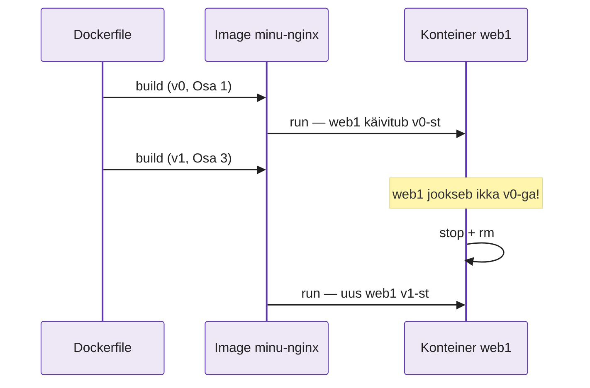
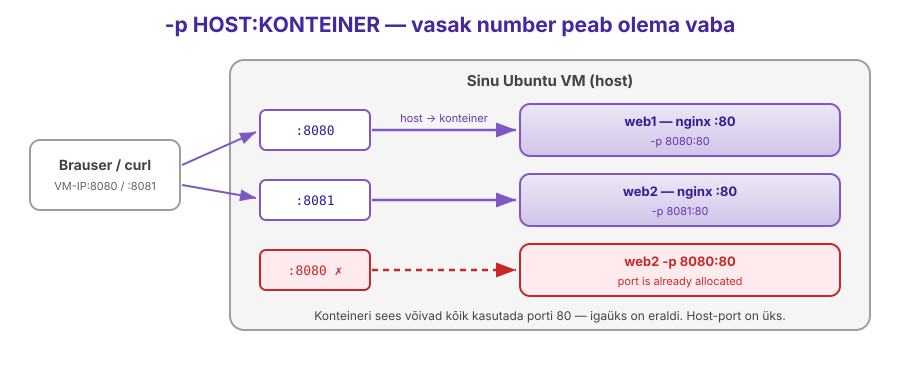
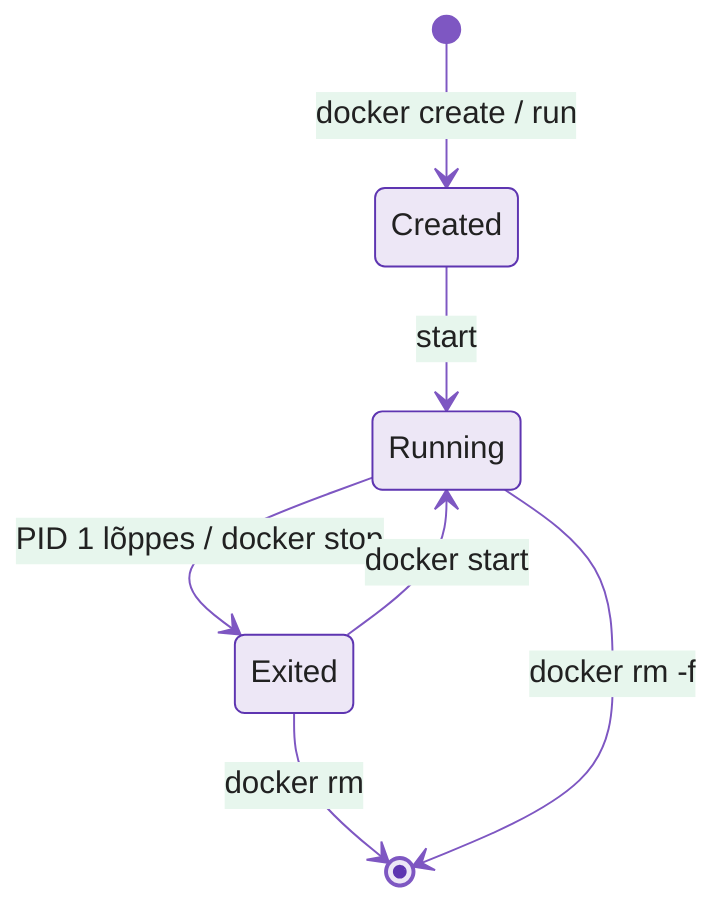

---
tags:
  - Docker
  - Konteinerid
  - Praktikum
---

# Docker — Labor

**Kestus:** 4 tundi (koos pausidega)
**Eeldused:** Loeng antud (image ≠ konteiner, Dockerfile, build/run). Kui udu — [tagasi loengusse](lecture.md). Siit edasi on **ainult käed külge**, teooriat ei korrata.
**Keskkond:** sinu kooli AlmaLinuxi VM (Proxmox), SSH + VS Code. `localhost` = VM, kus Docker jookseb. Brauserist ava `http://<VM-IP>:8080`.


| Osa | Mis | ~min |
|---|---|---|
| 0 | Docker Alma VM-i, `docker version`, `docker.sock` | 15 |
| 0.2 | VS Code: Remote-SSH + Container Tools | 5 |
| 0.3 | Docker Hubi konto + token + `docker login` | 8 |
| 0.5 | Tag'id (`1.27` vs `-alpine`, digest), `-it` konteiner, Ubuntu vs Alma | 15 |
| 1–2 | Esimene image, `-y` viga | 15 |
| 3–4 | Oma leht, rebuild ei uuenda konteinerit | 15 |
| 5–7 | Port kinni, surnud konteiner, koristus | 15 |
| 8 | ENV + USER (mitte-root) | 10 |
| 9 | `tag` + `push` Docker Hubi, tõmba tagasi | 10 |
| ☕ | Paus | 15 |
| 10 | Flask rakendus konteinerisse (`0.0.0.0` viga) | 25 |
| 11 | Kihid ja vahemälu: miks järjekord loeb | 10 |
| 12 | Multi-stage build: väike lõppimage | 20 |
| 13 | Andmed: bind mount (SELinux `:Z`) ja volume | 15 |
| 14 | Podman teises Alma VM-is: sama image, ilma deemonita | 20 |
| — | README + commit + PR | 7 |

Kiiremad: lisaülesanded (`exec`, `save/load` naabrile, push GHCR-i). Kodutöö: Ansible paigaldab sinu Docker Hubi image'i serverisse.

---

!!! abstract "Õpiväljundid"

    Selle labi lõpuks sa:

    1. Ehitad töötava image'i ja käivitad konteineri, ilma juhendisse piilumata
    2. **Diagnoosid** kolm tüüpilist Docker-viga nende veateate järgi (mitte pähe õpitult)
    3. Selgitad miks rebuild ei uuenda töötavat konteinerit — ja parandad selle
    4. Loed `docker ps` / `logs` väljundit tõrkeotsinguks
    5. Taastad puhta seisu pärast seda kui oled ise midagi katki teinud

---

## Mida sa täna ehitad

Vaata enne alustamist seda pilti. Labi lõpuks on sul **kõik see** olemas ja töötab. Kui kaotad järje, tule siia tagasi ja vaata, millise kasti juures sa oled.

<figure markdown="span">
  
  <figcaption>Joonis 5.9. Labi tervikpilt: üks image liigub sinu VM-ist Docker Hubi ja sealt teise VM-i. Iga kast on üks labi osa (Talvik, 2026).</figcaption>
</figure>

**Teekond — neli plokki:**

<figure markdown="span">

  <figcaption>Joonis 5.10. Labi järjekord. Iga ploki lõpus on midagi, mis töötab — ära mine järgmisse plokki enne (Talvik, 2026).</figcaption>
</figure>

---

Selle labi loogika: **baas → katki → paranda → laienda → viga → taasta.** Sa ei kopeeri valmis lahendust — sa ehitad, lõhud meelega, ja saad aru **miks**. Iga samm lisab ainult ühe tüki. Kui tahad tervet faili korraga kopeerida: see labi pole selleks.

---

## Osa 0 · Docker VM-i peale

!!! success "Eesmärk"
    Osa lõpuks: `docker run --rm hello-world` näitab `Hello from Docker!`.

Su VM on **AlmaLinux** (RHEL-i pere, `dnf`). AlmaLinux tuleb Red Hati **Podmaniga**; meie kasutame **Docker Engine'it** Dockeri enda repost — sama, mis tööstuses ja autograderis. Podmani kohta vt loengut ja lisaülesannet.

Eemalda konfliktsed paketid (kui pole, ütleb `No match` — normaalne), lisa Dockeri repo ja paigalda:

```bash
sudo dnf remove -y podman runc buildah
sudo dnf install -y dnf-plugins-core
sudo dnf config-manager --add-repo https://download.docker.com/linux/rhel/docker-ce.repo
sudo dnf install -y docker-ce docker-ce-cli containerd.io docker-buildx-plugin docker-compose-plugin
sudo systemctl enable --now docker
sudo usermod -aG docker $USER
```

**Logi välja ja SSH-ga uuesti sisse** — grupi muudatus kehtib alles uues sessioonis. Kontrolli:

```bash
docker version
docker run --rm hello-world
```

Näed `Hello from Docker!`. Kui `permission denied ... docker.sock` — sa ei loginud uuesti sisse.

Vaata, kellega `docker` käsk tegelikult räägib:

```bash
docker version            # kaks plokki: Client ja Server
systemctl status docker   # dockerd deemon
ls -l /var/run/docker.sock
```

??? question "Diagnoosi"
    Miks näitab `docker version` **kahte** versiooni? Kelle oma on `docker.sock` ja mis grupp? Seosta loengu joonisega 5.3: miks `usermod -aG docker` sisuliselt annab root'i?

!!! tip "Kiirematele: tee seda Ansible'iga"
    Sama playbook'ina (N3–N4 oskused): `yum_repository` või `get_url` Dockeri repo jaoks, `dnf` moodul pakettidele, `user` moodul `groups: docker, append: true`, `service` moodul `state: started, enabled: true`. Nii saab Docker'i igale serverile ühe käsuga — täpselt loengu "Ansible haldab serverit, Docker rakendust" mõte.

!!! note "Host on Alma, image on Ubuntu — kas see on viga?"
    Ei. Labis ehitame image'i `FROM ubuntu:24.04` peale, kuigi VM on AlmaLinux. Konteiner toob kaasa **oma kasutajaruumi** (paketid, `apt`, failid), aga kasutab **hosti tuuma**. Osa 0.5 näed seda oma silmaga.

---

## Osa 0.2 · VS Code: Docker otse VM-is

!!! success "Eesmärk"
    Osa lõpuks: VS Code'i vasakul ribal on konteinerite ikoon ja seal on näha `hello-world` image.

1. VS Code'is on sul juba **Remote - SSH** (N1). Ühenda VM-iga (`F1` → *Remote-SSH: Connect to Host*).
2. **VM-i aknas** ava Extensions ja paigalda **Container Tools** (`ms-azuretools.vscode-containers`, Microsoft; endine "Docker" laiendus). Vajuta *Install in SSH: ...* — laiendus peab jooksma VM-is, kus on Docker, mitte sinu Windowsis.
3. Vasakule tekib konteinerite ikoon: näed image'id, konteinerid, saad vaadata logisid (*View Logs*), minna sisse (*Attach Shell*), peatada, kustutada. `Dockerfile`-is tuleb automaatne lõpetamine ja vigade märkimine.

Kui laiendus ütleb `permission denied`: sama põhjus mis üleval — VS Code'i SSH-sessioon algas enne `usermod`-i. `F1` → *Remote-SSH: Kill VS Code Server on Host*, ühenda uuesti.

!!! tip
    Laiendus on mugavus, mitte asendus. Labis kirjuta käsud terminali — eksamil ja serveris pole hiirt.

---

## Osa 0.3 · Docker Hubi konto (kohustuslik)

!!! success "Eesmärk"
    Osa lõpuks: `docker login` ütleb `Login Succeeded`.

Docker Hub on image'ide "GitHub" — sealt tulevad `ubuntu`, `nginx`, `python`, ja sinna paned labi lõpus oma image'i.

1. Ava <https://www.docker.com/get-started/> → **Sign up** (või otse <https://hub.docker.com/signup>). Tasuta *Personal* konto. Kasutajanimi väikeste tähtedega — see läheb image'i nimesse (`kasutaja/minu-nginx`).
2. Docker Hubis: profiil → **Account settings → Personal access tokens → Generate new token**. Nimi `alma-vm`, õigused **Read & Write**. Kopeeri token — seda näed ainult korra.
3. VM-is logi sisse **tokeniga, mitte parooliga**:

```bash
docker login -u <kasutaja>
# Password: kleebi token
```

`Login Succeeded`. 

!!! warning "Kus token nüüd on?"
    `cat ~/.docker/config.json` — token on seal base64-na, mitte krüpteeritult. Seepärast token, mitte parool: tokeni saad Docker Hubis igal hetkel tühistada. **Ära kunagi pane `config.json`-i ega tokenit Giti** (meenuta N4).

Login annab ka kõrgema tõmbamislimiidi — terve klass kooli ühe IP tagant ilma loginita jookseb limiiti.

---

## Osa 0.5 · Tõmba ja vaata sisse

!!! success "Eesmärk"
    Osa lõpuks: oskad öelda, mitu korda on `-alpine` väiksem, ja oled käinud konteineri sees.

Enne oma image'it vaata valmis image'it. Tõmba konkreetse tag'iga:

```bash
docker pull ubuntu:24.04
docker images
```

**Tag'id praktikas** — tõmba sama nginx kahes variandis ja võrdle:

```bash
docker pull nginx:1.27
docker pull nginx:1.27-alpine
docker images nginx
docker inspect --format '{{index .RepoDigests 0}}' nginx:1.27
```

??? question "Võrdle"
    Mitu korda väiksem on `-alpine`? Mis on `@sha256:...` ja miks see ei muutu, kuigi `1.27` homme võib näidata uuele image'ile? Mis tag'i saaksid, kui kirjutaksid lihtsalt `docker pull nginx`?

Mine **interaktiivselt** sisse:

```bash
docker run -it --rm ubuntu:24.04 bash
```

Oled konteineris (prompt muutus). Proovi:

```bash
cat /etc/os-release
ps aux
uname -r
exit
```

Nüüd VM-is:

```bash
cat /etc/os-release
uname -r
docker ps -a
```

??? question "Diagnoosi"
    `os-release` ütleb konteineris **Ubuntu**, VM-is **AlmaLinux** — aga `uname -r` on mõlemas **sama** (Alma tuum, `el9`). Miks? `ps aux` näitas konteineris ainult paari protsessi — kus on kõik VM-i protsessid? (Vihje: loengu VM vs konteiner tabel.) Miks pole konteinerit `docker ps -a`-s?

---

## Osa 1 · Baas — töötav image

!!! success "Eesmärk"
    Osa lõpuks: `curl localhost:8080` näitab nginx-i tervituslehte.

Klooni oma Classroomi repo (`lab-05-...`, link Classroomis), tee haru ja kaustad:

```bash
git clone <sinu-repo-url> lab05 && cd lab05
git switch -c n05-docker
mkdir -p nginx logid && cd nginx
```

Kõik nginx-i failid lähevad kausta `nginx/`.

Loo fail `Dockerfile` (täpselt see nimi). See on **ainus kord**, kui näed tervet faili — edasi lisad ridu ühekaupa:

```dockerfile
FROM ubuntu:24.04
RUN apt update && apt install -y nginx
CMD ["nginx", "-g", "daemon off;"]
```

Ehita ja käivita:

```bash
docker build -t minu-nginx .
docker run -d -p 8080:80 --name web1 minu-nginx
curl localhost:8080
```

Näed nginx tervituslehte. Baas töötab. **Ära mine edasi enne kui see vastab.**

!!! tip
    `Connection refused` — kontrolli `docker ps`. Kui `web1` pole seal, `docker logs web1` ütleb miks.

---

## Osa 2 · Katki — ja miks

!!! success "Eesmärk"
    Osa lõpuks: build läbib, sest Dockerfile'is on `-y`.

Nüüd teed **meelega** vea, mille kõik teevad täpselt ühe korra. Lisa `Dockerfile`-i teine paketirida — aga jäta `-y` **teadlikult ära**:

Muuda keskmine rida selliseks (lisa `curl` install ilma `-y`-ta):

```dockerfile
RUN apt update && apt install nginx curl
```

Ehita:

```bash
docker build -t minu-nginx .
```

**Vaata mis juhtub.** apt küsib `Do you want to continue? [Y/n]`, keegi ei vasta, apt vastab ise `Abort.` ja build kukub veaga `exit code: 1`. Ehitamise ajal pole inimest, kes vastaks.

??? question "Diagnoosi enne kui parandad"
    Miks töötab sama `apt install nginx curl` sinu enda terminalis, aga Docker build'is ripub? Mis vahe on interaktiivsel terminalil ja build-keskkonnal?

**Paranda:** pane `-y` tagasi. `-y` = "jah kõigele", sest build-keskkonnas pole inimest:

```dockerfile
RUN apt update && apt install -y nginx curl
```

```bash
docker build -t minu-nginx .
```

Läbib. See on reegel, mitte soovitus: Dockerfile'is `apt install` **alati** `-y`.

---

## Osa 3 · Laienda — oma sisu image'isse

!!! success "Eesmärk"
    Osa lõpuks: uus image on ehitatud (aga leht on veel vana — see on meelega).

Baas serveerib nginx'i vaikimisi lehte. Paneme oma. Loo kausta `nginx/` fail `index.html`:

```html
<h1>Versioon 1</h1>
```

Lisa `Dockerfile`-i **üks uus rida**, `CMD` ette (näita ainult uut rida, mitte tervet faili):

```dockerfile
COPY index.html /var/www/html/index.html
```

Ehita ja **proovi vana konteineriga**:

```bash
docker build -t minu-nginx .
curl localhost:8080
```

??? question "Ennusta enne vaatamist"
    Mida `curl` nüüd näitab — "Versioon 1", vana vaikimisi leht, või vea?

Näed ikka **vana** lehte. See pole viga — see on Osa 4.

---

## Osa 4 · Rebuild ei uuenda konteinerit

!!! success "Eesmärk"
    Osa lõpuks: `curl localhost:8080` näitab `Versioon 1`.

Ehitasid uue image'i, aga `curl` näitab vana. Miks?

**Diagnoosi:**

```bash
docker ps
docker images
```

`docker ps` näitab et `web1` jookseb. `docker images` näitab et `minu-nginx` on **äsja** ehitatud (vaata `CREATED`). Kaks fakti, üks järeldus:

??? question "Miks?"
    `web1` käivitati Osas 1, **vanast** image'ist. `docker build` tegi uue image'i, aga ei puutunud töötavat konteinerit. Konteiner on külmutatud hetk sellest image'ist, mis kehtis tema **käivitamise** ajal. Miks Docker seda ei uuenda automaatselt? (Vihje: kujuta et keegi ehitab katkise image'i reedel 16:55, ja kõik konteinerid tootmises uueneksid ise.)

**Taasta õige seis:**

```bash
docker stop web1
docker rm web1
docker run -d -p 8080:80 --name web1 minu-nginx
curl localhost:8080
```

Nüüd "Versioon 1". Jäta meelde see jada: **stop → rm → run**.

<figure markdown="span">

  <figcaption>Joonis 5.11. `docker build` loob uue image'i, aga ei puutu töötavat konteinerit — konteiner on kinni selles image'is, millest ta käivitati (Talvik, 2026).</figcaption>
</figure>
 Uus image ei jõua tootmisse ilma selleta.

---

## Osa 5 · Port juba kinni

!!! success "Eesmärk"
    Osa lõpuks: kaks konteinerit jooksevad, `8080` ja `8081`, tõend `logid/docker-ps.txt`.

Proovi käivitada teine konteiner samast image'ist, **sama pordiga**:

```bash
docker run -d -p 8080:80 --name web2 minu-nginx
```

Saad vea: `port is already allocated`.

??? question "Diagnoosi"
    `web1` hoiab juba porti 8080. Kaks konteinerit ei saa jagada sama host-porti. Mis on lahendus, kui tahad **mõlemat** korraga jooksma? (Vihje: kumb number `-p X:80`-s on host-port?)

**Paranda:** anna `web2`-le teine host-port:

```bash
docker run -d -p 8081:80 --name web2 minu-nginx
curl localhost:8081
```

Nüüd jooksevad mõlemad — `8080` ja `8081`, üks image, kaks konteinerit.

<figure markdown="span">
  
  <figcaption>Joonis 5.12. Konteineri sees on igaühel oma port 80; hosti port on üks ja selle saab ainult üks konteiner (Talvik, 2026).</figcaption>
</figure>
 Salvesta tõend:

```bash
docker ps > ../logid/docker-ps.txt
```

---

## Osa 6 · Surnud konteiner

!!! success "Eesmärk"
    Osa lõpuks: `web3` on `docker ps`-is `Up`.

Muuda `Dockerfile` `CMD` rida selliseks (võta `daemon off;` ära):

```dockerfile
CMD ["nginx"]
```

Ehita ja käivita puhtalt:

```bash
docker build -t minu-nginx .
docker run -d -p 8082:80 --name web3 minu-nginx
docker ps
```

`web3` pole `docker ps`-is. Ta suri kohe.

**Diagnoosi:**

```bash
docker ps -a
docker logs web3
```

??? question "Miks?"
    Ilma `daemon off;` läheb nginx taustale ja põhiprotsess (PID 1) lõpeb kohe. Konteiner elab **täpselt nii kaua kui elab tema põhiprotsess**. Protsess lõppes → konteiner lõppes. Mis siis `daemon off;` teeb, et konteiner elus püsib?

<figure markdown="span">

  <figcaption>Joonis 5.13. Konteiner elab nii kaua kui PID 1. Ilma `daemon off;` läheb nginx taustale, PID 1 lõpeb ja konteiner on kohe `Exited` (Talvik, 2026).</figcaption>
</figure>

**Paranda:** pane `daemon off;` tagasi:

```dockerfile
CMD ["nginx", "-g", "daemon off;"]
```

Surnud `web3` on ikka olemas (`docker ps -a`) ja hoiab nime kinni — eemalda enne:

```bash
docker rm web3
docker build -t minu-nginx .
docker run -d -p 8082:80 --name web3 minu-nginx
docker ps
```

`web3` jääb seekord püsti.

---

## Osa 7 · Taasta puhas seis

!!! success "Eesmärk"
    Osa lõpuks: `docker ps -a` on tühi.

Tegid sassi — kolm konteinerit, üks image. Koristame nagu päris elus:

```bash
docker ps -a
docker stop web1 web2 web3
docker rm web1 web2 web3
docker ps -a
```

Kontrolli et midagi ei jäänud rippuma, ja et image on alles:

```bash
docker images
```

??? question "Mõtle"
    Miks Docker nõuab enne konteineri kustutamist selle peatamist (`stop` enne `rm`)? Mis läheks valesti, kui `rm` tapaks jooksva konteineri kohe?

Tahad ka image'i minema:

```bash
docker system df        # kui palju ruumi image'id ja vahemälu võtavad
docker rmi minu-nginx
docker image prune -f   # eemaldab rebuild'idest jäänud nimetud (<none>) image'id
```

---

## Osa 8 · Seadistatav ja mitte-root image

!!! success "Eesmärk"
    Osa lõpuks: väljund ütleb `olen appuser`, tõend `logid/turve.txt`.

Uus kaust kõrvale, et nginx-i labi mitte segada:

```bash
cd .. && mkdir turve && cd turve
```

`Dockerfile`:

```dockerfile
FROM alpine:3.20
ENV TERVITUS="Tere"
CMD ["sh", "-c", "echo $TERVITUS, olen $(whoami)"]
```

```bash
docker build -t turve .
docker run --rm turve
docker run --rm -e TERVITUS="Hei" turve
```

Väljund ütleb `olen root`. Lisa `CMD` ette kaks rida:

```dockerfile
RUN adduser -D appuser
USER appuser
```

Ehita ja käivita uuesti — nüüd `olen appuser`. Salvesta tõend:

```bash
docker build -t turve .
docker run --rm turve | tee ../logid/turve.txt
```

??? question "Mõtle"
    Mis vahe on `ENV`-il ja `ARG`-il? Proovi: lisa `ARG VERSIOON=1` ja `CMD`-sse `$VERSIOON` — miks see jooksvas konteineris tühi on? Ja miks ei tohiks parooli kunagi `ENV`-i kirjutada? (Vihje: `docker inspect turve`.)

```bash
docker rmi turve && cd ..
```

---

## Osa 9 · Avalda oma image Docker Hubi

!!! success "Eesmärk"
    Osa lõpuks: sinu image on Docker Hubi lehel näha ja `docker run kasutaja/minu-nginx:v1` töötab.

Ehita nginx image lõppseisus uuesti (Osa 7 kustutas selle) ja anna sellele Docker Hubi nimi koos tag'iga:

```bash
cd nginx
docker build -t minu-nginx .
docker tag minu-nginx <kasutaja>/minu-nginx:v1
docker images            # sama IMAGE ID kahe nimega
docker push <kasutaja>/minu-nginx:v1
```

Ava `https://hub.docker.com/r/<kasutaja>/minu-nginx` — image on avalik, tag `v1` näha.

!!! note "Docker Hub pole ainus koht"
    Registry on lihtsalt server, mis hoiab image'id. Docker Hub on vaikimisi, aga sama `tag` + `push` töötab kõigiga — muutub ainult nime algus:

    | Registry | Nimi | Kus kasutatakse |
    |---|---|---|
    | Docker Hub | `docker.io/kasutaja/app:v1` (lühidalt `kasutaja/app:v1`) | Avalikud image'id, vaikimisi |
    | GitHub Container Registry | `ghcr.io/kasutaja/app:v1` | Kood GitHubis, CI GitHub Actionsis |
    | Quay.io (Red Hat) | `quay.io/kasutaja/app:v1` | RHEL/OpenShift maailm |
    | Pilve registry'd | AWS ECR, Azure ACR, Google Artifact Registry | Firma rakendused pilves |
    | Oma registry | `registry.firma.ee/app:v1` (`registry:2`, Harbor, GitLab) | Sisevõrk, privaatsed image'id |

    Firmad hoiavad oma image'id tavaliselt **privaatses** registry's, mitte avalikus Docker Hubis. Lisaülesanne: pane sama image ka `ghcr.io`-sse.

**Kontrolli, et see töötab ka mujal** — kustuta kohalik koopia ja tõmba tagasi:

```bash
docker rmi minu-nginx <kasutaja>/minu-nginx:v1
docker run -d --rm -p 8080:80 --name hub-test <kasutaja>/minu-nginx:v1
curl localhost:8080
docker stop hub-test
echo "<kasutaja>/minu-nginx:v1" > ../logid/dockerhub.txt
cd ..
```

??? question "Mõtle"
    `docker run` leidis image'i, kuigi kustutasid selle. Kust? Mida teeks pinginaaber, et sinu lehte oma VM-is näha? Miks `v1`, mitte `latest`?

---

## Osa 10 · Päris rakendus: Flask konteinerisse

!!! success "Eesmärk"
    Osa lõpuks: `curl localhost:5000` näitab `Tere konteinerist!`.

Seni pakkisime valmis nginx-i. Nüüd **oma koodi** — täpselt loengu näide. Repo juurest:

```bash
mkdir flask && cd flask
```

`app.py`:

```python
from flask import Flask

app = Flask(__name__)

@app.route("/")
def index():
    return "Tere konteinerist!"

if __name__ == "__main__":
    app.run(port=5000)
```

`requirements.txt`:

```text
flask==3.0.3
```

`Dockerfile` — kirjuta ise loengu jaotise "Dockerfile" järgi: `FROM python:3.12-slim`, `WORKDIR /app`, **enne** `COPY requirements.txt .` + `RUN pip install --no-cache-dir -r requirements.txt`, **siis** `COPY . .`, `EXPOSE 5000`, `CMD ["python", "app.py"]`.

```bash
docker build -t flask-app .
docker run -d -p 5000:5000 --name flask1 flask-app
curl localhost:5000
```

`curl: (56) Recv failure` või `Connection reset`. Konteiner jookseb (`docker ps`), aga ei vasta.

```bash
docker logs flask1
```

??? question "Diagnoosi"
    Logis: `Running on http://127.0.0.1:5000`. Kelle `127.0.0.1` see on — VM-i või konteineri? Kuhu `-p 5000:5000` liiklust saadab? Miks töötaks sama `app.py` su sülearvutis ilma probleemita?

**Paranda** `app.py`-s viimane rida: `app.run(host="0.0.0.0", port=5000)`. Mis järjekord nüüd? (Osa 4!)

```bash
docker build -t flask-app .
docker stop flask1 && docker rm flask1
docker run -d -p 5000:5000 --name flask1 flask-app
curl localhost:5000
```

`Tere konteinerist!` — ja ka brauseris `http://<VM-IP>:5000`.

---

## Osa 11 · Kihid ja vahemälu — miks järjekord loeb

!!! success "Eesmärk"
    Osa lõpuks: build'i väljundis on `pip install` real `CACHED`, tõend `logid/cache.txt`.

Muuda `app.py`-s tervitust (nt `"Tere, versioon 2!"`) ja ehita uuesti, salvesta väljund:

```bash
docker build -t flask-app . 2>&1 | tee ../logid/cache.txt
```

Vaata väljundit: `pip install` real on **`CACHED`**. Kood muutus, teegid mitte — Docker ei paigaldanud Flaski uuesti.

Nüüd tee **meelega halvasti**: tõsta Dockerfile'is `COPY . .` **enne** `RUN pip install` rida. Muuda `app.py`-d jälle ja mõõda:

```bash
time docker build -t flask-app .
```

??? question "Võrdle"
    Kas `pip install` jooksis nüüd uuesti? Miks — mis muutus kihis, millest `pip` sõltub? Kui projektis on 200 teeki ja build käib 30 korda päevas CI-s, mida see järjekord maksab? (Vaata loengu joonist kihtidest.)

**Taasta õige järjekord** (requirements enne, kood pärast) — autograder kontrollib seda.

```bash
docker stop flask1 && docker rm flask1
cd ..
```

---

## Osa 12 · Multi-stage build — väike lõppimage

!!! success "Eesmärk"
    Osa lõpuks: `curl localhost:8084` näitab sinu `leht.md` sisu ja image on alla 100 MB.

Probleem: lehe ehitamiseks on vaja tööriistu (Python, teegid), aga lehe **serveerimiseks** ainult nginx-i. Miks peaks tootmisimage'is Python olema?

```bash
mkdir multistage && cd multistage
```

`leht.md` (kirjuta midagi enda kohta):

```markdown
# Minu multi-stage leht

See leht ehitati Pythoni konteineris, aga serveerib nginx.
```

`Dockerfile`:

```dockerfile
# Etapp 1: ehitaja — Python + markdown teek
FROM python:3.12-slim AS build
RUN pip install --no-cache-dir markdown==3.7
WORKDIR /src
COPY leht.md .
RUN python -m markdown leht.md > index.html

# Etapp 2: lõppimage — ainult nginx + valmis HTML
FROM nginx:1.27-alpine
COPY --from=build /src/index.html /usr/share/nginx/html/index.html
```

```bash
docker build -t multistage .
docker run -d --rm -p 8084:80 --name ms multistage
curl localhost:8084
docker images | grep -E "multistage|python|nginx"
docker stop ms
```

??? question "Võrdle"
    Kui suur on `multistage` võrreldes `python:3.12-slim`-iga? Kas lõppimage'is on Python? (Proovi: `docker run --rm multistage python --version`.) Kuhu kadus etapp 1? Miks on see ka **turvalisuse** küsimus?

```bash
cd ..
```

---

## Osa 13 · Andmed: bind mount ja volume

!!! success "Eesmärk"
    Osa lõpuks: faili muutmine VM-is muudab lehte kohe; `logid/volume.txt`-s on kaks rida.

Konteiner on ajutine — kirjutatav kiht kaob `rm`-iga. Kaks viisi andmeid alles hoida.

**Bind mount** — VM-i fail otse konteinerisse (arenduses: muudad faili, leht muutub kohe, rebuild'i pole):

```bash
docker run -d --rm -p 8083:80 --name bind \
  -v $(pwd)/nginx/index.html:/usr/share/nginx/html/index.html:ro \
  nginx:1.27-alpine
curl localhost:8083
```

Saad **`403 Forbidden`**. Fail on olemas, õigused korras — mis siis?

??? question "Diagnoosi"
    AlmaLinuxis on **SELinux** sees (`getenforce` → `Enforcing`). SELinux ei lase konteineril lugeda faile, millel pole konteineri silti. Ubuntul seda viga ei tule — seepärast töötab internetiõpetus, aga sinu serveris mitte.

**Paranda:** lisa sildi-lipp `Z` (Docker silditab faili konteineri jaoks ümber):

```bash
docker stop bind
docker run -d --rm -p 8083:80 --name bind \
  -v $(pwd)/nginx/index.html:/usr/share/nginx/html/index.html:ro,Z \
  nginx:1.27-alpine
curl localhost:8083
```

Muuda nüüd VM-is `nginx/index.html` ja tee uuesti `curl` — muudatus on kohe näha. `docker stop bind`.

**Volume** — Dockeri hallatud ketas, elab üle konteineri kustutamise (andmebaasid):

```bash
docker volume create andmed
docker run --rm -v andmed:/data alpine:3.20 sh -c 'echo "salvestatud $(date)" >> /data/log.txt'
docker run --rm -v andmed:/data alpine:3.20 sh -c 'echo "salvestatud $(date)" >> /data/log.txt'
docker run --rm -v andmed:/data alpine:3.20 cat /data/log.txt | tee logid/volume.txt
docker volume ls
```

??? question "Mõtle"
    Kolm **erinevat** konteinerit, kõik `--rm` (kustutati kohe) — miks on `log.txt`-s kaks rida? Kus VM-is need andmed füüsiliselt on? (`docker volume inspect andmed`.) Mis juhtuks andmebaasiga konteineris **ilma** volume'ita pärast `docker rm`?

---

## Osa 14 · Podman teises Alma VM-is

!!! success "Eesmärk"
    Osa lõpuks: teises VM-is jookseb sinu Docker Hubi image Podmaniga, tõend `logid/podman.txt`.

AlmaLinux / RHEL vaikimisi tööriist on **Podman**, mitte Docker. Võta oma **teine** Proxmoxi Alma masin (Lab 01 inventory'st) — seal Dockerit pole ja ei tule.

```bash
ssh <teine-vm>
sudo dnf install -y podman
podman version
```

Pane tähele: `podman version` näitab **ühte** plokki (Client), mitte kahte nagu Docker. Ja `usermod`-i pole vaja.

**Käivita sinu Docker Hubi image — tavakasutajana, ilma sudo-ta:**

```bash
podman run -d -p 8080:80 --name web1 <kasutaja>/minu-nginx:v1
```

Podman küsib: *Please select an image* — `docker.io`, `quay.io`, ...? Docker eeldab alati Docker Hubi, Podman **ei eelda**. Kirjuta täisnimi:

```bash
podman run -d -p 8080:80 --name web1 docker.io/<kasutaja>/minu-nginx:v1
curl localhost:8080
podman ps | tee podman-ps.txt
```

Sinu leht. **Sama image, ilma ümberehitamiseta** — OCI standard.

**Võrdle Dockeriga:**

```bash
systemctl status docker          # ei ole olemas
ps -ef | grep -E "dockerd|podman" | grep -v grep
podman top web1 user huser       # konteineris "root", aga hostis sina
podman run -d -p 80:80 docker.io/<kasutaja>/minu-nginx:v1
```

Viimane annab vea: `rootlessport cannot expose privileged port 80`.

??? question "Diagnoosi"
    1. Miks pole Podmanil deemonit ja mis see tähendab, kui konteineri protsess kukub?
    2. `podman top` näitas konteineris `root`, hostis sinu kasutajat — mis on **rootless** ja miks on see turvalisem kui Dockeri `docker` grupp?
    3. Miks ei saa tavakasutaja porti 80 võtta, aga 8080 saab? Kuidas Docker sama asja lubas?
    4. Miks küsis Podman registry't, aga Docker mitte?

Tõend esimesse VM-i (kus su repo on):

```bash
exit                                       # tagasi esimesse VM-i
scp <teine-vm>:podman-ps.txt logid/podman.txt
```

!!! tip "Podman ja automaatne käivitus"
    Deemonita pole `--restart always` taga kedagi. Podmanis käivitab konteinerit pärast reboot'i **systemd** (*Quadlet*: `~/.config/containers/systemd/web1.container`). Uuri: <https://docs.podman.io/en/latest/markdown/podman-systemd.unit.5.html>.

---

## Esitamine

Repo peab lõpuks välja nägema nii (kodutöö `ansible/` lisandub hiljem samasse harusse):

```text
lab05/
├── README.md            # vastused labi ??? küsimustele (min 150 sõna)
├── nginx/
│   ├── Dockerfile       # lõppseis: ubuntu:24.04, -y, daemon off;
│   └── index.html
├── turve/
│   └── Dockerfile       # USER, mitte root
├── flask/
│   ├── app.py           # 0.0.0.0
│   ├── requirements.txt
│   └── Dockerfile       # requirements ENNE koodi
├── multistage/
│   ├── leht.md
│   └── Dockerfile       # 2x FROM, COPY --from
└── logid/
    ├── docker-ps.txt    # web1 ja web2 Up (Osa 5)
    ├── turve.txt        # "olen appuser" (Osa 8)
    ├── dockerhub.txt    # kasutaja/minu-nginx:v1 (Osa 9)
    ├── cache.txt        # build väljund, pip CACHED (Osa 11)
    ├── podman.txt       # podman ps teisest VM-ist (Osa 14)
    └── volume.txt       # 2 rida "salvestatud" (Osa 13)
```

README-s vasta vähemalt neile: miks `uname -r` on konteineris ja VM-is sama (Osa 0.5); miks rebuild ei uuendanud `web1`-te (Osa 4); miks konteiner suri ilma `daemon off;`-ta (Osa 6); miks Flask vajas `0.0.0.0` (Osa 10); miks `bind` andis 403 (Osa 13); kaks erinevust Dockeri ja Podmani vahel, mida ise nägid (Osa 14).

```bash
git add . && git commit -m "N5 Docker lab" && git push -u origin n05-docker
```

Ava **Pull Request** `main`-i. Autograder **ehitab sinu image'id ise** ja kontrollib, et nginx serveerib sinu `index.html`-i `turve` ei jookse root'ina, Flask vastab, multi-stage image on väike ja sinu Docker Hubi image on avalikult tõmmatav — tõendifaile käsitsi kirjutada pole mõtet.

---

## Lõppkontroll — oskad ilma juhendita

- [ ] Ehitad töötava nginx image'i nullist, mälu järgi
- [ ] Selgitad **miks** `apt install` vajab `-y` Dockerfile'is (mitte lihtsalt "peab")
- [ ] Kui rebuild "ei mõju", tead kohe et vaja **stop → rm → run**
- [ ] `port is already allocated` — tead põhjust ja lahendust ilma googeldamata
- [ ] Surnud konteiner — `docker logs` + PID 1 loogika
- [ ] `docker ps -a` on tühi kui pead selle tühjaks tegema
- [ ] Selgitad, miks konteineris on sama `uname -r` kui VM-is
- [ ] Kasutad konkreetset tag'i (`ubuntu:24.04`), mitte `latest`, ja tead miks
- [ ] Panid image'i jooksma mitte-root kasutajana (`USER`)
- [ ] Flask konteineris vastab — ja tead, miks `127.0.0.1` ei tööta
- [ ] Dockerfile'i ridade järjekord: harva muutuv üles
- [ ] Multi-stage: ehitustööriistad ei jõua lõppimage'isse
- [ ] Bind mount vs volume, ja SELinux `:Z` AlmaLinuxis
- [ ] Podman jooksutab sama image'i rootless'ina — tead, mis on deemon ja miks Podmanil seda pole
- [ ] Su image on Docker Hubis ja `docker run kasutaja/minu-nginx:v1` töötab tühjas masinas

---

## Lisaülesanded (kui jõuad ette)

1. **`docker exec`:** mine jooksva `web1` sisse (`docker exec -it web1 bash`), muuda `/var/www/html/index.html` käsitsi. `docker stop web1` + `docker start web1` (mitte rm+run) — kas muudatus säilis? `rm`+`run` — kas säilis? Selgita vahet.
2. **`--no-cache`:** ehita `docker build --no-cache -t minu-nginx .`. Mis on aeglasem ja miks? Millal seda vaja?
3. **Aita kolleegi — jaga image'it:** `docker tag minu-nginx minu-nginx:v1`, `docker images` (sama IMAGE ID?). Siis `docker save -o nginx.tar minu-nginx:v1`, kopeeri `scp`-ga pinginaabri VM-i, tema teeb `docker load -i nginx.tar` ja `docker run`. (Docker Hubi kaudu tegid selle juba Osa 9-s — see on failiga variant suletud võrgu jaoks.)
4. **GHCR:** GitHubis *Settings → Developer settings → Personal access tokens (classic)*, õigus `write:packages`. `docker login ghcr.io -u <github-kasutaja>`, `docker tag minu-nginx ghcr.io/<github-kasutaja>/minu-nginx:v1`, `docker push ...`. Vaata GitHubi profiilis *Packages*. Mis vahe on avaliku ja privaatse package'i tõmbamisel?
5. **Oma port konteineris:** pane nginx kuulama porti 8000 konteineri **sees** (nõuab config-faili `COPY`-t). Mis muutub `-p`-s?

---

## Veaotsing

| Veateade | Põhjus | Lahendus |
|---|---|---|
| Build kukub `Abort.` / `[Y/n]` juures | `apt install` ilma `-y` | Lisa `-y` |
| `dnf` ütleb `conflicting requests` / podman | Alma vaikimisi Podman-paketid | `sudo dnf remove -y podman runc buildah`, siis uuesti |
| `denied: requested access to the resource is denied` (push) | Nimes pole sinu kasutajanime või pole sisse logitud | `docker tag ... <kasutaja>/...`, `docker login` |
| `toomanyrequests` (pull) | Docker Hubi anonüümne limiit | `docker login` |
| Flask: `Connection reset`, konteiner `Up` | Kuulab `127.0.0.1` konteineri sees | `app.run(host="0.0.0.0")` |
| Bind mount: `403 Forbidden` / `Permission denied` | SELinux (Alma) | Lisa `:Z` (`-v ...:ro,Z`) |
| `pip install` jookseb iga build'iga | `COPY . .` enne `pip install` | requirements enne, kood pärast |
| Podman: `Please select an image` / `short-name` | Podman ei eelda Docker Hubi | Täisnimi `docker.io/kasutaja/...` |
| Podman: `cannot expose privileged port 80` | Rootless: alla 1024 vaja root'i | Kasuta porti ≥1024, nt 8080 |
| `permission denied ... docker.sock` | Pole `docker` grupis või ei loginud uuesti | `usermod -aG docker $USER`, logi uuesti sisse |
| `container name ... already in use` | Vana (ka surnud) konteiner sama nimega | `docker rm <nimi>` |
| `Connection refused` | `-p` puudub, või konteiner ei jookse | `docker ps`, `docker logs` |
| Vana sisu pärast rebuild'i | Konteiner vanast image'ist | `stop` → `rm` → `run` |
| `port is already allocated` | Host-port kinni | Teine host-port `-p` vasakul |
| Konteiner sureb kohe | Põhiprotsess lõppes (nt `daemon off;` puudub) | `docker logs`, paranda `CMD` |
| `image is being used` | Konteinerid veel olemas | Eemalda konteinerid enne `rmi` |

*Tabel 5.6. Iga rida on viga, mille sa selles labis ise tekitasid ja parandasid.*

---

## Allikad

| Allikas | URL | Miks |
|---|---|---|
| Dockerfile reference | <https://docs.docker.com/reference/dockerfile/> | Kõik käsud |
| `docker run` | <https://docs.docker.com/reference/cli/docker/container/run/> | Lipud, pordid |
| `docker logs` | <https://docs.docker.com/reference/cli/docker/container/logs/> | Tõrkeotsing |
