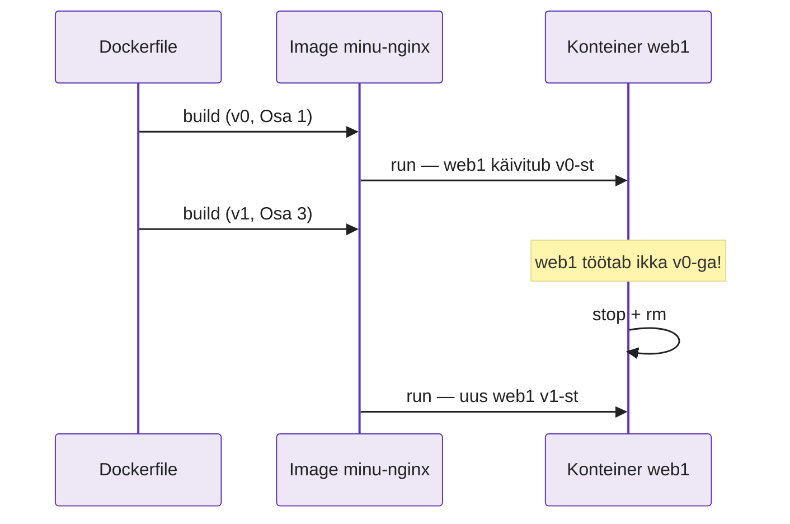
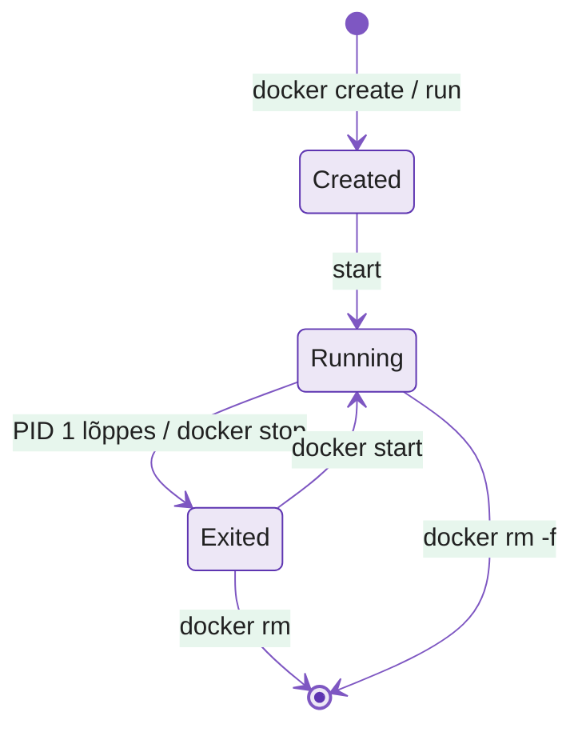

---
tags:
  - Docker
  - Konteinerid
  - Praktikum
---

# Docker — Labor

**Kestus:** 4 tundi (koos pausidega)
**Eeldused:** loeng on läbitud (image ≠ konteiner, Dockerfile, build/run). Kui midagi on segane, mine [tagasi loengusse](lecture.md). Siit edasi on **ainult praktiline töö**, teooriat ei korrata.
**Keskkond:** sinu kooli AlmaLinuxi VM (Proxmox), SSH ja VS Code. `localhost` tähendab VM-i, kus Docker töötab. Brauseris ava `http://<VM-IP>:8080`.


| Osa | Mis | ~min |
|---|---|---|
| 0 | Docker Alma VM-i, `docker version`, `docker.sock` | 15 |
| 0.2 | VS Code: Remote-SSH + Container Tools | 5 |
| 0.3 | Docker Hubi konto + token + `docker login` | 8 |
| 0.5 | Tag'id (`1.27` vs `-alpine`, digest), `-it` konteiner, Ubuntu vs Alma | 15 |
| 1–2 | Esimene image, `-y` viga | 15 |
| 3–4 | Oma leht, uus build ei uuenda konteinerit | 15 |
| 5–7 | Port on kinni, konteiner sureb, koristus | 15 |
| 8 | ENV + USER (mitte-root) | 10 |
| 9 | `tag` + `push` Docker Hubi ja tagasi tõmbamine | 10 |
| ☕ | Paus | 15 |
| 10 | Flask rakendus konteinerisse (`0.0.0.0` viga) | 25 |
| 11 | Kihid ja vahemälu: miks ridade järjekord on oluline | 10 |
| 12 | Multi-stage build: väike lõppimage | 20 |
| 13 | Andmed: bind mount (SELinux `:Z`) ja volume | 15 |
| 14 | Podman teises Alma VM-is: sama image, ilma deemonita | 20 |
| — | README + commit + PR | 7 |

Kes jõuab ette, teeb lisaülesandeid (`exec`, image'i jagamine naabriga `save/load` abil, push GHCR-i). Kodutöös paigaldab Ansible sinu Docker Hubi image'i serverisse.

---

!!! abstract "Õpiväljundid"

    Selle labi lõpuks sa:

    1. Ehitad töötava image'i ja käivitad konteineri ilma juhendisse vaatamata
    2. **Leiad** tüüpiliste Dockeri vigade põhjuse veateate järgi (mitte pähe õpitult)
    3. Selgitad, miks uus build ei uuenda töötavat konteinerit, ja parandad olukorra
    4. Kasutad vigade otsimiseks `docker ps` ja `docker logs` väljundit
    5. Taastad puhta seisu pärast seda, kui oled ise midagi katki teinud

---

## Mida sa täna ehitad

Vaata enne alustamist seda pilti. Labi lõpuks on sul **kõik see** olemas ja töötab. Kui kaotad järje, tule siia tagasi ja vaata, millise kasti juures sa oled.

<figure markdown="span">
  
  <figcaption>Joonis 5.9. Labi tervikpilt: üks image liigub sinu VM-ist Docker Hubi ja sealt teise VM-i. Iga kast on üks labi osa (Talvik, 2026).</figcaption>
</figure>

**Teekond — neli plokki:**

<figure markdown="span">

  <figcaption>Joonis 5.10. Labi järjekord. Iga ploki lõpuks peab midagi töötama — enne seda ära järgmise plokiga alusta (Talvik, 2026).</figcaption>
</figure>

---

Labi ülesehitus: **alus → vea tekitamine → parandus → laiendus → uus viga → taastamine.** Sa ei kopeeri valmis lahendust — sa ehitad, teed meelega vigu ja saad aru, **miks** need tekivad. Iga samm lisab ainult ühe uue asja. Kui tahad tervet faili korraga kopeerida, siis see lab pole selleks mõeldud.

---

## Osa 0 · Docker VM-i peale

!!! success "Eesmärk"
    Osa lõpuks: `docker run --rm hello-world` näitab `Hello from Docker!`.

Sinu VM-is on **AlmaLinux** (RHEL-i perekond, paketihaldur `dnf`). AlmaLinuxiga on kaasas Red Hati **Podman**, aga meie kasutame **Docker Engine'it** Dockeri enda repost — sama, mida kasutatakse tööstuses ja autograderis. Podmaniga tutvud 14. osas.

Eemalda paketid, mis on Dockeriga vastuolus (kui neid pole, näed teadet `No match` — see on normaalne), lisa Dockeri repo ja paigalda Docker:

```bash
sudo dnf remove -y podman runc buildah
sudo dnf install -y dnf-plugins-core
sudo dnf config-manager --add-repo https://download.docker.com/linux/rhel/docker-ce.repo
sudo dnf install -y docker-ce docker-ce-cli containerd.io docker-buildx-plugin docker-compose-plugin
sudo systemctl enable --now docker
sudo usermod -aG docker $USER
```

**Logi välja ja SSH-ga uuesti sisse** — grupi muudatus hakkab kehtima alles uues sessioonis. Kontrolli:

```bash
docker version
docker run --rm hello-world
```

Näed teksti `Hello from Docker!`. Kui saad vea `permission denied ... docker.sock`, siis sa ei loginud uuesti sisse.

Vaata, kellega käsk `docker` tegelikult suhtleb:

```bash
docker version            # kaks plokki: Client ja Server
systemctl status docker   # dockerd deemon
ls -l /var/run/docker.sock
```

??? question "Leia põhjus"
    Miks näitab `docker version` **kahte** versiooni? Kellele kuulub `docker.sock` ja millisele grupile? Seosta vastus loengu joonisega 5.3: miks annab `usermod -aG docker` sisuliselt root-õigused?

!!! tip "Kiirematele: tee seda Ansible'iga"
    Tee sama playbook'ina (N3–N4 oskused): Dockeri repo jaoks `yum_repository` või `get_url`, pakettide jaoks moodul `dnf`, moodul `user` parameetritega `groups: docker, append: true` ja moodul `service` parameetritega `state: started, enabled: true`. Nii saad Dockeri igasse serverisse ühe käsuga — see ongi loengu mõte "Ansible haldab serverit, Docker rakendust".

!!! note "Host on Alma, image on Ubuntu — kas see on viga?"
    Ei. Labis ehitame image'i `ubuntu:24.04` baasil, kuigi VM-is on AlmaLinux. Konteiner toob kaasa **oma kasutajaruumi** (paketid, `apt`, failid), aga kasutab **hosti tuuma**. Osas 0.5 näed seda ise.

---

## Osa 0.2 · VS Code: Docker otse VM-is

!!! success "Eesmärk"
    Osa lõpuks: VS Code'i vasakul ribal on konteinerite ikoon ja seal on näha image `hello-world`.

1. VS Code'is on sul juba laiendus **Remote - SSH** (N1). Ühenda VM-iga (`F1` → *Remote-SSH: Connect to Host*).
2. **VM-iga ühendatud aknas** ava Extensions ja paigalda **Container Tools** (`ms-azuretools.vscode-containers`, Microsoft; varem kandis nime "Docker"). Vajuta *Install in SSH: ...* — laiendus peab töötama VM-is, kus on Docker, mitte sinu Windowsis.
3. Vasakule ribale tekib konteinerite ikoon. Seal näed image'eid ja konteinereid, saad vaadata logisid (*View Logs*), minna konteineri sisse (*Attach Shell*), konteinereid peatada ja kustutada. `Dockerfile`-is pakub laiendus automaatset lõpetamist ja märgib vead.

Kui laiendus näitab viga `permission denied`, on põhjus sama mis eespool: VS Code'i SSH-sessioon algas enne `usermod`-i. Vali `F1` → *Remote-SSH: Kill VS Code Server on Host* ja ühenda uuesti.

!!! tip
    Laiendus teeb töö mugavamaks, aga ei asenda käske. Labis kirjuta käsud terminali — eksamil ja serveris hiirt ei ole.

---

## Osa 0.3 · Docker Hubi konto (kohustuslik)

!!! success "Eesmärk"
    Osa lõpuks: `docker login` ütleb `Login Succeeded`.

Docker Hub on image'ide "GitHub" — sealt tulevad `ubuntu`, `nginx` ja `python` ning sinna laadid 9. osas üles oma image'i.

1. Ava <https://www.docker.com/get-started/> → **Sign up** (või otse <https://hub.docker.com/signup>). Vali tasuta *Personal* konto. Kirjuta kasutajanimi väikeste tähtedega — see tuleb image'i nimesse (`kasutaja/minu-nginx`).
2. Docker Hubis vali: profiil → **Account settings → Personal access tokens → Generate new token**. Nimeks pane `alma-vm`, õigusteks **Read & Write**. Kopeeri token kohe — seda näidatakse ainult üks kord.
3. Logi VM-is sisse **tokeniga, mitte parooliga**:

```bash
docker login -u <kasutaja>
# Password: kleebi token
```

Näed teksti `Login Succeeded`.

!!! warning "Kus token nüüd on?"
    Vaata: `cat ~/.docker/config.json` — token on seal base64-kodeeritud, mitte krüpteeritud. Seepärast kasutamegi tokenit, mitte parooli: tokeni saad Docker Hubis igal ajal tühistada. **Ära pane kunagi `config.json`-i ega tokenit Giti** (meenuta N4).

Sisselogimine tõstab ka tõmbamise piirmäära. Kui terve klass tõmbab ilma sisse logimata kooli ühe IP-aadressi tagant, saab piirmäär kiiresti täis.

---

## Osa 0.5 · Tõmba image ja vaata konteinerisse

!!! success "Eesmärk"
    Osa lõpuks: oskad öelda, mitu korda on `-alpine` väiksem, ja oled olnud konteineri sees.

Enne oma image'i ehitamist vaata valmis image'it. Tõmba see konkreetse tag'iga:

```bash
docker pull ubuntu:24.04
docker images
```

**Tag'id praktikas** — tõmba nginx kahes variandis ja võrdle:

```bash
docker pull nginx:1.27
docker pull nginx:1.27-alpine
docker images nginx
docker inspect --format '{{index .RepoDigests 0}}' nginx:1.27
```

??? question "Võrdle"
    Mitu korda väiksem on `-alpine`? Mis on `@sha256:...` ja miks see ei muutu, kuigi `1.27` võib homme viidata uuele image'ile? Millise tag'i saaksid, kui kirjutaksid lihtsalt `docker pull nginx`?

Mine konteinerisse **interaktiivselt**:

```bash
docker run -it --rm ubuntu:24.04 bash
```

Oled nüüd konteineris (käsurea viip muutus). Proovi:

```bash
cat /etc/os-release
ps aux
uname -r
exit
```

Nüüd tee sama VM-is:

```bash
cat /etc/os-release
uname -r
docker ps -a
```

??? question "Leia põhjus"
    `os-release` näitab konteineris **Ubuntut**, VM-is **AlmaLinuxit**, aga `uname -r` on mõlemas **sama** (Alma tuum, `el9`). Miks? `ps aux` näitas konteineris ainult paari protsessi — kus on kõik VM-i protsessid? (Vihje: loengu tabel VM-i ja konteineri kohta.) Miks pole konteinerit `docker ps -a` väljundis?

---

## Osa 1 · Alus — töötav image

!!! success "Eesmärk"
    Osa lõpuks: `curl localhost:8080` näitab nginx-i tervituslehte.

Klooni oma Classroomi repo (`lab-05-...`, link on Classroomis), loo haru ja kaustad:

```bash
git clone <sinu-repo-url> lab05 && cd lab05
git switch -c n05-docker
mkdir -p nginx logid && cd nginx
```

Kõik nginx-i failid tulevad kausta `nginx/`.

Loo fail `Dockerfile` (täpselt selle nimega). See on **ainus kord**, kui näed tervet faili — edaspidi lisad ridu ükshaaval:

```dockerfile
FROM ubuntu:24.04
RUN apt update && apt install -y nginx
CMD ["nginx", "-g", "daemon off;"]
```

Ehita ja käivita:

```bash
docker build -t minu-nginx .
docker run -d -p 8080:80 --name web1 minu-nginx
curl localhost:8080
```

Näed nginx-i tervituslehte. Alus töötab. **Ära mine edasi enne, kui see töötab.**

!!! tip
    Kui saad vea `Connection refused`, kontrolli `docker ps`. Kui `web1` seal pole, näitab `docker logs web1`, miks.

---

## Osa 2 · Viga — ja miks see tekib

!!! success "Eesmärk"
    Osa lõpuks: build läbib, sest Dockerfile'is on `-y`.

Nüüd teed **meelega** vea, mille teevad kõik vähemalt korra. Lisa paigaldusse teine pakett (`curl`), aga jäta `-y` **teadlikult ära**. Muuda keskmine rida selliseks:

```dockerfile
RUN apt update && apt install nginx curl
```

Ehita:

```bash
docker build -t minu-nginx .
```

**Vaata, mis juhtub.** apt küsib `Do you want to continue? [Y/n]`, keegi ei vasta, apt katkestab ise (`Abort.`) ja build lõpeb veaga `exit code: 1`. Ehitamise ajal pole kedagi, kes vastaks.

??? question "Leia põhjus enne parandamist"
    Miks töötab sama `apt install nginx curl` sinu enda terminalis, aga Dockeri build'is mitte? Mis vahe on interaktiivsel terminalil ja build-keskkonnal?

**Paranda:** pane `-y` tagasi. `-y` tähendab "vasta kõigele jah", sest build-keskkonnas pole inimest, kes vastaks:

```dockerfile
RUN apt update && apt install -y nginx curl
```

```bash
docker build -t minu-nginx .
```

Nüüd build õnnestub. See on reegel, mitte soovitus: Dockerfile'is kasuta `apt install` käsuga **alati** `-y`.

---

## Osa 3 · Laiendus — oma sisu image'isse

!!! success "Eesmärk"
    Osa lõpuks: uus image on ehitatud (leht on veel vana — see on meelega nii).

Praegu näitab nginx oma vaikimisi lehte. Paneme sinna oma lehe. Loo kausta `nginx/` fail `index.html`:

```html
<h1>Versioon 1</h1>
```

Lisa `Dockerfile`-i **üks uus rida** `CMD` rea ette:

```dockerfile
COPY index.html /var/www/html/index.html
```

Ehita image ja **proovi vana konteineriga**:

```bash
docker build -t minu-nginx .
curl localhost:8080
```

??? question "Ennusta enne vaatamist"
    Mida `curl` nüüd näitab — "Versioon 1", vana vaikimisi lehe või vea?

Näed ikka **vana** lehte. See pole viga — sellest räägib 4. osa.

---

## Osa 4 · Uus build ei uuenda konteinerit

!!! success "Eesmärk"
    Osa lõpuks: `curl localhost:8080` näitab `Versioon 1`.

Ehitasid uue image'i, aga `curl` näitab vana lehte. Miks?

**Leia põhjus:**

```bash
docker ps
docker images
```

`docker ps` näitab, et `web1` töötab. `docker images` näitab, et `minu-nginx` on **äsja** ehitatud (vaata veergu `CREATED`). Kaks fakti, üks järeldus:

??? question "Miks?"
    `web1` käivitati 1. osas **vanast** image'ist. `docker build` tegi uue image'i, aga töötavat konteinerit see ei muutnud. Konteiner jääb selle image'i külge, millest see **käivitati**. Miks Docker konteinerit automaatselt ei uuenda? (Vihje: kujuta ette, et keegi ehitab reedel kell 16.55 katkise image'i ja kõik tootmise konteinerid uueneksid ise.)

**Paranda olukord:**

```bash
docker stop web1
docker rm web1
docker run -d -p 8080:80 --name web1 minu-nginx
curl localhost:8080
```

Nüüd näed lehte "Versioon 1". Jäta see järjekord meelde: **stop → rm → run**. Ilma selleta ei jõua uus image tootmisse.

<figure markdown="span">

  <figcaption>Joonis 5.11. `docker build` loob uue image'i, aga töötavat konteinerit ei muuda — konteiner jääb selle image'i juurde, millest see käivitati (Talvik, 2026).</figcaption>
</figure>

---

## Osa 5 · Port on juba kinni

!!! success "Eesmärk"
    Osa lõpuks: kaks konteinerit töötavad portidel `8080` ja `8081`, tõend on failis `logid/docker-ps.txt`.

Proovi käivitada teine konteiner samast image'ist, **sama pordiga**:

```bash
docker run -d -p 8080:80 --name web2 minu-nginx
```

Saad vea `port is already allocated`.

??? question "Leia põhjus"
    `web1` kasutab juba porti 8080. Kaks konteinerit ei saa kasutada sama hosti porti. Mis on lahendus, kui tahad, et **mõlemad** töötaksid korraga? (Vihje: kumb number `-p X:80` sees on hosti port?)

**Paranda:** anna `web2`-le teine hosti port:

```bash
docker run -d -p 8081:80 --name web2 minu-nginx
curl localhost:8081
```

Nüüd töötavad mõlemad — `8080` ja `8081`: üks image, kaks konteinerit. Salvesta tõend:

```bash
docker ps > ../logid/docker-ps.txt
```

<figure markdown="span">
  
  <figcaption>Joonis 5.12. Igal konteineril on sees oma port 80; hosti port on üks ja seda saab kasutada ainult üks konteiner (Talvik, 2026).</figcaption>
</figure>

---

## Osa 6 · Konteiner sureb kohe

!!! success "Eesmärk"
    Osa lõpuks: `docker ps` näitab `web3` olekuks `Up`.

Muuda `Dockerfile`-is `CMD` rida selliseks (võta `daemon off;` ära):

```dockerfile
CMD ["nginx"]
```

Ehita ja käivita uus konteiner:

```bash
docker build -t minu-nginx .
docker run -d -p 8082:80 --name web3 minu-nginx
docker ps
```

`web3` pole `docker ps` väljundis. Konteiner lõpetas kohe töö.

**Leia põhjus:**

```bash
docker ps -a
docker logs web3
```

??? question "Miks?"
    Ilma `daemon off;` läheb nginx taustale ja põhiprotsess (PID 1) lõpeb kohe. Konteiner töötab **täpselt nii kaua kui selle põhiprotsess**. Protsess lõppes, seega lõppes ka konteiner. Mida teeb `daemon off;`, et konteiner jääks tööle?

<figure markdown="span">

  <figcaption>Joonis 5.13. Konteiner töötab nii kaua kui PID 1. Ilma `daemon off;` läheb nginx taustale, PID 1 lõpeb ja konteiner on kohe olekus `Exited` (Talvik, 2026).</figcaption>
</figure>

**Paranda:** pane `daemon off;` tagasi:

```dockerfile
CMD ["nginx", "-g", "daemon off;"]
```

Peatunud `web3` on ikka olemas (`docker ps -a`) ja nimi on seetõttu kinni. Eemalda see enne:

```bash
docker rm web3
docker build -t minu-nginx .
docker run -d -p 8082:80 --name web3 minu-nginx
docker ps
```

Seekord jääb `web3` tööle.

---

## Osa 7 · Taasta puhas seis

!!! success "Eesmärk"
    Osa lõpuks: `docker ps -a` on tühi.

Nüüd on sul kolm konteinerit ja üks image. Koristame nagu päris töös:

```bash
docker ps -a
docker stop web1 web2 web3
docker rm web1 web2 web3
docker ps -a
```

Kontrolli, et midagi ei jäänud alles ja et image on endiselt olemas:

```bash
docker images
```

??? question "Mõtle"
    Miks nõuab Docker, et konteiner oleks enne kustutamist peatatud (`stop` enne `rm`)? Mis võiks valesti minna, kui `rm` lõpetaks töötava konteineri kohe?

Kui tahad ka image'i eemaldada:

```bash
docker system df        # kui palju ruumi image'id ja vahemälu võtavad
docker rmi minu-nginx
docker image prune -f   # eemaldab varasematest build'idest jäänud nimeta (<none>) image'id
```

---

## Osa 8 · Seadistatav ja mitte-root image

!!! success "Eesmärk"
    Osa lõpuks: väljundis on `olen appuser`, tõend on failis `logid/turve.txt`.

Loo uus kaust, et see ei läheks nginx-i failidega segamini:

```bash
cd .. && mkdir turve && cd turve
```

`Dockerfile`:

```dockerfile
FROM alpine:3.20
ENV TERVITUS="Tere"
CMD ["sh", "-c", "echo $TERVITUS, olen $(whoami)"]
```

```bash
docker build -t turve .
docker run --rm turve
docker run --rm -e TERVITUS="Hei" turve
```

Väljundis on `olen root`. Lisa `CMD` rea ette kaks rida:

```dockerfile
RUN adduser -D appuser
USER appuser
```

Ehita ja käivita uuesti — nüüd on väljundis `olen appuser`. Salvesta tõend:

```bash
docker build -t turve .
docker run --rm turve | tee ../logid/turve.txt
```

??? question "Mõtle"
    Mis vahe on `ENV`-il ja `ARG`-il? Proovi: lisa rida `ARG VERSIOON=1` ja `CMD`-sse `$VERSIOON` — miks on see töötavas konteineris tühi? Ja miks ei tohi parooli kunagi `ENV`-i kirjutada? (Vihje: `docker inspect turve`.)

```bash
docker rmi turve && cd ..
```

---

## Osa 9 · Avalda oma image Docker Hubi

!!! success "Eesmärk"
    Osa lõpuks: sinu image on Docker Hubis näha ja `docker run kasutaja/minu-nginx:v1` töötab.

Ehita nginx-i image uuesti (7. osas kustutasid selle) ja anna sellele Docker Hubi nimi koos tag'iga:

```bash
cd nginx
docker build -t minu-nginx .
docker tag minu-nginx <kasutaja>/minu-nginx:v1
docker images            # sama IMAGE ID, kaks nime
docker push <kasutaja>/minu-nginx:v1
```

Ava `https://hub.docker.com/r/<kasutaja>/minu-nginx` — image on avalik ja tag `v1` on näha.

!!! note "Docker Hub pole ainus koht"
    Registry on lihtsalt server, kus hoitakse image'eid. Docker Hub on vaikimisi valik, aga `tag` ja `push` töötavad kõigiga ühtemoodi — muutub ainult nime algus:

    | Registry | Nimi | Kus kasutatakse |
    |---|---|---|
    | Docker Hub | `docker.io/kasutaja/app:v1` (lühidalt `kasutaja/app:v1`) | Avalikud image'id, vaikimisi valik |
    | GitHub Container Registry | `ghcr.io/kasutaja/app:v1` | Kood GitHubis, CI GitHub Actionsis |
    | Quay.io (Red Hat) | `quay.io/kasutaja/app:v1` | RHEL-i ja OpenShifti keskkonnad |
    | Pilve registry'd | AWS ECR, Azure ACR, Google Artifact Registry | Firma rakendused pilves |
    | Oma registry | `registry.firma.ee/app:v1` (`registry:2`, Harbor, GitLab) | Sisevõrk, privaatsed image'id |

    Firmad hoiavad oma image'eid tavaliselt **privaatses** registry's, mitte avalikus Docker Hubis. Lisaülesanne: laadi sama image üles ka `ghcr.io`-sse.

**Kontrolli, et image töötab ka mujal** — kustuta kohalik koopia ja tõmba image tagasi:

```bash
docker rmi minu-nginx <kasutaja>/minu-nginx:v1
docker run -d --rm -p 8080:80 --name hub-test <kasutaja>/minu-nginx:v1
curl localhost:8080
docker stop hub-test
echo "<kasutaja>/minu-nginx:v1" > ../logid/dockerhub.txt
cd ..
```

??? question "Mõtle"
    `docker run` leidis image'i, kuigi sa kustutasid selle. Kust? Mida peaks pinginaaber tegema, et sinu lehte oma VM-is näha? Miks kasutame `v1`, mitte `latest`?

---

## Osa 10 · Päris rakendus: Flask konteinerisse

!!! success "Eesmärk"
    Osa lõpuks: `curl localhost:5000` näitab `Tere konteinerist!`.

Seni pakkisime valmis nginx-i. Nüüd pakime **oma koodi** — täpselt nagu loengu näites. Repo juurkaustas:

```bash
mkdir flask && cd flask
```

`app.py`:

```python
from flask import Flask

app = Flask(__name__)

@app.route("/")
def index():
    return "Tere konteinerist!"

if __name__ == "__main__":
    app.run(port=5000)
```

`requirements.txt`:

```text
flask==3.0.3
```

`Dockerfile` kirjuta ise loengu jaotise "Dockerfile" järgi: `FROM python:3.12-slim`, `WORKDIR /app`, **kõigepealt** `COPY requirements.txt .` ja `RUN pip install --no-cache-dir -r requirements.txt`, **seejärel** `COPY . .`, `EXPOSE 5000` ja `CMD ["python", "app.py"]`.

```bash
docker build -t flask-app .
docker run -d -p 5000:5000 --name flask1 flask-app
curl localhost:5000
```

Saad vea `curl: (56) Recv failure` või `Connection reset`. Konteiner töötab (`docker ps`), aga ei vasta.

```bash
docker logs flask1
```

??? question "Leia põhjus"
    Logis on `Running on http://127.0.0.1:5000`. Kelle `127.0.0.1` see on — VM-i või konteineri? Kuhu suunab `-p 5000:5000` liikluse? Miks töötaks sama `app.py` sinu sülearvutis probleemideta?

**Paranda** `app.py` viimane rida: `app.run(host="0.0.0.0", port=5000)`. Mis järjekorras nüüd tegutsed? (Meenuta 4. osa!)

```bash
docker build -t flask-app .
docker stop flask1 && docker rm flask1
docker run -d -p 5000:5000 --name flask1 flask-app
curl localhost:5000
```

Näed teksti `Tere konteinerist!` — ka brauseris aadressil `http://<VM-IP>:5000`.

---

## Osa 11 · Kihid ja vahemälu — miks ridade järjekord on oluline

!!! success "Eesmärk"
    Osa lõpuks: build'i väljundis on `pip install` real `CACHED`, tõend on failis `logid/cache.txt`.

Muuda `app.py`-s tervitust (nt `"Tere, versioon 2!"`), ehita uuesti ja salvesta väljund:

```bash
docker build -t flask-app . 2>&1 | tee ../logid/cache.txt
```

Vaata väljundit: `pip install` real on **`CACHED`**. Kood muutus, teegid mitte, seega Docker Flaski uuesti ei paigaldanud.

Nüüd tee **meelega valesti**: tõsta Dockerfile'is rida `COPY . .` rea `RUN pip install` **ette**. Muuda uuesti `app.py`-d ja mõõda aega:

```bash
time docker build -t flask-app .
```

??? question "Võrdle"
    Kas `pip install` käivitus nüüd uuesti? Miks — mis muutus kihis, millest `pip` sõltub? Kui projektis on 200 teeki ja CI ehitab image'i 30 korda päevas, kui palju aega selline järjekord raiskab? (Vaata loengu joonist kihtide kohta.)

**Taasta õige järjekord** (kõigepealt requirements, siis kood) — autograder kontrollib seda.

```bash
docker stop flask1 && docker rm flask1
cd ..
```

---

## Osa 12 · Multi-stage build — väike lõppimage

!!! success "Eesmärk"
    Osa lõpuks: `curl localhost:8084` näitab sinu `leht.md` sisu ja image on väiksem kui 100 MB.

Probleem: lehe ehitamiseks on vaja tööriistu (Python, teegid), aga lehe **serveerimiseks** ainult nginx-i. Miks peaks tootmise image'is olema Python?

```bash
mkdir multistage && cd multistage
```

`leht.md` (kirjuta midagi enda kohta):

```markdown
# Minu multi-stage leht

See leht ehitati Pythoni konteineris, aga serveerib nginx.
```

`Dockerfile`:

```dockerfile
# Etapp 1: ehitamine — Python + markdown teek
FROM python:3.12-slim AS build
RUN pip install --no-cache-dir markdown==3.7
WORKDIR /src
COPY leht.md .
RUN python -m markdown leht.md > index.html

# Etapp 2: lõppimage — ainult nginx + valmis HTML
FROM nginx:1.27-alpine
COPY --from=build /src/index.html /usr/share/nginx/html/index.html
```

```bash
docker build -t multistage .
docker run -d --rm -p 8084:80 --name ms multistage
curl localhost:8084
docker images | grep -E "multistage|python|nginx"
docker stop ms
```

??? question "Võrdle"
    Kui suur on `multistage` võrreldes `python:3.12-slim`-iga? Kas lõppimage'is on Python? (Proovi: `docker run --rm multistage python --version`.) Kuhu jäi etapp 1? Miks on see ka **turvalisuse** küsimus?

```bash
cd ..
```

---

## Osa 13 · Andmed: bind mount ja volume

!!! success "Eesmärk"
    Osa lõpuks: kui muudad faili VM-is, muutub leht kohe; failis `logid/volume.txt` on kaks rida.

Konteiner on ajutine — kirjutatav kiht kaob `rm`-iga. Andmete alleshoidmiseks on kaks viisi.

**Bind mount** — VM-i kaust ühendatakse otse konteinerisse (arenduses: muudad faili ja leht muutub kohe, uut build'i pole vaja):

```bash
docker run -d --rm -p 8083:80 --name bind \
  -v $(pwd)/nginx:/usr/share/nginx/html:ro \
  nginx:1.27-alpine
curl localhost:8083
```

Saad vea **`403 Forbidden`**. Fail on olemas ja õigused on korras — milles siis asi?

??? question "Leia põhjus"
    AlmaLinuxis on **SELinux** sisse lülitatud (`getenforce` → `Enforcing`). SELinux ei lase konteineril lugeda faile, millel pole konteineri silti. Ubuntus seda viga ei teki — seepärast töötab internetist leitud õpetus, aga sinu serveris mitte.

**Paranda:** lisa lipp `Z` (Docker määrab failidele konteineri jaoks sobiva SELinuxi sildi):

```bash
docker stop bind
docker run -d --rm -p 8083:80 --name bind \
  -v $(pwd)/nginx:/usr/share/nginx/html:ro,Z \
  nginx:1.27-alpine
curl localhost:8083
```

Muuda nüüd VM-is faili `nginx/index.html` ja käivita uuesti `curl` — muudatus on kohe näha. Lõpuks peata konteiner: `docker stop bind`.

**Volume** — Dockeri hallatud andmeala, mis jääb alles ka pärast konteineri kustutamist (näiteks andmebaaside jaoks):

```bash
docker volume create andmed
docker run --rm -v andmed:/data alpine:3.20 sh -c 'echo "salvestatud $(date)" >> /data/log.txt'
docker run --rm -v andmed:/data alpine:3.20 sh -c 'echo "salvestatud $(date)" >> /data/log.txt'
docker run --rm -v andmed:/data alpine:3.20 cat /data/log.txt | tee logid/volume.txt
docker volume ls
```

??? question "Mõtle"
    Kolm **erinevat** konteinerit, kõik `--rm`-iga (kustutati kohe) — miks on `log.txt`-s kaks rida? Kus VM-is need andmed füüsiliselt asuvad? (`docker volume inspect andmed`.) Mis juhtuks konteineris oleva andmebaasiga **ilma** volume'ita pärast `docker rm`-i?

---

## Osa 14 · Podman teises Alma VM-is

!!! success "Eesmärk"
    Osa lõpuks: teises VM-is töötab sinu Docker Hubi image Podmaniga, tõend on failis `logid/podman.txt`.

AlmaLinuxi ja RHEL-i vaikimisi konteineritööriist on **Podman**, mitte Docker. Kasuta oma **teist** Proxmoxi Alma masinat (Lab 01 inventory'st) — seal Dockerit pole ja sinna seda ka ei paigaldata.

```bash
ssh <teine-vm>
sudo dnf install -y podman
podman version
```

Pane tähele: `podman version` näitab **ühte** plokki (Client), mitte kahte nagu Docker. Ka `usermod`-i pole vaja.

**Käivita oma Docker Hubi image tavakasutajana, ilma `sudo`-ta:**

```bash
podman run -d -p 8080:80 --name web1 <kasutaja>/minu-nginx:v1
```

Podman küsib *Please select an image* ja pakub valikuks `docker.io`, `quay.io` jt. Docker eeldab alati Docker Hubi, Podman **ei eelda**. Kirjuta image'i täisnimi:

```bash
podman run -d -p 8080:80 --name web1 docker.io/<kasutaja>/minu-nginx:v1
curl localhost:8080
podman ps | tee podman-ps.txt
```

Näed oma lehte. **Sama image töötab ilma ümberehitamiseta** — tänu OCI standardile.

**Võrdle Dockeriga:**

```bash
systemctl status docker          # sellist teenust pole
ps -ef | grep -E "dockerd|podman" | grep -v grep
podman top web1 user huser       # konteineris "root", aga hostis sina
podman run -d -p 80:80 docker.io/<kasutaja>/minu-nginx:v1
```

Viimane käsk annab vea `rootlessport cannot expose privileged port 80`.

??? question "Leia põhjus"
    1. Miks pole Podmanil deemonit ja mida see tähendab, kui konteineri protsess jookseb kokku?
    2. `podman top` näitas konteineris kasutajat `root`, hostis aga sinu kasutajat — mis on **rootless** ja miks on see turvalisem kui Dockeri `docker` grupp?
    3. Miks ei saa tavakasutaja kasutada porti 80, aga porti 8080 saab? Kuidas Docker seda lubas?
    4. Miks küsis Podman registry't, aga Docker mitte?

Kopeeri tõend esimesse VM-i (kus on sinu repo):

```bash
exit                                       # tagasi esimesse VM-i
scp <teine-vm>:podman-ps.txt logid/podman.txt
```

!!! tip "Podman ja automaatne käivitus"
    Kuna deemonit pole, ei ole kedagi, kes täidaks `--restart always`. Podmanis käivitab konteineri pärast taaskäivitust **systemd** (*Quadlet*: `~/.config/containers/systemd/web1.container`). Loe lähemalt: <https://docs.podman.io/en/latest/markdown/podman-systemd.unit.5.html>.

---

## Esitamine

Lõpuks peab repo välja nägema nii (kodutöö kaust `ansible/` lisandub hiljem samasse harusse):

```text
lab05/
├── README.md            # vastused labi ??? küsimustele (min 150 sõna)
├── nginx/
│   ├── Dockerfile       # lõppseis: ubuntu:24.04, -y, daemon off;
│   └── index.html
├── turve/
│   └── Dockerfile       # USER, mitte root
├── flask/
│   ├── app.py           # 0.0.0.0
│   ├── requirements.txt
│   └── Dockerfile       # requirements ENNE koodi
├── multistage/
│   ├── leht.md
│   └── Dockerfile       # 2x FROM, COPY --from
└── logid/
    ├── docker-ps.txt    # web1 ja web2 Up (Osa 5)
    ├── turve.txt        # "olen appuser" (Osa 8)
    ├── dockerhub.txt    # kasutaja/minu-nginx:v1 (Osa 9)
    ├── cache.txt        # build väljund, pip CACHED (Osa 11)
    ├── volume.txt       # 2 rida "salvestatud" (Osa 13)
    └── podman.txt       # podman ps teisest VM-ist (Osa 14)
```

README-s vasta vähemalt neile küsimustele: miks on `uname -r` konteineris ja VM-is sama (Osa 0.5); miks uus build ei uuendanud `web1`-te (Osa 4); miks konteiner lõpetas töö ilma `daemon off;`-ta (Osa 6); miks Flask vajas `0.0.0.0` (Osa 10); miks `bind` andis vea 403 (Osa 13); kaks erinevust Dockeri ja Podmani vahel, mida ise nägid (Osa 14).

```bash
git add . && git commit -m "N5 Docker lab" && git push -u origin n05-docker
```

Ava **Pull Request** `main`-i. Autograder **ehitab sinu image'id ise** ja kontrollib, et nginx näitab sinu `index.html`-i, `turve` ei jookse root'ina, Flask vastab, multi-stage image on väike ja sinu Docker Hubi image on avalikult kättesaadav. Tõendifailide käsitsi kirjutamisest pole kasu.

---

## Lõppkontroll — kas oskad ilma juhendita?

- [ ] Ehitad töötava nginx-i image'i nullist, mälu järgi
- [ ] Selgitad, **miks** vajab `apt install` Dockerfile'is `-y`-d (mitte lihtsalt "nii peab")
- [ ] Kui uus build "ei mõju", tead kohe, et vaja on **stop → rm → run**
- [ ] `port is already allocated` — tead põhjust ja lahendust ilma guugeldamata
- [ ] Kohe lõppenud konteiner — oskad kasutada `docker logs`-i ja tead PID 1 loogikat
- [ ] Oskad teha `docker ps -a` tühjaks
- [ ] Selgitad, miks konteineris on sama `uname -r` kui VM-is
- [ ] Kasutad konkreetset tag'i (`ubuntu:24.04`), mitte `latest`-i, ja tead, miks
- [ ] Oskad panna image'i töötama mitte-root kasutajana (`USER`)
- [ ] Flask vastab konteineris — ja tead, miks `127.0.0.1` ei tööta
- [ ] Dockerfile'i ridade järjekord: harva muutuv üles, tihti muutuv alla
- [ ] Multi-stage: ehitustööriistad ei jõua lõppimage'isse
- [ ] Bind mount vs volume, ja SELinux `:Z` AlmaLinuxis
- [ ] Podman käivitab sama image'i rootless'ina — tead, mis on deemon ja miks Podmanil seda pole
- [ ] Sinu image on Docker Hubis ja `docker run kasutaja/minu-nginx:v1` töötab ka tühjas masinas

---

## Lisaülesanded (kui jõuad ette)

1. **`docker exec`:** mine töötava `web1` sisse (`docker exec -it web1 bash`) ja muuda käsitsi faili `/var/www/html/index.html`. Tee `docker stop web1` ja `docker start web1` (mitte `rm` + `run`) — kas muudatus säilis? Aga pärast `rm` + `run`? Selgita vahet.
2. **`--no-cache`:** ehita käsuga `docker build --no-cache -t minu-nginx .`. Miks on see aeglasem? Millal seda vaja on?
3. **Aita kolleegi — jaga image'it:** `docker tag minu-nginx minu-nginx:v1`, siis `docker images` (kas IMAGE ID on sama?). Seejärel `docker save -o nginx.tar minu-nginx:v1`, kopeeri fail `scp`-ga pinginaabri VM-i ning tema teeb `docker load -i nginx.tar` ja `docker run`. (Docker Hubi kaudu tegid seda juba 9. osas — see on failipõhine variant suletud võrgu jaoks.)
4. **GHCR:** loo GitHubis *Settings → Developer settings → Personal access tokens (classic)* alt token õigusega `write:packages`. `docker login ghcr.io -u <github-kasutaja>`, `docker tag minu-nginx ghcr.io/<github-kasutaja>/minu-nginx:v1`, `docker push ...`. Vaata GitHubi profiilis jaotist *Packages*. Mis vahe on avaliku ja privaatse paketi tõmbamisel?
5. **Teine port konteineris:** pane nginx konteineri **sees** kuulama porti 8000 (selleks tuleb konfiguratsioonifail `COPY`-ga image'isse kopeerida). Mis muutub `-p` väärtuses?

---

## Veaotsing

| Veateade | Põhjus | Lahendus |
|---|---|---|
| Build katkeb `Abort.` / `[Y/n]` juures | `apt install` ilma `-y`-ta | Lisa `-y` |
| `dnf` annab vea `conflicting requests` (podman) | Alma vaikimisi Podmani paketid | `sudo dnf remove -y podman runc buildah`, siis proovi uuesti |
| `denied: requested access to the resource is denied` (push) | Nimes pole sinu kasutajanime või sa pole sisse loginud | `docker tag ... <kasutaja>/...`, `docker login` |
| `toomanyrequests` (pull) | Docker Hubi piirmäär sisselogimata kasutajale | `docker login` |
| Flask: `Connection reset`, konteiner on `Up` | Rakendus kuulab konteineri sees aadressi `127.0.0.1` | `app.run(host="0.0.0.0")` |
| Bind mount: `403 Forbidden` / `Permission denied` | SELinux (Alma) | Lisa `:Z` (`-v ...:ro,Z`) |
| `pip install` käivitub iga build'iga | `COPY . .` on enne `pip install`-i | Kõigepealt requirements, siis kood |
| Podman: `Please select an image` / `short-name` | Podman ei eelda Docker Hubi | Täisnimi `docker.io/kasutaja/...` |
| Podman: `cannot expose privileged port 80` | Rootless: alla 1024 portide jaoks on vaja root'i | Kasuta porti ≥1024, nt 8080 |
| `permission denied ... docker.sock` | Sa pole `docker` grupis või ei loginud uuesti sisse | `usermod -aG docker $USER`, logi uuesti sisse |
| `container name ... already in use` | Sama nimega vana (ka peatunud) konteiner | `docker rm <nimi>` |
| `Connection refused` | `-p` puudub või konteiner ei tööta | `docker ps`, `docker logs` |
| Vana sisu pärast uut build'i | Konteiner on käivitatud vanast image'ist | `stop` → `rm` → `run` |
| `port is already allocated` | Hosti port on kinni | Vali teine hosti port (`-p` vasak number) |
| Konteiner lõpetab kohe töö | Põhiprotsess lõppes (nt `daemon off;` puudub) | `docker logs`, paranda `CMD` |
| `image is being used` | Konteinerid on veel olemas | Eemalda konteinerid enne `rmi`-d |

*Tabel 5.6. Iga rida on viga, mille sa selles labis ise tekitasid ja parandasid (Talvik, 2026).*

---

## Allikad

| Allikas | URL | Miks |
|---|---|---|
| Dockerfile'i juhend | <https://docs.docker.com/reference/dockerfile/> | Kõik käsud |
| `docker run` | <https://docs.docker.com/reference/cli/docker/container/run/> | Lipud, pordid |
| `docker logs` | <https://docs.docker.com/reference/cli/docker/container/logs/> | Tõrkeotsing |
