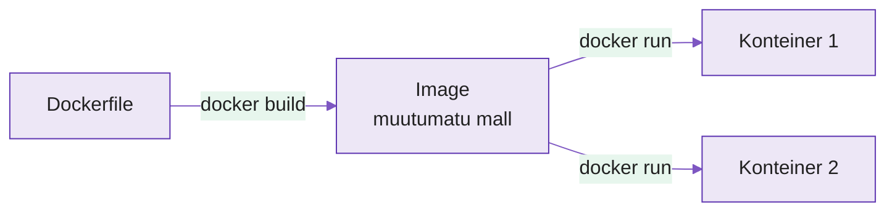

---
tags:
  - Docker
  - Konteinerid
  - Automatiseerimine
---

# Loeng — Rakenduse pakkimine ja ümberpaigutamine

**Kestus:** ~40 minutit
**Tase:** Algaste — eeldame et tead Git-i ja Ansible põhikäsklusi

---

!!! example "Näidisstsenaarium"
    Arendaja: "Aga minu masinas töötab."

    Sysadmin, kes on seda lauset kuulnud paarsada korda: pikk vaikus.

    Docker on vastus, mis lõpetab selle vestluse: kui su masinas töötab, siis saadame **su masina kaasa**. Rakendus liigub koos kogu oma keskkonnaga — sama Python, samad teegid, sama kõik.

---

## 1. "Töötab minu masinas" — mis probleem see on?

Eelmistel nädalatel seadistasime Ansible'iga serverit: paketid, konfiguratsioon, teenused. See lahendab serveri. Aga jääb teine probleem — rakendus ise.

Tüüpiline lugu: arendaja kirjutab Python-rakenduse sülearvutil, kus on Python 3.11 ja kindlad teegid kindlates versioonides. Kood läheb Git-i, sealt serverisse. Serveril on Python 3.9, mõned teegid vanemad, üks puudub üldse. Rakendus kukub käivitades kokku veaga, mida arendaja oma masinal kunagi ei näinud.

Probleem ei ole ainult Python versioonis — erinevused võivad olla OS-i tasemel, keskkonnamuutujates, failiõigustes. Iga selline erinevus on koht, kus "töötab minu masinas" muutub "ei tööta serveris".

Konteineri mõte: mitte serverit rakendusele sobivaks muuta, vaid panna rakendus oma keskkonda kaasa võtma. Sama pakk, sama käitumine, ükskõik kus see käivitub.

---

## 2. Image vs konteiner

**Image** on muutumatu mall — failide, teekide ja seadistuste komplekt, külmutatud kettale. Image ise ei tee midagi, ei käivitu, ei kasuta protsessoriaega.

**Konteiner** on image'i käivitatud eksemplar — protsess, millel on oma failisüsteem (image'ist), oma võrguliides, oma isoleeritud keskkond.

Analoogia: image on retsept, konteiner on retsepti järgi valminud roog. Samast retseptist saad sama rooga nii mitu korda kui tahad, iga kord identne — sest retsept ei muutu. Programmeerimises: image on klass, konteiner on objekt.

<figure markdown="span">

  <figcaption>Joonis 5.1. Ühest image'ist saab käivitada mitu identset konteinerit (Talvik, 2025).</figcaption>
</figure>

Kui üks konteiner kukub või kustutad, jääb image muutumatuks — käivitad uue ja saad täpselt sama algseisu tagasi.

---

## 3. Dockerfile — kuidas image ehitatakse

Image ei teki tühjast — selle jaoks kirjutatakse Dockerfile, mis kirjeldab samm-sammult mis image'isse läheb. Näide Flask-rakendusele:

```dockerfile
FROM python:3.11-slim

WORKDIR /app

COPY requirements.txt .
RUN pip install -r requirements.txt

COPY . .

EXPOSE 5000

CMD ["python", "app.py"]
```

`FROM` määrab baasimage'i — siin Python 3.11 kergekaalulises Debianis, mitte tühjast OS-ist. `WORKDIR` seab töökataloogi. `COPY requirements.txt .` toob **ainult** sõltuvuste faili enne ülejäänud koodi — teadlik valik: Docker jätab selle kihi vahele kui requirements.txt ei muutu, ja ehitamine kiireneb. `RUN pip install` paigaldab teegid image'isse. Teine `COPY` toob ülejäänud koodi. `EXPOSE` dokumenteerib pordi. `CMD` on käsk, mis käivitub konteineri käivitudes.

```bash
docker build -t minu-flask-app .
```

`-t` annab nime, punkt näitab et Dockerfile on praeguses kaustas.

---

## 4. Põhikäsklused

```bash
docker build -t minu-app .        # ehita image Dockerfile'ist
docker run -d -p 5000:5000 minu-app  # käivita konteiner
docker ps                          # töötavad konteinerid
docker stop <id>                   # peata
docker rm <id>                     # kustuta peatatud konteiner
```

`-d` käivitab taustal, `-p 5000:5000` seob konteineri sisemise pordi väljapoole — ilma selleta jääb rakendus konteineri sisse suletuks.

---

## 5. Docker vs Ansible — millal kumbagi

Need ei konkureeri. Ansible haldab **serverit** — OS, kettaseadistus, kasutajad, teenused. Docker pakib **ühe rakenduse** koos sõltuvustega nii, et see käitub identselt igal pool.

Praktikas koos: Ansible playbook seadistab serveri (paigaldab Docker'i, avab pordid, kontrollib kettaruumi), siis käivitab `docker run`. Server jääb Ansible'i alla, rakendus Docker'i alla.

Kui mõtled "kas Ansible või Docker" — küsi: kas see on osa **serverist** (tulemüür, kasutajad, ketas) või osa **rakendusest** (Python versioon, teegid, kood)? Esimene → Ansible, teine → Docker.

---

## 6. Miks tööl oluline

Suurtes tootmismeeskondades liigub sama image muutumatuna läbi kolme keskkonna: arendaja masin → staging → tootmine. Kui image läbib staging'us testid, on garanteeritud et tootmises käivitub täpselt sama kood samade teekidega — mitte "peaaegu sama, aga teise Python versiooniga koostatud".

See kaotab "töötab minu masinas" juurest. Arendaja ei anna serverile koodi, mida server peab ise õigesti käivitama — ta annab valmis paki, mis sisaldab kõike vajalikku. Kui viga tekib tootmises, käivitad sama image'i lokaalselt ja lähed veast täpselt sama moodi läbi.

---

## Kokkuvõte

- **Image on muutumatu mall, konteiner on selle käivitatud eksemplar** — ühest image'ist mitu identset konteinerit
- **Dockerfile kirjeldab kuidas image ehitatakse** — baasimage'ist käivituskäsuni
- **Põhikäsklused:** `build` ehitab, `run` käivitab, `ps` näitab, `stop` peatab, `rm` kustutab
- **Docker ei asenda Ansible't** — Ansible haldab serverit, Docker pakib rakendust
- **"Töötab minu masinas" kaob**, kui rakendus liigub koos kogu keskkonnaga

---

## Allikad

| Allikas | URL |
|---|---|
| Docker dokumentatsioon | <https://docs.docker.com> |
| Dockerfile referents | <https://docs.docker.com/reference/dockerfile/> |
| Docker Get Started | <https://docs.docker.com/get-started/> |

**Versioonid (testitud, juuli 2026):** Docker Engine `27.x`, Python baasimage `python:3.11-slim`.

---

*Järgmine: Praktikumis pakid oma Flask rakenduse Docker image'iks ja käivitad selle konteinerina.*
