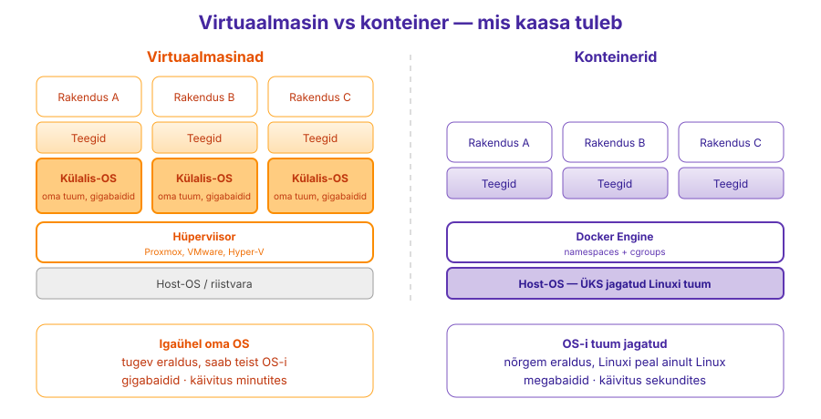
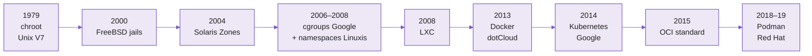
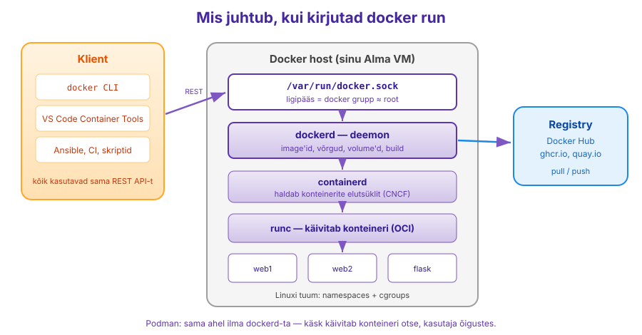
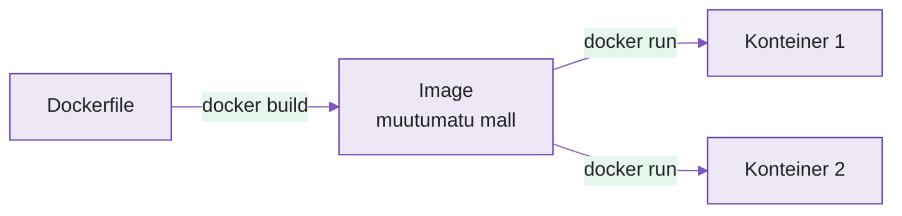
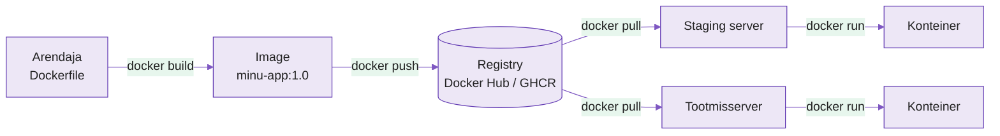
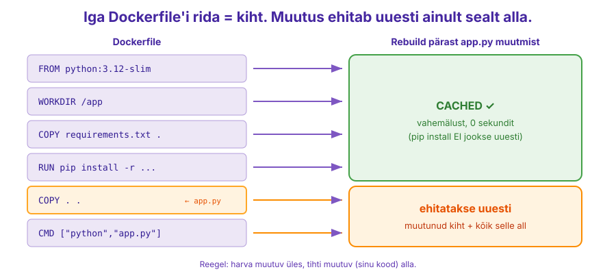
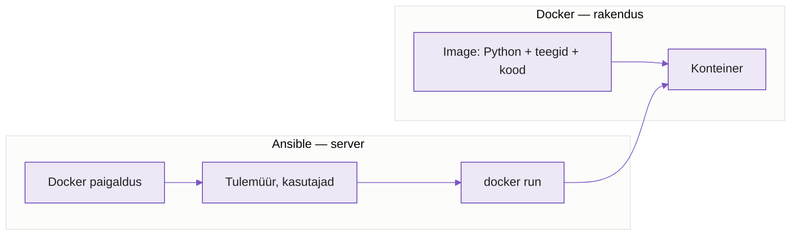

---
tags:
  - Docker
  - Konteinerid
  - Automatiseerimine
---

# Loeng — Rakenduse pakkimine ja ümberpaigutamine

**Kestus:** ~60 minutit
**Tase:** algaja — eeldame, et tunned Giti ja Ansible'i põhikäske

---

!!! example "Näidisstsenaarium"
    Arendaja: "Aga minu masinas töötab."

    Süsteemiadministraator, kes on seda lauset kuulnud sadu kordi: pikk vaikus.

    Docker lõpetab selle vestluse: kui rakendus töötab sinu masinas, saadame **sinu masina kaasa**. Rakendus liigub koos kogu oma keskkonnaga — sama Python, samad teegid, kõik on sama.

---

## 1. "Töötab minu masinas" — mis probleem see on?

Eelmistel nädalatel seadistasime Ansible'iga serverit: paketid, konfiguratsioon, teenused. Server on sellega korras, aga alles jääb teine probleem — rakendus ise.

Tüüpiline lugu: arendaja kirjutab Pythoni rakenduse oma sülearvutis, kus on Python 3.11 ja kindlate versioonidega teegid. Kood läheb Giti ja sealt serverisse. Serveris on Python 3.9, mõned teegid on vanemad ja üks puudub üldse. Käivitamisel jookseb rakendus kokku veaga, mida arendaja oma masinas kunagi ei näinud.

Probleem ei ole ainult Pythoni versioonis — erinevusi võib olla OS-is, keskkonnamuutujates ja failiõigustes. Iga selline erinevus on koht, kus "töötab minu masinas" muutub "ei tööta serveris".

Konteineri mõte: me ei kohanda serverit rakenduse järgi, vaid rakendus võtab oma keskkonna kaasa. Sama pakk käitub ühtemoodi, ükskõik kus see käivitatakse.

---

## 2. Virtuaalmasin vs konteiner

**Füüsilise masina piirangud:** üks server = üks OS = tavaliselt üks rakendus. Rakendus kasutab 10% protsessorist, ülejäänu seisab tühjalt, aga voolu ja ruumi võtab terve masin. Uue serveri saamine võtab nädalaid (ost, tarne, paigaldus). Riistvararike peatab kõik, mis selles masinas jookseb. Kui panna kaks rakendust samasse masinasse, segavad need teineteist (sama Python, samad pordid).

**Virtualiseerimine** jagab ühe füüsilise masina mitmeks **virtuaalmasinaks (VM)** — igal VM-il on oma virtuaalne riistvara ja **oma terve operatsioonisüsteem**. Ressursse jagab hüperviisor (Proxmox, VMware, VirtualBox, Hyper-V). Ka sinu kooli AlmaLinuxi masin on Proxmoxi VM.

**Virtualiseerimise eelised:** riistvara on täielikult kasutuses (kümned VM-id ühes serveris); VM-id on üksteisest isoleeritud — kui üks jookseb kokku, töötavad teised edasi; uue VM-i saab minutitega, mitte nädalatega; **snapshot** ja varukoopia enne riskantset muudatust; VM-i saab kolida teise füüsilisse serverisse (migratsioon); ühes masinas võivad olla eri OS-id (Windows ja Linux).

**Konteiner** läheb sammu edasi: see ei too kaasa oma OS-i tuuma, vaid **kasutab hosti Linuxi tuuma**. Kaasas on ainult rakendus ja selle teegid. Eraldatuse tagab Linuxi tuum ise: namespaces annavad oma protsessid, võrgu ja failisüsteemi, cgroups piiravad protsessori- ja mälukasutust.

| | Virtuaalmasin | Konteiner |
|---|---|---|
| Mis on kaasas | Terve OS + tuum + rakendus | Rakendus + teegid, tuum jagatud |
| Suurus | Gigabaidid | Megabaidid |
| Käivitus | Minutid | Sekundid |
| Isolatsioon | Tugev (eraldi tuum) | Nõrgem (jagatud tuum) |
| Teine OS (nt Windows Linuxi peal) | Saab | Ei saa |
| Tüüpiline kasutus | Server, erinevad OS-id, tugev eraldus | Rakendused, mikroteenused, CI/CD |

*Tabel 5.1. VM ja konteiner (Talvik, 2026).*

<figure markdown="span">
  
  <figcaption>Joonis 5.1. VM toob kaasa terve OS-i, konteiner ainult rakenduse ja teegid; tuum on ühine. Konteinerite eraldatuse tagab hosti tuum (Talvik, 2026).</figcaption>
</figure>

**Konteinerite eelised:** **teisaldatavus** — sama image töötab sülearvutis, serveris ja pilves; **kiirus** — käivitub sekunditega, sobib automaatseks skaleerimiseks; **kergus** — ühte VM-i mahub kümneid konteinereid; **korratavus** — Dockerfile on kood, sama sisend annab sama tulemuse; **eraldatus** — igal rakendusel on oma teegid ja need ei sega teisi. Konteinerid sobivad hästi **mikroteenustele** ja CI/CD-le.

**Millal kumba kasutada:**

| Olukord | Valik | Miks |
|---|---|---|
| Samas riistvaras on vaja nii Windowsi kui ka Linuxit | VM | Konteiner ei too oma tuuma |
| Tugev turvaeraldus (eri kliendid, vaenulik kood) | VM | Eraldi tuum = väiksem rünnakupind |
| Vana süsteem, terve server koos OS-iga | VM | See ei ole üks rakendus |
| Veebirakendus, API, mikroteenused | Konteiner | Kiire, kerge, skaleeritav |
| CI/CD testid — puhas keskkond igaks jooksuks | Konteiner | Käivitub ja kaob sekunditega |
| "Töötab minu masinas" — arendus ja tootmine peavad olema samad | Konteiner | Sama image igal pool |
| Õppelabor nagu meil | **Mõlemad** | Proxmoxi VM, selles Docker |

*Tabel 5.2. VM-i ja konteineri kasutusjuhud (Talvik, 2026).*

Need ei välista teineteist — praktikas jooksevad konteinerid **VM-i sees**. Täpselt nii on ka labis: Docker töötab sinu Proxmoxi AlmaLinuxi VM-is, aga konteineris jookseb hoopis Ubuntu. Distributsioon on erinev, tuum sama.

??? question "Mõtle"
    Labis näed `uname -r` väljundit nii VM-is kui konteineri sees. Ennusta: kas need on samad või erinevad? Miks?

### Kust konteinerid tulid

Docker ei leiutanud konteinerit — see tegi konteineri kasutamise **lihtsaks**. Idee on üle 40 aasta vana:

<figure markdown="span">

```mermaid
%%{init: {'theme':'base','themeVariables':{'primaryColor':'#ede7f6','primaryBorderColor':'#5e35b1','primaryTextColor':'#212121','lineColor':'#7e57c2'}}}%%
graph LR
    A[1979<br/>chroot<br/>Unix V7] --> B[2000<br/>FreeBSD jails]
    B --> C[2004<br/>Solaris Zones]
    C --> D[2006–2008<br/>cgroups Google<br/>+ namespaces Linuxis]
    D --> E[2008<br/>LXC]
    E --> F[2013<br/>Docker<br/>dotCloud]
    F --> G[2014<br/>Kubernetes<br/>Google]
    G --> H[2015<br/>OCI standard]
    H --> I[2018–19<br/>Podman<br/>Red Hat]
```
  <figcaption>Joonis 5.2. Konteinerite ajalugu: vajalikud tuuma võimalused olid olemas juba enne Dockerit; Docker lisas lihtsa tööriista, image'i vormingu ja Docker Hubi (Talvik, 2026).</figcaption>
</figure>

- **chroot (1979)** — protsess näeb ainult osa failisüsteemist. See oli esimene "oma juurkataloog".
- **FreeBSD jails (2000), Solaris Zones (2004)** — lisaks failidele on eraldi ka protsessid, võrk ja kasutajad.
- **cgroups + namespaces (Linux, 2006–2008)** — Google'i insenerid lisasid tuuma ressursipiirangud (cgroups); namespaces eraldavad protsessid, võrgu ja failisüsteemi. Need kaks koos **ongi** konteiner.
- **LXC (2008)** — esimesed "päris" Linuxi konteinerid, mida oli aga keeruline kasutada.
- **Docker (2013)** — firma dotCloud lõi lihtsa käsurea, `Dockerfile`-i, kihilise image'i ja registry (Docker Hub). Konteinerist sai arendaja tööriist.
- **Kubernetes (2014)** — Google avaldas orkestreerija paljude konteinerite haldamiseks.
- **OCI (2015)** — Open Container Initiative: image'i ja käivitamise standard. Tänu sellele töötab Dockeriga ehitatud image ka Podmanis ja Kubernetes'is.
- **Podman (Red Hat, versioon 1.0 aastal 2019)** — Dockeriga ühilduv, aga töötab ilma deemonita ja ilma root-õigusteta.

---

## 3. Kuidas Docker sees töötab

"Docker" tähendab kolme asja: **Docker Engine** (tarkvara, mis konteinereid käitab), **Docker, Inc.** (firma, mis müüb Docker Desktopi ja Docker Hubi tasulisi plaane) ja **avatud lähtekoodiga projekt**. Engine'i lähtekood on projektis **Moby** (<https://github.com/moby/moby>); Dockeri ametlikus GitHubis (<https://github.com/docker>) on CLI (`docker/cli`), Compose (`docker/compose`), Buildx ja dokumentatsioon (`docker/docs`). Ametlike image'ide (`nginx`, `python`...) retseptid on `docker-library` all.

Dockeril on **klient-server-arhitektuur**:

<figure markdown="span">
  
  <figcaption>Joonis 5.3. Käsk `docker` ise midagi ei käivita — see saadab päringu deemonile, mis teeb töö ära containerd ja runc abil (Talvik, 2026).</figcaption>
</figure>

- **Klient** (`docker` CLI, VS Code laiendus, Ansible) — saadab käsu REST API kaudu. Klient võib asuda ka teises masinas.
- **`/var/run/docker.sock`** — Unixi sokkel, mille kaudu klient deemoniga räägib. Sellest tuleb labis viga `permission denied ... docker.sock`: sa ei ole `docker` grupis. Samal põhjusel **`docker` grupp ≈ root**: kes pääseb soklile ligi, saab käivitada konteineri, mis ühendab enda sisse kogu hosti failisüsteemi (`/`).
- **`dockerd`** — deemon, mis haldab **Dockeri objekte**: image'id, konteinerid, **võrgud** (konteinerite omavaheline suhtlus) ja **volume'd** (andmed, mis jäävad alles ka pärast konteineri kustutamist — N6).
- **containerd** → **runc** — need käivitavad konteineri tegelikult. Docker andis containerd CNCF-ile (2017) ja runc-i OCI-le; samu komponente kasutab ka Kubernetes. Podmanil `dockerd` vahelüli puudub.

**Mis juhtub käsu `docker run nginx:1.27` ajal** — viis sammu:

<figure markdown="span">

```mermaid
%%{init: {'theme':'base','themeVariables':{'primaryColor':'#ede7f6','primaryBorderColor':'#5e35b1','primaryTextColor':'#212121','lineColor':'#7e57c2'}}}%%
sequenceDiagram
    participant K as Klient (docker CLI)
    participant D as dockerd
    participant R as Registry (Docker Hub)
    K->>D: docker run nginx:1.27 (REST, docker.sock)
    D->>D: kas image on kettal?
    D->>R: 1. pull — pole kettal, tõmba
    R-->>D: kihid
    D->>D: 2. loo konteiner image'ist
    D->>D: 3. lisa kirjutatav kiht
    D->>D: 4. võrguliides + vaikevõrk (bridge)
    D->>D: 5. käivita PID 1 (runc)
    D-->>K: konteineri ID
```
  <figcaption>Joonis 5.4. `docker run` = pull (kui vaja) + create + kirjutatav kiht + võrk + start (Talvik, 2026, ByteByteGo selgituse põhjal).</figcaption>
</figure>

Sama protsessi hea ülevaatejoonis (build, pull ja run ühel pildil): [ByteByteGo — How does Docker work?](https://bytebytego.com/guides/how-does-docker-work/).

**Kirjutatav kiht.** Image on kirjutuskaitstud. Konteineri käivitamisel lisatakse selle peale õhuke **kirjutatav kiht** — kõik, mida konteineris muudad (näiteks fail, mida muutsid `docker exec`-iga, või logid), salvestub sinna. `docker stop` + `start` jätab selle alles, `docker rm` **kustutab** selle. Järelikult on konteiner ajutine: olulised andmed kuuluvad volume'isse, seadistus image'isse (Dockerfile'i).

??? question "Mõtle"
    Kolleeg parandas tootmises `docker exec`-iga konteineri sees konfiguratsioonifaili ja kõik töötab. Järgmisel nädalal tehakse uus deploy (`rm` + `run` uuest image'ist). Mis juhtub ja kuidas oleks pidanud õigesti tegema?

---

## 4. Image vs konteiner

**Image** on muutumatu mall — failide, teekide ja seadistuste komplekt, mis on kettale salvestatud. Image ise midagi ei tee, ei käivitu ega kasuta protsessoriaega.

**Konteiner** on image'i käivitatud eksemplar — protsess, millel on oma failisüsteem (image'ist), oma võrguliides ja oma eraldatud keskkond.

Analoogia: image on retsept, konteiner on retsepti järgi valminud roog. Sama retsepti järgi saad teha sama rooga nii mitu korda, kui tahad, ja see tuleb iga kord samasugune, sest retsept ei muutu. Programmeerimises: image on klass, konteiner on objekt.

<figure markdown="span">

```mermaid
%%{init: {'theme':'base','themeVariables':{'primaryColor':'#ede7f6','primaryBorderColor':'#5e35b1','primaryTextColor':'#212121','lineColor':'#7e57c2'}}}%%
graph LR
    D[Dockerfile] -->|docker build| I[Image<br/>muutumatu mall]
    I -->|docker run| C1[Konteiner 1]
    I -->|docker run| C2[Konteiner 2]
```
  <figcaption>Joonis 5.5. Ühest image'ist saab käivitada mitu identset konteinerit (Talvik, 2026).</figcaption>
</figure>

Kui konteiner jookseb kokku või sa kustutad selle, jääb image samaks — käivitad uue konteineri ja saad täpselt sama algseisu tagasi.

---

## 5. Dockerfile — kuidas image ehitatakse

Image ei teki tühjast kohast — selle jaoks kirjutatakse Dockerfile, mis kirjeldab samm-sammult, mis image'isse läheb. Näide Flask-rakendusele:

```dockerfile
FROM python:3.12-slim

WORKDIR /app

COPY requirements.txt .
RUN pip install -r requirements.txt

COPY . .

EXPOSE 5000

CMD ["python", "app.py"]
```

`FROM` määrab baasimage'i — siin Python 3.12 kergel Debiani baasil, mitte tühi OS. `WORKDIR` määrab töökataloogi. `COPY requirements.txt .` kopeerib enne ülejäänud koodi **ainult** sõltuvuste faili. See on teadlik valik: kui `requirements.txt` ei muutu, võtab Docker selle kihi vahemälust ja ehitamine on kiirem. `RUN pip install` paigaldab teegid image'isse. Teine `COPY` kopeerib ülejäänud koodi. `EXPOSE` dokumenteerib pordi. `CMD` on käsk, mis käivitatakse konteineri käivitumisel.

```bash
docker build -t minu-flask-app .
```

`-t` annab image'ile nime, punkt näitab, et Dockerfile on praeguses kaustas.

---

## 6. Põhikäsklused

```bash
docker build -t minu-app .        # ehita image Dockerfile'ist
docker run -d -p 5000:5000 minu-app  # käivita konteiner
docker ps                          # töötavad konteinerid
docker stop <id>                   # peata
docker rm <id>                     # kustuta peatatud konteiner
docker logs <nimi>                 # konteineri väljund — esimene koht vigade otsimisel
docker exec -it <nimi> bash        # shell jooksva konteineri sisse
docker run -it --rm ubuntu:24.04 bash  # interaktiivne ühekordne konteiner
docker pull nginx:1.27             # tõmba image registry'st
docker images / docker rmi <image> # image'id kettal / kustuta
docker system prune                # koristus: peatatud konteinerid, kasutamata image'id
```

`-d` käivitab konteineri taustal, `-p 5000:5000` seob konteineri sisemise pordi hosti pordiga — ilma selleta ei pääse rakendusele konteinerist väljast ligi.

Kolm käivitusviisi: **taustal** (`-d`) — teenused, veebiserver; **interaktiivselt** (`-it`) — uurimiseks, saad terminali konteineri sees; **nimega** (`--name web1`) — siis ei pea juhuslikku ID-d kopeerima. `--rm` kustutab konteineri automaatselt, kui see lõpetab töö.

---

## 7. Image'i nimi, tag ja registry

Image'i täisnimi koosneb mitmest osast:

```text
ghcr.io / hkhk-automation / minu-nginx : v1
registry   nimeruum (kasutaja)  repo       tag
```

Kui kirjutad lühikese nime, lisab Docker puuduvad osad ise: `nginx` = `docker.io/library/nginx:latest` (Docker Hub, ametlik image, tag `latest`).

**Tag** on silt, mis viitab ühele image'ile. Ühel image'il võib olla mitu silti:

| Tag | Mida tähendab | Muutub? |
|---|---|---|
| `nginx:1.27.3` | Täpne versioon | Praktiliselt mitte |
| `nginx:1.27` | Uusim 1.27.x | Jah — iga paranduse järel |
| `nginx:1` | Uusim 1.x | Jah, tihti |
| `nginx:latest` | **Ainult vaikimisi nimi**, mille hooldaja võib panna ükskõik millisele versioonile | Jah, ettearvamatult |
| `nginx:1.27-alpine`, `python:3.12-slim` | Variant: väiksem baas (Alpine, slim Debian) | Nagu versioon |
| `nginx@sha256:4c0f...` | **Digest** — image'i sisu räsi | **Mitte kunagi** |

*Tabel 5.3. Tag'id ja digest (Talvik, 2026).*

**`latest` ei tähenda "uusim"** — see on lihtsalt tag, mille Docker võtab, kui sa ise tag'i ei kirjuta. Täna on see üks versioon, kuu pärast teine: sama Dockerfile ehitab erineva image'i ja "töötab minu masinas" on tagasi. Reeglid:

- **Tootmises alati konkreetne tag** (`nginx:1.27`), kriitilises kohas isegi digest (`@sha256:...`) — tag'i saab teisele image'ile ümber tõsta, digest'i mitte.
- **Oma image'ile pane versioon** (`v1`, `1.0.3`, Giti commit'i lühiräsi) — siis tead täpselt, mis tootmises jookseb, ja saad vajaduse korral tagasi minna (`v2` on katki → `docker run ...:v1`).
- **Ümbersildistamine** (`docker tag minu-app:v2 minu-app:latest`) ei kopeeri midagi — `IMAGE ID` jääb samaks, lisandub uus nimi.

Image'eid hoitakse **registry's**. Kõige tuntum on **Docker Hub** (<https://hub.docker.com>) — kui kirjutad `FROM nginx`, tuleb image sealt. Teised on näiteks GitHub Container Registry (`ghcr.io`), Quay.io (Red Hat) ja firmade oma registry'd. `docker pull` tõmbab image'i alla, `docker push` laadib selle üles (et jagada oma image'it meeskonnaga; vaja on `docker login`).

Docker Hubis vaata image'i lehel kolme asja:

- **Märgis** — *Docker Official Image* (Docker hooldab, nt `nginx`, `python`, `ubuntu`) või *Verified Publisher* (avaldab tootja ise). Need on usaldusväärsed. Suvaline `kasutaja123/nginx` võib sisaldada ükskõik mida.
- **Tags** vahekaart — näitab, millised versioonid on olemas (`1.27`, `1.27-alpine`, `latest`...).
- **Nimi** — ametliku image'i nime ees pole kasutajanime: `nginx` = `docker.io/library/nginx`.

**Oma image'i jagamine kolleegiga** — kolm viisi:

```bash
# 1. Registry kaudu (tavaline)
docker tag minu-app:1.0 kasutaja/minu-app:1.0   # uus nimi samale image'ile
docker login
docker push kasutaja/minu-app:1.0
# kolleeg: docker pull kasutaja/minu-app:1.0

# 2. Failina (ilma internetita, nt suletud võrk)
docker save -o minu-app.tar minu-app:1.0
# kolleeg: docker load -i minu-app.tar

# 3. Dockerfile Gitis — kolleeg ehitab ise (docker build)
```

`docker tag` ei kopeeri midagi — sama image saab lihtsalt veel ühe nime. `docker images` näitab mõlemat nime sama `IMAGE ID`-ga.

**Kettaruum:** iga uus build jätab vanad kihid alles. `docker system df` näitab, kui palju ruumi image'id, konteinerid ja vahemälu võtavad; `docker image prune` kustutab nimeta (`<none>`) image'id, `docker system prune` kõik kasutamata objektid.

Sisselogimata tõmbamisel on Docker Hubil piirang — kui terve klass tõmbab kooli ühe IP-aadressi tagant, võib piir täis saada. Siis aitab `docker login` (tasuta konto). Kui image'it kettal pole, tõmbab `docker run` selle ise.

<figure markdown="span">

```mermaid
%%{init: {'theme':'base','themeVariables':{'primaryColor':'#ede7f6','primaryBorderColor':'#5e35b1','primaryTextColor':'#212121','lineColor':'#7e57c2'}}}%%
graph LR
    A[Arendaja<br/>Dockerfile] -->|docker build| I[Image<br/>minu-app:1.0]
    I -->|docker push| R[(Registry<br/>Docker Hub / GHCR)]
    R -->|docker pull| S1[Staging server]
    R -->|docker pull| S2[Tootmisserver]
    S1 -->|docker run| C1[Konteiner]
    S2 -->|docker run| C2[Konteiner]
```
  <figcaption>Joonis 5.6. Sama image (sama tag) jõuab registry kaudu muutmata kujul igasse keskkonda — seepärast käitub see igal pool ühtemoodi (Talvik, 2026).</figcaption>
</figure>


**Kihid (layers):** iga Dockerfile'i rida on kiht. Docker salvestab kihid vahemällu ja ehitab uuesti alles muutunud kihist alates. Seepärast on järjekord oluline: harva muutuv (OS, teegid) üles, tihti muutuv (sinu kood) alla — nagu `requirements.txt` näites.

<figure markdown="span">
  
  <figcaption>Joonis 5.7. Kui muudad koodi, tulevad OS ja teegid vahemälust; uuesti ehitatakse ainult muutunud kiht ja kõik selle all olevad kihid (Talvik, 2026).</figcaption>
</figure>


---

## 8. Turvalisem ja seadistatav image

```dockerfile
FROM python:3.12-slim

ARG APP_VERSION=1.0          # ainult ehitamise ajal: docker build --build-arg APP_VERSION=2.0
ENV APP_ENV=production       # kehtib ka jooksvas konteineris; üle kirjutatav: docker run -e APP_ENV=dev

WORKDIR /app
COPY requirements.txt .
RUN pip install --no-cache-dir -r requirements.txt
COPY . .

RUN useradd --create-home appuser
USER appuser                 # sellest reast alates ei jookse käsud ega rakendus root'ina

CMD ["python", "app.py"]
```

Vaikimisi jookseb konteineris kõik **root**'ina. Kui rakenduses on turvaauk, saab ründaja konteineris root-õigused. `USER` vähendab võimalikku kahju.

Turvareeglid, mis sobivad igale Dockerfile'ile:

- **Usaldusväärne baasimage** — ametlik (Docker Official Image) või tuntud tootjalt, mitte suvaline `kasutaja123/python`
- **Konkreetne tag**, mitte `latest`
- **Vähem pakette** = vähem turvaauke — kasuta `-slim`/`alpine` image'eid ja ära paigalda tööriistu "igaks juhuks"
- **Mitte root** — `USER`
- **Saladused ei kuulu image'isse** — paroole ei panda `ENV`-i ega `ARG`-i ega kopeerita `COPY`-ga (meenuta N4 Vault'i). Igaüks saab image'i lahti pakkida — saladus jääb kihti alles ka siis, kui mõni hilisem rida selle kustutab.

**Mitmeetapiline build (multi-stage)** — ehitustööriistad (kompilaator, `npm`, `pip`-i vahemälu) ei pea lõppimage'isse jõudma:

```dockerfile
FROM node:20-alpine AS build      # etapp 1: ehita
WORKDIR /app
COPY package*.json ./
RUN npm ci
COPY . .
RUN npm run build

FROM nginx:1.27-alpine            # etapp 2: ainult tulemus
COPY --from=build /app/dist /usr/share/nginx/html
```

Lõppimage'is on ainult nginx ja valmis failid: see on sadu megabaite väiksem ja vähemate pakettidega, seega ka vähemate turvaaukudega.

**Andmeid ei hoita konteineris.** Konteiner on ajutine (kirjutatav kiht kaob `rm`-iga). Püsivate andmete jaoks on kaks võimalust:

- **Volume** — Dockeri hallatud andmeala: `docker volume create andmed`, `docker run -v andmed:/var/lib/mysql ...` — näiteks andmebaasidele.
- **Bind mount** — hosti kaust ühendatakse konteinerisse: `docker run -v $(pwd):/app ...` — arenduses, sest koodi muudatus on kohe näha.

Täpsemalt räägime sellest N6-s koos Compose'iga.

---

## 9. Docker vs Podman

AlmaLinuxis ja RHEL-is on vaikimisi **Podman** — Red Hati tööriist, mis ühildub Dockeriga. Käsud on samad (`podman build`, `podman run`, `podman ps`), image'id on samad (OCI standard) ja enamasti töötab isegi `alias docker=podman`.

| | Docker | Podman |
|---|---|---|
| Arhitektuur | Taustal deemon `dockerd` (root) | Deemonit pole — iga käsk on tavaline protsess |
| Root | Deemon töötab root-õigustes; `docker` grupp ≈ root | Vaikimisi **rootless** — töötab kasutaja enda õigustes |
| Pod'id | Ei | Jah — mitu konteinerit koos, nagu Kubernetes'is |
| Compose | `docker compose` | `podman compose` / `podman-compose` |
| Kus kasutatakse | Igal pool: arendajad, CI, Docker Desktop | RHEL/Alma/Fedora serverid, turvatundlikud keskkonnad |

*Tabel 5.4. Docker ja Podman (Talvik, 2026).*

Miks me kasutame Dockerit? See on valdkonnas levinuim tööriist, enamik juhendeid ja CI-süsteeme eeldab seda ning Compose (N6) töötab Dockeriga kõige sujuvamalt. Samas on **`docker` grupi liige sisuliselt root** — Podmani rootless-mudel on turvalisem. Kui lähed tööle firmasse, kus kasutatakse RHEL-i, puutud kokku Podmaniga; sinu oskused kehtivad seal üks ühele. Labi 14. osas paigaldad teise Alma VM-i Podmani ja käivitad seal sama image'i.

---

## 10. Ökosüsteem: Desktop, Compose, orkestreerimine

| Tööriist | Mis see on | Kus kohtad |
|---|---|---|
| **Docker Engine** | Deemon + CLI + API Linuxis | Serverid, meie VM |
| **Docker Desktop** | Windowsi ja Maci rakendus: Engine VM-is, CLI, Compose, Kubernetes, graafiline liides. Suurfirmadele tasuline | Arendaja sülearvuti |
| **Docker Compose** | Mitu konteinerit ühest YAML-failist, ühe käsuga (`docker compose up`) | **N6** |
| **Docker Swarm** | Dockeri enda lihtne orkestreerija mitmele serverile | Väiksemad paigaldused |
| **Kubernetes** | Orkestreerijate standard: paigaldus, uuendused, koormuse jaotamine, tervisekontroll, skaleerimine. Google'i Borgi järeltulija, avaldatud 2014, CNCF-is alates 2015 | Suured süsteemid, pilv (EKS, AKS, GKE, OpenShift) |
| **Docker Scout** / Trivy | Image'i turvaaukude skannimine | CI/CD, DevSecOps |

*Tabel 5.5. Konteinerite ökosüsteem (Talvik, 2026).*

**Kus konteinereid kasutatakse:**

- **Mikroteenused** — rakendus on jagatud väikesteks iseseisvateks teenusteks (kasutajad, maksed, otsing). Iga teenus on oma konteineris ning seda uuendatakse ja skaleeritakse eraldi.
- **CI/CD** — iga test jookseb puhtas konteineris; sama image läheb testist tootmisse (N7).
- **Pilve kolimine ja hübriidpilv** — sama image töötab oma serveris, AWS-is ja Azure'is; teenusepakkuja vahetamiseks ei pea rakendust ümber ehitama.
- **Containers as a Service** — pilveteenus käitab sinu konteinereid ise (AWS ECS/Fargate, Azure Container Apps, Google Cloud Run).
- **AI/ML** — mudel ja täpselt õiged teekide versioonid (CUDA, PyTorch) on ühes pakis.

**Turvalisus ei teki iseenesest:** konteinerid on eraldatud, aga **mitte täielikult** — ühine tuum tähendab, et tuuma turvaauk mõjutab kõiki konteinereid. Seepärast: mitte-root kasutaja (`USER`), ametlikud image'id, skannimine enne tootmist ja VM-i eraldus võõra koodi jaoks.

---

## 11. Docker vs Ansible — millal kumba kasutada

Need ei konkureeri omavahel. Ansible haldab **serverit** — OS-i, kettaid, kasutajaid ja teenuseid. Docker pakib **ühe rakenduse** koos sõltuvustega nii, et see käitub igal pool ühtemoodi.

Praktikas kasutatakse neid koos: Ansible'i playbook seadistab serveri (paigaldab Dockeri, avab pordid, kontrollib kettaruumi) ja käivitab siis konteineri. Serverit haldab Ansible, rakendust Docker.

<figure markdown="span">

```mermaid
%%{init: {'theme':'base','themeVariables':{'primaryColor':'#ede7f6','primaryBorderColor':'#5e35b1','primaryTextColor':'#212121','lineColor':'#7e57c2'}}}%%
graph LR
    subgraph Ansible[Ansible — server]
      P1[Docker paigaldus] --> P2[Tulemüür, kasutajad] --> P3[docker run]
    end
    subgraph Docker[Docker — rakendus]
      I[Image: Python + teegid + kood] --> C[Konteiner]
    end
    P3 --> C
```
  <figcaption>Joonis 5.8. Ansible valmistab serveri ette ja käivitab konteineri; mis on konteineri sees, määrab image (Talvik, 2026).</figcaption>
</figure>


Kui konteinereid on kümneid või sadu mitmel serveril, võtab nende haldamise üle **orkestreerija** (vt Tabel 5.5). Järgmisel nädalal teeme vahesammu: Docker Compose ja mitu teenust ühes masinas.

Kui kahtled, kas kasutada Ansible'it või Dockerit, küsi: kas see on osa **serverist** (tulemüür, kasutajad, ketas) või osa **rakendusest** (Pythoni versioon, teegid, kood)? Esimesel juhul Ansible, teisel Docker.

---

## 12. Miks see on tööl oluline

Suurtes meeskondades liigub sama image muutmata kujul läbi kolme keskkonna: arendaja masin → testkeskkond (staging) → tootmine. Kui image läbib testkeskkonnas testid, on kindel, et tootmises käivitub täpselt sama kood samade teekidega — mitte "peaaegu sama, aga teise Pythoni versiooniga".

Nii kaob probleem "töötab minu masinas" juurtega. Arendaja ei anna serverile koodi, mille server peab ise õigesti käivitama, vaid valmis paki, milles on kõik vajalik olemas. Kui tootmises tekib viga, käivitad sama image'i oma masinas ja näed täpselt sama viga.

---

## Kokkuvõte

- **Konteiner pole uus** — chroot (1979) → cgroups/namespaces → Docker (2013), mis tegi selle lihtsaks; OCI standard ühendab Dockeri, Podmani ja Kubernetese
- **VM virtualiseerib riistvara (oma OS), konteiner jagab hosti tuuma** — konteiner on kergem ja kiirem, aga eraldatus nõrgem
- **Image on muutumatu mall, konteiner on selle käivitatud eksemplar** — ühest image'ist saab mitu ühesugust konteinerit
- **Dockerfile kirjeldab, kuidas image ehitatakse** — baasimage'ist käivituskäsuni
- **Põhikäsklused:** `build` ehitab, `run` käivitab, `ps` näitab, `stop` peatab, `rm` kustutab
- **VM-i eelised:** ressursid, eraldus, snapshot, migratsioon; **konteineri eelised:** teisaldatavus, kiirus, kergus, korratavus
- **Jagamine:** `tag` + `push`/`pull` või failina `save`/`load`; kettaruum: `system df`, `prune`
- **Tag on silt, digest on sisu** — `latest` on ainult vaikimisi nimi, mitte "uusim"; tootmises kasuta konkreetset tag'i või digest'i
- **Multi-stage build** teeb image'i väikeseks; **volume** hoiab andmeid alles ka pärast konteineri kustutamist; kihid ja vahemälu teevad ehitamise kiireks
- **Turvaline image:** ametlik baasimage, konkreetne tag, vähe pakette, `USER`, saladused image'ist väljas
- **Arhitektuur:** klient → `docker.sock` → `dockerd` → containerd → runc; `docker` grupp ≈ root; konteineri kirjutatav kiht kaob `rm`-iga
- **Ökosüsteem:** Desktop, Compose (N6), Swarm, Kubernetes; kasutusalad: mikroteenused, CI/CD, pilv, AI/ML
- **Docker Hub** — ametlikud ja kinnitatud (verified) image'id; Podman ühildub Dockeriga, töötab ilma deemonita ja rootless'ina
- **Docker ei asenda Ansible'it** — Ansible haldab serverit, Docker pakib rakendust
- **"Töötab minu masinas" kaob**, kui rakendus liigub koos kogu keskkonnaga

---

## Allikad

| Allikas | URL |
|---|---|
| Docker dokumentatsioon | <https://docs.docker.com> |
| Dockerfile'i juhend | <https://docs.docker.com/reference/dockerfile/> |
| Docker Get Started | <https://docs.docker.com/get-started/> |
| Docker Engine paigaldus RHEL/Alma | <https://docs.docker.com/engine/install/rhel/> |
| Docker Hub | <https://hub.docker.com> |
| Podman | <https://podman.io/docs> |
| VS Code Container Tools | <https://code.visualstudio.com/docs/containers/overview> |
| Open Container Initiative | <https://opencontainers.org> |
| OpenReplay: Beginner's guide to images and containers | <https://blog.openreplay.com/beginner-guide-docker-images-containers/> |
| Docker: image tags best practices | <https://docs.docker.com/build/building/best-practices/> |
| ByteByteGo: How does Docker work? | <https://bytebytego.com/guides/how-does-docker-work/> |
| IBM: What is Docker? | <https://www.ibm.com/think/topics/docker> |
| Docker GitHub (CLI, Compose, docs) | <https://github.com/docker> |
| Moby (Docker Engine lähtekood) | <https://github.com/moby/moby> |
| Ametlike image'ide retseptid | <https://github.com/docker-library/official-images> |

**Versioonid:** Docker Engine `29.x` (AlmaLinux 9, docker-ce repo), Python baasimage `python:3.12-slim`.

---

*Järgmisena: praktikumis pakid oma Flaski rakenduse Docker image'iks ja käivitad selle konteinerina.*
