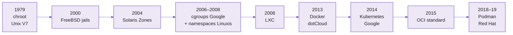
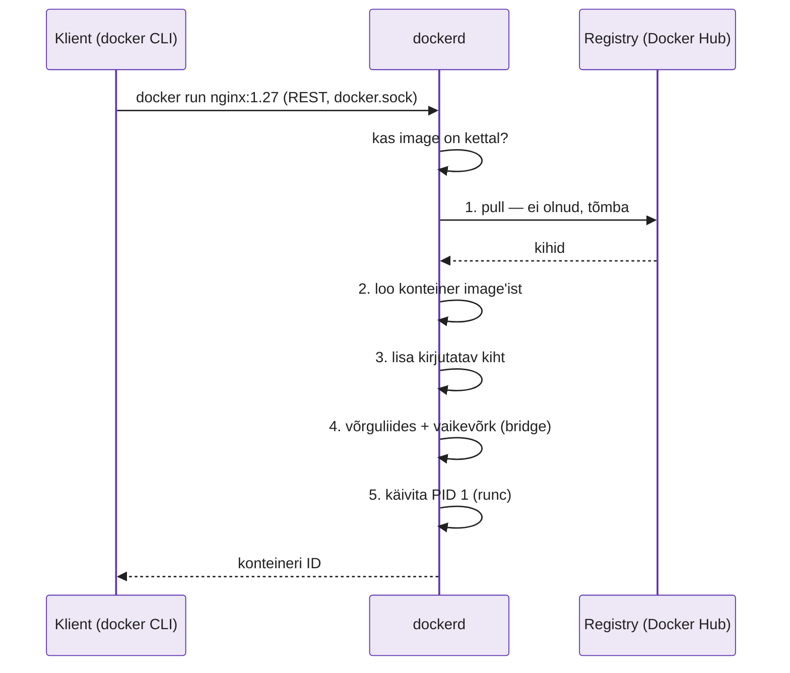
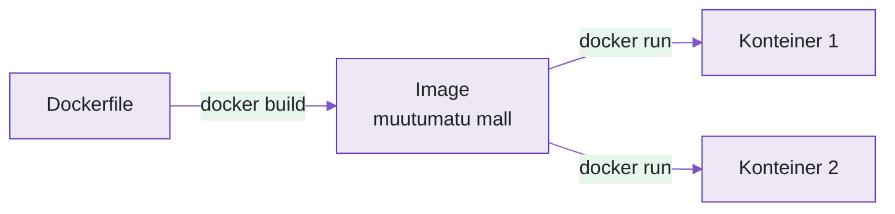
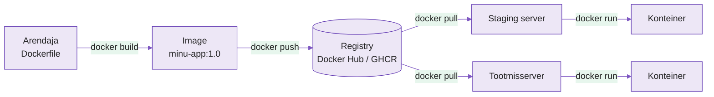
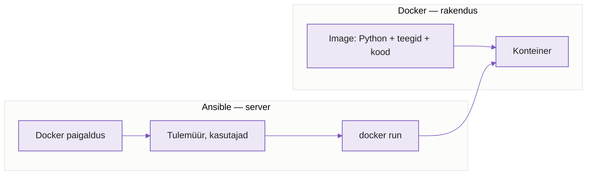

---
tags:
  - Docker
  - Konteinerid
  - Automatiseerimine
---

# Loeng — Rakenduse pakkimine ja ümberpaigutamine

**Kestus:** ~60 minutit
**Tase:** Algaste — eeldame et tead Git-i ja Ansible põhikäsklusi

---

!!! example "Näidisstsenaarium"
    Arendaja: "Aga minu masinas töötab."

    Sysadmin, kes on seda lauset kuulnud paarsada korda: pikk vaikus.

    Docker on vastus, mis lõpetab selle vestluse: kui su masinas töötab, siis saadame **su masina kaasa**. Rakendus liigub koos kogu oma keskkonnaga — sama Python, samad teegid, sama kõik.

---

## 1. "Töötab minu masinas" — mis probleem see on?

Eelmistel nädalatel seadistasime Ansible'iga serverit: paketid, konfiguratsioon, teenused. See lahendab serveri. Aga jääb teine probleem — rakendus ise.

Tüüpiline lugu: arendaja kirjutab Python-rakenduse sülearvutil, kus on Python 3.11 ja kindlad teegid kindlates versioonides. Kood läheb Git-i, sealt serverisse. Serveril on Python 3.9, mõned teegid vanemad, üks puudub üldse. Rakendus kukub käivitades kokku veaga, mida arendaja oma masinal kunagi ei näinud.

Probleem ei ole ainult Python versioonis — erinevused võivad olla OS-i tasemel, keskkonnamuutujates, failiõigustes. Iga selline erinevus on koht, kus "töötab minu masinas" muutub "ei tööta serveris".

Konteineri mõte: mitte serverit rakendusele sobivaks muuta, vaid panna rakendus oma keskkonda kaasa võtma. Sama pakk, sama käitumine, ükskõik kus see käivitub.

---

## 2. Virtuaalmasin vs konteiner

**Füüsilise masina piirangud:** üks server = üks OS = tavaliselt üks rakendus. Rakendus kasutab 10% protsessorist, ülejäänu seisab, aga voolu ja ruumi võtab kogu kast. Uue serveri saamine võtab nädalaid (ost, kohaletoimetus, paigaldus). Riistvararike viib maha kõik, mis seal jookseb. Kahe rakenduse panek ühte masinasse tähendab, et nad segavad teineteist (sama Python, samad pordid).

**Virtualiseerimine** jagab ühe füüsilise masina mitmeks **virtuaalmasinaks (VM)** — iga VM-il oma virtuaalne riistvara ja **oma terve operatsioonisüsteem**. Hüperviisor (Proxmox, VMware, VirtualBox, Hyper-V) jagab ressursse. Sinu kooli AlmaLinux ongi Proxmoxi VM.

**Virtualiseerimise eelised:** riistvara kasutatakse ära (kümned VM-id ühel serveril); VM-id on üksteisest isoleeritud — üks kukub, teised elavad; uus VM minutitega, mitte nädalatega; **snapshot** ja varukoopia (enne riskantset muudatust); VM-i saab teise füüsilisse serverisse kolida (migratsioon); ühel masinal eri OS-id (Windows + Linux).

**Konteiner** läheb sammu edasi: ta ei too kaasa oma OS-i tuuma, vaid **jagab hosti Linuxi tuuma**. Kaasas on ainult rakendus ja tema teegid. Isolatsiooni teeb Linuxi tuum ise (namespaces — oma protsessid, võrk, failisüsteem; cgroups — CPU/RAM piirangud).

| | Virtuaalmasin | Konteiner |
|---|---|---|
| Mis kaasas | Terve OS + tuum + rakendus | Rakendus + teegid, tuum jagatud |
| Suurus | Gigabaidid | Megabaidid |
| Käivitus | Minutid | Sekundid |
| Isolatsioon | Tugev (eraldi tuum) | Nõrgem (jagatud tuum) |
| Teine OS (nt Windows Linuxi peal) | Saab | Ei saa |
| Tüüpiline kasutus | Server, erinevad OS-id, tugev eraldus | Rakendused, mikroteenused, CI/CD |

*Tabel 5.1. VM ja konteiner (Talvik, 2026).*

<figure markdown="span">
  
  <figcaption>Joonis 5.1. VM toob kaasa terve OS-i; konteiner ainult rakenduse ja teegid, tuum on jagatud. Konteineri isolatsiooni teeb host-tuum ise (Talvik, 2026).</figcaption>
</figure>

**Konteinerite eelised:** **porditavus** — sama image jookseb sülearvutis, serveris ja pilves; **kiirus** — käivitus sekunditega, sobib automaatseks skaleerimiseks; **kergus** — ühele VM-ile mahub kümneid konteinereid; **korratavus** — Dockerfile on kood, sama sisend = sama tulemus; **eraldatus** — iga rakendus oma teekidega, ei sega teisi; sobib **mikroteenustele** ja CI/CD-le.

**Millal kumba:**

| Olukord | Valik | Miks |
|---|---|---|
| Vaja Windowsi ja Linuxi samal raual | VM | Konteiner ei too oma tuuma |
| Tugev turvaeraldus (eri kliendid, vaenulik kood) | VM | Eraldi tuum = väiksem rünnakupind |
| Pärandsüsteem, terve server koos OS-iga | VM | Ei ole "üks rakendus" |
| Veebirakendus, API, mikroteenused | Konteiner | Kiire, kerge, skaleeritav |
| CI/CD testid — puhas keskkond igaks jooksuks | Konteiner | Sekunditega üles ja minema |
| "Töötab minu masinas" — arendus = tootmine | Konteiner | Sama image igal pool |
| Õppelabor nagu meil | **Mõlemad** | Proxmox VM → selles Docker |

*Tabel 5.2. VM-i ja konteineri kasutusjuhud (Talvik, 2026).*

Need ei välista teineteist — praktikas jooksevad konteinerid **VM-i sees**. Täpselt nii teed ka labis: Docker sinu Proxmoxi AlmaLinuxi VM-is, ja konteineris jookseb… Ubuntu. Erinev distro, sama tuum.

??? question "Mõtle"
    Labis näed `uname -r` väljundit nii VM-is kui konteineri sees. Ennusta: kas need on samad või erinevad? Miks?

### Kust konteinerid tulid

Docker ei leiutanud konteinerit — ta tegi selle **lihtsaks**. Idee on 40 aastat vana:

<figure markdown="span">

```mermaid
%%{init: {'theme':'base','themeVariables':{'primaryColor':'#ede7f6','primaryBorderColor':'#5e35b1','primaryTextColor':'#212121','lineColor':'#7e57c2'}}}%%
graph LR
    A[1979<br/>chroot<br/>Unix V7] --> B[2000<br/>FreeBSD jails]
    B --> C[2004<br/>Solaris Zones]
    C --> D[2006–2008<br/>cgroups Google<br/>+ namespaces Linuxis]
    D --> E[2008<br/>LXC]
    E --> F[2013<br/>Docker<br/>dotCloud]
    F --> G[2014<br/>Kubernetes<br/>Google]
    G --> H[2015<br/>OCI standard]
    H --> I[2018–19<br/>Podman<br/>Red Hat]
```
  <figcaption>Joonis 5.2. Konteinerite ajalugu: tuuma võimalused olid olemas enne Dockerit; Docker lisas lihtsa tööriista, image'i formaadi ja Docker Hubi (Talvik, 2026).</figcaption>
</figure>

- **chroot (1979)** — protsess näeb ainult osa failisüsteemist. Esimene "oma juurkataloog".
- **FreeBSD jails (2000), Solaris Zones (2004)** — lisaks failidele ka eraldi protsessid, võrk, kasutajad.
- **cgroups + namespaces (Linux, 2006–2008)** — Google'i insenerid lisasid tuuma ressursipiirangud (cgroups); namespaces eraldavad protsessid, võrgu, failisüsteemi. Need kaks **ongi** konteiner.
- **LXC (2008)** — esimesed "päris" Linuxi konteinerid, aga keerulised kasutada.
- **Docker (2013)** — firma dotCloud tegi lihtsa käsurea, `Dockerfile`-i, kihilise image'i ja registry (Docker Hub). Konteiner muutus arendaja tööriistaks.
- **Kubernetes (2014)** — Google avaldas orkestreerija paljude konteinerite haldamiseks.
- **OCI (2015)** — Open Container Initiative: image'i ja käivitamise standard. Seepärast töötab Dockeriga ehitatud image ka Podmanis ja Kubernetes'is.
- **Podman (Red Hat, 1.0 2019)** — Dockeriga ühilduv, aga ilma deemonita ja root'ita.

---

## 3. Kuidas Docker sees töötab

"Docker" tähendab kolme asja: **Docker Engine** (tarkvara, mis konteinereid käitab), **Docker, Inc.** (firma, kes müüb Docker Desktopi ja Docker Hubi tasulisi plaane) ja **avatud lähtekoodiga projekt**. Engine'i lähtekood on projektis **Moby** (<https://github.com/moby/moby>); Dockeri ametlik GitHub (<https://github.com/docker>) hoiab CLI-d (`docker/cli`), Compose'i (`docker/compose`), Buildx-i ja dokumentatsiooni (`docker/docs`). Ametlike image'ide (`nginx`, `python`...) retseptid on `docker-library` all.

Docker on **klient–server** arhitektuuriga:

<figure markdown="span">
  
  <figcaption>Joonis 5.3. `docker` käsk ise ei käivita midagi — ta saadab päringu deemonile, mis teeb töö containerd ja runc abil (Talvik, 2026).</figcaption>
</figure>

- **Klient** (`docker` CLI, VS Code laiendus, Ansible) — saadab käsu REST API kaudu. Võib olla ka teises masinas.
- **`/var/run/docker.sock`** — Unixi sokkel, mille kaudu klient deemoniga räägib. Seepärast labis `permission denied ... docker.sock`: sa pole `docker` grupis. Ja seepärast **`docker` grupp ≈ root**: kes saab sokliga rääkida, saab käivitada konteineri, mis haagib hosti `/` sisse.
- **`dockerd`** — deemon, haldab **Docker objekte**: image'id, konteinerid, **võrgud** (konteinerid räägivad omavahel), **volume'd** (andmed, mis elavad üle konteineri kustutamise — N6).
- **containerd** → **runc** — tegelik käivitaja. Docker annetas containerd CNCF-ile (2017) ja runc-i OCI-le; samu tükke kasutab Kubernetes. Podman jätab `dockerd` vahelt ära.

**Mis toimub `docker run nginx:1.27` ajal** — viis sammu:

<figure markdown="span">

```mermaid
%%{init: {'theme':'base','themeVariables':{'primaryColor':'#ede7f6','primaryBorderColor':'#5e35b1','primaryTextColor':'#212121','lineColor':'#7e57c2'}}}%%
sequenceDiagram
    participant K as Klient (docker CLI)
    participant D as dockerd
    participant R as Registry (Docker Hub)
    K->>D: docker run nginx:1.27 (REST, docker.sock)
    D->>D: kas image on kettal?
    D->>R: 1. pull — ei olnud, tõmba
    R-->>D: kihid
    D->>D: 2. loo konteiner image'ist
    D->>D: 3. lisa kirjutatav kiht
    D->>D: 4. võrguliides + vaikevõrk (bridge)
    D->>D: 5. käivita PID 1 (runc)
    D-->>K: konteineri ID
```
  <figcaption>Joonis 5.4. `docker run` = pull (kui vaja) + create + kirjutatav kiht + võrk + start (Talvik, 2026, ByteByteGo selgituse põhjal).</figcaption>
</figure>

Hea ülevaatepilt sama kohta (build, pull, run ühel joonisel): [ByteByteGo — How does Docker work?](https://bytebytego.com/guides/how-does-docker-work/).

**Kirjutatav kiht.** Image on kirjutuskaitstud. Konteineri käivitamisel lisatakse peale õhuke **kirjutatav kiht** — kõik, mida konteineris muudad (`docker exec`-iga faili muutmine, logid), läheb sinna. `docker stop` + `start` jätab selle alles; `docker rm` **kustutab** selle. Seega: konteiner on ajutine, olulised andmed käivad volume'isse või image'isse (Dockerfile).

??? question "Mõtle"
    Kolleeg parandas tootmises `docker exec`-iga konteineris konfifaili ja kõik töötab. Järgmisel nädalal tehakse uus deploy (`rm` + `run` uuest image'ist). Mis juhtub ja kuidas oleks pidanud tegema?

---

## 4. Image vs konteiner

**Image** on muutumatu mall — failide, teekide ja seadistuste komplekt, külmutatud kettale. Image ise ei tee midagi, ei käivitu, ei kasuta protsessoriaega.

**Konteiner** on image'i käivitatud eksemplar — protsess, millel on oma failisüsteem (image'ist), oma võrguliides, oma isoleeritud keskkond.

Analoogia: image on retsept, konteiner on retsepti järgi valminud roog. Samast retseptist saad sama rooga nii mitu korda kui tahad, iga kord identne — sest retsept ei muutu. Programmeerimises: image on klass, konteiner on objekt.

<figure markdown="span">

```mermaid
%%{init: {'theme':'base','themeVariables':{'primaryColor':'#ede7f6','primaryBorderColor':'#5e35b1','primaryTextColor':'#212121','lineColor':'#7e57c2'}}}%%
graph LR
    D[Dockerfile] -->|docker build| I[Image<br/>muutumatu mall]
    I -->|docker run| C1[Konteiner 1]
    I -->|docker run| C2[Konteiner 2]
```
  <figcaption>Joonis 5.5. Ühest image'ist saab käivitada mitu identset konteinerit (Talvik, 2026).</figcaption>
</figure>

Kui üks konteiner kukub või kustutad, jääb image muutumatuks — käivitad uue ja saad täpselt sama algseisu tagasi.

---

## 5. Dockerfile — kuidas image ehitatakse

Image ei teki tühjast — selle jaoks kirjutatakse Dockerfile, mis kirjeldab samm-sammult mis image'isse läheb. Näide Flask-rakendusele:

```dockerfile
FROM python:3.12-slim

WORKDIR /app

COPY requirements.txt .
RUN pip install -r requirements.txt

COPY . .

EXPOSE 5000

CMD ["python", "app.py"]
```

`FROM` määrab baasimage'i — siin Python 3.12 kergekaalulises Debianis, mitte tühjast OS-ist. `WORKDIR` seab töökataloogi. `COPY requirements.txt .` toob **ainult** sõltuvuste faili enne ülejäänud koodi — teadlik valik: Docker jätab selle kihi vahele kui requirements.txt ei muutu, ja ehitamine kiireneb. `RUN pip install` paigaldab teegid image'isse. Teine `COPY` toob ülejäänud koodi. `EXPOSE` dokumenteerib pordi. `CMD` on käsk, mis käivitub konteineri käivitudes.

```bash
docker build -t minu-flask-app .
```

`-t` annab nime, punkt näitab et Dockerfile on praeguses kaustas.

---

## 6. Põhikäsklused

```bash
docker build -t minu-app .        # ehita image Dockerfile'ist
docker run -d -p 5000:5000 minu-app  # käivita konteiner
docker ps                          # töötavad konteinerid
docker stop <id>                   # peata
docker rm <id>                     # kustuta peatatud konteiner
docker logs <nimi>                 # konteineri väljund — esimene koht vigade otsimisel
docker exec -it <nimi> bash        # shell jooksva konteineri sisse
docker run -it --rm ubuntu:24.04 bash  # interaktiivne ühekordne konteiner
docker pull nginx:1.27             # tõmba image registry'st
docker images / docker rmi <image> # image'id kettal / kustuta
docker system prune                # koristus: peatatud konteinerid, kasutamata image'id
```

`-d` käivitab taustal, `-p 5000:5000` seob konteineri sisemise pordi väljapoole — ilma selleta jääb rakendus konteineri sisse suletuks.

Kolm käivitusviisi: **taustal** (`-d`) — teenused, veebiserver; **interaktiivselt** (`-it`) — uurimiseks, terminal konteineri sees; **nimega** (`--name web1`) — et ei peaks juhuslikku ID-d kopeerima. `--rm` kustutab konteineri ise, kui see lõpeb.

---

## 7. Image'i nimi, tag ja registry

Image'i täisnimi koosneb osadest:

```text
ghcr.io / hkhk-automation / minu-nginx : v1
registry   nimeruum (kasutaja)  repo       tag
```

Lühikesel kujul puuduvad osad täidetakse: `nginx` = `docker.io/library/nginx:latest` (Docker Hub, ametlik image, tag `latest`).

**Tag** on silt, mis näitab ühele image'ile. Üks image võib kanda mitut silti:

| Tag | Mida tähendab | Muutub? |
|---|---|---|
| `nginx:1.27.3` | Täpne versioon | Praktiliselt ei |
| `nginx:1.27` | Uusim 1.27.x | Jah — iga paranduse järel |
| `nginx:1` | Uusim 1.x | Jah, tihti |
| `nginx:latest` | **Ainult vaikimisi nimi**, mida hooldaja paneb kuhu tahab | Jah, ettearvamatult |
| `nginx:1.27-alpine`, `python:3.12-slim` | Variant: väiksem baas (Alpine, slim Debian) | Nagu versioon |
| `nginx@sha256:4c0f...` | **Digest** — image'i sisu räsi | **Mitte kunagi** |

*Tabel 5.3. Tag'id ja digest (Talvik, 2026).*

**`latest` ei tähenda "uusim"** — see on lihtsalt tag, mille Docker võtab, kui sa ise ei kirjuta. Täna üks versioon, kuu pärast teine: sama Dockerfile ehitab erineva image'i ja "töötab minu masinas" on tagasi. Reeglid:

- **Tootmises alati konkreetne tag** (`nginx:1.27`), kriitilises kohas isegi digest (`@sha256:...`) — tag'i saab ümber tõsta, digest'i mitte.
- **Oma image'ile pane versioon** (`v1`, `1.0.3`, Giti commit'i lühiräsi) — siis tead täpselt, mis tootmises jookseb, ja saad tagasi minna (`v2` katki → `docker run ...:v1`).
- **Ümbersildistamine** (`docker tag minu-app:v2 minu-app:latest`) ei kopeeri midagi — sama `IMAGE ID`, uus nimi.

Image'id elavad **registry's**. Kõige tuntum on **Docker Hub** (<https://hub.docker.com>) — kui kirjutad `FROM nginx`, tuleb see sealt. Teised: GitHub Container Registry (`ghcr.io`), Quay.io (Red Hat), firmade oma registry'd. `docker pull` tõmbab, `docker push` laeb üles (oma image jagamiseks meeskonnaga; vajab `docker login`).

Docker Hubis vaata image'i lehel kolme asja:

- **Märgis** — *Docker Official Image* (Dockeri hooldatud, nt `nginx`, `python`, `ubuntu`) või *Verified Publisher* (tootja ise). Need on usaldusväärsed. Suvaline `kasutaja123/nginx` võib sisaldada ükskõik mida.
- **Tags** vahekaart — millised versioonid on olemas (`1.27`, `1.27-alpine`, `latest`...).
- **Nimi** — ametlikul image'il pole kasutajanime ees: `nginx` = `docker.io/library/nginx`.

**Oma image'i jagamine kolleegiga** — kolm viisi:

```bash
# 1. Registry kaudu (tavaline)
docker tag minu-app:1.0 kasutaja/minu-app:1.0   # uus nimi samale image'ile
docker login
docker push kasutaja/minu-app:1.0
# kolleeg: docker pull kasutaja/minu-app:1.0

# 2. Failina (ilma internetita, nt suletud võrk)
docker save -o minu-app.tar minu-app:1.0
# kolleeg: docker load -i minu-app.tar

# 3. Dockerfile Gitis — kolleeg ehitab ise (docker build)
```

`docker tag` ei kopeeri midagi — sama image saab lihtsalt teise nime. `docker images` näitab mõlemat sama `IMAGE ID`-ga.

**Kettaruum:** iga rebuild jätab vanad kihid alles. `docker system df` näitab, palju image'id, konteinerid ja vahemälu ruumi võtavad; `docker image prune` kustutab nimetud (`<none>`) image'id, `docker system prune` kõik kasutamata.

Anonüümsel tõmbamisel on Docker Hubil kiiruspiirang — terve klass ühe kooli IP tagant võib selle täis saada. Siis aitab `docker login` (tasuta konto). `docker run` tõmbab ise, kui image'it kettal pole.

<figure markdown="span">

```mermaid
%%{init: {'theme':'base','themeVariables':{'primaryColor':'#ede7f6','primaryBorderColor':'#5e35b1','primaryTextColor':'#212121','lineColor':'#7e57c2'}}}%%
graph LR
    A[Arendaja<br/>Dockerfile] -->|docker build| I[Image<br/>minu-app:1.0]
    I -->|docker push| R[(Registry<br/>Docker Hub / GHCR)]
    R -->|docker pull| S1[Staging server]
    R -->|docker pull| S2[Tootmisserver]
    S1 -->|docker run| C1[Konteiner]
    S2 -->|docker run| C2[Konteiner]
```
  <figcaption>Joonis 5.6. Sama image (sama tag) liigub registry kaudu igasse keskkonda muutumatuna — seepärast käitub see igal pool ühtemoodi (Talvik, 2026).</figcaption>
</figure>


**Kihid (layers):** iga Dockerfile'i rida on kiht. Docker salvestab kihid vahemällu ja ehitab uuesti ainult muutunud kihist alates. Seepärast on järjekord oluline: harva muutuv (OS, teegid) üles, tihti muutuv (sinu kood) alla — nagu `requirements.txt` näites.

<figure markdown="span">
  
  <figcaption>Joonis 5.7. Koodi muutmisel tulevad OS ja teegid vahemälust; ehitatakse ainult muutunud kiht ja kõik selle all (Talvik, 2026).</figcaption>
</figure>


---

## 8. Turvalisem ja seadistatav image

```dockerfile
FROM python:3.12-slim

ARG APP_VERSION=1.0          # ainult ehitamise ajal: docker build --build-arg APP_VERSION=2.0
ENV APP_ENV=production       # kehtib ka jooksvas konteineris; üle kirjutatav: docker run -e APP_ENV=dev

WORKDIR /app
COPY requirements.txt .
RUN pip install --no-cache-dir -r requirements.txt
COPY . .

RUN useradd --create-home appuser
USER appuser                 # edasi kõik käsud ja rakendus EI jookse root'ina

CMD ["python", "app.py"]
```

Vaikimisi jookseb kõik konteineris **root**'ina. Kui rakenduses on turvaauk, saab ründaja konteineris root'i. `USER` vähendab kahju.

Turvareeglid, mis sobivad igale Dockerfile'ile:

- **Usaldusväärne baasimage** — ametlik (Docker Official Image) või tuntud tootja, mitte suvaline `kasutaja123/python`
- **Konkreetne tag**, mitte `latest`
- **Vähem pakette** = vähem auke — `-slim`/`alpine`, ära paigalda "igaks juhuks" tööriistu
- **Mitte root** — `USER`
- **Saladused ei kuulu image'isse** — paroolid ei lähe `ENV`/`ARG`-i ega `COPY`-ga sisse (meenuta N4 Vault'i). Image'it võib igaüks lahti pakkida — saladus jääb kihti alles ka siis, kui hilisem rida selle kustutab.

**Mitmeetapiline build (multi-stage)** — ehitustööriistad (kompilaator, `npm`, `pip` vahemälu) ei pea lõppimage'isse jõudma:

```dockerfile
FROM node:20-alpine AS build      # etapp 1: ehita
WORKDIR /app
COPY package*.json ./
RUN npm ci
COPY . .
RUN npm run build

FROM nginx:1.27-alpine            # etapp 2: ainult tulemus
COPY --from=build /app/dist /usr/share/nginx/html
```

Lõppimage'is on ainult nginx + valmis failid: sadu MB väiksem, vähem pakette = vähem turvaauke.

**Andmed ei ela konteineris.** Konteiner on ajutine (kirjutatav kiht kaob `rm`-iga). Püsivad andmed:

- **Volume** — Dockeri hallatud ketas: `docker volume create andmed`, `docker run -v andmed:/var/lib/mysql ...` — andmebaasid.
- **Bind mount** — hosti kaust konteinerisse: `docker run -v $(pwd):/app ...` — arenduses, kood muutub kohe.

Täpsemalt N6-s koos Compose'iga.

---

## 9. Docker vs Podman

AlmaLinux / RHEL tulevad vaikimisi **Podmaniga** — Red Hati Dockeri-ühilduv tööriist. Käsud on samad (`podman build`, `podman run`, `podman ps`), image'id samad (OCI standard), isegi `alias docker=podman` töötab enamasti.

| | Docker | Podman |
|---|---|---|
| Arhitektuur | Taustal deemon `dockerd` (root) | Deemonit pole — iga käsk on tavaline protsess |
| Root | Vaikimisi root-õigustes deemon; `docker` grupp ≈ root | **Rootless** vaikimisi — kasutaja enda õigustes |
| Pod'id | Ei | Jah — mitu konteinerit koos, nagu Kubernetes'is |
| Compose | `docker compose` | `podman compose` / `podman-compose` |
| Kus kasutatakse | Kõikjal, arendajad, CI, Docker Desktop | RHEL/Alma/Fedora serverid, turvatundlik keskkond |

*Tabel 5.4. Docker ja Podman (Talvik, 2026).*

Miks me kasutame Dockerit: see on tööstuse vaikimisi tööriist, enamik juhendeid ja CI-süsteeme eeldab seda, ja Compose (N6) on Dockeris kõige sujuvam. Aga **`docker` grupi liige on sisuliselt root** — Podmani rootless-mudel on turvalisem. Kui satud tööle RHEL-i firmasse, kohtad Podmani; oskus kandub 1:1 üle. Labis (Osa 14) paned teise Alma VM-i Podmani ja käivitad sama image'i.

---

## 10. Ökosüsteem: Desktop, Compose, orkestreerimine

| Tööriist | Mis see on | Kus kohtad |
|---|---|---|
| **Docker Engine** | Deemon + CLI + API, Linuxis | Serverid, meie VM |
| **Docker Desktop** | Windowsi/Maci rakendus: Engine VM-is, CLI, Compose, Kubernetes, GUI. Suurfirmadele tasuline | Arendaja sülearvuti |
| **Docker Compose** | Mitu konteinerit ühest YAML-failist, ühe käsuga (`docker compose up`) | **N6** |
| **Docker Swarm** | Dockeri enda lihtne orkestreerija mitmele serverile | Väiksemad paigaldused |
| **Kubernetes** | Tööstusstandard orkestreerija: paigaldus, uuendused, koormuse jaotus, tervisekontroll, skaleerimine. Google'i Borg'i järeltulija, 2014, CNCF 2015 | Suured süsteemid, pilv (EKS, AKS, GKE, OpenShift) |
| **Docker Scout** / Trivy | Image'i turvaaukude skannimine | CI/CD, DevSecOps |

*Tabel 5.5. Konteinerite ökosüsteem (Talvik, 2026).*

**Kus konteinereid kasutatakse:**

- **Mikroteenused** — rakendus jagatud väikesteks iseseisvateks teenusteks (kasutajad, maksed, otsing), igaüks oma konteineris, uuendatakse ja skaleeritakse eraldi.
- **CI/CD** — iga test jookseb puhtas konteineris; sama image läheb testist tootmisse (N7).
- **Pilve kolimine ja hübriidpilv** — sama image jookseb oma serveris, AWS-is, Azure'is; teenusepakkuja vahetus ei nõua rakenduse ümberehitust.
- **Containers as a Service** — pilv käitab su konteinereid ise (AWS ECS/Fargate, Azure Container Apps, Google Cloud Run).
- **AI/ML** — mudel + täpselt õiged teegiversioonid (CUDA, PyTorch) ühes pakis.

**Turvalisus pole automaatne:** konteinerid on isoleeritud, aga **mitte täielikult** — jagatud tuum tähendab, et tuuma turvaauk mõjutab kõiki. Seepärast: mitte-root (`USER`), ametlikud image'id, skannimine enne tootmist, VM-i eraldus vaenuliku koodi jaoks.

---

## 11. Docker vs Ansible — millal kumbagi

Need ei konkureeri. Ansible haldab **serverit** — OS, kettaseadistus, kasutajad, teenused. Docker pakib **ühe rakenduse** koos sõltuvustega nii, et see käitub identselt igal pool.

Praktikas koos: Ansible playbook seadistab serveri (paigaldab Docker'i, avab pordid, kontrollib kettaruumi), siis käivitab `docker run`. Server jääb Ansible'i alla, rakendus Docker'i alla.

<figure markdown="span">

```mermaid
%%{init: {'theme':'base','themeVariables':{'primaryColor':'#ede7f6','primaryBorderColor':'#5e35b1','primaryTextColor':'#212121','lineColor':'#7e57c2'}}}%%
graph LR
    subgraph Ansible[Ansible — server]
      P1[Docker paigaldus] --> P2[Tulemüür, kasutajad] --> P3[docker run]
    end
    subgraph Docker[Docker — rakendus]
      I[Image: Python + teegid + kood] --> C[Konteiner]
    end
    P3 --> C
```
  <figcaption>Joonis 5.8. Ansible valmistab serveri ette ja käivitab konteineri; mis on konteineri sees, otsustab image (Talvik, 2026).</figcaption>
</figure>


Kui konteinereid on kümneid või sadu mitmel serveril, võtab nende haldamise üle **orkestreerija** (vt Tabel 5.5). Järgmisel nädalal teeme vahesammu: Docker Compose, mitu teenust ühel masinal.

Kui mõtled "kas Ansible või Docker" — küsi: kas see on osa **serverist** (tulemüür, kasutajad, ketas) või osa **rakendusest** (Python versioon, teegid, kood)? Esimene → Ansible, teine → Docker.

---

## 12. Miks tööl oluline

Suurtes tootmismeeskondades liigub sama image muutumatuna läbi kolme keskkonna: arendaja masin → staging → tootmine. Kui image läbib staging'us testid, on garanteeritud et tootmises käivitub täpselt sama kood samade teekidega — mitte "peaaegu sama, aga teise Python versiooniga koostatud".

See kaotab "töötab minu masinas" juurest. Arendaja ei anna serverile koodi, mida server peab ise õigesti käivitama — ta annab valmis paki, mis sisaldab kõike vajalikku. Kui viga tekib tootmises, käivitad sama image'i lokaalselt ja lähed veast täpselt sama moodi läbi.

---

## Kokkuvõte

- **Konteiner pole uus** — chroot (1979) → cgroups/namespaces → Docker (2013) tegi selle lihtsaks; OCI standard ühendab Dockeri, Podmani, Kubernetese
- **VM virtualiseerib riistvara (oma OS), konteiner jagab hosti tuuma** — kergem ja kiirem, isolatsioon nõrgem
- **Image on muutumatu mall, konteiner on selle käivitatud eksemplar** — ühest image'ist mitu identset konteinerit
- **Dockerfile kirjeldab kuidas image ehitatakse** — baasimage'ist käivituskäsuni
- **Põhikäsklused:** `build` ehitab, `run` käivitab, `ps` näitab, `stop` peatab, `rm` kustutab
- **VM-i eelised:** ressursid, eraldus, snapshot, migratsioon; **konteineri eelised:** porditavus, kiirus, kergus, korratavus
- **Jagamine:** `tag` + `push`/`pull`, või `save`/`load` failina; ruum: `system df`, `prune`
- **Tag on silt, digest on sisu** — `latest` on ainult vaikimisi nimi, mitte "uusim"; tootmises konkreetne tag või digest
- **Multi-stage build** teeb image'i väikeseks; **volume** hoiab andmeid üle konteineri elu; kihid ja vahemälu teevad ehituse kiireks
- **Turvaline image:** ametlik baas, konkreetne tag, vähe pakette, `USER`, saladused välja
- **Arhitektuur:** klient → `docker.sock` → `dockerd` → containerd → runc; `docker` grupp ≈ root; konteineri kirjutatav kiht kaob `rm`-iga
- **Ökosüsteem:** Desktop, Compose (N6), Swarm, Kubernetes; kasutus: mikroteenused, CI/CD, pilv, AI/ML
- **Docker Hub** — ametlikud / verified image'id; Podman on Dockeri-ühilduv, deemonita ja rootless
- **Docker ei asenda Ansible't** — Ansible haldab serverit, Docker pakib rakendust
- **"Töötab minu masinas" kaob**, kui rakendus liigub koos kogu keskkonnaga

---

## Allikad

| Allikas | URL |
|---|---|
| Docker dokumentatsioon | <https://docs.docker.com> |
| Dockerfile referents | <https://docs.docker.com/reference/dockerfile/> |
| Docker Get Started | <https://docs.docker.com/get-started/> |
| Docker Engine paigaldus RHEL/Alma | <https://docs.docker.com/engine/install/rhel/> |
| Docker Hub | <https://hub.docker.com> |
| Podman | <https://podman.io/docs> |
| VS Code Container Tools | <https://code.visualstudio.com/docs/containers/overview> |
| Open Container Initiative | <https://opencontainers.org> |
| OpenReplay: Beginner's guide to images and containers | <https://blog.openreplay.com/beginner-guide-docker-images-containers/> |
| Docker: image tags best practices | <https://docs.docker.com/build/building/best-practices/> |
| ByteByteGo: How does Docker work? | <https://bytebytego.com/guides/how-does-docker-work/> |
| IBM: What is Docker? | <https://www.ibm.com/think/topics/docker> |
| Docker GitHub (CLI, Compose, docs) | <https://github.com/docker> |
| Moby (Docker Engine lähtekood) | <https://github.com/moby/moby> |
| Ametlike image'ide retseptid | <https://github.com/docker-library/official-images> |

**Versioonid:** Docker Engine `29.x` (AlmaLinux 9, docker-ce repo), Python baasimage `python:3.12-slim`.

---

*Järgmine: Praktikumis pakid oma Flask rakenduse Docker image'iks ja käivitad selle konteinerina.*
