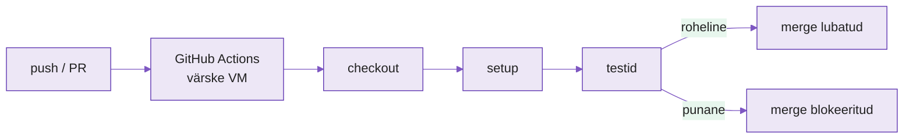

---
tags:
  - CI
  - GitHubActions
  - Automatiseerimine
---

# Loeng — Automaatne testimine ja tarnekonveier (CI)

**Kestus:** ~40 minutit
**Tase:** Eeldame et tead Docker Compose'i ja oled kirjutanud mõne testi

---

!!! abstract "Õpiväljundid"
    Pärast loengut oskad:

    - selgitada mis on CI ja mis probleemi see lahendab
    - kirjeldada GitHub Actions workflow struktuuri (trigger, job, step)
    - lugeda workflow'i ja öelda millal see katkeb
    - põhjendada miks "töötab minu masinas" meeskonnas ei kanna

---

## 1. "Töötab minu masinas" — meeskonna mõõtkavas

Ühe inimese projektis on "töötab minu masinas" tüütu, aga elatav. Viie arendajaga see tapab.

Viis inimest samal rakendusel. Igaüks kirjutab oma tüki, jooksutab **oma** testid, näeb rohelist, teeb `git push`. Üks unustab jooksutada testi, mis katab teise mooduli — tema muudatus lõhkus midagi, aga tema testid seda ei näidanud, sest ta ei käivitanud kõiki. Kood läheb `main`-i. Keegi teine pull'ib tunni pärast, ehitab peale oma osa, ja **tema** masinas hakkab asi katki minema. Põhjuseta, tema meelest. Põhjus oli eelmises commitis, mis jõudis `main`-i ilma et keegi kõiki teste jooksutaks.

CI lahendab selle jõuga: iga push käivitab **kõik** testid automaatselt, serveris, mitte kellegi sülearvutis. Testid punased → koodi `main`-i ei lasta. Keegi ei pea "meeles pidama teste jooksutada" — see juhtub iga kord, sõltumata kes push'is.

<figure markdown="span">

  <figcaption>Joonis 7.1. Iga push käivitab konveieri; punane test blokeerib merge'i (Talvik, 2025).</figcaption>
</figure>

---

## 2. Mis on CI

**Continuous Integration** — koodimuudatused sulanduvad baasharusse sageli ja väikeste tükkidena, mitte suurte partiidena. Iga muudatuse juures jooksevad testid automaatselt.

Vastand vanale mudelile, kus meeskond arendas nädalaid eraldi harudes ja "testimise nädal" tuli enne release'i. Seal avastati konfliktid ja katkised integratsioonid hilja — kui parandamine on kallis ja stressirohke. CI juures on iga push väike, testitud samm. Katki läks → tead minutitega, mitte nädalatega.

---

## 3. GitHub Actions — struktuur

GitHub Actions on GitHubi sisseehitatud CI/CD. Workflow on YAML-fail kaustas `.github/workflows/`. GitHub näeb seda ja käivitab triggeri peale värskes virtuaalmasinas.

```yaml
name: Testid

on:
  push:
    branches: [main]
  pull_request:
    branches: [main]

jobs:
  test:
    runs-on: ubuntu-latest
    steps:
      - uses: actions/checkout@v4
      - name: Käivita testid
        run: echo "siia tulevad testid"
```

Kolm tasandit:

**Trigger** (`on:`) — millal käivitub. `push`, `pull_request`, piiratud harudega (`branches: [main]`).

**Job** (`jobs:`) — kus ja millest koosneb. `runs-on: ubuntu-latest` = värske Ubuntu VM iga kord, ilma eelmise käivituse jääkideta.

**Step** (`steps:`) — käsud järjest samas masinas. `uses:` käivitab valmis action'i (nt `actions/checkout@v4` toob repo sisu masinasse), `run:` käivitab tavalise bash-käsu. Üks step kukub → järgnevad jäävad käivitamata, job on punane.

---

## 4. Terviklik näide — rakenduse CI

```yaml
name: CI

on:
  pull_request:
    branches: [main]

jobs:
  test:
    runs-on: ubuntu-latest
    steps:
      - uses: actions/checkout@v4
      - uses: actions/setup-python@v5
        with:
          python-version: '3.12'
      - run: pip install -r requirements.txt
      - run: pytest
```

`checkout` toob koodi VM-i (ilma selleta pole seal ühtegi faili). `setup-python` paneb õige versiooni (VM ei tule automaatselt õigega). `pip install` paigaldab samad sõltuvused mis arendajal (kirjas repos olevas failis). `pytest` jooksutab testid. Neli sammu rohelised → PR-il roheline linnuke.

---

## 5. Millal pipeline katkeb

Pipeline katkeb, kui mõni käsk lõpetab **exit code'iga ≠ 0**. `pytest` järgib seda: kasvõi üks test kukub → mittenulliline exit code → samm punane → kogu workflow punane. GitHub näitab seda PR-il otse.

Enamikus repodes on reegel: PR-i ei saa `main`-i mergida kui vajalikud check'id pole rohelised. See on **soovitud** käitumine, mitte viga. Parem et pipeline blokeerib merge'i kohe, kui et katkine kood jõuab `main`-i ja sealt tootmisse. (Meenuta Märtenit ja `main`-i lukku nädalast 2 — CI on sama lukk, aga automaatne.)

---

## 6. Miks tööl oluline

Suurel makseteenusel jookseb tuhandeid automaatteste, mis katavad maksete loogikat ja valuutakonversioone. Iga pull request käivitab need **enne** kui keegi muudatust üldse vaatama hakkab.

Muudatuse autor saab tagasiside mõne minutiga — mitte pärast release'i, kui viga on juba tootmises ja puudutab päris kasutajate raha. See kiirus on põhjus, miks CI on tänapäeval tavapraktika, mitte lisavõimalus.

---

## Kokkuvõte

- **"Töötab minu masinas" ei kanna meeskonnas** — testimine peab olema automaatne ja inimese mälust sõltumatu
- **CI = testid jooksevad automaatselt** iga push/PR peale, mitte "testide nädalal"
- **Workflow on `.github/workflows/` YAML-fail**
- **Kolm komponenti:** trigger (`on:`), job (`runs-on:`), steps (käsud järjest)
- **`uses:` = valmis action, `run:` = bash-käsk**
- **Pipeline katkeb exit code ≠ 0 peale** — `pytest` teeb seda automaatselt
- **Katkenud pipeline on soovitud käitumine** — hoiab katkise koodi `main`-ist eemal

---

## Allikad

| Allikas | URL |
|---|---|
| GitHub Actions dokumentatsioon | <https://docs.github.com/en/actions> |
| Workflow süntaks | <https://docs.github.com/en/actions/using-workflows/workflow-syntax-for-github-actions> |
| actions/checkout | <https://github.com/actions/checkout> |
| actions/setup-python | <https://github.com/actions/setup-python> |
| pytest | <https://docs.pytest.org/> |

---

*Järgmine: Praktikumis kirjutad rakendusele CI workflow'i, mis jooksutab teie testid igal pull request'il.*
