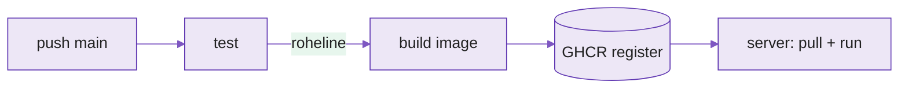

---
tags:
  - CD
  - GHCR
  - GitHubActions
---

# Loeng — Automaatne ehitamine ja levitamine (CD)

**Kestus:** ~40 minutit
**Tase:** Eeldame et nädal 7 CI pipeline on selge

---

!!! abstract "Õpiväljundid"
    Pärast loengut oskad:

    - selgitada mis vahe on CI ja CD vahel
    - kirjeldada mis on image-register ja miks GHCR
    - lugeda CD-workflow'i ja öelda millal `build-and-push` käivitub
    - põhjendada miks image saab mitu tagi (`latest` + commit hash)

---

## 1. CI oli pool lugu

Nädal 7: iga push käivitab testid, halb kood ei jõua `main`-i. See on **CI** — kvaliteedi-värav.

Teine pool on **CD (Continuous Delivery)**: kui kood on `main`-is ja roheline, jõuab see automaatselt sinna, kust server selle kätte saab. CI ütleb "kood on korras". CD ütleb "korras kood on kohal".

Käsitsi prod'i deploy'imine on nagu pommi kahjutuks tegemine: läheb hästi, kuni ühel reedel ei lähe, ja siis on kõik käed värisemas. CD teeb sama töö **igavaks ja korratavaks** — ja igav on siin kompliment.

<figure markdown="span">

  <figcaption>Joonis 8.1. CD laiendab CI-d: test → build → register → server (Talvik, 2025).</figcaption>
</figure>

---

## 2. Image-register

Nädal 5 ehitasid image'i `docker build`-iga. Aga image su arvutis on **ainult** su arvutis. Kuidas jõuab see serverisse? Läbi **registri** — hoidla, kust igaüks (kellel on ligipääs) saab image'i `docker pull`-iga.

Kaks levinut: **Docker Hub** (avalik, tuntuim) ja **GitHub Container Registry (GHCR)** (GitHubi enda, töötab sujuvalt Actions'iga). Kasutame GHCR-i, sest pipeline on juba GitHubis.

Image aadress GHCR-is:

```
ghcr.io/<kasutaja>/<repo>:<tag>
```

Pipeline'is tuleb see automaatselt muutujast `${{ github.repository }}` (kujul `kasutaja/repo`) — sa ei kirjuta oma nime kuhugi kõvasti.

---

## 3. Miks GHCR

- Ei pea eraldi kontot — sama GitHubi konto.
- `GITHUB_TOKEN` toimib automaatselt — ei pea saladusi käsitsi seadistama.
- Image'id on repo küljes — näed neid repo "Packages" all.

---

## 4. Tagid — miks mitu

Igal image'il on **tag** (versioonisilt).

| Strateegia | Näide | Millal |
|---|---|---|
| `latest` | `app:latest` | Arendus, kiire test |
| Versiooninumber | `app:1.2.3` | Tootmine, rollback |
| Commit hash | `app:a3f9b2c` | Täpne jälgitavus |
| Haru nimi | `app:main` | Keskkondade eraldus |

Ainult `latest` tootmises on ohtlik — ei tea mis versioon **tegelikult** jookseb. Seepärast tagitakse ka commit hash'iga: iga image on üheselt seotud kindla commitiga. Kui midagi läheb katki, tead täpselt millise koodi juurde tagasi minna.

---

## 5. CD osa workflow'is

CD töötab ainult siis, kui kood jõuab `main`-i. PR-id käivitavad ainult CI (test), mitte build'i.

```yaml
on:
  push:
    branches: [main]   # CD: ainult mergeil main-i
  pull_request:        # CI: kõigil PR-idel
```

Struktuur: `test` job (nädal 7) → `build-and-push` job. Teine käivitub ainult pärast esimest (`needs: test`) ja ainult `main`-il:

```yaml
  build-and-push:
    needs: test
    runs-on: ubuntu-latest
    if: github.ref == 'refs/heads/main'
    permissions:
      contents: read
      packages: write
    steps:
      - uses: actions/checkout@v4
      - uses: docker/login-action@v3
        with:
          registry: ghcr.io
          username: ${{ github.actor }}
          password: ${{ secrets.GITHUB_TOKEN }}
      - uses: docker/build-push-action@v5
        with:
          context: .
          push: true
          tags: |
            ghcr.io/${{ github.repository }}:latest
            ghcr.io/${{ github.repository }}:${{ github.sha }}
```

Kolm asja, mis väärivad tähelepanu:

**`GITHUB_TOKEN`** — GitHub loob iga käivituse jaoks ajutise tokeni, mis töötab ainult selle töö ajal ja kaob pärast. Sa ei loo ega hoia seda kuskil. Saladuse-probleem lahendatud ilma saladuseta.

**`permissions: packages: write`** — vaikimisi saab workflow koodi ainult **lugeda**. GHCR-i kirjutamiseks pead loa selgelt andma. Ilma selleta: 403.

**`if: github.ref == 'refs/heads/main'`** — ilma selleta üritaks build joosta ka PR-idel, kus `packages: write` tavaliselt puudub → pipeline punane seal kus ei peaks.

!!! warning
    Paroole, tokeneid ega võtmeid ei kirjutata **kunagi** otse `.yml`-i. Git-ajalugu on püsiv — korra koodis olnud saladus võib jääda nähtavaks igaveseks. (Sama reegel mis Märteni `.env`, nüüd pipeline'is.)

---

## 6. Miks tööl oluline

Ilma CD-ta: keegi testib käsitsi, ehitab image'i käsitsi, deployb käsitsi, ja vea korral pöörab käsitsi tagasi. Iga "käsitsi" on koht, kus keegi väsinuna reedel eksib.

CD-ga: arendaja merge'ib PR-i, pipeline testib, ehitab, pushib registrisse, kõik logis — täpne ajalugu millal mis juhtus. Inimesed tegelevad funktsioonidega, mitte infrastruktuuri käsitsi-lükkamisega. Ja kui midagi läheb valesti, ei otsi keegi "kes mida serveris tegi" — vastus on commitis.

---

## Kokkuvõte

- **CI tagab kvaliteedi, CD tagab kohaloleku** — korras kood jõuab automaatselt registrisse
- **Register (GHCR)** on hoidla, kust server image'i `pull`-ib
- **`GITHUB_TOKEN`** toimib automaatselt — ei pea saladust looma
- **Image saab kaks tagi:** `latest` + commit hash (`github.sha`)
- **`needs: test`** — build ainult pärast roheliseid teste
- **`permissions: packages: write`** kohustuslik GHCR-i kirjutamiseks
- **`if: main`** — build ainult `main`-il, mitte PR-idel

---

## Allikad

| Allikas | URL |
|---|---|
| GHCR dokumentatsioon | <https://docs.github.com/en/packages/working-with-a-github-packages-registry/working-with-the-container-registry> |
| docker/build-push-action | <https://github.com/docker/build-push-action> |
| docker/login-action | <https://github.com/docker/login-action> |
| GITHUB_TOKEN | <https://docs.github.com/en/actions/security-guides/automatic-token-authentication> |
| Workflow permissions | <https://docs.github.com/en/actions/using-jobs/assigning-permissions-to-jobs> |

---

*Järgmine: Praktikumis laiendad nädal 7 pipeline'i — lisad `build-and-push` job'i ja kontrollid et image ilmub GHCR-i.*
