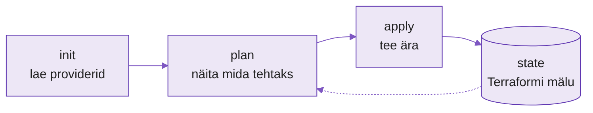

---
tags:
  - Terraform
  - IaC
---

# Loeng — Infrastruktuuri kirjeldamine koodina (Terraform)

**Kestus:** ~30 minutit (lühisessioon, 90 min kokku)
**Tase:** Eeldame Ansible't ja IaC mõtteviisi (nädal 9 async)

---

!!! abstract "Õpiväljundid"
    Pärast loengut oskad:

    - selgitada mida "infrastruktuur koodina" Terraformi kontekstis tähendab
    - kirjeldada töövoogu `init → plan → apply`
    - eristada Ansible ja Terraformi kasutusjuhtu (konfiguratsioon vs infrastruktuur)
    - selgitada miks state-fail on tähtis

---

## 1. Ennustuste kontroll

Nädal 9 kirjutasid ennustuse: mida Terraform teeb teisiti kui Ansible? Enamik pakub süntaksit või pilvetuge. Tegelik vahe on sügavam — see puudutab **mida** tööriist üldse haldab.

Su võrdlustabelist tuli tõenäoliselt välja korduv teema: Ansible "teeb asju ära" olemasoleval serveril, Terraform otsustab kas server üldse **eksisteerib**. See intuitsioon on õige suund. Vaatame selle täna lahti.

---

## 2. Terraform vs Ansible

Ansible haldab seda mis on serveri **sees**: paketid, konfiguratsioon, teenused, kasutajad. Terraform haldab serverit **ennast**: loob VM-i, seadistab võrgu, lisab firewall-reegli, tellib andmebaasi.

Ei konkureeri — täiendavad. Tüüpiline voog: Terraform loob VM-i, Ansible seadistab selle sisu.

| Ülesanne | Kumb tööriist |
|---|---|
| Loo uus VM | Terraform |
| Paigalda nginx | Ansible |
| Loo võrk ja subnet | Terraform |
| Uuenda konfiguratsioonifaili | Ansible |
| Firewall-reegel serverite vahel | Terraform |
| Käivita teenus restardi järel | Ansible |

Meeselreegel: küsimus "kas see asi on **olemas**?" → Terraform. Küsimus "kas see asi on **õigesti seadistatud**?" → Ansible.

---

## 3. Töövoog — init → plan → apply

<figure markdown="span">

  <figcaption>Joonis 10.1. Terraformi kolmeastmeline töövoog; state on mälu, mille vastu plan võrdleb (Talvik, 2025).</figcaption>
</figure>

**`init`** — laeb providerid (Proxmox, AWS, local). Sama mõte mis `ansible-galaxy install`.

**`plan`** — näitab mida **tehtaks**, ei muuda midagi. `+` luuakse, `~` muudetakse, `-` kustutatakse.

**`apply`** — teeb päriselt ära selle, mida plan näitas.

`plan` on su viimane kaitseliin: näed muudatused **enne** kui midagi juhtub. Tootmises ei jookse keegi `apply`-t ilma `plan`-i lugemata.

!!! warning
    Kui `plan` näitab midagi ootamatut (nt `- kustutatakse andmebaas`), **peatu** ja uuri miks. See on kõige levinum koht, kus algaja teeb tõsise vea — üks tähelepanuta jäetud `-` rida ja andmebaas on läinud.

---

## 4. State — Terraformi mälu

Terraform peab mäletama mida ta on loonud. Selleks on `terraform.tfstate`.

Kui lood VM-i, salvestab Terraform selle ID, IP ja atribuudid state'i. Järgmine `plan` teab juba et VM on olemas — ei ürita uuesti luua, vaid võrdleb olekut sooviga.

Kustutad state-faili kogemata → Terraform "unustab" kõik. VM-id jäävad alles, aga Terraform ei tea nende olemasolust, ja järgmine `apply` üritab teha **duplikaate**. Seepärast hoitakse state-faili reaalselt eraldi turvalises kohas (jagatud storage), mitte kellegi sülearvutis.

---

## 5. Näidiskonfiguratsioon (local provider)

Lühisessiooni tõttu täna ise ei installi — vaatame koos. `local` provider loob lihtsalt faile kettale, ei vaja pilvekontot ega Proxmoxi.

```hcl
terraform {
  required_providers {
    local = {
      source = "hashicorp/local"
    }
  }
}

variable "filename" {
  default = "/tmp/tervitus.txt"
}

resource "local_file" "tervitus" {
  filename = var.filename
  content  = "Tere, Terraform lõi selle faili!"
}
```

Kolm põhimõistet:

- **provider** — ühendus välise süsteemiga (local, Proxmox, AWS). Ütleb **millega** Terraform räägib.
- **resource** — konkreetne hallatav asi (fail, VM, võrk). IaC põhiühik.
- **variable** — muudetav sisend, ilma koodi ennast muutmata (sama mõte mis Ansible muutujad).

`plan` näitaks: `+ luuakse local_file.tervitus`. `apply` looks faili.

---

## 6. Miks tööl oluline

Ettevõtted, kes haldavad infrastruktuuri mitmes piirkonnas või keskkonnas, kirjeldavad selle koodina: uus piirkond või testkeskkond = `terraform apply`, mitte insener, kes klõbistab käsitsi pilvekonsoolis VM-e kokku. Tulemus on korratav (sama seadistuse taastad minutitega) ja auditeeritav (iga muudatus on koodis ja versioonihalduses nähtav, mitte kellegi mälus või käsitsi klõpsuna).

See on ka põhjus, miks intervjuul küsitakse IaC kogemuse kohta: keegi ei taha, et infrastruktuur eksisteeriks ainult ühe inimese peas — ega et see kaoks koos tema lahkumisega (meenuta Märtenit).

---

## Kokkuvõte

- **Ansible haldab serveri sisu, Terraform serverit ennast** — ei konkureeri, käivad koos
- **Töövoog:** `init` (lae providerid) → `plan` (näita) → `apply` (tee)
- **`plan` on turvavõrk** — näitab muudatused enne kui need juhtuvad
- **State (`terraform.tfstate`) on Terraformi mälu** — selle kaotamine on ohtlik
- **Põhiosad:** `provider` (ühendus), `resource` (loodav asi), `variable` (sisend)

---

## Allikad

| Allikas | URL |
|---|---|
| Terraform Documentation | <https://developer.hashicorp.com/terraform/docs> |
| CLI Workflow (init/plan/apply) | <https://developer.hashicorp.com/terraform/cli/run> |
| Terraform State | <https://developer.hashicorp.com/terraform/language/state> |
| Local Provider | <https://registry.terraform.io/providers/hashicorp/local/latest/docs> |

---

*Järgmine: Praktikumis jooksutad ise `init → plan → apply → destroy` local provideriga.*
