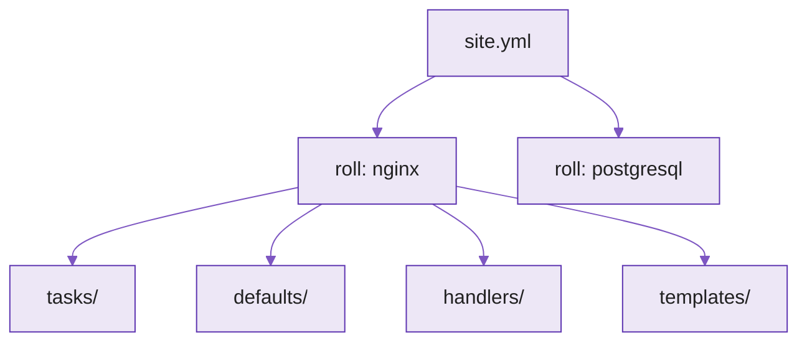

---
tags:
  - Ansible
  - Rollid
  - Konfiguratsioonihaldus
---

# Loeng — Ansible rollid (Valik 2)

**Kestus:** ~40 minutit
**Tase:** Eeldame Ansible playbook'e (nädalad 3–4)

---

!!! abstract "Õpiväljundid"
    Pärast loengut oskad:

    - selgitada mis on roll ja miks see playbook'ist parem struktuur on
    - kirjeldada rolli standardset kataloogistruktuuri
    - selgitada kuidas rolli playbook'ist välja kutsutakse (`roles:` / `include_role`)
    - põhjendada millal kasutada rolli ja millal piisab playbook'ist

---

## 1. Playbook, mis kasvas suureks

Nädalatel 3–4 olid tasks, vars ja templates ühes failis kõrvuti. Ühe nginx-serveri jaoks loetav. Aga kui sama fail peab seadistama nginx'i, PostgreSQL'i, firewall'i ja monitooringu, kasvab sada rida viiesajaks — ja keegi, kes tuleb kuu aja pärast lugema, ei leia enam kus PostgreSQL lõppeb ja firewall algab.

Rollid lahendavad selle. Roll grupeerib seotud tasks, vars, templates, files ja handlers kindla kataloogistruktuuri alla, mille Ansible automaatselt ära tunneb. Üks roll paigaldab nginx'i, teine PostgreSQL'i, kolmas firewall'i. Iga roll on iseseisev üksus, mida saab taaskasutada ja jagada.

Suured meeskonnad, kelle serveripark koosneb kümnetest teenustest (rakendusserverid, andmebaasid, cache, load balancer'id), ei kirjuta iga serveritüübi jaoks playbook'i nullist — nad ehitavad rollide kogumi, kus iga roll vastutab ühe teenuse eest, ja playbook paneb need sobivas järjekorras kokku.

<figure markdown="span">

  <figcaption>Joonis 11.1. site.yml orkestreerib rolle; iga roll on oma kataloogistruktuur (Talvik, 2025).</figcaption>
</figure>

---

## 2. Rolli struktuur

Roll ei ole midagi maagilist — kindla nimega kataloogide kogum. Ansible otsib igast kataloogist `main.yml` ja teab kataloogi nime järgi mida sellega teha.

- `tasks/main.yml` — tegevuste nimekiri (sama süntaks mis playbook'is).
- `defaults/main.yml` — vaikeväärtused, madalaim prioriteet, kergesti üle kirjutatavad.
- `handlers/main.yml` — handlerid (nt `restart nginx` pärast konfi muutmist).
- `templates/` — Jinja2 mallid (`.j2`).
- `files/` — staatilised failid, kopeeritakse muutmata.
- `vars/main.yml` — kõrge prioriteediga muutujad; `meta/main.yml` — metaandmed (autor, litsents, sõltuvused).

Roll ei pea sisaldama kõiki katalooge — piisab neist, mida vaja. Näide nginx-rollile:

```
roles/nginx/
├── tasks/main.yml
├── defaults/main.yml
├── handlers/main.yml
├── templates/nginx.conf.j2
└── files/robots.txt
```

Ansible teab ise, et `templates/nginx.conf.j2` kuulub rolli juurde ja `tasks/main.yml` tuleb käivitada. Sulle jääb sisu.

---

## 3. `ansible-galaxy init` — skelett ühe käsuga

Kataloogide käsitsi loomine on tüütu ja veaohtlik. `ansible-galaxy init` genereerib kogu skeleti:

```bash
ansible-galaxy init nginx
```

Loob `nginx/` kõigi standardsete alamkataloogidega. Iga `main.yml` on peaaegu tühi (päis + kommentaar). Otse projekti `roles/`-i:

```bash
ansible-galaxy init --init-path roles/ nginx
```

!!! warning
    Kui sama nimega kataloog juba on, `init` keeldub üle kirjutamast. `--force` asendab — aga sellega **kaob kõik**, mis kaustas oli. Ära `--force`-i harjumusest.

---

## 4. Rolli väljakutsumine — site.yml

Rollist ei ole kasu, kui seda ei käivitata. Tavamuster: üks keskne `site.yml`, mis ütleb millised rollid millistele gruppidele rakenduvad:

```yaml
# site.yml
- hosts: webservers
  become: true
  roles:
    - nginx
    - monitoring

- hosts: databases
  become: true
  roles:
    - postgresql
```

Ansible otsib rolle vaikimisi `roles/` kataloogist playbook'i kõrval — piisab rolli nimest, teed ei pea täpsustama. Muutuja saab anda playbook'i tasandil, mis kirjutab üle rolli `defaults/`:

```yaml
  roles:
    - role: nginx
      vars:
        nginx_port: 8080
```

Alternatiiv on `include_role`/`import_role` `tasks:` sees — kasulik kui roll tuleb käivitada tingimuslikult:

```yaml
tasks:
  - include_role:
      name: nginx
    when: env == "production"
```

---

## 5. Galaxy — kogukonna rollid

Suur osa ülesandeid on standardne (nginx, Docker, PostgreSQL) — keegi on need juba rolliks vorminud. Ansible Galaxy on avalik hoidla:

```bash
ansible-galaxy role install geerlingguy.nginx
```

Mitu rolli korraga `requirements.yml`-iga (versioneeritud, korratav — sama mõte mis Compose `requirements.txt`):

```yaml
- name: geerlingguy.nginx
- name: geerlingguy.postgresql
  version: "3.2.0"
```

```bash
ansible-galaxy install -r requirements.yml
```

Enne kogukonna rolli kasutamist vaata millal viimati uuendati, kui palju allalaadimisi ja star'e. Vanem roll võib eeldada aegunud Ansible't või kasutada deprecated moodulit. Rangete turvanõuetega keskkonnas vaadatakse kolmanda osapoole rolli lähtekood **alati** üle enne tootmist — Galaxy roll ei ole automaatselt usaldusväärne lihtsalt sellepärast, et see on avalik. (Sama loogika mis suvalise `docker pull`-i puhul.)

Millal ise, millal Galaxy: standardsete teenuste jaoks alusta Galaxy rollist ja kohanda `vars`-iga. Ettevõttespetsiifilise loogika (oma rakenduse deploy) jaoks kirjutad ise.

---

## Kokkuvõte

- **Roll grupeerib tasks, vars, templates, handlers** struktureeritud kujul — lahendab loetamatu suure playbook'i
- **Standardkataloogid:** `tasks/`, `defaults/`, `handlers/`, `templates/`, `files/`, `vars/`, `meta/` — piisab vajalikest
- **`ansible-galaxy init`** genereerib skeleti; sina täidad sisu
- **Rollid kutsutakse `roles:` loendiga** või `include_role`/`import_role`-ga; Ansible otsib `roles/`-ist
- **Muutuja `vars:`-iga playbook'i tasandil** kirjutab üle rolli `defaults/`
- **Galaxy pakub valmis rolle** — aga kolmanda osapoole roll vaadatakse enne tootmist üle
- **Ise ettevõttespetsiifika jaoks, Galaxy'st standardteenuste jaoks**

---

## Allikad

| Allikas | URL |
|---|---|
| Ansible Roles | <https://docs.ansible.com/ansible/latest/playbook_guide/playbooks_reuse_roles.html> |
| ansible-galaxy init | <https://docs.ansible.com/projects/ansible/latest/galaxy/dev_guide.html> |
| Galaxy User Guide | <https://docs.ansible.com/projects/ansible/latest/galaxy/user_guide.html> |
| Variable precedence | <https://docs.ansible.com/ansible/latest/playbook_guide/playbooks_variables.html#variable-precedence-where-should-i-put-a-variable> |

**Versioonid (testitud, juuli 2026):** Ansible core 2.17.x.

---

*Järgmine: labor — lood oma rolli nullist.*
