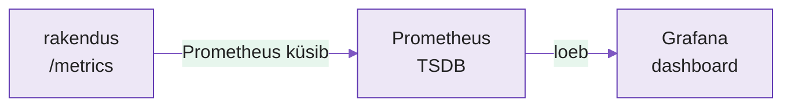

---
tags:
  - Monitooring
  - Prometheus
  - Grafana
  - Observability
---

# Loeng — Nähtavus: mis toimub tegelikult?

**Kestus:** ~40 minutit
**Tase:** Eeldame Docker Compose'i ja CI/CD-d

---

!!! abstract "Õpiväljundid"
    Pärast loengut oskad:

    - selgitada miks automatiseerimine ilma monitooringuta on pime
    - kirjeldada Prometheuse pull-mudelit ja `/metrics` endpointi
    - eristada mõõdiku tüüpe (counter, gauge, histogram)
    - selgitada mida Grafana teeb ja mida mitte

---

## 1. Pime automatiseerimine

Nädal 8 automatiseerisid kogu tarne — koodist serverini. Aga: **kuidas tead, et see mida tarnid ka tegelikult töötab?**

Sa tead et rakendus käivitus. Aga kas ta vastab? Kui kiiresti? Kas vastamisaeg halveneb iga tunniga? Millal midagi läks valesti? Automatiseerimine ilma monitooringuta on pime — sa lükkad koodi tootmisse ja loodad parimat.

Monitooring annab **nähtavuse** — akna süsteemi sisse.

!!! example "Näidisstsenaarium"
    Optimist näeb klaasi pooltäis. Pessimist pooltühi. SRE näeb klaasi **99.99% täis** — ja kirjutab ülejäänud 0.01% kohta postmortemi. Monitooring on see, mis selle 0.01% üldse nähtavaks teeb, enne kui klient helistab.

---

## 2. Kolm kihti

| Kiht | Küsimus | Tööriist |
|---|---|---|
| Mõõdikud | Mis numbrid? | Prometheus |
| Visualiseerimine | Mis trend? | Grafana |
| Teavitused | Millal valesti? | Alertmanager |

Täna kaks esimest (Prometheus + Grafana). Alertmanager on venitusülesanne.

<figure markdown="span">

  <figcaption>Joonis 12.1. Pull-mudel: Prometheus küsib ise rakenduselt, Grafana loeb Prometheusest (Talvik, 2025).</figcaption>
</figure>

---

## 3. Prometheus — pull-mudel

Prometheus kogub mõõdikuid **pull**-mudeliga: ta läheb ise rakenduse juurde ja küsib, iga N sekundi tagant. Rakendus **ei saada** andmeid Prometheusele — see on vastupidine sellele, mida võiks arvata.

Selleks peab rakendusel olema `/metrics` endpoint Prometheuse formaadis:

```
# HELP http_requests_total Päringute koguarv
# TYPE http_requests_total counter
http_requests_total{method="GET",status="200"} 1247
http_requests_total{method="GET",status="500"} 3
```

Inimloetav tekst — iga rida on üks mõõdik siltidega. Prometheus teab kust küsida `scrape_configs`-ist:

```yaml
global:
  scrape_interval: 15s

scrape_configs:
  - job_name: 'flask-app'
    static_configs:
      - targets: ['flask-app:5000']
```

`flask-app` on Compose teenuse nimi — võrk lahendab nime automaatselt (sama loogika mis nädal 6).

---

## 4. Mõõdiku tüübid

**Counter** — ainult tõusev loendur (`http_requests_total`). Päringute arv, vigade arv. Ei lähe kunagi alla.

**Gauge** — hetkeväärtus (`memory_usage_bytes`, `active_connections`). Tõuseb ja langeb.

**Histogram** — jaotumine vahemikesse (`..._bucket{le="0.1"}`). Vastamisaegade analüüs: kui palju päringuid mahtus alla mingi piiri.

**Summary** — protsentiilid, arvutab ise. Tänapäeval kasutatakse vähem kui histogrami.

---

## 5. Grafana — visualiseerimine

Grafana **ei kogu** ise mõõdikuid. Ta loeb andmeid allikatest (Prometheus, Elasticsearch, MySQL) ja joonistab. Enne kui midagi näed, lisad **andmeallika** (datasource): `http://prometheus:9090`.

**Dashboard** on kogum paneele, iga paneel üks graafik või number. Grafanas kirjutad **PromQL** päringu, et öelda mida näidata:

```promql
rate(http_requests_total[1m])                    # päringud minutis
sum(rate(http_requests_total[1m]))               # kõik staatused koos
rate(http_requests_total{status="500"}[1m])      # ainult vead
histogram_quantile(0.95, rate(http_request_duration_seconds_bucket[5m]))  # 95. protsentiil
```

Praktikumis kasutad **valmis dashboardi** — PromQL-i ise ei kirjuta. Aga hea on mõista mida graafik kuvab.

---

## 6. Miks tööl oluline

Ilma monitooringuta: kasutajad helistavad et midagi katki, sa ei tea millal algas, ei tea mis põhjustas, ja rollback on pime (ei tea kas aitas).

Monitooringuga: näed anomaaliat **enne** kasutajaid (vastamisaeg tõuseb), tead täpselt millal algas (Prometheus salvestab ajaloo), näed mis samal ajal muutus (deploy? konfimuutus?), ja rollbacki järel näed graafikult et olukord paranes.

SRE-s on mõiste **MTTD** — Mean Time To Detect. Hea monitooring viib selle minutitesse, mitte tundidesse. Vahe "avastasime 3 minutiga" ja "klient avastas 3 tunniga" on vahe intsidendi ja katastroofi vahel.

---

## Kokkuvõte

- **Automatiseerimine ilma monitooringuta on pime** — ei tea mis tegelikult toimub
- **Prometheus kogub pull-mudeliga** — küsib ise rakenduselt `/metrics`-ilt
- **Mõõdiku tüübid:** counter (tõusev), gauge (hetk), histogram (jaotus)
- **Grafana visualiseerib** Prometheuse andmeid, ei kogu ise
- **MTTD** — hea monitooring avastab minutitega, mitte tundidega

---

## Allikad

| Allikas | URL |
|---|---|
| Prometheus dokumentatsioon | <https://prometheus.io/docs/> |
| Grafana dokumentatsioon | <https://grafana.com/docs/> |
| Metric types | <https://prometheus.io/docs/concepts/metric_types/> |
| PromQL basics | <https://prometheus.io/docs/prometheus/latest/querying/basics/> |

**Versioonid (testitud, juuli 2026):** Prometheus `prom/prometheus:latest`, Grafana `grafana/grafana:latest`.

---

*Järgmine: Praktikumis deployd stacki, seadistad scrape'i, impordid dashboardi ja genereerid koormust.*
