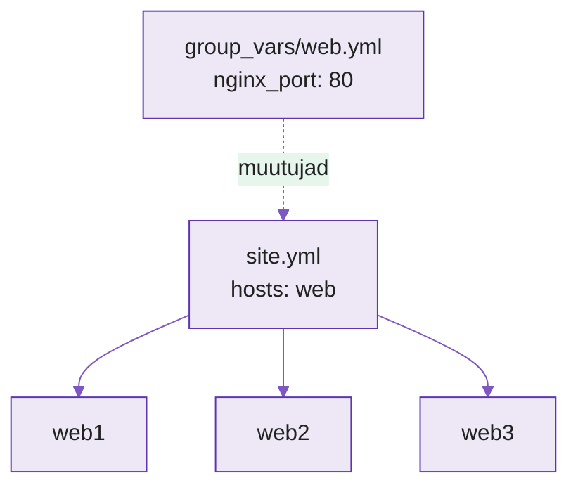

---
tags:
  - Ansible
  - IaC
  - Infrastruktuur
---

# Loeng — Infrastruktuur koodina: Ansible IaC

**Kestus:** ~40 minutit
**Tase:** Eeldame Ansible playbook'e, rolle ja muutujaid (nädalad 3–4, 11)

---

!!! abstract "Õpiväljundid"
    Pärast loengut oskad:

    - selgitada mis vahe on "playbook mis paigaldab nginx'i" ja "infrastruktuur koodina"
    - kirjeldada kuidas üks playbook haldab mitut serverit korraga (inventory grupid)
    - eristada `group_vars` ja `host_vars` — sama kood, erinev keskkond
    - selgitada millal Ansible ja millal Terraform (ja miks mitte kumbki üksi)

---

## 1. Nädalatel 3–4 tegid juba Ansible't. Mis siis uut?

Nädalatel 3–4 kirjutasid playbook'i, mis paigaldas nginx'i **ühele** serverile. See oli automatiseerimine — aga veel mitte päris "infrastruktuur koodina".

Vahe on skaalas ja hoiakus. Üks server on skript. Kakskümmend serverit, kolmes keskkonnas (arendus, test, tootmine), kus iga keskkond on **koodis kirjeldatud** ja igaüks saab selle nullist üles ehitada sama failikomplektiga — see on IaC. Server ei ole enam "lemmikloom", keda käsitsi hooldad ja kelle kadumine on katastroof. Ta on "kariloom": kui üks katki, kustutad ja playbook ehitab identse asemele.

Märten hooldas lemmikloomi. Igal serveril oli oma käsitsi tehtud eripära, mida ainult Märten teadis (ja pooli neist ka tema ei mäletanud). Kui server suri, suri temaga Märteni pähe salvestatud "kuidas see üles seati". IaC tähendab: kogu see teadmine on failides, Git-is, loetav ja korratav.

---

## 2. Üks playbook, mitu serverit

Seni oli `inventory.ini`-s üks host. Päris elus on neid mitu, gruppidena:

```ini
[web]
web1.example.com
web2.example.com

[db]
db1.example.com

[production:children]
web
db
```

`[web]` ja `[db]` on grupid. `[production:children]` on **grupp gruppidest**. Playbook ütleb `hosts: web` ja jookseb korraga **kõigil** web-serveritel — sama task, kakskümmend masinat, üks käsk. Nädalal 1 küsisid "aga mis siis kui masinaid on 50?" — see ongi vastus.

<figure markdown="span">

  <figcaption>Joonis 12.1. Üks playbook rakendub kõigile grupi hostidele; group_vars annab neile ühised muutujad (Talvik, 2025).</figcaption>
</figure>

---

## 3. group_vars ja host_vars — sama kood, erinev keskkond

Kood on kõigil serveritel sama. Aga arendusserver ei tohi kasutada tootmise parooli, ega testserver tootmise domeeni. Kuidas hoida **üks** playbook, aga anda igale keskkonnale **omad väärtused**?

Ansible loeb muutujad automaatselt failinime järgi:

- `group_vars/web.yml` — rakendub kõigile `[web]` grupi hostidele
- `group_vars/all.yml` — rakendub kõigile (nägid nädalal 4)
- `host_vars/web1.example.com.yml` — rakendub **ainult** sellele ühele hostile

Nii et sama `site.yml` + `roles:` annab arenduses ühe pordi ja tootmises teise, ilma et koodis midagi muudaks. Muutub ainult see, milline `group_vars` fail kehtib. Meenuta nädal 4: siis panid muutujad `group_vars/all.yml`-i ühele masinale. Sama mehaanika, nüüd mitmele.

See on IaC tuum: **kood kirjeldab struktuuri, muutujad kirjeldavad keskkonda.** Vaheta `group_vars`, saad teise keskkonna — kood puutumata.

---

## 4. Idempotentsus infra tasemel

Nädalal 3 nägid idempotentsust ühe task'i tasemel: `changed` vs `ok`. Infra tasemel on sama põhimõte võimsam.

Kui kogu su serveripargi seis on kirjeldatud playbook'is, siis playbook'i jooksutamine on **tervisekontroll**. `changed=0` kõigil hostidel tähendab: kõik serverid on täpselt sellises seisus nagu kood ütleb. Kui üks host näitab `changed=3`, tähendab keegi (või miski) muutis seda käsitsi — ja Ansible **parandas selle tagasi** koodis kirjeldatud seisu.

See on "configuration drift" avastamine ja parandamine ühe käsuga. Käsitsi hooldatud pargis triivivad serverid aeglaselt lahku (üks sai turvapaiga, teine mitte, kolmandal keegi näppis konfi öösel) — ja keegi ei tea, enne kui midagi katki. IaC-ga jooksutad playbook'i cron'is ja drift parandub ise.

---

## 5. Ansible vs Terraform — millal kumbki?

Nädalatel 10–11 nägid Terraformi. Nüüd Ansible sama "infra koodina" lipu all. Millal kumb?

Lühivastus: nad teevad **eri asju** ja päris meeskonnad kasutavad **mõlemat koos**.

| | Terraform | Ansible |
|---|---|---|
| Mida teeb | **Loob** infra (VM, võrk, ketas) | **Seadistab** olemasolevat (paketid, konfid, teenused) |
| Küsimus | "Mis serverid **eksisteerivad**?" | "Mis on serverite **sees**?" |
| Mudel | Deklaratiivne, hoiab state-faili | Deklaratiivne, state'i ei hoia |
| Näide | Loo 3 VM-i pilve | Paigalda neile nginx |

Terraform ehitab tühjad masinad (provisioning). Ansible paneb neisse sisu (configuration). Tüüpiline voog: Terraform loob 3 VM-i → väljastab nende IP-d → Ansible võtab need IP-d inventory'sse ja seadistab. Kumbki üksi jätab poole tööst tegemata: Terraform annab tühja serveri, Ansible eeldab et server juba on.

!!! example "Näidisstsenaarium"
    Märten kuulis, et "Terraform on parem" ja kirjutas Terraformiga ka nginx-i konfi (`local-exec` provisioner'itega, mis jooksutavad bash-i). See töötas — nagu kruvikeeraja töötab haamrina, kui väga tahad. Kuus kuud hiljem ei saanud keegi aru, miks pool konfist on Terraformis ja pool käsitsi. Tööriist tuleb valida töö järgi, mitte kuulujutu järgi.

---

## 6. Miks see tööl oluline

DevOps-meeskonnas ei logi keegi 20 serverisse käsitsi. Server on koodis kirjeldatud, muudatus käib PR-ina (nädal 2!), CI kontrollib (nädal 7), ja playbook rakendab. Kui uus inimene tuleb, ei küsi ta "kuidas see server üles seati" — ta loeb `site.yml`-i. Kui server sureb, ei paanika keegi — playbook ehitab uue.

See on kogu kursuse mõte ühes kohas: Märteni pähe salvestatud, käsitsi tehtud, dokumenteerimata teadmine on asendatud koodiga, mida terve meeskond näeb, versioonib ja usaldab.

---

## Kokkuvõte

- **IaC ≠ üks playbook** — see on kogu serverpargi seisu kirjeldamine koodis, korratav ja versioneeritud
- **Üks playbook, mitu hosti** — inventory grupid, `hosts: web` jookseb kõigil
- **group_vars / host_vars** — sama kood, erinev keskkond; muutub ainult muutujafail
- **Idempotentsus infra tasemel** — `changed=0` on tervisekontroll, drift parandub ise
- **Ansible seadistab, Terraform loob** — päris elus mõlemad koos, tööriist töö järgi
- Server on kariloom, mitte lemmikloom — surm ei ole katastroof, kui seis on koodis

---

## Allikad

| Allikas | URL |
|---|---|
| Ansible inventory | <https://docs.ansible.com/ansible/latest/inventory_guide/intro_inventory.html> |
| group_vars / host_vars | <https://docs.ansible.com/ansible/latest/playbook_guide/intro_inventory.html#organizing-host-and-group-variables> |
| Ansible vs Terraform | <https://developer.hashicorp.com/terraform/intro/vs/chef-puppet> |
| Idempotency (glossary) | <https://docs.ansible.com/ansible/latest/reference_appendices/glossary.html> |

**Versioonid (testitud, juuli 2026):** Ansible core 2.17.x.

---

*Järgmine: laboris laiendad ühe serveri playbook'i mitmele hostile, eraldad keskkonnad group_vars'iga ja võrdled Ansible't Terraformiga.*
